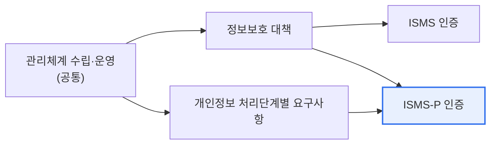

# 정보보호 및 개인정보보호 관리체계(ISMS / ISMS-P)

## 1. 개요

### 가. 정의
> **ISMS(정보보호 관리체계)** 는 정보자산의 기밀성·무결성·가용성을 보호하기 위한 관리체계 인증이고, **ISMS-P** 는 여기에 **개인정보보호**까지 포함한 통합 인증이다. 한국인터넷진흥원(KISA)·개인정보보호위원회가 운영한다.

인증제도의 목적은 조직이 보안을 '**일회성 대책이 아니라 지속적으로 관리되는 체계**'로 갖추도록 강제·검증하는 것이다. 즉 보안 사고가 나지 않게 정책 수립→실행→점검→개선(PDCA)의 순환을 제도적으로 요구한다.

## 2. ISMS와 ISMS-P 차이점 (가)

| 구분 | ISMS | ISMS-P |
|---|---|---|
| **보호 대상** | 정보자산(보안) | 정보자산 + **개인정보** |
| **인증 범위** | 관리체계 + 정보보호 대책 | + 개인정보 처리단계별 요구사항 |
| **적용** | 정보보호 중심 조직 | 개인정보 다량 처리 조직 |
| **점검 항목** | 보안 통제 | 보안 + 개인정보 생애주기(수집·이용·제공·파기) |

> 공통으로 '관리체계 수립·운영'을 요구하며, ISMS-P는 개인정보 처리 요구사항이 추가된다.

## 3. ISMS 의무 대상 기준 (나)

| 대상 | 기준(예) |
|---|---|
| **통신사업자(ISP)** | 전기통신사업자 |
| **집적정보통신시설(IDC)** | 데이터센터 사업자 |
| **매출·이용자 규모** | 정보통신서비스 매출·일 평균 이용자 수 기준 초과 |
| **병원·대학** | 일정 규모 이상 상급종합병원·대학 |

> 「정보통신망법」에 따라 매출액·이용자 수 등 일정 기준을 충족하는 정보통신서비스 제공자는 ISMS 인증이 의무다.

## 4. 시사점
- 인증은 목적이 아닌 수단 — **실질적 보안 수준 향상**이 본질
- 개인정보 비중 큰 조직은 ISMS-P로 통합 관리가 효율적
- 클라우드(CSAP)·글로벌(ISO 27001)과 연계·상호인정 고려

---

> **한 줄 요약**: ISMS는 정보보호 관리체계 인증, ISMS-P는 여기에 개인정보보호를 더한 통합 인증이며, 정보통신망법상 매출·이용자 규모 등 기준을 충족하는 사업자는 ISMS 인증이 의무다.
