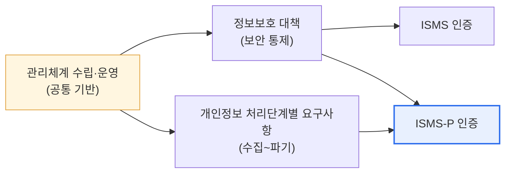

# 정보보호 및 개인정보보호 관리체계(ISMS / ISMS-P)

## 1. 개요

### 가. 정의
> **ISMS(Information Security Management System, 정보보호 관리체계)** 는 정보자산의 기밀성·무결성·가용성을 보호하기 위한 관리체계를 수립·운영하고 있음을 제3의 심사기관이 객관적으로 검증하는 인증이다. **ISMS-P** 는 여기에 **개인정보보호(Personal information)** 처리 생애주기 요구사항까지 통합한 인증으로, 한국인터넷진흥원(KISA)과 개인정보보호위원회가 운영한다.

인증제도의 본질적 목적은 조직이 보안을 '**일회성 대책이 아니라 지속적으로 관리되는 체계**'로 갖추도록 강제하고 검증하는 데 있다. 방화벽을 하나 샀다고 안전해지는 것이 아니라, 정책을 세우고(Plan) 실행하며(Do) 점검하고(Check) 개선하는(Act) **PDCA 순환** 이 조직 문화에 뿌리내려야 진짜 보안이 된다. 인증은 제3의 심사기관이 이 관리체계가 실제로 돌아가는지를 외부 시각에서 확인해주는 장치다. 정보만 다루는 조직에는 ISMS가, 개인정보를 대량으로 처리하는 조직에는 개인정보 처리 요구사항까지 검증하는 ISMS-P가 적합하다.

여기서 강조할 점은 인증이 '문서 한 뭉치를 만들었느냐'가 아니라 '**위험을 식별하고 통제하는 절차가 살아 움직이느냐**'를 본다는 것이다. 그래서 인증심사는 정책 문서뿐 아니라 실제 접근권한 부여 기록, 로그 점검 이력, 사고 대응 훈련 결과 같은 운영 증적을 함께 확인한다. 이것이 단순 자격증이 아니라 '관리체계' 인증이라 불리는 이유다.

### 나. 등장 배경 및 필요성
개인정보 유출·해킹 사고가 기업의 존폐와 사회적 신뢰에 직결되면서, 자율적 보안 노력만으로는 사회 전체의 위험을 감당할 수 없다는 인식이 커졌다. 수백만 명의 개인정보를 다루는 대형 서비스에서 한 번의 사고는 개별 이용자 피해를 넘어 사회적 파급을 낳기 때문에, 일정 규모 이상 사업자에게는 관리체계 인증이 **법적 의무**가 되었다. 즉 인증은 대외 신뢰 확보(마케팅적 효과)와 규제 준수(법적 효과)를 동시에 달성하는 수단이다.

또 하나의 배경은 인증 체계의 **통합**이다. 과거에는 정보보호(ISMS)와 개인정보보호(PIMS/PIPL)가 별개 인증으로 운영되어 조직이 유사한 심사를 중복으로 받아야 했다. 이 부담을 줄이기 위해 2018년 두 체계를 하나로 묶은 ISMS-P가 출범했고, 조직은 자신의 처리 특성에 따라 ISMS 또는 ISMS-P를 선택하게 되었다.

## 2. ISMS와 ISMS-P의 관계와 차이

두 인증의 관계를 먼저 구조로 보면, ISMS-P는 ISMS를 **포함하는** 더 넓은 인증이다. 공통 기반 위에 개인정보 영역을 얹은 포함 관계임을 이해하는 것이 두 제도를 구분하는 출발점이다.

```mermaid
flowchart LR
  A["관리체계 수립·운영<br/>(공통 기반)"] --> B["정보보호 대책<br/>(보안 통제)"]
  A --> C["개인정보 처리단계별 요구사항<br/>(수집~파기)"]
  B --> ISMS["ISMS 인증"]
  B --> ISMSP["ISMS-P 인증"]
  C --> ISMSP
  style ISMSP fill:#e8f0fe,stroke:#2f6fed,stroke-width:2px
  style A fill:#fff6e0,stroke:#e0a03a,stroke-width:1px
```

두 인증은 '관리체계 수립·운영'이라는 공통 기반을 공유하되, **보호 대상과 점검 범위**에서 갈린다. ISMS는 정보자산 전반의 보안 통제, 즉 접근통제·암호화·물리보안·사고대응 등이 제대로 작동하는지를 검증한다. 서버·네트워크·인력·물리 시설 같은 '정보를 담는 그릇'의 안전이 초점이다.

반면 ISMS-P는 여기에 더해 개인정보의 **수집 → 이용·제공 → 보관 → 파기** 라는 처리 생애주기 전반의 요구사항을 추가로 점검한다. 예를 들어 수집 단계에서 동의를 적법하게 받았는지, 제공 단계에서 위탁·제3자 제공 절차가 갖춰졌는지, 파기 단계에서 보유기간 경과 개인정보를 실제로 지웠는지까지 확인한다. 즉 '그릇의 안전(ISMS)'에 더해 '그릇에 담긴 개인정보라는 내용물이 전 과정에서 적법하게 다뤄지는가(P 영역)'를 함께 보는 것이 ISMS-P다.

실무적으로 이 차이가 갖는 함의는 분명하다. 개인정보를 거의 다루지 않는 인프라·B2B 조직은 ISMS만으로 충분하지만, 회원 개인정보를 대량 처리하는 커머스·플랫폼·핀테크는 ISMS-P가 사실상 필수다. 개인정보 영역을 빼고 ISMS만 받으면 정작 가장 큰 법적 리스크인 개인정보 처리 절차가 검증되지 않은 채 남기 때문이다.

또한 인증 마크가 이용자에게 주는 신뢰 신호도 다르다. 개인정보를 다루는 서비스에서 'ISMS-P 인증' 표시는 보안뿐 아니라 개인정보를 적법하게 처리한다는 대외 약속으로 읽히므로, 소비자 대면 서비스일수록 P 영역까지 포함한 인증의 마케팅·신뢰 효과가 크다. 반대로 의무 대상이 되어 촉박하게 ISMS만 취득한 뒤, 뒤늦게 개인정보 규제 이슈가 불거져 ISMS-P로 확장하는 사례도 적지 않다. 처음 인증을 설계할 때 조직의 개인정보 처리 규모와 성장 방향을 함께 고려해 인증 범위를 정하는 것이 재작업을 줄이는 길이다.

| 구분 | ISMS | ISMS-P |
|---|---|---|
| **보호 대상** | 정보자산(보안) | 정보자산 + **개인정보** |
| **인증 범위** | 관리체계 + 정보보호 대책 | + 개인정보 처리단계별 요구사항 |
| **점검 초점** | 보안 통제(접근·암호·물리) | 보안 + 개인정보 생애주기(수집~파기) |
| **인증 마크** | ISMS | ISMS-P |
| **적합 조직** | 정보보호 중심·개인정보 소량 | 개인정보 다량 처리(커머스·플랫폼 등) |

## 3. 인증기준의 구성(3개 영역)

ISMS-P 인증기준(2023.11 개정 기준)은 크게 세 영역으로 구성되며, ISMS는 이 중 앞의 두 영역을 대상으로 한다. 각 영역이 '무엇을, 왜' 보는지를 이해하면 인증의 논리 구조가 보인다.

**가. 관리체계 수립 및 운영(16개 기준).** 이 영역은 보안의 '뼈대'를 본다. 경영진의 참여와 조직 구성, 정보자산 식별과 위험평가, 보호대책 이행과 사후관리까지, PDCA 순환이 조직에 자리 잡았는지를 검증한다. 도구를 아무리 많이 사도 위험을 평가하고 대책을 결정하는 절차가 없으면 관리체계라 할 수 없으므로, 이 영역이 모든 통제의 상위에 놓인다.

**나. 보호대책 요구사항(64개 기준).** 이 영역은 구체적 '근육'에 해당한다. 정책·조직·인적보안, 외부자·물리보안, 인증 및 권한관리, 접근통제, 암호화, 정보시스템 도입·개발 보안, 시스템·서비스 운영보안, 사고 예방·대응, 재해복구까지 실제 보안 통제의 이행 여부를 항목별로 점검한다. 접근통제·암호화 같은 기술적 통제부터 인적보안 같은 관리적 통제까지 폭넓게 아우른다.

**다. 개인정보 처리단계별 요구사항(21개 기준).** ISMS-P에만 적용되는 이 영역은 개인정보 생애주기를 따라 수집 시 보호조치, 보유·이용 시 보호조치, 제공 시 보호조치, 파기 시 보호조치, 그리고 정보주체 권리보호를 확인한다. 앞의 두 영역이 '보안 일반'이라면 이 영역은 '개인정보 특유의 적법성'을 본다는 점에서 성격이 다르다.

이 영역의 심사는 기술적 통제보다 **절차의 적법성** 을 깊이 파고든다. 예컨대 수집 단계에서는 필수·선택 동의가 구분되어 있는지, 최소수집 원칙이 지켜지는지를 보고, 제공 단계에서는 위탁 시 수탁사 관리·감독이 이뤄지는지, 국외 이전 시 별도 동의·고지가 있는지를 확인한다. 파기 단계에서는 보유기간이 지난 개인정보가 복원 불가능한 방식으로 삭제되는지를 실제 로그로 검증한다. 이처럼 '동의를 받았다'는 문서가 아니라 '적법하게 받은 동의가 처리 전 과정에서 지켜지는가'를 보기 때문에, 개인정보를 다루는 조직에는 이 영역이 가장 준비 부담이 큰 부분이기도 하다.

세 영역을 합치면 인증기준은 총 **101개(16+64+21)** 이며, 각 기준마다 다수의 세부 점검항목이 딸려 있다. 다만 개정 시점에 따라 항목 수는 조정될 수 있으므로, 실제 심사에서는 최신 고시·안내서를 확인하는 것이 원칙이다.

## 4. ISMS 의무 대상과 인증 절차

### 가. 의무 대상 기준
「정보통신망 이용촉진 및 정보보호 등에 관한 법률(정보통신망법)」 제47조 제2항 및 같은 법 시행령 제49조에 따라, 일정 요건을 충족하는 정보통신서비스 제공자는 ISMS 인증이 **의무**다. 의무 대상이 규모 기준으로 설정된 이유는, 다루는 정보·이용자가 많을수록 사고 시 사회적 파급이 크므로 자율에 맡길 수 없기 때문이다. 이는 '위험이 큰 곳에 더 강한 규제'라는 비례 원칙의 반영이다.

구체적으로는 ① 서울 및 모든 광역시에서 정보통신망서비스를 제공하는 **기간통신사업자(ISP)**, ② **집적정보통신시설(IDC)** 사업자, ③ 정보통신서비스 부문 전년도 매출액 **100억 원 이상** 또는 전년도 말 기준 직전 3개월간 **일일평균 이용자 수 100만 명 이상** 인 사업자, ④ 매출·세입 **1,500억 원 이상** 인 상급종합병원·대학 등이 대상이 된다. 예컨대 회원 수가 급증해 일평균 이용자 100만 명을 넘긴 온라인 서비스는 그 시점부터 의무 대상이 되어 인증을 준비해야 한다.

| 대상 유형 | 기준(예시) |
|---|---|
| **기간통신사업자(ISP)** | 서울 및 모든 광역시에서 정보통신망서비스 제공 |
| **집적정보통신시설(IDC)** | 데이터센터 서비스 제공 사업자 |
| **매출·이용자 규모** | 정보통신서비스 매출 100억 원↑ 또는 일평균 이용자 100만 명↑ |
| **병원·대학** | 매출·세입 1,500억 원 이상 상급종합병원·대학 |

의무 대상이면서 인증을 받지 않으면 정보통신망법에 따라 과태료가 부과될 수 있어, 규모 임계치에 근접한 성장 기업은 사전에 인증 준비 로드맵을 세워두는 것이 실무적으로 중요하다.

### 나. 인증 절차와 유지
인증은 앞서 본 통제 항목을 대상으로 **신청 → 심사(문서·현장) → 결함 보완 → 인증위원회 심의 → 인증서 발급** 의 절차를 거친다. 심사에서는 정책 문서의 존재만이 아니라 실제 운영 증적(권한 부여 기록, 로그, 훈련 결과 등)을 함께 확인해 형식적 준비를 걸러낸다.

중요한 것은 인증이 일회성이 아니라는 점이다. 인증서 유효기간은 3년이며, 그 사이 **매년 사후심사**로 관리체계가 지속 운영되는지 점검하고, 3년마다 **갱신심사**로 재인증을 받는다. 이 주기적 심사 구조 자체가 '보안은 유지·개선되어야 한다'는 PDCA 철학을 제도로 구현한 것이다.

사후심사는 최초 심사보다 범위가 좁지만 결코 형식적이지 않다. 지난 1년간 관리체계가 실제로 돌아갔는지를 운영 증적으로 확인하므로, 인증만 받아두고 운영을 방치한 조직은 사후심사에서 결함이 드러난다. 예를 들어 위험평가를 매년 갱신하지 않았거나, 퇴직자 접근권한을 회수한 기록이 없거나, 침해사고 대응 훈련을 한 번도 하지 않았다면 결함으로 지적된다. 즉 인증은 '한 번 통과하면 끝'이 아니라 '3년 내내 유지해야 하는 상태'라는 점을 조직 전체가 이해해야 한다.

결함이 발견되면 조직은 정해진 기간 내에 보완 조치를 이행하고 그 결과를 증적으로 제출해야 하며, 중대한 결함이 해소되지 않으면 인증이 취소될 수도 있다. 따라서 인증 취득만큼이나 취득 후 운영 거버넌스(정기 위험평가, 권한 재검토, 로그 점검, 모의훈련)를 체계화하는 것이 실무의 핵심 과제가 된다.

## 5. 심화: 타 인증체계 연계와 최신 동향

ISMS-P는 국내외 다른 인증·규제와 **연계·상호인정** 관점에서 이해할 때 실무 가치가 커진다. 대표적으로 클라우드 서비스 보안 인증인 **CSAP(클라우드 서비스 보안인증)** 와는 통제 항목이 상당 부분 겹쳐, ISMS-P를 보유한 클라우드 사업자는 CSAP 대응 부담을 줄일 수 있다. 공공 클라우드 시장 진입을 노리는 사업자에게는 두 인증의 통제 매핑이 실질적 비용 절감으로 이어진다.

이러한 연계는 통제 항목을 1:1로 매핑한 대응표(Crosswalk)를 사전에 만들어 두면 훨씬 효율적이다. 예컨대 ISMS-P의 접근통제·암호화 항목을 ISO/IEC 27001 Annex A 통제와 미리 매핑해 두면, 한 번의 증적 수집으로 두 인증의 요구를 함께 충족시킬 수 있어 심사 대응 공수가 크게 줄어든다.

국제적으로는 정보보안 국제표준인 **ISO/IEC 27001** 과 구조·통제가 유사하다. ISMS-P의 관리체계·보호대책 영역은 ISO/IEC 27001의 관리체계 요구와 부속서 통제(Annex A)에 대응되므로, 글로벌 사업을 하는 기업은 두 인증을 함께 준비해 국내 규제 준수와 해외 신뢰 확보를 동시에 달성한다. 다만 ISMS-P는 개인정보 처리단계별 요구사항이라는 국내법 특유의 영역을 추가로 담고 있어, ISO/IEC 27001만으로는 국내 개인정보 규제를 온전히 충족하지 못한다는 점이 차이다.

최신 동향으로는 2023년 개인정보 보호법 및 시행령 개정에 맞춰 ISMS-P 인증기준이 개정되었다는 점을 들 수 있다. 정보주체 권리 강화, 자동화된 결정에 대한 대응, 마이데이터·AI 서비스 확산에 따른 개인정보 처리의 복잡화가 반영되는 흐름이며, 인증기준도 이러한 변화에 맞춰 지속 갱신된다. 따라서 답안 작성 시에는 특정 항목 수를 단정하기보다 '개정에 따라 조정된다'는 전제 위에서 최신 고시를 기준으로 삼는 태도가 필요하다.

AI 서비스 확산은 개인정보 처리 관점에서 특히 새로운 쟁점을 던진다. 대규모 언어모델·추천 시스템은 학습 데이터에 개인정보가 포함될 수 있고, 자동화된 프로파일링이 정보주체에게 불리한 결정을 내릴 수 있어, 수집 적법성·목적 제한·설명 요구권 같은 원칙이 더 정교하게 적용되어야 한다. 관리체계 인증도 이런 신기술 환경에서 개인정보가 어떻게 흐르고 통제되는지를 담아내는 방향으로 진화하고 있으며, 조직은 인증 준비 과정에서 AI 파이프라인의 데이터 흐름까지 자산 식별·위험평가 범위에 포함하는 것이 바람직하다.

또한 공급망·클라우드 위험의 증가로, 자체 시스템뿐 아니라 위탁사·클라우드 사업자를 포함한 **외부자 보안** 통제의 비중이 커지고 있다. 개인정보 처리를 외부에 위탁하는 구조가 일반화되면서, 수탁사 관리·감독과 재위탁 통제, 클라우드 책임 공유 모델에 대한 이해가 인증 준비의 중요한 축으로 부상했다.

## 6. 고려사항 및 시사점(기술사 관점)

1. **인증은 목적이 아니라 수단이다.** 인증서 취득 자체가 아니라 실질적 보안 수준 향상이 본질이므로, 심사 통과만을 위한 형식적 문서 준비('서류용 보안')에 그치면 사고 발생 시 관리체계가 작동하지 않는다. 운영 증적이 살아 있도록 일상 절차에 통제를 녹여야 한다.

2. **개인정보 비중이 큰 조직은 ISMS-P로 통합 관리하는 것이 효율적이다.** 보안과 개인정보보호를 하나의 체계로 관리하면 정책·조직·심사의 중복을 줄이고 정합성을 높인다. 반대로 개인정보를 거의 다루지 않는 인프라 조직이 무리하게 P 영역까지 인증받을 필요는 없어, 처리 특성에 맞는 인증 선택이 중요하다.

3. **타 인증체계와의 연계 전략으로 인증 부담과 비용을 최적화한다.** 클라우드는 CSAP, 글로벌은 ISO/IEC 27001과 통제 항목을 매핑해 상호 인정·재사용함으로써, 중복 심사를 줄이고 국내외 신뢰를 동시에 확보할 수 있다. 통제 매핑 테이블을 사전에 마련하는 것이 실무 핵심이다.

4. **규모 임계치 관리와 의무 대상 여부의 선제적 판단이 필요하다.** 매출·이용자 수가 의무 기준(100억 원·100만 명 등)에 근접하는 성장 기업은, 임계치 도달 이후 촉박하게 대응하다 과태료·평판 리스크를 겪지 않도록 사전에 인증 준비 로드맵과 예산을 확보해야 한다.

5. **개정 대응과 지속 개선 체계를 내재화한다.** 개인정보 보호법·인증기준은 AI·마이데이터 등 환경 변화에 맞춰 주기적으로 개정되므로, 최신 고시·안내서를 추적하고 사후·갱신 심사를 관리체계 개선의 기회로 활용하는 지속 운영 거버넌스가 요구된다.

## 참고자료
- ISMS-P 인증제도 안내(KISA): https://isms.kisa.or.kr/main/ispims/target/
- ISMS-P 인증기준 안내서(개인정보보호위원회, 2023.11): https://www.privacy.go.kr/front/bbs/bbsView.do?bbsNo=BBSMSTR_000000000049&bbscttNo=20677
- 정보통신망법(국가법령정보센터): https://www.law.go.kr/

---

> **한 줄 요약**: ISMS는 정보보호 관리체계 인증, ISMS-P는 여기에 개인정보 수집~파기 처리단계별 요구사항을 더한 통합 인증(포함 관계)이며, 인증기준은 관리체계 수립·운영(16)+보호대책(64)+개인정보 처리단계(21) 등 3개 영역으로 구성되고, 정보통신망법상 매출 100억·이용자 100만 명 등 기준을 충족하는 사업자는 ISMS가 의무이며, PDCA 기반의 실질적 보안 수준 향상이 인증의 본질이다.
