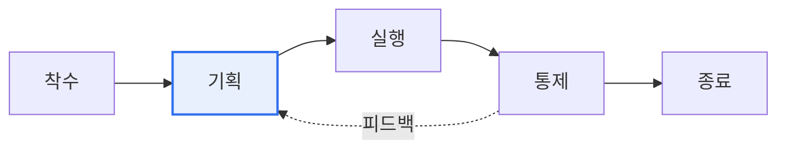

# ISO 21500 (프로젝트 관리 지침)

## 1. 개요

### 가. 정의
> 프로젝트 관리에 대한 **국제 표준 가이드**로, 조직·산업에 무관하게 적용 가능한 프로젝트 관리의 개념·프로세스를 제시한다. PMBOK과 유사한 체계를 국제표준화한 것이다.

ISO 21500이 필요한 이유는 '**프로젝트 관리의 공통 언어와 기준**'을 국제적으로 제공하기 위함이다. 조직마다 방법론이 제각각이면 협업·평가가 어려운데, 이 표준은 프로세스·주제 그룹을 표준화해 상호 이해와 품질의 기반을 마련한다. (이후 ISO 21502로 개정)

## 2. 구성 모델 (프로세스 그룹 × 대상 그룹)

| 프로세스 그룹 | 내용 |
|---|---|
| **착수(Initiating)** | 프로젝트·단계 시작, 목표 정의 |
| **기획(Planning)** | 상세 계획 수립 |
| **실행(Implementing)** | 계획 수행 |
| **통제(Controlling)** | 진척 감시·조정 |
| **종료(Closing)** | 공식 종료·교훈 정리 |

| 대상 그룹(주제) | 예 |
|---|---|
| **통합·이해관계자·범위** | 통합관리, 이해관계자, 범위 |
| **자원·시간·원가** | 자원, 일정, 비용 |
| **리스크·품질·조달·의사소통** | 리스크, 품질, 조달, 커뮤니케이션 |

## 3. PMBOK과 비교

| 구분 | ISO 21500 | PMBOK |
|---|---|---|
| **성격** | 국제표준(가이드) | 미국 PMI 지식체계 |
| **상세도** | 개념·프레임워크 중심 | 상세 기법·도구 |
| **활용** | 표준 준거 | 실무 방법론 |

## 4. 시사점
- 프로젝트 관리의 **국제 공통 기준** — 조직 방법론 정합성 확보
- PMBOK과 상호 보완(표준+실무 기법)
- ISO 21502로 개정되며 지속가능성·거버넌스 강화

---

> **한 줄 요약**: ISO 21500은 *착수·기획·실행·통제·종료* 프로세스 그룹과 통합·범위·자원·리스크 등 대상 그룹으로 구성된 프로젝트 관리 국제표준 가이드로, PMBOK과 상호 보완적으로 활용된다.
