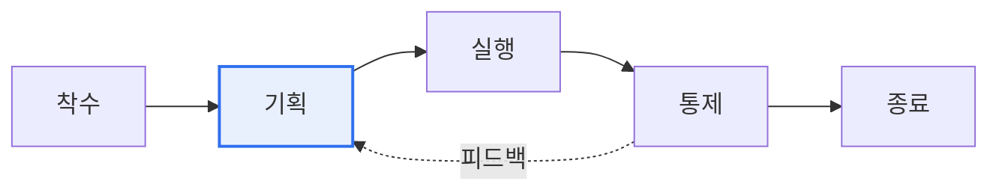

# ISO 21500 (프로젝트 관리 지침)

## 1. 개요

### 가. 정의
> 프로젝트 관리에 대한 **국제 표준 가이드**로, 조직·산업·프로젝트 규모에 무관하게 적용할 수 있는 프로젝트 관리의 개념·프로세스·용어를 제시한다. PMBOK과 유사한 체계를 국제표준화기구(ISO)가 국제 표준으로 정립한 것이다.

ISO 21500이 필요한 이유는 '**프로젝트 관리의 국제 공통 언어와 기준**'을 제공하기 위함이다. 조직마다 프로젝트 관리 방식과 용어가 제각각이면, 글로벌 협업이나 성과 평가, 지식 공유가 어렵다. 특정 국가·단체의 방법론(예: 미국 PMI의 PMBOK)이 사실상 널리 쓰이긴 했지만, 이를 중립적인 국제 표준으로 정립할 필요에서 ISO 21500이 만들어졌다. 이 표준은 프로세스와 주제 그룹을 표준화해 서로 다른 조직·국가가 프로젝트를 같은 틀로 이해하고 소통하게 하는 공통 기반을 제공한다(이후 ISO 21502로 개정되며 지속가능성·거버넌스가 강화되었다).

### 나. 필요성
프로젝트의 대형화·국제화로 다국적 팀과 협력사가 함께 일하는 경우가 늘면서, 조직 방법론의 정합성과 품질을 담보할 국제 기준이 요구된다. ISO 21500은 그 준거를 제공한다.

## 2. 구성 모델 (프로세스 그룹 × 대상 그룹)

ISO 21500은 프로젝트를 두 축으로 조직화한다. 첫째 축은 **프로세스 그룹** 으로, 프로젝트가 시간에 따라 거치는 착수·기획·실행·통제·종료의 흐름이다. 특히 통제는 실행과 병행하며 계획과의 차이를 감시·조정하고 필요시 기획으로 환류한다. 둘째 축은 **대상 그룹(주제)** 으로, 통합·이해관계자·범위·자원·시간·원가·리스크·품질·조달·의사소통 등 프로젝트에서 관리해야 할 지식 영역이다. 각 프로세스는 이 두 축이 교차하는 지점에 위치한다.

| 프로세스 그룹 | 내용 |
|---|---|
| **착수(Initiating)** | 프로젝트·단계 시작, 목표·헌장 정의 |
| **기획(Planning)** | 상세 계획 수립 |
| **실행(Implementing)** | 계획 수행 |
| **통제(Controlling)** | 진척 감시·조정 |
| **종료(Closing)** | 공식 종료·교훈 정리 |

| 대상 그룹(주제) | 예 |
|---|---|
| **통합·이해관계자·범위** | 통합관리, 이해관계자, 범위 |
| **자원·시간·원가** | 자원, 일정, 비용 |
| **리스크·품질·조달·의사소통** | 리스크, 품질, 조달, 커뮤니케이션 |

## 3. PMBOK과 비교

| 구분 | ISO 21500 | PMBOK |
|---|---|---|
| **성격** | 국제표준(가이드) | 미국 PMI 지식체계 |
| **상세도** | 개념·프레임워크 중심 | 상세 기법·도구·산출물 |
| **활용** | 표준 준거·인증 기반 | 실무 방법론 |

ISO 21500이 '무엇을 관리해야 하는가'라는 프레임워크를 국제 표준으로 제시한다면, PMBOK은 '어떻게 관리하는가'라는 구체적 도구·기법을 상세히 다룬다. 둘은 경쟁이 아니라 상호 보완적으로, 표준 준거는 ISO에서, 실무 상세는 PMBOK에서 취하는 방식으로 함께 활용된다.

## 4. 고려사항 및 시사점

1. **프로젝트 관리의 국제 공통 기준**으로서, 조직 고유 방법론이 국제 표준과 정합성을 갖도록 하는 준거가 된다. 다국적 프로젝트의 소통·평가 기반이 된다.
2. **PMBOK과 상호 보완**한다. 표준의 프레임워크(ISO)와 실무 기법(PMBOK)을 결합하면 체계성과 실행력을 모두 확보할 수 있다.
3. **ISO 21502로의 진화**를 이해해야 한다. 개정판은 프로젝트 거버넌스, 지속가능성, 이해관계자 관리 등을 강화해, 단순 프로세스 관리를 넘어 가치·거버넌스 중심으로 발전하고 있다.

---

> **한 줄 요약**: ISO 21500은 *착수·기획·실행·통제·종료* 프로세스 그룹과 통합·범위·자원·리스크 등 대상 그룹으로 구성된 프로젝트 관리 국제표준 가이드로, PMBOK의 실무 기법과 상호 보완적으로 활용되며 ISO 21502로 거버넌스·지속가능성이 강화되었다.
