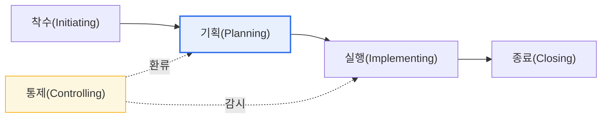
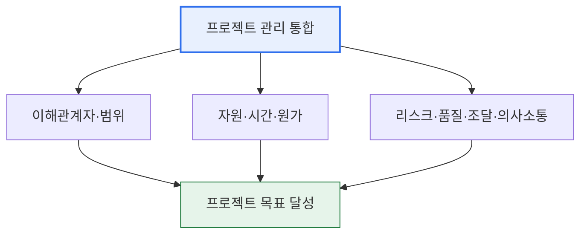

# ISO 21500 (프로젝트 관리 지침)

## 1. 개요

### 가. 정의
> 프로젝트 관리에 대한 **국제 표준 가이드**로, 조직·산업·프로젝트 규모에 무관하게 적용할 수 있는 프로젝트 관리의 개념·프로세스·용어를 제시한다. 미국 PMI의 지식체계인 PMBOK과 유사한 프로세스 구조를 국제표준화기구(ISO)가 중립적 국제 표준으로 정립한 것이 그 출발점이다.

ISO 21500이 필요한 근본 이유는 '**프로젝트 관리의 국제 공통 언어와 준거**'를 제공하기 위함이다. 조직마다 프로젝트 관리 방식과 용어가 제각각이면, 글로벌 협업이나 성과 평가, 지식 공유, 감사·인증이 모두 어려워진다. 특정 국가·단체의 방법론(대표적으로 미국 PMI의 PMBOK)이 사실상 널리 쓰이긴 했으나, 이는 어디까지나 한 기관의 지식체계였다. 이를 특정 조직에 종속되지 않는 중립적 국제 표준으로 정립할 필요에서 2012년 ISO 21500:2012 "Guidance on project management"가 제정되었다.

ISO 21500이 다루는 대상은 '프로젝트'라는 일회적·한시적 노력이다. 정형화된 반복 업무(운영, operations)와 달리 프로젝트는 고유한 산출물을 정해진 기간·예산 안에서 만들어내는 활동이므로, 불확실성과 변경이 상수(常數)로 존재한다. 표준이 통제-기획의 환류나 리스크 관리를 핵심 요소로 강조하는 것도 이러한 프로젝트의 본질적 불확실성에 대응하기 위함이다.

여기서 주의할 점은 이 표준이 '**방법론(methodology)이 아니라 가이드(guidance)**'라는 성격이다. 즉 "이 순서대로 이 도구를 쓰라"는 처방이 아니라, "프로젝트 관리에는 이러이러한 개념과 프로세스가 있으며 이렇게 이해하라"는 공통 프레임워크를 제시한다. 따라서 조직은 자사의 방법론(예: 사내 PM 표준, PRINCE2, 애자일)을 ISO 21500이라는 공통 틀에 비추어 정합성을 점검하고 보완하는 준거로 활용한다. 서로 다른 국가·조직이 프로젝트를 '같은 지도'로 이해하고 소통하게 하는 공통 기반을 제공하는 것이 이 표준의 본질적 가치이다.

### 나. 등장 배경 및 필요성
프로젝트의 대형화·국제화로 다국적 팀과 협력사가 하나의 프로젝트에 함께 참여하는 경우가 급증하면서, 각 조직의 방법론이 서로 호환되고 품질을 담보할 수 있는 국제 기준의 필요성이 커졌다. 예컨대 발주사·설계사·시공사·감리사가 각기 다른 나라에 있는 대형 인프라 프로젝트에서, 착수·기획·통제의 절차와 용어가 통일되어 있지 않으면 일정·원가·리스크 관리의 소통 비용이 폭증한다. ISO 21500은 이러한 이질적 참여자들에게 공통의 준거를 제공해 협업과 거버넌스의 기반이 된다. 이후 이 표준군은 2020~2021년에 대대적으로 개정·재편되는데, 이는 뒤의 심화 절에서 다룬다.

또한 표준화는 조직 내부에도 실익을 준다. 프로젝트 관리 역량이 특정 스타 관리자의 암묵지에 의존하면, 그 사람이 떠날 때 관리 품질이 급락한다. ISO 21500과 같은 공통 표준을 조직에 내재화하면 프로젝트 관리가 개인기가 아닌 조직의 형식지·프로세스 자산으로 축적되어, 인력 교체와 무관하게 일정한 품질을 유지하고 신규 인력의 학습 곡선도 단축할 수 있다. 이것이 표준이 대외 협업뿐 아니라 조직 내부의 지속가능성 측면에서도 요구되는 이유이다.

## 2. 구성 모델 (프로세스 그룹 × 대상 그룹)

ISO 21500(2012)은 프로젝트를 두 개의 직교하는 축으로 조직화한다. 이 '2차원 매트릭스' 구조가 PMBOK과 발상을 공유하는 핵심 부분이다.

```mermaid
flowchart LR
  I["착수(Initiating)"] --> P["기획(Planning)"] --> E["실행(Implementing)"] --> Cl["종료(Closing)"]
  C["통제(Controlling)"] -. 감시 .-> E
  C -. 환류 .-> P
  style P fill:#e8f0fe,stroke:#2f6fed,stroke-width:2px
  style C fill:#fef7e0,stroke:#f9ab00
```

첫째 축은 **프로세스 그룹(Process Groups)** 으로, 프로젝트가 시간 흐름에 따라 거치는 다섯 단계(착수·기획·실행·통제·종료)이다. 이 다섯은 순차적으로만 진행되는 것이 아니라 상호작용한다. 특히 **통제(Controlling)** 는 실행과 병행하며 계획 대비 실적의 차이를 감시하고, 편차가 발생하면 기획으로 되돌려 계획을 갱신하는 **피드백 루프**를 형성한다. 이 환류 구조 덕분에 프로젝트는 초기 계획을 경직되게 고수하지 않고, 진행 중 발생하는 변경을 통제된 방식으로 반영할 수 있다.

둘째 축은 **대상 그룹(Subject Groups, 주제 영역)** 으로, 프로젝트에서 관리해야 할 지식 영역을 묶은 것이다. 통합(Integration)·이해관계자(Stakeholder)·범위(Scope)·자원(Resource)·시간(Time)·원가(Cost)·리스크(Risk)·품질(Quality)·조달(Procurement)·의사소통(Communication)의 열 개 영역으로 구성된다. 각 대상 그룹은 프로젝트 전 생애에 걸쳐 관리되며, 개별 프로세스는 '프로세스 그룹(언제)'과 '대상 그룹(무엇을)'이 교차하는 지점에 위치한다. 예를 들어 '원가 산정'은 기획(프로세스 그룹) × 원가(대상 그룹)의 교차점에 놓인 프로세스이다.

```mermaid
flowchart TB
  T["프로젝트 관리 통합"] --> SA["이해관계자·범위"]
  T --> RES["자원·시간·원가"]
  T --> QRC["리스크·품질·조달·의사소통"]
  SA --> O["프로젝트 목표 달성"]
  RES --> O
  QRC --> O
  style T fill:#e8f0fe,stroke:#2f6fed,stroke-width:2px
  style O fill:#e6f4ea,stroke:#137333
```

위 대상 그룹 세부도가 보여주듯, **통합관리**는 나머지 아홉 영역을 조율·연결하는 중심축 역할을 한다. 개별 영역이 아무리 잘 관리되어도 서로 상충(예: 일정 단축과 원가 절감의 충돌)하면 프로젝트는 실패하므로, 통합관리가 전체 균형과 우선순위를 조정해 하나의 목표로 수렴시킨다. 이해관계자·범위가 '무엇을 왜 하는가'를 정의하고, 자원·시간·원가가 '어떻게 얼마로 하는가'를 다루며, 리스크·품질·조달·의사소통이 '어떻게 안정적으로 완수하는가'를 뒷받침하는 구조로 이해하면 각 영역의 관계가 명확해진다.

| 프로세스 그룹 | 핵심 활동 |
|---|---|
| **착수(Initiating)** | 프로젝트·단계 개시, 목표·프로젝트 헌장 정의 |
| **기획(Planning)** | 범위·일정·원가 등 상세 계획 수립 |
| **실행(Implementing)** | 계획에 따른 작업 수행·산출물 생성 |
| **통제(Controlling)** | 진척 감시, 편차 분석, 변경·시정조치 |
| **종료(Closing)** | 공식 인수·종료, 교훈(lessons learned) 정리 |

| 대상 그룹 묶음 | 포함 영역 |
|---|---|
| **정의·통합** | 통합, 이해관계자, 범위 |
| **제약(3대)** | 자원, 시간(일정), 원가(비용) |
| **품질·불확실성·소통** | 리스크, 품질, 조달, 의사소통 |

이 매트릭스 구조가 가지는 실무적 함의는 '**빠짐없이·중복 없이(MECE) 관리 영역을 조망**'할 수 있다는 데 있다. 프로젝트 관리자는 매 단계(프로세스 그룹)마다 열 개 대상 그룹을 점검표처럼 훑어, 예컨대 실행 단계에서 '리스크 대응은 갱신되고 있는가, 이해관계자 소통은 충분한가'를 구조적으로 확인할 수 있다. 이는 관리자의 경험이나 직관에 의존하던 프로젝트 관리를, 표준화된 체크 프레임으로 전환한다는 점에서 조직 전반의 관리 품질을 상향 평준화하는 효과가 있다. 다만 표준은 '모든 프로젝트가 열 영역을 동일한 강도로 관리해야 한다'고 규정하지 않는다. 소규모·저위험 프로젝트는 조달·프로그램 연계 등을 간소화하는 **재단(tailoring)** 이 오히려 권장되며, 이 재단의 판단이 관리자의 전문성이 발휘되는 지점이다.

## 3. PMBOK과의 비교 (차이의 이유와 함의)

| 구분 | ISO 21500 | PMBOK Guide(PMI) |
|---|---|---|
| **성격** | 국제표준(중립적 가이드) | 특정 협회의 지식체계 |
| **상세도** | 개념·프레임워크 중심(간결) | 상세 기법·도구·산출물(ITTO) 풍부 |
| **활용** | 표준 준거·정합성·인증 기반 | 실무 수행 방법론·자격(PMP) 기반 |
| **개정 방향** | 거버넌스·포트폴리오로 확장(21502 등) | 프로세스 → 원칙·성과영역 중심 전환 |

두 문서의 차이는 우열이 아니라 **지향점의 차이**에서 비롯된다. ISO 21500이 '무엇을 관리해야 하는가'라는 프레임워크를 중립적 국제 표준으로 간결하게 제시하는 데 초점을 둔다면, PMBOK은 '어떻게 관리하는가'라는 구체적 도구·기법·산출물(투입·도구·산출, ITTO)을 방대하게 다룬다. 이 때문에 ISO 21500은 조직 방법론의 정합성을 점검하는 '기준자' 역할에, PMBOK은 실무자가 참고하는 '실행 매뉴얼' 역할에 각각 강점이 있다.

실무에서는 둘을 경쟁 관계가 아니라 상호 보완적으로 함께 활용한다. 즉 조직 표준의 큰 틀과 용어는 ISO 21500(및 후속 21502)에 맞춰 국제 정합성을 확보하고, 개별 프로세스의 세부 수행 기법은 PMBOK에서 취하는 방식이다. 실제로 두 문서의 프로세스 그룹 명칭과 지식 영역이 상당히 대응되므로, 한쪽에 익숙한 실무자가 다른 쪽을 이해하는 데 큰 어려움이 없다는 점도 병행 활용을 쉽게 한다.

차이가 발생하는 근본 이유는 두 문서의 '제정 주체와 목적'이 다르기 때문이다. ISO는 다양한 국가 표준기관의 합의로 표준을 만드는 조직이므로, 특정 도구·기법을 규정하기보다 최대공약수 수준의 개념·프로세스 합의에 머무를 수밖에 없다. 반면 PMI는 실무자 자격(PMP)과 교육 사업을 함께 운영하는 전문 협회이므로, 실무자가 바로 쓸 수 있는 상세 도구·산출물·용어집을 방대하게 축적해 왔다. 이 구조적 차이를 이해하면, 왜 ISO 21500은 '간결한 준거'이고 PMBOK은 '두꺼운 실무서'인지가 자연스럽게 설명된다.

한편 PMBOK도 2021년 제7판에서 기존의 프로세스·지식영역 중심에서 **원칙(principles)·성과영역(performance domains)** 중심으로 크게 전환하여, 애자일·하이브리드를 포괄하는 방향으로 진화했다. 즉 ISO 계열과 PMBOK이 모두 '절차 나열'에서 '가치·원칙·거버넌스'로 무게중심을 옮기고 있다는 점에서, 두 표준의 진화 방향은 수렴하는 양상을 보인다.

## 4. 표준군의 진화 (심화 — 2020~2021 개정)

ISO 21500 계열은 2020~2021년에 걸쳐 크게 재편되었으며, 기술사 관점에서 이 변화를 정확히 이해하는 것이 중요하다. 핵심은 **프로젝트 관리의 상세 지침이 ISO 21500에서 신규 표준 ISO 21502로 이관되고, ISO 21500 자체는 상위의 '맥락과 개념(Context and concepts)' 문서로 재정의**되었다는 점이다.

구체적으로, **ISO 21502:2020**("Project, programme and portfolio management — Guidance on project management")이 2012년판 ISO 21500이 담당하던 프로젝트 관리 실무 지침을 대체하는 주 참조 표준이 되었다. 반면 **ISO 21500:2021**은 "Project, programme and portfolio management — Context and concepts"로 재정의되어, 프로젝트뿐 아니라 **프로그램·포트폴리오**를 아우르는 전체 관리 체계의 맥락·개념·용어와, ISO/TC 258이 만든 관련 표준군(21502·21503·21504·21505 등)에 대한 상위 조망을 제공하는 '우산(umbrella)' 표준이 되었다.

이 재편의 배경에는 두 가지 흐름이 있다. 첫째, 개별 프로젝트를 넘어 **프로그램(연관 프로젝트 묶음)·포트폴리오(전사 투자 집합)** 차원의 전략 정렬이 중요해지면서, 표준이 단일 프로젝트 관리에서 조직 전체의 프로젝트 거버넌스로 시야를 넓혔다. 둘째, 2020년대 개정판들은 **거버넌스·지속가능성·가치 실현(benefits realization)** 을 강조해, 단순한 절차 준수를 넘어 프로젝트가 조직에 실제 가치를 창출하는지에 초점을 옮겼다. 다만 국내외 조직·교재·기출에서는 여전히 'ISO 21500'을 2012년판의 5개 프로세스 그룹 모델로 지칭하는 경우가 많으므로, 답안 작성 시에는 "2012년판 프로세스 모델"과 "2020~2021년 재편(21502 이관, 21500의 맥락·개념화)"을 구분해 서술하는 것이 안전하다.

## 5. 적용 사례

ISO 21500 계열이 실제로 어떻게 활용되는지는 조직 유형별로 구체화된다.

**사례 1 — 다국적 EPC(플랜트 건설) 프로젝트.** 발주사(중동)·설계사(유럽)·시공사(아시아)가 협업하는 대형 플랜트 프로젝트에서는 참여 조직의 PM 용어와 절차가 제각각이다. 이때 계약서상 프로젝트 관리 준거로 ISO 21500/21502를 명시하면, 착수·기획·통제·종료의 단계 정의와 리스크·조달·품질 관리 프로세스가 공통 기준으로 정렬된다. 예컨대 '변경 관리(change control)'의 절차와 승인 게이트를 표준에 맞춰 통일하면, 서로 다른 조직 간의 변경 요청·승인 소통 비용이 크게 줄어든다.

**사례 2 — 공공기관 정보화사업 PMO.** 국내 대형 공공 정보화사업에서 PMO는 다수 사업자의 산출물과 일정을 통합 관리해야 한다. ISO 21500의 프로세스 그룹·대상 그룹 매트릭스를 사업 관리 체계의 준거로 삼으면, 각 사업자의 방법론이 달라도 '무엇을 언제 관리해야 하는가'를 공통 틀로 점검할 수 있다. 특히 통제 프로세스의 '감시-환류' 루프를 EVM(획득가치관리) 등 실무 기법(PMBOK)과 결합해 일정·원가 편차를 정량 관리한다.

**사례 3 — 조직 PM 성숙도 향상.** 사내 PM 표준이 없거나 비체계적인 기업이 ISO 21500을 준거로 자사 프로세스를 매핑하면, 누락된 관리 영역(예: 이해관계자 관리, 리스크 관리)이 드러난다. 이를 보완해 사내 표준을 정비하고, 나아가 프로그램·포트폴리오 차원(ISO 21503/21504)으로 확장하면 전사 프로젝트 거버넌스 체계를 단계적으로 구축할 수 있다.

세 사례의 공통점은, ISO 21500이 '실행 방법론'을 대체하는 것이 아니라 서로 다른 방법론·조직을 하나의 공통 좌표계로 정렬하는 '준거 역할'을 한다는 점이다.

## 6. 고려사항 및 시사점 (기술사 관점)

1. **국제 공통 준거로서의 정합성 확보 수단이다.** 조직 고유 PM 방법론이 국제 표준과 어긋나면 다국적 협업·감사·인증에서 마찰이 생긴다. ISO 21500/21502를 준거로 자사 표준의 프로세스·용어·산출물을 매핑·점검하는 것이 실무 적용의 첫걸음이다.

2. **PMBOK 등 실무 방법론과 상호 보완적으로 결합해야 한다.** 표준의 프레임워크(ISO)만으로는 구체 실행이 어렵고, 방법론(PMBOK·PRINCE2)만으로는 국제 정합성·중립성이 약하다. 큰 틀은 ISO, 세부 기법은 방법론에서 취하는 하이브리드 전략이 체계성과 실행력을 동시에 확보한다.

3. **거버넌스·포트폴리오·가치 중심으로의 진화를 반영해야 한다.** 2020~2021 개정은 프로젝트 단위 통제를 넘어 프로그램·포트폴리오 거버넌스와 편익 실현을 강조한다. PMO·전략기획 부서는 개별 프로젝트 관리(21502)와 전사 조망(21500 개념·21503/21504)을 계층적으로 연계해 투자 우선순위와 전략 정렬을 관리해야 한다.

4. **애자일·하이브리드 환경과의 접목이 과제이다.** 원 표준은 전통적(예측형) 프로젝트를 전제로 하지만, 실제 SW·디지털 프로젝트는 애자일·하이브리드로 수행되는 경우가 많다. 프로세스 그룹의 '통제-기획 환류'를 반복 주기(스프린트)로 해석하는 등, 표준의 개념을 애자일 실천과 정합적으로 재해석하는 능력이 요구된다.

5. **표준 준수 자체가 목적이 아님을 유의해야 한다.** 표준은 공통 언어·준거일 뿐, 프로젝트 성공을 보장하지 않는다. 조직의 성숙도(예: OPM3 등 성숙도 모델)와 상황(프로젝트 규모·리스크)에 맞게 표준을 재단(tailoring)하여 적용하는 것이 기술사 관점의 핵심 판단이다.

## 참고자료
- ISO 21500:2021 — Project, programme and portfolio management — Context and concepts — https://www.iso.org/standard/75704.html
- ISO 21502:2020 — Project, programme and portfolio management — Guidance on project management — https://www.iso.org/standard/74947.html

---

> **한 줄 요약**: ISO 21500은 *착수·기획·실행·통제·종료* 프로세스 그룹과 통합·범위·자원·리스크 등 대상 그룹으로 구성된 프로젝트 관리 국제표준 가이드(2012)로, PMBOK의 실무 기법과 상호 보완적으로 활용되며, 2020~2021년 개정에서 실무 지침은 ISO 21502로 이관되고 ISO 21500은 프로그램·포트폴리오를 아우르는 '맥락·개념' 표준으로 재편되어 거버넌스·지속가능성이 강화되었다.
