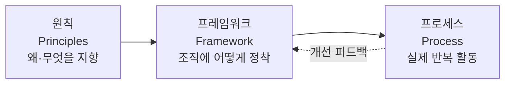

# ISO 31000 (리스크 관리)

## 1. 개요

### 가. 정의
> 조직이 직면하는 **불확실성(리스크)이 목표 달성에 미치는 영향을 체계적으로 관리**하기 위한 **원칙(Principles)·프레임워크(Framework)·프로세스(Process)** 를 제시하는 국제표준(ISO 31000:2018). 산업·규모·부문에 무관하게 적용 가능한 범용 지침이다.

ISO 31000에서 리스크는 단순한 '위험'이 아니라 "**목표에 대한 불확실성의 영향(effect of uncertainty on objectives)**"으로 정의된다. 이 정의가 중요한 이유는, 리스크를 손실을 초래하는 위협(threat)뿐 아니라 성과를 높일 수 있는 **기회(opportunity)** 로도 보게 만들기 때문이다. 즉 리스크 관리는 나쁜 일을 막는 방어 활동에 그치지 않고, 불확실성 속에서 **가치를 창출하고 보호**하는 경영 활동으로 격상된다.

### 나. 등장 배경 및 필요성
과거 조직의 리스크 관리는 재무·안전·정보보안 등 **부서별로 분절(silo)** 되어 있었다. 그 결과 같은 리스크를 중복 대응하거나, 부서 경계에 걸친 리스크를 아무도 책임지지 않는 사각지대가 생겼다. 또 리스크 대응이 사고가 난 뒤에야 이뤄지는 **사후 대응** 중심이라 손실을 키웠다. ISO 31000은 이를 전사적으로 통합해 **전략·의사결정 과정에 리스크 관리를 내재화**하도록 함으로써, 조직 전체가 일관된 기준으로 불확실성을 다루게 하는 것을 목표로 한다. 전사적 리스크 관리(ERM)를 도입하려는 조직에게 국제적으로 통용되는 공통 언어와 골격을 제공한다는 점에서 필요성이 크다.

## 2. 3대 구성

ISO 31000의 구조는 "**왜(원칙) → 어떻게 정착(프레임워크) → 무엇을 실행(프로세스)**"의 삼층 구조로 이해하면 명확하다. 세 요소는 위계가 아니라 서로를 지지하는 관계이며, 프로세스 실행 결과가 다시 프레임워크 개선으로 환류된다.

- **원칙(Principles)**: 리스크 관리가 지향해야 할 가치와 성질을 규정한다. 핵심은 **가치의 창출과 보호**이며, 이를 위해 관리가 **통합적·구조적·맞춤형·포용적**이어야 하고, 이용 가능한 최선의 정보에 기반하되 인적·문화적 요소를 고려하며 **지속적으로 개선**되어야 한다. 원칙은 "좋은 리스크 관리란 무엇인가"의 판단 기준 역할을 한다.
- **프레임워크(Framework)**: 원칙을 조직에 실제로 뿌리내리게 하는 지원 체계로, **리더십과 의지(경영진 관여)** 를 중심에 두고 **통합→설계→실행→평가→개선**의 PDCA 순환으로 구성된다. 리스크 관리가 일회성 이벤트가 아니라 거버넌스에 상시 통합되도록 한다.
- **프로세스(Process)**: 실무 담당자가 반복 수행하는 활동으로, 리스크 평가를 중심으로 다음 3장에서 상술한다.

## 3. 리스크 관리 프로세스

프로세스는 순차적 절차인 동시에, 의사소통과 모니터링이 전 과정을 감싸며 필요 시 앞 단계로 되돌아가는 **반복(iterative)** 구조를 가진다.

- **범위·상황·기준 설정(Scope, Context, Criteria)**: 관리 대상 범위를 정하고, 조직의 내·외부 맥락(규제·시장·이해관계자·조직문화)을 파악하며, **어느 수준의 리스크를 수용할지(리스크 기준·감내수준)** 를 사전에 정의한다. 이 기준이 없으면 이후 '평가'가 주관적 판단에 흔들린다.
- **리스크 평가(Risk Assessment)**: 세 단계로 나뉜다. **식별(Identification)** 은 목표를 위협·촉진할 수 있는 리스크를 빠짐없이 도출하고, **분석(Analysis)** 은 각 리스크의 발생가능성과 영향을 정성·정량으로 추정하며, **평가(Evaluation)** 는 분석 결과를 앞서 정한 기준과 비교해 대응 우선순위를 정한다.
- **리스크 대응(Risk Treatment)**: 우선순위가 높은 리스크에 대해 **회피(활동 중단)·감소(통제 강화)·전가(보험·아웃소싱)·수용(감내)** 중 전략을 선택한다. 하나의 리스크에 여러 대응을 조합하며, 대응 후 남는 **잔여 리스크(residual risk)** 를 다시 평가한다.
- **모니터링·검토(Monitoring & Review)**: 리스크 환경은 변하므로 통제의 효과와 리스크 수준을 지속 감시·재평가한다.
- **의사소통·협의, 기록·보고(Communication & Recording)**: 전 단계에 걸쳐 이해관계자와 소통하고 근거를 문서화해 책임성과 학습을 확보한다.

| 단계 | 핵심 활동 | 산출·기준 |
|---|---|---|
| 범위·상황·기준 설정 | 맥락 분석, 감내수준 정의 | 리스크 기준 |
| 리스크 평가 | 식별→분석→평가 | 리스크 등급·우선순위 |
| 리스크 대응 | 회피·감소·전가·수용 | 대응계획·잔여리스크 |
| 모니터링·검토 | 상시 감시·재평가 | 통제 유효성 |
| 의사소통·기록 | 소통·문서화 | 리스크 대장 |

## 4. 관련 표준 비교

리스크 관련 표준은 목적과 초점이 다르므로 상호 배타가 아니라 보완적으로 함께 쓰인다. ISO 31000이 **범용 골격**을 제공한다면, COSO ERM은 미국계 상장사의 재무보고·내부통제 맥락에서 출발해 **전략·성과와의 연계**를 강조하고, ISO 27005는 그 골격을 **정보보안(ISMS)** 영역에 특화해 자산·위협·취약점 기반으로 구체화한다. 즉 정보보안 조직은 27005로 세부 방법을, 31000으로 전사 정합성을 맞추는 식으로 결합한다.

| 표준 | 초점 | 성격 |
|---|---|---|
| **ISO 31000** | 범용 리스크 관리 지침 | 비인증(가이드) |
| **COSO ERM** | 전사 리스크·전략·내부통제 | 프레임워크 |
| **ISO 27005** | 정보보안 리스크 관리 | ISMS 특화 |

예를 들어 어느 제조기업이 신규 스마트팩토리를 도입할 때, ISO 31000의 프로세스로 '설비 오작동·공급망 중단·사이버 침해' 리스크를 함께 식별하되, 사이버 침해 부분은 ISO 27005의 자산·위협 분석으로 심화하고, 재무 영향은 COSO ERM 관점으로 이사회에 보고하는 식의 조합이 실무적이다.

## 5. 고려사항 및 시사점
- **인증이 아닌 지침**: ISO 31000은 인증 취득용 요구사항 표준이 아니라 **가이드**이므로, 조직 상황에 맞춰 재단(tailoring)해 적용해야 하며 형식적 문서화에 그치지 않도록 유의한다.
- **거버넌스·전략과의 통합**: 리스크 관리를 별도 부서 업무로 두면 실패한다. 의사결정·예산·성과관리 프로세스 안에 녹여야 실효성이 생긴다.
- **트레이드오프**: 통제를 강화하면 리스크는 줄지만 비용·민첩성이 희생된다. 감내수준을 명확히 해 과잉·과소 통제를 모두 피하는 균형이 관건이다.
- **연계·전망**: ISMS(ISO 27001)·BCP·프로젝트 리스크관리(PMBOK)와 연계되며, 최근에는 **공급망·ESG·AI 리스크** 등 신종 불확실성으로 적용 범위가 확장되고 있다.

---

> **한 줄 요약**: ISO 31000은 *원칙·프레임워크·프로세스* 로 구성된 범용 리스크 관리 국제표준으로, 상황·기준 설정→리스크 평가(식별·분석·평가)→대응→모니터링의 반복 프로세스를 통해 불확실성을 위협이자 기회로 관리하는 전사적 골격을 제공한다.
