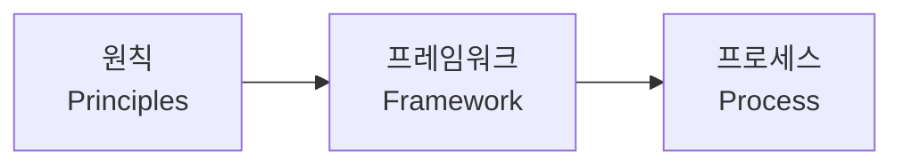

# ISO 31000 (리스크 관리)

## 1. 개요

### 가. 정의
> 조직의 **리스크 관리를 위한 원칙·프레임워크·프로세스**를 제시하는 국제표준(ISO 31000:2018). 산업·규모에 무관하게 적용 가능한 범용 지침.

### 나. 필요성
- 불확실성(리스크)이 목표 달성에 미치는 영향의 체계적 관리
- 전사적 리스크 관리(ERM)의 국제 기준

## 2. 3대 구성

| 구성 | 내용 |
|---|---|
| **원칙(Principles)** | 가치 창출·보호, 통합적·체계적·맞춤형·포용적, 지속 개선 |
| **프레임워크(Framework)** | 리더십·통합·설계·실행·평가·개선(PDCA) |
| **프로세스(Process)** | 리스크 평가 중심의 반복 활동 |

## 3. 리스크 관리 프로세스

| 단계 | 내용 |
|---|---|
| **범위·상황 설정** | 조직 내·외부 맥락, 기준 정의 |
| **리스크 평가** | 식별(Identification)→분석(Analysis)→평가(Evaluation) |
| **리스크 대응(처리)** | 회피·감소·전가·수용 |
| **모니터링·검토** | 지속 감시·재평가 |
| **의사소통·기록** | 이해관계자 소통, 문서화 |

## 4. 관련 표준 비교

| 표준 | 초점 |
|---|---|
| **ISO 31000** | 범용 리스크 관리 지침 |
| **COSO ERM** | 전사 리스크·내부통제 |
| **ISO 27005** | 정보보안 리스크 관리 |

## 5. 고려사항 및 시사점
- 인증용이 아닌 **가이드(지침)** 표준 — 조직 상황에 맞춤 적용
- 전략·거버넌스와 통합, 리스크를 위협뿐 아니라 **기회**로 관리
- 정보보안(ISMS)·프로젝트 리스크·BCP와 연계

---

> **한 줄 요약**: ISO 31000은 *원칙·프레임워크·프로세스* 로 구성된 범용 리스크 관리 국제표준으로, 상황설정→리스크 평가(식별·분석·평가)→대응→모니터링의 반복 프로세스로 불확실성을 관리한다.
