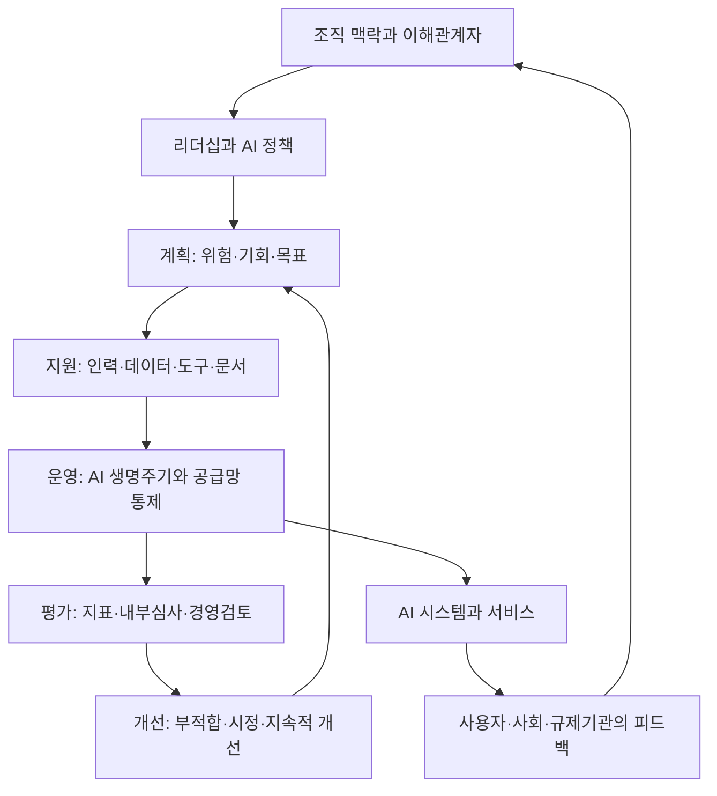
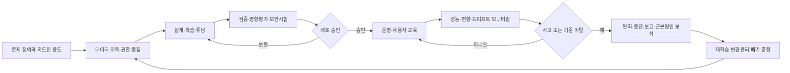

# ISO/IEC 42001:2023 인공지능 경영시스템(AIMS)

## 1. 개요

> **ISO/IEC 42001**은 조직이 인공지능 시스템을 책임 있게 개발·제공·사용하기 위하여 인공지능 경영시스템(AIMS, Artificial Intelligence Management System)을 수립하고, 실행하고, 유지하며, 지속적으로 개선하도록 요구하는 국제 표준이다.

생성형 AI와 머신러닝이 고객 심사, 의료 보조, 제조 품질검사, 공공서비스 등 조직의 의사결정에 편입되면서 모델 정확도만으로는 시스템의 품질을 설명하기 어려워졌다. 같은 모델이라도 어떤 데이터를 사용했는지, 누가 사용을 승인했는지, 오류가 발생했을 때 중단할 수 있는지에 따라 실제 위험과 사회적 영향이 달라진다. 따라서 AI의 기술적 성능과 조직의 책임·절차·감독을 함께 관리하는 체계가 필요하다.

ISO/IEC 42001:2023은 이러한 요구에 대응하는 관리시스템 표준이다. 특정 알고리즘이나 제품의 성능 기준을 정하는 표준이라기보다 조직의 맥락에서 AI와 관련한 위험과 기회를 식별하고 정책, 목표, 프로세스, 증적을 연결하는 상위 거버넌스 체계라는 점이 핵심이다. 조직은 개발자뿐 아니라 구매부서, 현업 사용자, 법무·개인정보·보안 담당자까지 포함하여 AI의 전 생명주기를 관리해야 한다.

ISO 공식 설명에 따르면 이 표준은 AI 기반 제품이나 서비스를 개발·제공·이용하는 조직을 대상으로 하며, 산업 분야와 조직 규모에 관계없이 적용할 수 있다. 표준은 2023년 12월 발행된 제1판이며 ISO/IEC JTC 1/SC 42가 담당한다. 따라서 대기업의 자체 모델뿐 아니라 외부 API를 호출하는 중소기업의 업무 프로세스도 적용 범위에 포함될 수 있다.

## 2. 등장 배경과 필요성

### 2.1 AI 위험의 조직적 성격

전통적인 소프트웨어는 요구사항과 코드가 비교적 직접적으로 연결되지만, 학습 기반 AI는 데이터 분포와 학습 과정이 결과에 영향을 준다. 운영 중 데이터가 변하면 정확도가 저하될 수 있고, 평균 정확도가 높아도 특정 집단에 불리한 오류가 집중될 수 있다. 이 문제는 테스트 단계의 결함 수정만으로 끝나지 않으며 배포 후 모니터링과 재학습 정책까지 요구한다.

또한 AI 위험은 하나의 부서에 고립되지 않는다. 데이터 수집의 적법성은 개인정보와 법무의 문제이고, 모델의 설명가능성은 기획·UX의 문제이며, 공급자 모델의 변경 통지는 조달과 계약의 문제다. 운영자는 모델을 직접 만들지 않았더라도 결과를 사용하여 고객에게 불이익을 줄 수 있다. AIMS는 이 분산된 책임을 조직의 정책과 역할, 의사결정 기록으로 묶는다.

### 2.2 표준화가 필요한 이유

첫째, AI 사용 현황을 파악할 수 있어야 한다. 조직이 어떤 부서에서 어떤 모델과 데이터를 사용하는지 모르면 위험평가나 사고 대응의 출발점이 없다. 둘째, 책임 있는 사용의 기준을 업무목표와 연결해야 한다. 공정성·투명성·안전성이라는 원칙을 선언하는 것만으로는 승인 기준과 측정지표가 생기지 않는다.

셋째, 공급망과 제3자 모델을 통제해야 한다. 외부 LLM이나 클라우드 AI를 사용하면 모델 내부를 모두 검증하기 어렵지만, 데이터 입력 금지 범위, 로그 보존, 변경 통지, 사고 보고, 재위탁 조건 등을 계약과 운영절차로 관리할 수 있다. 넷째, 감사와 개선이 가능해야 한다. 정책을 만들었다는 사실보다 실제로 위험을 평가하고 시정조치를 완료했다는 증거가 중요하다.

## 3. AIMS의 개념과 전체 구조

### 3.1 관리시스템으로서의 AIMS

AIMS는 AI 모델 하나를 감싸는 별도의 보안 제품이 아니다. 조직의 목적과 이해관계자를 고려하여 AI 관련 정책과 목표를 설정하고, 그 목표를 달성하는 프로세스를 운영하는 관리시스템이다. 그러므로 모델 카드나 데이터시트 같은 기술 문서도 중요하지만, 승인권자·위험수용 기준·내부심사·경영진 검토와 같은 관리 요소가 동등하게 중요하다.

다음 구조에서 가장 바깥의 조직 맥락은 적용 범위와 위험 허용수준을 결정한다. 그 안에서 리더십은 정책과 역할을 부여하고, 계획 단계는 위험·기회와 목표를 정한다. 실행 단계에서는 데이터·모델·운영 통제를 수행하며, 점검 단계에서는 지표와 감사로 결과를 확인한다.

### 3.2 PDCA와 책임성

ISO/IEC 42001은 다른 경영시스템 표준과 마찬가지로 Plan-Do-Check-Act의 순환을 사용한다. Plan에서는 AI의 목적, 이해관계자, 위험원, 기회, 목표와 처리계획을 정한다. 이때 조직은 무엇을 자동화할지뿐 아니라 무엇을 자동화하지 않을지도 결정해야 한다.

Do에서는 정책을 실제 프로세스로 전환한다. 데이터 취득과 품질관리, 모델 개발과 검증, 배포 승인, 사용자 교육, 사고 처리, 외부 공급자 관리가 여기에 포함된다. Check에서는 모델 성능만이 아니라 공정성, 설명가능성, 안전성, 개인정보, 보안, 민원과 사고 추세를 정해진 주기로 확인한다.

Act에서는 부적합의 원인을 분석하고 시정조치를 수행한다. 단순히 문제 모델을 재학습하는 것보다 데이터 편향, 승인 절차 누락, 모니터링 지표 부재와 같은 근본 원인을 찾는 것이 중요하다. 개선 결과는 다시 위험평가와 목표에 반영되어 다음 주기의 기준이 된다.

### 3.3 핵심 이해관계자와 역할

최고경영자는 AI 정책과 자원을 승인하고 조직의 위험수용 수준을 결정한다. AI 시스템 소유자는 업무 목적, 사용 범위, 중단 기준과 성능 목표에 책임을 진다. 데이터 스튜어드는 데이터의 출처, 사용권한, 품질, 대표성과 보존기간을 관리한다.

모델 개발자는 학습·검증 방법, 하이퍼파라미터, 한계와 재현 절차를 문서화한다. 보안·개인정보 담당자는 공격, 유출, 목적 외 이용, 재식별 위험을 검토한다. 현업 사용자는 의도된 용도와 금지된 용도를 준수하고 이상 결과를 보고한다. 내부심사자는 개발 성과를 평가하는 사람이 아니라 AIMS가 요구사항대로 운영되는지 독립적으로 확인한다.

이 역할을 직함 하나에 몰아주면 이해상충이 생길 수 있다. 모델을 개발한 팀이 자신의 모델을 승인하고 성능을 선언하면 위험을 축소할 유인이 생긴다. 규모가 작은 조직은 한 사람이 여러 역할을 겸할 수 있지만, 승인·검증·운영·감사의 분리 원칙과 대체 검토자를 문서로 남기는 것이 바람직하다.

## 4. ISO/IEC 42001 요구사항과 통제

### 4.1 조항 4~10의 흐름

ISO/IEC 42001의 본문은 조직의 상황, 리더십, 계획, 지원, 운영, 성과평가, 개선이라는 관리시스템 흐름을 따른다. 조항 4에서는 조직 내부·외부의 상황과 이해관계자의 요구를 파악하고 AIMS 적용범위를 정한다. 예를 들어 고객상담용 LLM만 대상으로 할지, 데이터센터와 외부 API를 포함한 전사 AI 사용을 대상으로 할지 명확히 해야 한다.

조항 5에서는 최고경영자의 책임, AI 정책, 역할과 권한을 정한다. AI 정책은 추상적인 윤리 선언에 머물지 않고 위험 보고, 인간 감독, 사용 승인, 법규 준수, 지속적 개선을 포함해야 한다. 조항 6에서는 위험과 기회를 평가하고 AI 목표와 변경계획을 수립한다.

조항 7은 자원, 역량, 인식, 의사소통과 문서화된 정보를 다룬다. 모델을 구매하는 조직도 사용자의 역량과 데이터 입력 교육을 마련해야 한다. 조항 8은 AI 위험 처리와 생명주기 운영을 다루며, 개발뿐 아니라 배포·사용·모니터링·폐기까지 범위를 확장한다.

조항 9의 성과평가는 운영지표, 내부심사, 경영검토로 구성된다. 조항 10은 부적합과 시정조치, 지속적 개선을 요구한다. 이 구조는 단발성 AI 영향평가 보고서를 만드는 접근과 다르며, 반복 가능한 운영체계를 만드는 접근이다.

| 구분 | 핵심 질문 | 대표 산출물 |
|---|---|---|
| 조직의 상황 | 어떤 AI를 어떤 범위에서 관리하는가 | 적용범위, 이해관계자 목록 |
| 리더십 | 누가 정책과 책임을 승인하는가 | AI 정책, RACI, 위원회 의사록 |
| 계획 | 어떤 위험을 어느 수준까지 처리할 것인가 | 위험평가서, 목표, 처리계획 |
| 지원 | 필요한 역량·자원·문서는 준비되었는가 | 교육기록, 자원목록, 문서관리대장 |
| 운영 | 생명주기와 외부 공급자를 어떻게 통제하는가 | 모델 카드, 검증보고서, 배포승인 |
| 성과평가 | 목표와 통제가 실제로 작동하는가 | KPI, 내부심사, 경영검토 |
| 개선 | 오류와 부적합이 재발하지 않도록 했는가 | 사고기록, 근본원인, 시정조치 |

### 4.2 Annex A와 Annex B의 활용

Annex A는 AI 관련 위험과 조직 목표를 다루기 위한 참조 통제목표와 통제를 제공한다. 조직은 자신의 적용범위와 위험평가를 바탕으로 필요한 통제를 선택하고, 선택·제외 이유와 구현상태를 설명하는 적용성 선언서(SoA, Statement of Applicability) 형태로 관리할 수 있다. 모든 조직이 동일한 통제를 기계적으로 적용하는 것이 목적은 아니다.

통제 영역은 AI 정책, 내부 조직, AI 시스템 자원, 영향평가, AI 생명주기, AI용 데이터, 이해관계자 정보, AI 사용, 제3자와 고객 관계로 이해할 수 있다. 이 영역을 보면 표준이 모델 정확도만을 다루지 않고 조직·데이터·사용자·공급자까지 관리한다는 점이 드러난다.

Annex B는 통제 구현을 위한 지침으로 활용된다. 같은 통제라도 채용 선별 AI와 공장 설비 이상탐지 AI의 문서와 검증 깊이는 달라질 수 있다. 위험이 큰 영역은 더 엄격한 인간 검토와 독립 검증이 필요하고, 영향이 낮은 내부 생산성 도구는 비례적인 통제를 적용할 수 있다.

Annex C는 조직 목표와 위험원을 식별할 때 고려할 수 있는 예시를 제공하며 모든 조직에 그대로 적용되는 목록은 아니다. Annex D는 표준의 적용 맥락을 이해하기 위한 보조 정보를 제공한다. 따라서 본문 요구사항, 위험평가, 조직의 법적 의무를 우선하고 부속서의 목록을 체크리스트로만 사용해서는 안 된다.

### 4.3 AI 영향평가와 위험처리

AI 위험평가는 단순한 확률 곱셈표가 아니다. 먼저 시스템의 의도된 목적과 금지된 목적을 정의하고, 영향을 받는 개인·집단·조직·사회와 이해관계자를 식별한다. 그 다음 편향, 부정확성, 설명 부족, 개인정보 침해, 보안 공격, 안전 실패, 과도한 의존, 환경·사회적 영향의 가능성과 결과를 검토한다.

영향평가는 위험평가와 연결되지만 같은 문서로 뭉개지 않는 것이 좋다. 위험평가는 조직이 통제해야 할 사건의 가능성과 결과에 초점을 두고, 영향평가는 AI의 결정이나 출력이 사람과 사회에 미치는 변화를 살핀다. 예를 들어 신용평가 모델의 오분류는 시스템 위험인 동시에 특정 집단의 금융 접근성에 영향을 주는 사회적 영향이다.

위험처리 옵션은 회피, 감소, 전가·공유, 수용으로 구분할 수 있다. 위험이 수용 수준을 넘으면 사용 중단이나 인간 승인으로 회피하고, 학습 데이터 개선·임계값 조정·모니터링으로 감소시킨다. 외부 공급자 계약으로 일부 책임을 배분할 수 있지만, 계약만으로 조직의 최종 책임이 사라지는 것은 아니다.

### 4.4 AI 생명주기와 증적

문제 정의 단계에서는 자동화의 목적과 의사결정의 주체를 명확히 한다. 데이터 단계에서는 출처, 동의·사용권한, 대표성, 라벨 품질, 결측과 이상치, 보존·폐기를 기록한다. 학습 단계에서는 코드·모델·데이터셋 버전을 연결하여 결과를 재현할 수 있어야 한다.

검증 단계에서는 전체 평균 성능뿐 아니라 중요한 하위집단별 오류, 임계값 변화, 적대적 입력, 프롬프트 주입, 개인정보 노출, 설명의 적합성을 시험한다. 배포 승인에는 모델 버전, 승인자, 적용 범위, 롤백 절차, 인간 개입 조건을 포함한다. 운영 중에는 데이터 드리프트와 개념 드리프트를 구분해 모니터링해야 한다.

사고 발생 시에는 결과를 삭제하는 것보다 시간순 이벤트 로그와 입력·출력·모델 버전을 보존하는 것이 먼저다. 이후 영향을 받은 대상과 규제·고객 보고 필요성을 판단하고, 임시 차단과 재발 방지책을 분리해 관리한다. 폐기 때에는 모델뿐 아니라 캐시, 임베딩, 파생 데이터, 접근권한과 계약상 보존 의무까지 확인해야 한다.

| 생명주기 단계 | 주요 위험 | 통제와 증적 예시 |
|---|---|---|
| 기획 | 목적 불명확, 과도한 자동화 | 사용사례 명세, 금지용도, 영향받는 집단 목록 |
| 데이터 | 편향, 불법 수집, 품질 저하 | 데이터시트, 출처·권한, 품질지표, 대표성 분석 |
| 개발 | 재현 불가, 취약 모델, 과적합 | 실험 추적, 코드·모델 버전, 보안시험 보고서 |
| 검증 | 하위집단 오류, 설명 부족 | 공정성·성능 검증, 독립 검토, 승인 기록 |
| 배포 | 과대신뢰, 설정 오류 | 변경관리, 롤백 테스트, 사용자 교육 |
| 운영 | 드리프트, 정보 유출, 오남용 | 모니터링 대시보드, 접근로그, 사고 플레이북 |
| 폐기 | 잔존 데이터와 권한 | 보존·삭제 증적, 키 폐기, 공급자 종료 확인 |

## 5. 유사 프레임워크와 비교

ISO/IEC 42001은 조직이 감사 가능한 관리시스템을 운영하고 있음을 보여주는 데 초점이 있다. NIST AI RMF는 자발적으로 AI 신뢰성 위험을 관리할 수 있도록 안내하는 위험관리 프레임워크이며, ISO/IEC 23894는 AI 관련 위험관리에 대한 지침이다. ISO/IEC 27001은 정보보호 관리시스템이므로 AI가 처리하는 정보와 인프라 보안에는 강하지만 AI의 의도된 용도·영향평가·모델 생명주기 전체를 직접 대체하지는 않는다.

이 차이를 모르고 ISO 27001 인증만으로 AI 거버넌스를 완성했다고 판단하면 모델 편향과 부적절한 자동화 같은 위험이 남는다. 반대로 AIMS를 별도 섬으로 구축하면 보안·개인정보·품질관리와 중복된 문서가 늘어난다. 기존 ISMS, 개인정보 영향평가, 소프트웨어 개발 생명주기와 공통 리스크 레지스터를 연결하는 통합 설계가 효율적이다.

| 기준 | 성격 | 중심 질문 | 활용 방식 |
|---|---|---|---|
| ISO/IEC 42001 | AI 경영시스템 표준 | 조직이 AI를 책임 있게 관리하는 체계를 갖추었는가 | 정책·위험·운영·감사·개선, 인증 가능 |
| NIST AI RMF | 자발적 위험관리 프레임워크 | AI 위험을 어떻게 거버넌스·식별·측정·관리할 것인가 | 위험관리 활동과 실무 지침 보완 |
| ISO/IEC 23894 | AI 위험관리 지침 | AI 특유의 위험을 어떻게 식별·처리할 것인가 | 위험평가 방법과 통제 설계 참고 |
| ISO/IEC 27001 | 정보보호 경영시스템 | 정보의 기밀성·무결성·가용성을 어떻게 지킬 것인가 | AI 데이터·인프라·접근통제 보완 |
| 개인정보 영향평가 | 개인정보 보호 절차 | 개인정보 처리로 인한 권리 침해를 어떻게 줄일 것인가 | 개인정보 처리 AI의 법적·권리 영향 검토 |

NIST AI RMF의 Govern, Map, Measure, Manage와 같은 활동을 AIMS의 위험평가·운영·성과평가에 매핑하면 실무자가 이해하기 쉽다. 다만 프레임워크의 용어를 그대로 복사하기보다 조직의 AI 목록과 위험수용 기준에 맞춰 책임자와 증적을 정해야 한다. 표준 간 관계는 우열이 아니라 목적과 적용 깊이의 차이로 이해해야 한다.

## 6. 적용 사례

### 6.1 금융권 신용평가 보조 모델

은행이 대출 심사자의 판단을 보조하는 모델을 도입한다고 가정한다. 먼저 의도된 용도는 심사자의 참고자료 제공으로 정의하고, 모델이 단독으로 승인·거절하지 못하도록 업무 규칙을 둔다. 적용범위에는 학습데이터, 모델 API, 심사 화면, 외부 데이터 공급자, 고객 이의제기 절차를 포함한다.

데이터 스튜어드는 소득·거래·대체정보의 출처와 사용권한을 기록하고, 특정 지역이나 연령대가 과소대표되지 않았는지 확인한다. 검증팀은 전체 AUC뿐 아니라 집단별 거짓 양성·거짓 음성 비율과 임계값 변화에 따른 영향을 평가한다. 심사자는 추천 결과의 근거와 한계를 보고 최종 결정을 내리며, 이의제기와 재검토 경로를 제공한다.

운영 단계에서는 승인률 급변, 하위집단별 오류, 입력 분포 변화, 민원 증가를 모니터링한다. 임계값이나 데이터 공급자가 변경되면 재검증과 재승인을 거친다. 이 사례의 핵심은 공정성 지표 하나를 만족하는 것이 아니라 목적·인간감독·설명·이의제기·변경관리의 연결을 증명하는 것이다.

### 6.2 생성형 AI 고객상담 서비스

콜센터가 외부 LLM API로 상담 초안을 생성하는 경우, 상담원의 이름·주민번호·계약정보가 모델 제공자에게 전달되는지부터 확인한다. 입력 마스킹과 보존기간, 학습 재사용 금지 여부, 지역별 저장 위치, 장애 시 대체 절차를 계약과 기술 설정으로 관리한다.

의도된 용도는 상담원 지원으로 한정하고, 법적 판단·환불 확정·의료 조언처럼 위험이 높은 답변은 자동 전송하지 않도록 한다. 검색증강을 적용한다면 근거 문서의 버전과 권한을 확인하고, 모델이 출처 없는 답변을 생성할 때 상담원이 쉽게 발견하도록 화면을 설계한다.

운영 지표에는 평균 처리시간뿐 아니라 잘못된 답변률, 근거 링크 누락률, 개인정보 포함률, 상담원 수정률, 고객 불만과 사고 건수를 포함한다. 프롬프트 주입, 악성 문서, 민감정보 재현, 시스템 프롬프트 노출 시험을 정기적으로 수행한다. 이 사례는 AI를 구매해 사용하는 조직도 AIMS의 주체가 된다는 사실을 보여준다.

## 7. 구축 로드맵과 감사 대응

첫 단계는 전사 AI 인벤토리다. 개발 중인 모델, 운영 모델, SaaS 기능, 개인이 사용하는 외부 LLM, 데이터 파이프라인을 조사하고 소유자와 업무 목적을 연결한다. 발견되지 않은 그림자 AI는 위험평가에서 빠지므로 네트워크 목록·구매 기록·비용 청구·설문을 교차검증한다.

둘째 단계는 적용범위와 위험등급을 정하는 것이다. 사람의 권리·안전·금융·고용에 미치는 영향, 자동화 수준, 데이터 민감도, 공급자 의존도를 고려해 위험등급을 부여한다. 등급이 높을수록 독립 검증, 인간 승인, 더 짧은 모니터링 주기와 강한 사고 대응을 적용한다.

셋째 단계는 기존 관리체계와 통합하는 것이다. ISMS의 접근통제·사고대응, 개인정보보호 체계의 처리목적·보유기간, 품질관리의 부적합·시정조치, DevOps의 배포·변경기록을 AIMS의 증적으로 재사용한다. 중복 양식을 만들기보다 하나의 시스템 ID와 모델 버전을 여러 관리 목적에 매핑한다.

넷째 단계는 핵심 고위험 사례로 시범 운영하는 것이다. 정책을 한 번에 전사 적용하기보다 대표 모델의 영향평가, 데이터시트, 검증, 승인, 모니터링, 사고훈련을 끝까지 수행한다. 시범 결과에서 역할 충돌과 누락 지표를 확인한 뒤 적용 범위를 넓힌다.

다섯째 단계는 내부심사와 경영검토다. 심사자는 문서가 존재하는지뿐 아니라 샘플 모델의 버전과 운영 로그가 일치하는지, 사고 시 중단이 실제로 가능한지, 목표 미달 시 조치가 완료되는지 확인한다. 경영검토에서는 모델 정확도만 보고하지 말고 위험 추세, 규제 변화, 공급자 변경, 잔여 위험과 자원 부족을 함께 다룬다.

| 단계 | 주요 활동 | 통과 기준 |
|---|---|---|
| 1. 조사 | AI 인벤토리와 소유자 식별 | 승인되지 않은 사용까지 목록화 |
| 2. 설계 | 적용범위·정책·역할·위험 기준 수립 | 책임자와 의사결정권이 명확함 |
| 3. 시범 | 대표 AI의 전 생명주기 통제 | 증적과 운영 로그가 연결됨 |
| 4. 확산 | 템플릿·교육·공급망 적용 | 부서별 편차와 그림자 AI 감소 |
| 5. 검증 | 내부심사·경영검토·모의사고 | 부적합 시정과 재발 방지 확인 |
| 6. 개선 | 지표 재설계·범위 조정·재평가 | 위험 변화가 다음 계획에 반영됨 |

감사 증적은 정책 문서 하나로 충분하지 않다. AI 목록, 적용범위, 이해관계자 요구사항, 위험평가, 영향평가, SoA, 데이터 출처, 모델 카드, 검증보고서, 배포 승인, 교육기록, 모니터링 결과, 사고·시정조치와 경영검토 의사록을 상호 연결해야 한다. 감사자가 특정 모델을 골랐을 때 기획부터 운영까지 추적할 수 있어야 한다.

## 8. 심화: 최신 동향과 출제 연계

ISO 공식 페이지는 ISO/IEC 42001을 AI 관리시스템 표준으로 설명하면서 AI 관련 위험과 기회를 조직 차원에서 관리하고 PDCA로 지속 개선하도록 안내한다. 이는 AI 윤리 원칙을 선언하는 수준에서 벗어나 목표·프로세스·성과평가·개선의 관리체계로 전환하려는 흐름을 보여준다.

NIST AI RMF 1.0은 2023년 1월 공개된 자발적 프레임워크이고 2024년 7월에는 생성형 AI 특화 프로파일이 공개되었다. 따라서 답안에서는 ISO/IEC 42001을 인증 가능한 경영시스템 관점으로, NIST AI RMF를 위험관리 실무 관점으로 구분하면 비교의 정확도가 높아진다.

기출형 문제에서는 ‘AI 거버넌스 구축 방안’, ‘신뢰할 수 있는 AI의 조직적 관리’, ‘생성형 AI 도입 시 위험관리’와 결합될 수 있다. 답안은 정의와 등장배경만 쓴 뒤 원칙을 나열하는 방식보다, ① 조직 맥락과 범위, ② 정책·역할, ③ 위험·영향평가, ④ 생명주기·데이터·공급망 통제, ⑤ 성과평가·개선, ⑥ 기술사 관점의 통합 로드맵 순서로 전개하는 것이 설득력이 있다.

특히 ‘AI 시스템의 정확도를 높이면 책임 있는 AI가 되는가’라는 질문에는 그렇지 않다고 답해야 한다. 정확도는 필요한 지표 중 하나지만 공정성, 설명가능성, 안전성, 개인정보, 보안, 인간감독, 이의제기, 추적성의 균형이 필요하다. 위험 기반 비례성에 따라 지표와 통제를 선택하고, 모든 조직에 같은 임계값을 강제하지 않는다는 점도 함께 제시해야 한다.

## 9. 고려사항 및 시사점

### 9.1 위험 기반 비례성

모든 AI에 동일한 심사와 문서 부담을 부과하면 현업이 통제를 우회하거나 혁신이 지연된다. 반대로 영향이 큰 시스템을 단순한 생산성 도구와 같은 방식으로 취급하면 권리와 안전을 보호할 수 없다. 자동화 수준, 영향 대상, 되돌릴 수 있는 정도, 데이터 민감도와 공급자 의존도를 기준으로 통제 강도를 차등화해야 한다.

### 9.2 책임 있는 인간감독

인간이 화면을 보고 있다는 사실만으로 인간감독이 성립하지 않는다. 감독자는 모델의 한계와 불확실성을 이해하고, 결과를 거부·수정·중단할 권한과 시간을 가져야 한다. 업무량이 지나치게 많아 모든 추천을 자동 승인한다면 형식적인 감독에 불과하므로 실제 개입률과 재검토 결과를 지표로 관리해야 한다.

### 9.3 데이터와 모델의 추적성

데이터셋 버전, 라벨 기준, 코드, 모델, 프롬프트, 외부 API 버전과 배포 설정이 연결되지 않으면 사고 원인을 설명할 수 없다. 모델 레지스트리와 데이터 카탈로그를 통합하고, 재현 가능한 실험 추적과 변경 승인 절차를 운영해야 한다. 다만 모든 원천 데이터를 무기한 보관하는 것은 개인정보와 비용의 새로운 위험이므로 보존 목적과 기간을 함께 설계한다.

### 9.4 공급망과 계약

외부 모델을 사용하는 경우 계약서에 데이터 학습 재사용 여부, 저장 위치, 보존기간, 하위처리자, 보안사고 통지, 모델 변경 통지, 서비스 종료와 데이터 반환·삭제를 명시해야 한다. 공급자의 인증서만으로 조직의 사용 맥락에 대한 위험이 해소되지는 않는다. 실제 입력·출력과 사용자 권한을 조직이 통제할 수 있는지 별도로 검증해야 한다.

### 9.5 보안·개인정보·안전의 통합

프롬프트 주입과 데이터 유출은 보안 문제이면서 AI 시스템의 신뢰성과 업무 안전 문제다. 개인정보 최소화, 접근통제, 암호화, 출력 필터, 샌드박스, 모델·데이터 무결성 검증을 생명주기에 배치하고 사고 대응 체계와 연결해야 한다. 의료·제조·교통과 같이 안전이 중요한 분야는 정보보호 사고뿐 아니라 잘못된 제어와 물리적 피해까지 시나리오에 포함한다.

### 9.6 성과지표의 균형

처리시간과 비용절감만 KPI로 두면 현업은 정확하지 않은 출력을 빠르게 사용하는 쪽으로 최적화될 수 있다. 품질·공정성·민원·사고·재검토·드리프트·에너지 사용량을 업무성과와 함께 측정해야 한다. 지표 간 충돌이 발생할 때 어떤 위험을 우선할지 경영진이 사전에 정하고 기록하는 것이 AIMS의 실효성을 높인다.

### 9.7 지속적 개선과 조직문화

AI는 데이터와 업무 맥락의 변화에 따라 위험이 변한다. 인증 취득일이나 최초 배포일을 통제의 종료점으로 삼지 말고, 정기 재평가·사고 학습·사용자 피드백·규제 모니터링을 계획에 반영해야 한다. 우려를 신고한 직원이나 고객을 불이익 없이 보호하는 문화가 있어야 이상 징후가 조기에 발견된다.

## 참고자료

- ISO, “ISO/IEC 42001:2023 — AI management systems”, https://www.iso.org/standard/42001
- NIST, “AI Risk Management Framework”, https://www.nist.gov/itl/ai-risk-management-framework
- ISO, “ISO/IEC 23894:2023 — Guidance on risk management”, https://www.iso.org/standard/77304.html

---

> **한 줄 요약**: ISO/IEC 42001은 AI 모델 자체의 성능만 평가하는 표준이 아니라 조직 맥락·정책·위험·영향·생명주기·공급망·성과평가를 PDCA로 연결하여 책임 있는 AI를 지속적으로 운영하게 하는 경영시스템이다.
