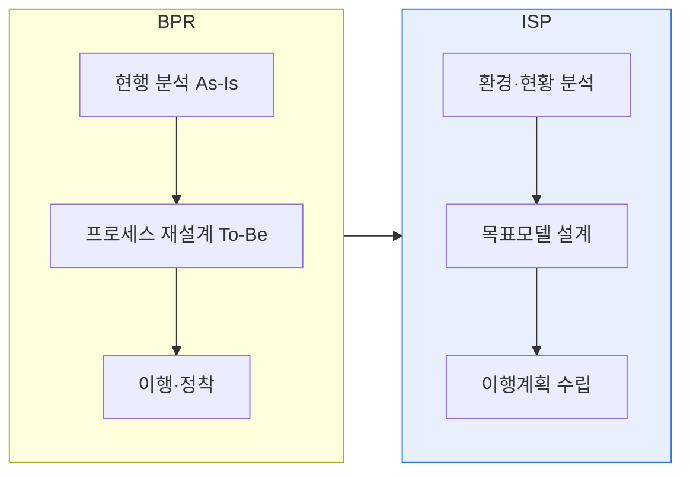

# ISP와 BPR의 비교 및 상호보완 활용

## 1. 개요

### 가. 정의
> **ISP(Information Strategic Planning, 정보전략계획)** 는 경영전략에 부합하도록 조직의 정보화 목표·과제·이행계획을 수립하는 활동이고, **BPR(Business Process Reengineering)** 은 업무 프로세스를 근본적으로 재설계하여 비용·품질·속도의 획기적 개선을 추구하는 활동이다.

두 기법을 이해하는 핵심은 '**출발점과 대상이 다르다**'는 것이다. BPR은 "**우리가 일하는 방식(프로세스)을 어떻게 근본적으로 혁신할 것인가**"라는 업무 관점에서 출발한다. 기존 절차를 개선하는 정도가 아니라 "이 일을 아예 없앨 수는 없는가, 완전히 새 방식으로 할 수는 없는가"를 백지에서 다시 묻는다. 반면 ISP는 "**그 일을 지원할 정보시스템을 어떻게 구축할 것인가**"라는 IT 관점에서 출발해 정보화 청사진을 그린다. 그래서 논리적 순서상, BPR로 미래 프로세스(To-Be)를 먼저 재설계하고 ISP로 이를 뒷받침하는 정보화 계획을 세우는 것이 자연스럽다. 순서가 뒤바뀌어 낡은 프로세스를 그대로 둔 채 정보화만 하면 '낡은 업무의 전산화'에 그친다.

### 나. 필요성
디지털 환경 변화와 경쟁 심화로 기업은 업무 혁신과 정보화 투자를 동시에 요구받는다. 그러나 프로세스 혁신 없는 정보화는 효과가 제한적이고, 정보화 뒷받침 없는 프로세스 혁신은 실행되지 못한다. 두 기법을 연계해야 하는 이유가 여기에 있다.

## 2. 수행 절차 비교

BPR은 현행 프로세스를 분석해 문제를 진단하고, 이상적 미래 프로세스를 설계한 뒤 조직에 정착시킨다. ISP는 경영전략·내외부 환경을 분석해 정보화 목표모델(업무·데이터·응용·기술 아키텍처)을 설계하고 이행 로드맵을 만든다. 둘 다 'As-Is 분석 → To-Be 설계 → 이행'의 큰 틀은 같지만, BPR의 To-Be가 '업무 흐름'이라면 ISP의 To-Be는 '정보시스템 구조'라는 점이 다르다.

| 구분 | ISP | BPR |
|---|---|---|
| **초점** | 정보화 전략·시스템 청사진 | 업무 프로세스 혁신 |
| **범위** | IT·정보시스템 중심 | 업무·조직 전반 |
| **절차** | 환경분석→목표모델→이행계획 | 현행분석→재설계→이행 |
| **산출물** | 정보화 마스터플랜·아키텍처 | 개선된 프로세스(To-Be) |
| **성격** | 계획 수립 중심 | 근본 혁신 중심 |

## 3. 상호 보완 활용 방안

BPR과 ISP는 경쟁 관계가 아니라 연결되어야 시너지를 낸다. 가장 효과적인 방식은 **BPR로 도출한 To-Be 프로세스를 ISP의 입력으로 삼는** 것이다. 즉 먼저 업무를 혁신해 미래 모습을 정하고, 그 프로세스가 요구하는 정보·기능·데이터를 ISP가 정보시스템 아키텍처와 이행계획으로 구체화한다. 이렇게 하면 정보화 투자가 실제 업무 혁신을 지원하는 방향으로 정렬된다. 또한 EA(전사 아키텍처)를 활용하면 비즈니스(BPR)–정보–응용–기술 계층을 하나의 틀로 연결해 지속적으로 정합성을 유지할 수 있다.

| 활용 방안 | 내용 |
|---|---|
| **BPR → ISP 연계** | To-Be 프로세스를 ISP 요구로 반영 |
| **통합 수행(BPR/ISP)** | 프로세스 혁신·정보화 계획 동시 진행 |
| **EA 기반 정렬** | 비즈니스–정보–기술 계층 정합성 유지 |

## 4. 고려사항 및 시사점

1. **프로세스 혁신이 정보화에 선행**해야 투자 효과가 극대화된다. 정보화가 낡은 업무를 고착시키지 않도록 BPR로 미래 프로세스를 먼저 정의한다.
2. **최고경영진의 강력한 후원**이 필수다. BPR은 조직·권한의 근본 변화를 수반해 저항이 크므로, 톱다운의 변화관리가 없으면 실패한다.
3. 최근에는 두 기법이 **DX·디지털 전략과 결합**해, 데이터·플랫폼·고객경험 중심으로 확장되고 있다. 프로세스 자동화(RPA)·데이터 기반 의사결정과 연계해 혁신의 실효성을 높인다.

---

> **한 줄 요약**: BPR은 *업무 프로세스를 근본 재설계* 하고 ISP는 *이를 지원할 정보화 전략을 수립* 하며, BPR로 To-Be 프로세스를 먼저 도출한 뒤 ISP로 정보시스템 청사진을 그리고 EA로 정렬하는 상호 보완 활용이 투자 효과를 극대화한다.
