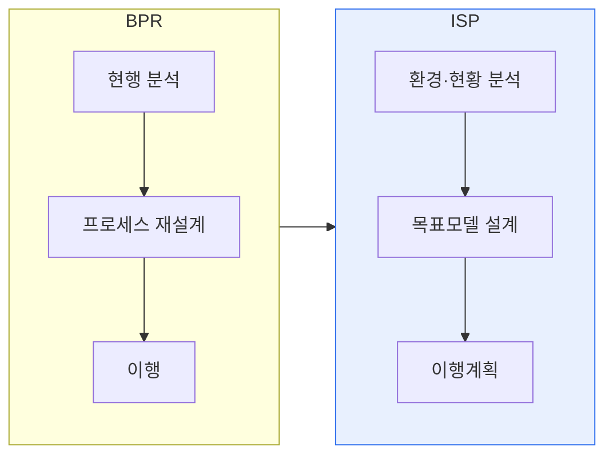

# ISP와 BPR의 비교 및 상호보완 활용

## 1. 개요

### 가. 정의
> **ISP(Information Strategic Planning, 정보전략계획)** 는 경영전략에 부합하는 정보화 목표·과제·이행계획을 수립하는 활동이고, **BPR(Business Process Reengineering)** 은 업무 프로세스를 근본적으로 재설계해 성과를 획기적으로 개선하는 활동이다.

두 기법은 접근 방향이 다르다. BPR이 "**일하는 방식(프로세스)을 어떻게 혁신할 것인가**"에서 출발한다면, ISP는 "**그 일을 지원할 정보시스템을 어떻게 구축할 것인가**"를 계획한다. 그래서 순서상 BPR로 프로세스를 재설계한 뒤 ISP로 이를 뒷받침하는 정보화 청사진을 그리는 것이 자연스럽다.

## 2. 수행 절차 비교

| 구분 | ISP | BPR |
|---|---|---|
| **초점** | 정보화 전략·시스템 청사진 | 업무 프로세스 혁신 |
| **범위** | IT 중심 | 업무·조직 중심 |
| **절차** | 환경분석→목표모델→이행계획 | 현행분석→재설계→이행 |
| **산출물** | 정보화 마스터플랜 | 개선된 프로세스(To-Be) |
| **성격** | 계획 중심 | 혁신 중심 |

## 3. 상호 보완 활용 방안
- **BPR → ISP 연계**: BPR로 To-Be 프로세스를 도출하고, ISP가 이를 지원하는 정보시스템 아키텍처·이행계획으로 구체화
- **통합 수행(BPR/ISP)**: 프로세스 혁신과 정보화 계획을 동시 진행해 정합성 확보
- EA(전사 아키텍처)로 비즈니스-정보-기술 계층을 정렬해 지속 관리

## 4. 시사점
- 프로세스 혁신 없는 정보화는 '**낡은 업무의 전산화**'에 그침 → BPR 선행 가치
- 최근에는 DX·디지털 전략과 결합해 데이터·플랫폼 중심으로 확장

---

> **한 줄 요약**: BPR은 *업무 프로세스를 근본 재설계* 하고 ISP는 *이를 지원할 정보화 전략을 수립* 하며, BPR로 To-Be를 도출한 뒤 ISP로 정보시스템 청사진을 그리는 상호 보완 활용이 효과적이다.
