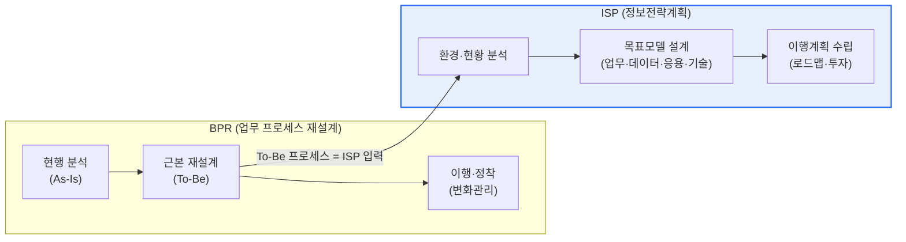
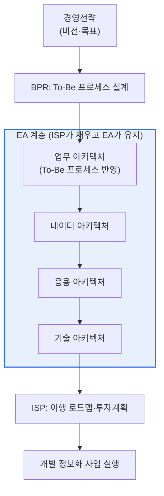

# ISP와 BPR의 비교 및 상호보완 활용

## 1. 개요

### 가. 정의
> **ISP(Information Strategic Planning, 정보전략계획)** 는 경영전략에 부합하도록 조직의 정보화 목표·과제·이행계획을 수립하는 활동이고, **BPR(Business Process Reengineering, 업무 프로세스 재설계)** 은 업무 프로세스를 근본적으로 재설계하여 비용·품질·서비스·속도에서 획기적(dramatic) 개선을 추구하는 경영혁신 기법이다.

두 기법을 제대로 이해하는 열쇠는 '**출발점과 대상이 다르다**'는 데 있다. BPR은 마이클 해머(M. Hammer)와 제임스 챔피(J. Champy)가 1990년대 초 제창한 개념으로, "**우리가 일하는 방식(프로세스)을 어떻게 근본적으로 혁신할 것인가**"라는 업무 관점에서 출발한다. 핵심 화두는 '점진적 개선'이 아니라 '백지에서 다시 생각하기(fundamental rethinking)'다. 기존 절차를 조금 빠르게 만드는 정도가 아니라 "이 일을 아예 없앨 수는 없는가, 완전히 새로운 방식으로 할 수는 없는가"를 원점에서 묻는다.

반면 ISP는 "**그 업무를 지원할 정보시스템을 어떻게 구축·운영할 것인가**"라는 정보화 관점에서 출발해 조직 전체의 정보화 청사진(마스터플랜)을 그린다. 경영전략을 정보화 전략으로 번역하고, 그에 필요한 업무·데이터·응용·기술 아키텍처와 이행 로드맵을 도출한다. 그래서 논리적 순서상 BPR로 미래 프로세스(To-Be)를 먼저 재설계하고 ISP로 이를 뒷받침하는 정보화 계획을 세우는 것이 자연스럽다. 순서가 뒤바뀌어 낡은 프로세스를 그대로 둔 채 정보화만 하면 이른바 '**낡은 업무의 전산화(paving the cow paths)**'에 그쳐 투자 효과가 반감된다.

### 나. 등장 배경 및 필요성
두 기법이 태어난 시대적 맥락을 짚으면 성격이 더 분명해진다. BPR은 1990년대 초 세계화·경쟁 심화 속에서 점진적 개선(TQM 등)만으로는 살아남기 어렵다는 위기의식에서 태어났고, ISP는 정보화 투자가 폭증하는데도 개별 시스템이 난립하며 낭비가 커지던 현실에 대한 대응으로 자리 잡았다. 전자가 '업무의 위기'에, 후자가 '정보화의 무질서'에 각각 응답한 것이다.

BPR과 ISP가 별개로 등장했으나 결국 연계될 수밖에 없었던 데에는 배경이 있다. 1990년대 기업들은 정보기술에 막대한 투자를 하고도 생산성이 오르지 않는 '**생산성 역설(productivity paradox)**'을 겪었다. 그 원인의 상당 부분은, 기술은 새것을 들여왔지만 그 기술이 지원하는 업무 절차는 수십 년 된 낡은 것을 그대로 둔 데 있었다. BPR은 이 문제에 "기술 도입 전에 프로세스부터 근본적으로 바꿔라"고 답했다.

한편 정보화 투자가 커질수록 개별 시스템을 산발적으로 구축하는 방식의 한계가 드러났다. 부서마다 따로 만든 시스템이 서로 연동되지 않고 데이터가 중복·불일치하는 사일로(silo) 문제가 심화되었다. ISP는 "개별 시스템을 짓기 전에 전사 차원의 정보화 밑그림부터 그려라"고 답했다. 결국 두 기법은 각각 '업무의 근본 혁신'과 '정보화의 전사적 정렬'이라는 다른 문제를 풀지만, 실제 프로젝트에서는 미래 업무와 그것을 지원할 정보시스템을 함께 설계해야 하므로 연계가 필수가 된다.

### 다. 두 기법의 성격 차이
요컨대 BPR은 '**무엇을·어떻게 일할 것인가(업무)**'를, ISP는 '**그 일을 무엇으로 지원할 것인가(정보시스템)**'를 다룬다. BPR의 산출물이 개선된 업무 흐름(To-Be 프로세스)이라면, ISP의 산출물은 정보화 마스터플랜과 아키텍처다. 이 성격 차이가 이후의 절차·범위·결과물 차이를 모두 만들어낸다.

바꿔 말해 BPR은 '**변화(혁신)**'에, ISP는 '**정렬(설계)**'에 무게 중심이 있다. 이 강조점의 차이가 두 기법을 상충이 아니라 보완 관계로 만든다. 혁신된 업무를 정보시스템이 뒷받침하고, 정렬된 정보시스템이 다시 업무 혁신을 지속 가능하게 하는 선순환이 이상적 모습이다.

## 2. 수행 절차 비교

두 기법의 진행 흐름과 그 접점을 먼저 조망한다. 아래는 BPR과 ISP의 절차를 나란히 놓고, BPR의 결과가 ISP의 입력으로 이어지는 연결을 표현한 전체 구조도다.

```mermaid
flowchart LR
  subgraph BPR["BPR (업무 프로세스 재설계)"]
    B1["현행 분석<br/>(As-Is)"] --> B2["근본 재설계<br/>(To-Be)"] --> B3["이행·정착<br/>(변화관리)"]
  end
  subgraph ISP["ISP (정보전략계획)"]
    I1["환경·현황 분석"] --> I2["목표모델 설계<br/>(업무·데이터·응용·기술)"] --> I3["이행계획 수립<br/>(로드맵·투자)"]
  end
  B2 -->|To-Be 프로세스 = ISP 입력| I1
  style ISP fill:#e8f0fe,stroke:#2f6fed,stroke-width:2px
```

BPR은 현행 프로세스를 분석해 병목과 낭비를 진단하고, 고객가치 관점에서 이상적 미래 프로세스를 설계한 뒤 조직에 정착시킨다. 이때 핵심은 As-Is에 얽매이지 않는 것이다. 현행을 지나치게 상세히 분석하면 그 틀에 갇혀 '개선'에 머물기 쉬우므로, BPR은 As-Is를 문제 진단의 최소한으로만 활용하고 To-Be 설계에 무게를 둔다.

ISP는 경영전략과 내·외부 환경(시장·기술 동향, 현행 정보시스템 수준)을 분석해 정보화 목표모델을 설계하고 단계별 이행 로드맵과 투자계획을 만든다. 두 기법 모두 'As-Is 분석 → To-Be 설계 → 이행'이라는 큰 틀은 공유하지만, BPR의 To-Be가 '업무 흐름'인 데 비해 ISP의 To-Be는 '정보시스템 구조(아키텍처)'라는 점이 결정적으로 다르다. 이 차이 때문에 BPR의 To-Be가 ISP의 자연스러운 입력이 된다.

여기서 'As-Is 분석의 깊이'는 두 기법에서 다르게 다뤄져야 한다는 점이 실무의 미묘한 지점이다. BPR은 As-Is에 오래 머무를수록 기존 틀에 사고가 갇혀 급진적 재설계가 어려워지므로 현행 분석을 문제 진단에 필요한 최소한으로 절제한다. 반면 ISP는 현행 정보시스템·데이터의 상태를 비교적 상세히 파악해야 정확한 이행 로드맵과 투자 규모를 산정할 수 있어 As-Is 분석의 비중이 상대적으로 크다. 같은 'As-Is 분석'이라도 BPR에서는 '벗어나기 위한 분석', ISP에서는 '이어가기 위한 분석'이라는 성격 차이가 있는 셈이다.

| 구분 | ISP | BPR |
|---|---|---|
| **초점** | 정보화 전략·시스템 청사진 | 업무 프로세스의 근본 혁신 |
| **관점** | IT·정보시스템 관점 | 업무·고객가치 관점 |
| **범위** | 전사 정보시스템 | 업무·조직·직무 전반 |
| **절차** | 환경분석 → 목표모델 → 이행계획 | 현행분석 → 근본 재설계 → 이행 |
| **주요 산출물** | 정보화 마스터플랜·아키텍처·로드맵 | 개선된 To-Be 프로세스·조직 설계 |
| **성격** | 계획 수립 중심(정렬·설계) | 근본 혁신 중심(파괴적 재설계) |
| **개선 폭** | 체계적·점진적 정렬 | 비약적(dramatic) 개선 지향 |

## 3. 각 기법의 구성요소와 핵심 원리

### 가. BPR의 핵심 원리와 기법
BPR을 표만으로 이해하면 '프로세스 개선'과 구분이 흐려진다. BPR의 정체성은 네 개의 키워드 — **근본적(fundamental)·급진적(radical)·극적(dramatic)·프로세스(process)** — 에 있다. '근본적'은 당연시하던 규칙과 가정을 의심하는 것이고, '급진적'은 표면을 손질하는 것이 아니라 뿌리부터 새로 설계하는 것이며, '극적'은 10~20%가 아니라 수 배의 성과 향상을 목표로 한다는 뜻이고, '프로세스'는 부서·기능이 아니라 고객가치를 만들어내는 일의 흐름을 단위로 본다는 의미다.

실무 기법으로는 여러 단계로 쪼개진 절차를 하나로 통합하고, 순차 처리를 병렬 처리로 바꾸며, 의사결정 권한을 실무자에게 내려(empowerment) 승인 단계를 줄이고, 정보기술로 물리적 이동·중개를 제거하는 방식이 쓰인다. 예컨대 주문-생산-배송이 부서별로 단절되어 며칠씩 걸리던 프로세스를, 하나의 통합 프로세스와 담당자(case manager)로 재설계해 처리시간을 대폭 단축하는 식이다.

BPR이 실패하는 전형은 '혁신'을 표방하면서 실제로는 기존 조직·권한을 건드리지 못하고 절차만 조금 손보는 경우다. 근본 재설계는 필연적으로 조직·직무·평가 체계의 변화를 동반하므로, 뒤에서 볼 최고경영진의 후원과 변화관리가 성패를 가른다.

여기서 정보기술은 단순한 지원 도구가 아니라 재설계의 '**동인(enabler)**'으로 작동한다는 점이 중요하다. 예컨대 공유 데이터베이스는 '정보는 한 곳에만 있을 수 있다'는 가정을 깨 여러 부서가 동시에 같은 정보를 활용하게 하고, 통신·워크플로 기술은 '전문가가 있어야 처리할 수 있다'는 가정을 깨 일반 담당자도 전문 업무를 수행하게 한다. 이렇게 기술이 열어주는 새로운 가능성을 전제로 프로세스를 다시 상상하는 것이 BPR의 정수이며, 바로 이 지점에서 BPR은 자연스럽게 ISP·정보화와 맞물린다.

### 나. ISP의 산출물과 아키텍처
ISP의 산출물은 크게 네 계층의 아키텍처로 정리된다. **업무(비즈니스) 아키텍처**는 조직이 수행하는 업무의 구조를, **데이터 아키텍처**는 관리해야 할 정보와 그 관계를, **응용(애플리케이션) 아키텍처**는 업무를 지원할 시스템 기능을, **기술 아키텍처**는 이를 구동할 인프라·표준을 규정한다. 이 네 계층은 서로 정합해야 하며, 상위(업무)에서 하위(기술)로 근거가 흘러야 한다.

ISP의 가치는 개별 시스템 구축 계획을 넘어 **전사적 정합성**을 확보하는 데 있다. 부서별로 흩어진 요구를 전사 목표모델 안에 배치하고, 우선순위·투자·일정을 담은 이행 로드맵으로 묶어 '무엇을 언제 어떤 순서로 구축할지'를 정한다. 이 산출물들이 이후 개별 정보화 사업의 기준선(baseline) 역할을 한다.

우선순위 결정은 ISP에서 특히 중요한 산출물이다. 자원은 유한하므로 모든 과제를 동시에 추진할 수 없고, 각 정보화 과제를 '경영 기여도(효과)'와 '구현 용이성·시급성' 등의 축으로 평가해 단계별로 배치해야 한다. 이 과정에서 선행·후행 의존관계(예: 데이터 표준화가 선행되어야 통합 분석이 가능)를 고려한 이행 순서를 정한다. 우선순위가 근거 없이 정해지면 정치적 힘이 센 부서의 과제가 앞서게 되어 전사 최적이 훼손되므로, 객관적 평가 기준을 세우는 것이 ISP의 핵심 성공요인 중 하나다.

ISP는 종종 **EA(Enterprise Architecture, 전사 아키텍처)** 와 결합된다. ISP가 특정 시점의 정보화 계획을 세우는 프로젝트성 활동이라면, EA는 비즈니스–정보–응용–기술 계층을 지속적으로 관리하는 상시 체계다. ISP로 그린 목표모델을 EA로 유지·갱신하면 계획이 일회성 문서로 끝나지 않고 조직의 살아있는 정합성 관리 도구가 된다.

### 다. 두 기법의 공통 성공요인과 실패요인
BPR과 ISP는 대상이 다르지만 대형 변화 프로젝트라는 공통점 때문에 성공·실패 요인도 상당 부분 겹친다. 공통 성공요인의 첫째는 **경영전략과의 정렬**이다. 프로세스 재설계든 정보화 계획이든 경영 목표에서 근거가 도출되지 않으면 방향을 잃는다. 둘째는 **현업의 참여**다. 실제 일을 하는 사람과 정보를 쓰는 사람이 설계에 깊이 참여해야 현실성 있는 To-Be가 나온다. 셋째는 **명확한 성과지표(KPI)** 로, 개선 전후를 비용·시간·품질 등 수치로 측정할 수 있어야 혁신의 효과가 입증되고 다음 투자가 정당화된다.

공통 실패요인도 뚜렷하다. 가장 흔한 것은 '**분석 마비(analysis paralysis)**' — As-Is를 지나치게 상세히 분석하다 To-Be 설계로 넘어가지 못하는 것이다. 다음은 '**계획과 실행의 단절**'로, 훌륭한 문서를 만들고도 후속 사업·조직 변화로 이어지지 못하는 경우다. ISP의 마스터플랜이 서랍 속 문서로 남거나, BPR의 재설계안이 조직 저항에 막혀 실행되지 못하는 것이 대표적이다. 이 실패요인들은 뒤에서 볼 변화관리와 거버넌스로 방어해야 한다.

## 4. 상호 보완 활용 방안

BPR과 ISP는 경쟁 관계가 아니라 서로를 필요로 한다. 가장 효과적인 방식은 **BPR로 도출한 To-Be 프로세스를 ISP의 입력으로 삼고, 이를 EA의 계층 구조로 정렬**하는 것이다. 아래는 두 기법이 EA 계층 위에서 어떻게 맞물리는지를 보여주는 세부 아키텍처도다.

```mermaid
flowchart TB
  ST["경영전략<br/>(비전·목표)"] --> BPR2["BPR: To-Be 프로세스 설계"]
  BPR2 --> BA["업무 아키텍처<br/>(To-Be 프로세스 반영)"]
  subgraph EA["EA 계층 (ISP가 채우고 EA가 유지)"]
    BA --> DA["데이터 아키텍처"]
    DA --> AA["응용 아키텍처"]
    AA --> TA["기술 아키텍처"]
  end
  TA --> RM["ISP: 이행 로드맵·투자계획"]
  RM --> IMP["개별 정보화 사업 실행"]
  style EA fill:#e8f0fe,stroke:#2f6fed,stroke-width:2px
```

흐름을 따라가 보면, 경영전략에서 출발해 BPR이 미래 업무 모습을 정의하고, 그 To-Be 프로세스가 업무 아키텍처가 되어 데이터·응용·기술 아키텍처로 구체화되며, 마지막에 ISP의 이행 로드맵과 투자계획으로 정리되어 개별 사업으로 실행된다. 이렇게 하면 정보화 투자가 실제 업무 혁신을 지원하는 방향으로 정렬되어, 낡은 업무를 전산화하는 오류를 피할 수 있다.

세 가지 대표적 연계 방식을 정리하면 다음과 같다. 첫째, **순차 연계(BPR → ISP)** 는 프로세스를 먼저 혁신하고 그 요구를 정보화 계획에 반영하는 정석적 방식이다. 둘째, **통합 수행(BPR/ISP 병행)** 은 시간 제약이 크거나 업무·정보화가 강하게 얽힌 경우 두 활동을 하나의 프로젝트로 동시에 진행하는 방식으로, 상호 피드백이 빠르지만 관리 복잡도가 높다. 셋째, **EA 기반 상시 정렬** 은 일회성 프로젝트를 넘어 계층 간 정합성을 지속적으로 유지하는 방식이다.

연계를 실행할 때 흔히 저지르는 실수는 BPR의 To-Be를 '이상론'으로만 그리고 ISP에서 구현 제약을 뒤늦게 마주치는 것이다. 예를 들어 프로세스상으로는 실시간 통합 처리를 전제했으나 데이터·기술 아키텍처가 이를 뒷받침하지 못하면 재설계안이 현실에서 작동하지 않는다. 따라서 성숙한 조직은 BPR 단계에서부터 정보화 가능성을 함께 검토하고, ISP 단계에서 확인된 기술적 제약을 프로세스 설계에 되먹임하는 **양방향 피드백**을 둔다. 순차 연계라도 완전한 일방향이 아니라, 접점에서 반복적으로 조정하는 것이 실무의 정석이다.

| 활용 방안 | 내용 | 적합 상황 |
|---|---|---|
| **BPR → ISP 순차 연계** | To-Be 프로세스를 ISP 요구·목표모델로 반영 | 프로세스 혁신이 명확히 선행되는 경우 |
| **BPR/ISP 통합 수행** | 프로세스 혁신·정보화 계획을 동시 진행 | 일정 압박·업무·정보화 결합도가 높은 경우 |
| **EA 기반 정렬** | 비즈니스–정보–응용–기술 계층 정합성 상시 유지 | 대규모·지속적 정보화 거버넌스가 필요한 경우 |

어떤 방식을 택하든 연계의 성패는 '요구의 추적성(traceability)'에 달려 있다. BPR이 정의한 각 To-Be 프로세스가 어떤 데이터·기능·시스템 요구로 이어지고, 그것이 ISP의 어떤 응용·기술 아키텍처 항목과 이행 과제로 실현되는지를 끝까지 추적할 수 있어야 한다. 추적성이 끊기면 정보화 사업이 진행되면서 처음의 업무 혁신 의도와 멀어져, 다시 '기술 따로 업무 따로'의 사일로로 회귀하기 쉽다. EA의 계층 모델과 요구 매트릭스가 이 추적성을 담보하는 실용적 도구가 된다.

## 5. 비교 및 실무 사례

두 기법의 차이가 실제 성과에서 어떻게 갈리는지는 사례로 확인된다. BPR의 고전적 사례로 인용되는 포드(Ford)의 구매-대금지급 프로세스 재설계는, 송장(invoice) 대조 중심의 절차를 데이터베이스 기반의 자동 대조 방식으로 근본 재설계하여 관련 인력을 대폭 줄인 것으로 알려져 있다(구체 수치는 자료마다 차이가 있어 '수백 명 규모의 인력을 크게 감축'한 사례로 일반화하는 것이 안전하다). 핵심은 '송장 없는(invoiceless) 처리'라는 발상 전환으로, 절차 단축이 아니라 절차 자체를 없앤 것이 극적 성과를 만들었다는 점이다.

반대로 프로세스 혁신 없이 정보화만 앞세운 프로젝트가 실패하는 패턴도 흔하다. 많은 전사적자원관리(ERP) 도입 실패가 여기에 해당한다. 표준 프로세스를 담은 ERP를 도입하면서 기존의 비효율적 업무 절차를 그대로 커스터마이징으로 이식하면, 비용은 크게 늘고 효과는 낮아진다. 이 경우 ERP 도입 전에 BPR로 업무를 표준·간소화하고 ISP로 시스템 청사진을 정렬한 조직이 훨씬 높은 성과를 낸다. 즉 성패의 갈림길은 '기술 도입 순간'이 아니라 '프로세스를 먼저 바꾸었는가'에 있다.

ERP 도입 시 자주 인용되는 원칙이 '**Best Practice 수용**'이다. 이는 패키지에 이미 담긴 검증된 표준 프로세스를 최대한 그대로 받아들이고, 조직의 업무를 거기에 맞춰 바꾸라는 것이다. 이 원칙 자체가 사실상 BPR의 한 형태이며, 커스터마이징을 최소화하려면 도입 전에 업무를 표준에 맞게 재설계하는 BPR과 시스템 범위를 정하는 ISP가 선행되어야 한다. 반대로 조직의 낡은 절차를 지키려고 패키지를 과도하게 수정하면 유지보수 비용이 눈덩이처럼 불어나고 향후 버전 업그레이드도 어려워진다. 이 역시 '프로세스 혁신이 정보화에 선행해야 한다'는 원칙을 실증한다.

공공 부문에서도 정보화 사업 전에 ISP를 의무화하거나 권고하는 이유가 여기에 있다. 대규모 예산이 투입되는 사업일수록, 개별 시스템을 짓기 전에 전사 목표모델과 이행 로드맵을 먼저 확정해야 중복 투자와 연계 실패를 막을 수 있기 때문이다.

사례들이 공통으로 시사하는 바는 '정보기술은 수단이지 목적이 아니다'라는 원칙이다. 포드 사례에서 성과를 만든 것은 최신 기술 자체가 아니라 '송장 대조'라는 오래된 규칙을 폐기한 발상이었고, ERP 실패 사례에서 문제를 일으킨 것은 기술의 부족이 아니라 낡은 프로세스를 그대로 옮긴 관성이었다. 즉 BPR이 '무엇을 없앨 것인가'를 묻고, ISP가 '무엇으로 지원할 것인가'를 정한 뒤, 그 순서대로 실행할 때 비로소 투자가 성과로 연결된다. 반대로 이 순서를 건너뛰면 기술 투자는 커지되 성과는 따라오지 않는 생산성 역설이 재현된다.

## 6. 심화: DX 시대의 변화와 예상 출제 방향

최근 두 기법은 디지털 전환(DX) 전략과 결합하며 진화하고 있다. 과거 BPR이 내부 효율(비용·속도) 중심이었다면, 오늘날의 프로세스 혁신은 **고객경험(CX)·데이터 기반 의사결정·플랫폼화**를 함께 겨냥한다. 프로세스 자동화도 사람이 절차를 바꾸는 것을 넘어 RPA(로봇 프로세스 자동화)와 인공지능으로 판단까지 자동화하는 방향으로 확장된다. 이에 따라 최근에는 프로세스를 발굴·분석하는 **프로세스 마이닝(process mining)** 기법이 As-Is 진단의 정밀도를 크게 높여 BPR의 과학화를 뒷받침한다.

ISP 역시 전통적 '5개년 정보화 계획' 형태를 넘어, 클라우드·데이터·인공지능을 전제로 한 **디지털 전략 수립(ISP/DX)** 으로 확장되고, EA·클라우드 도입 전략과 통합되는 추세다. 계획의 주기도 길고 무거운 문서에서 반복적으로 갱신되는 애자일한 로드맵으로 옮겨가고 있다. 클라우드 시대에는 '무엇을 자체 구축하고 무엇을 서비스로 이용할 것인가'라는 소싱 전략이 ISP의 핵심 의사결정으로 부상했고, 데이터가 전략 자산이 되면서 데이터 아키텍처와 거버넌스의 비중도 커졌다.

출제 관점에서는 ① ISP와 BPR의 **개념·절차·산출물 비교**, ② **상호보완(연계) 방안**과 그 순서의 근거, ③ EA·DX와의 **연계** 를 묻는 형태가 반복적으로 출제된다. 답안에서는 단순 항목 나열을 넘어 '왜 BPR이 ISP에 선행해야 하는가', '통합 수행과 순차 수행의 트레이드오프는 무엇인가'까지 설명해야 변별력이 생긴다. 연계·유사 주제로는 EA/TOGAF, ERP, 디지털 전환, 프로세스 마이닝, 변화관리(change management)가 있다.

답안 구성 전략 측면에서는, 개요에서 두 기법의 관점 차이(업무 vs 정보시스템)를 명확히 대비시키고, 본문 중반에 절차·산출물 비교표와 연계 아키텍처 개념도를 배치한 뒤, 후반부에서 '선행 순서의 근거'와 '트레이드오프'를 서술하는 흐름이 효과적이다. 특히 결론에서 DX·EA와의 통합 전망을 제시하면 최신성과 통찰을 함께 보여줄 수 있다.

## 7. 고려사항 및 시사점

1. **프로세스 혁신의 정보화 선행 원칙**: 정보화가 낡은 업무를 고착시키지 않도록 BPR로 미래 프로세스를 먼저 정의한 뒤 ISP로 정보시스템 청사진을 그려야 투자 효과가 극대화된다. 순서를 지키지 못하면 '낡은 업무의 전산화'라는 전형적 실패에 빠진다.
2. **최고경영진의 후원과 변화관리**: BPR은 조직·권한·직무의 근본 변화를 수반해 저항이 크다. 톱다운의 강력한 후원과 체계적 변화관리(커뮤니케이션·교육·평가체계 정비)가 없으면 재설계안이 문서로만 남는다. ISP도 전사 우선순위 조정을 요하므로 거버넌스 뒷받침이 필요하다.
3. **트레이드오프에 근거한 연계 방식 선택**: 순차 연계는 안정적이지만 시간이 걸리고, 통합 수행은 빠르지만 관리 복잡도와 리스크가 크다. 조직의 시급성·성숙도·업무와 정보화의 결합도를 고려해 방식을 선택해야 한다.
4. **EA를 통한 지속적 정합성 관리**: ISP·BPR을 일회성 프로젝트로 끝내지 말고 EA로 비즈니스–정보–응용–기술 계층의 정합성을 상시 유지해야, 환경 변화에 따라 계획이 살아 움직인다. 일회성 마스터플랜은 수립 직후부터 낡기 시작한다.
5. **DX·데이터·AI와의 결합 전망**: 향후 프로세스 혁신은 프로세스 마이닝으로 진단을 과학화하고, RPA·인공지능으로 판단까지 자동화하며, 고객경험과 플랫폼 전략까지 포괄하는 방향으로 확장된다. 기술사는 ISP·BPR을 개별 기법이 아니라 디지털 전환 전략의 구성요소로 통합해 설계할 수 있어야 한다.
6. **성과 측정과 지속적 개선 체계**: 혁신은 한 번의 프로젝트로 끝나지 않는다. 재설계 전후를 비용·처리시간·오류율·고객만족 등 지표로 측정해 효과를 입증하고, 그 결과를 다음 개선 주기로 되먹이는 관리 체계를 갖춰야 한다. 측정 없는 혁신은 성과를 증명하지 못해 후속 투자 동력을 잃는다.

## 참고자료

- M. Hammer, "Reengineering Work: Don't Automate, Obliterate," Harvard Business Review, 1990 — https://hbr.org/1990/07/reengineering-work-dont-automate-obliterate
- The Open Group, TOGAF Standard(Enterprise Architecture) — https://www.opengroup.org/togaf

---

> **한 줄 요약**: BPR은 *업무 프로세스를 백지에서 근본 재설계* 하고 ISP는 *이를 지원할 전사 정보화 전략·아키텍처를 수립* 하는 기법으로, BPR로 To-Be 프로세스를 먼저 도출해 ISP의 입력으로 삼고 EA로 비즈니스–정보–기술 계층을 정렬하는 상호보완 활용이 '낡은 업무의 전산화'를 막고 정보화 투자 효과를 극대화한다.
