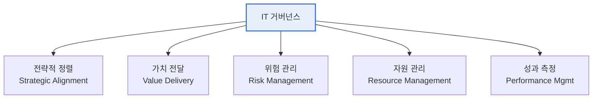

# IT 거버넌스(IT Governance)

## 1. 개요

### 가. 정의
> IT가 조직의 **전략·목표에 부합**하고 가치를 창출하도록 이사회·경영진이 IT 자원과 위험을 **방향 제시(Direct)·통제(Control)·평가(Evaluate)** 하는 의사결정·책임 체계. COBIT·ISO/IEC 38500이 대표 프레임워크.

### 나. 필요성
- IT 투자 대비 **비즈니스 가치 정렬**, 위험·컴플라이언스 관리
- IT 의사결정의 **책임성·투명성** 확보

## 2. 구성요소 (가)

| 구성요소 | 내용 |
|---|---|
| **전략적 정렬** | IT 전략과 비즈니스 전략의 일치 |
| **가치 전달** | IT 투자의 비즈니스 가치 실현 |
| **위험 관리** | IT 리스크 식별·통제, 컴플라이언스 |
| **자원 관리** | 인력·인프라·데이터 등 IT 자원 최적화 |
| **성과 측정** | 목표 대비 IT 성과 모니터링 |

## 3. 효과 측정 지표 (나)

| 관점(BSC) | 지표 예시 |
|---|---|
| **재무** | IT ROI, TCO 절감률, IT 예산 준수율 |
| **고객** | 사용자 만족도, SLA 준수율 |
| **내부 프로세스** | 시스템 가용성, 장애 복구시간, 프로젝트 납기 준수 |
| **학습·성장** | IT 인력 역량, 신기술 도입률 |

> KGI(목표지표)–KPI(성과지표) 체계로 전략목표를 정량 지표로 연결

## 4. 효과 측정 방법론 (다)

| 방법론 | 특징 |
|---|---|
| **BSC** (Balanced Scorecard) | 재무·고객·프로세스·학습성장 균형 측정 |
| **COBIT** | IT 통제·성숙도(Maturity) 평가 프레임워크 |
| **ISO/IEC 38500** | IT 거버넌스 국제표준(EDM 원칙) |
| **Val IT / Risk IT** | IT 투자가치·위험 관리 확장 |
| **ITIL** | IT 서비스관리(운영 성과) |
| **벤치마킹** | 동종업계 대비 성과 비교 |

## 5. 고려사항 및 시사점
- 프레임워크는 **조직 특성에 맞게 테일러링**(단순 도입 지양)
- 거버넌스(방향·통제) ↔ 매니지먼트(실행)의 역할 구분(COBIT 2019)
- ESG·디지털 전환과 연계된 **디지털 거버넌스**로 확장

---

> **한 줄 요약**: IT 거버넌스는 *전략정렬·가치전달·위험·자원·성과* 5요소를 **BSC·COBIT·ISO38500** 등으로 측정하여 IT가 비즈니스 가치에 기여하도록 통제하는 체계다.
