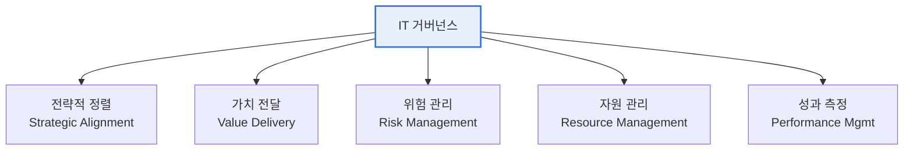

# IT 거버넌스(IT Governance)

## 1. 개요

### 가. 정의
> IT가 조직의 **전략·목표에 부합**하고 가치를 창출하도록, 이사회·경영진이 IT 자원과 위험을 **평가(Evaluate)·지시(Direct)·감시(Monitor)** 하는 의사결정·책임 체계로, COBIT과 ISO/IEC 38500이 대표 프레임워크다.

IT 거버넌스의 핵심은 **거버넌스(방향 설정·통제)와 매니지먼트(실행)의 분리**에 있다. 경영진이 "IT가 무엇을 향해 가야 하는가"를 정하고 통제하는 것이 거버넌스이고, 그 방향에 맞춰 실제 시스템을 구축·운영하는 것이 매니지먼트다. 이 구분이 없으면 IT는 비즈니스와 따로 노는 기술 부서로 전락하기 쉽다.

### 나. 등장 배경 및 필요성
IT 투자 규모가 커지고 기업 활동 전반이 IT에 의존하게 되면서, "IT에 돈을 쓰는데 그만큼의 사업 가치가 나오는가"라는 물음이 경영의 핵심 의제가 되었다. 과거 IT는 성과 측정이 어렵고 의사결정 책임이 모호해 투자 실패·중복·보안 사고가 잦았다. IT 거버넌스는 IT 투자와 비즈니스 전략을 **정렬**시키고, 위험·컴플라이언스를 관리하며, IT 의사결정의 **책임성과 투명성**을 확보하기 위해 등장했다. 특히 규제 준수(내부통제)와 디지털 전환이 겹치면서 그 중요성이 더욱 커졌다.

## 2. 구성요소 (가)

IT 거버넌스는 다섯 개의 상호 연결된 영역으로 구성된다. **전략적 정렬**이 IT가 나아갈 방향을 비즈니스에 맞추는 출발점이라면, **가치 전달**은 그 방향대로 실제 사업 가치를 실현하는 결과이고, 이 둘을 **위험 관리와 자원 관리**가 뒷받침한다. 마지막으로 **성과 측정**이 목표 대비 결과를 계량해 다시 전략에 피드백함으로써 순환이 완성된다. 어느 한 요소가 빠지면(예: 성과 측정 부재) 거버넌스는 구호에 그친다.

| 구성요소 | 내용 | 핵심 질문 |
|---|---|---|
| **전략적 정렬** | IT 전략과 비즈니스 전략의 일치 | 올바른 방향인가 |
| **가치 전달** | IT 투자의 비즈니스 가치 실현 | 값어치를 하는가 |
| **위험 관리** | IT 리스크 식별·통제, 컴플라이언스 | 안전한가 |
| **자원 관리** | 인력·인프라·데이터 등 IT 자원 최적화 | 효율적인가 |
| **성과 측정** | 목표 대비 IT 성과 모니터링 | 잘하고 있는가 |

## 3. 효과 측정 지표 (나)

거버넌스가 잘 작동하는지는 결국 **정량 지표**로 확인해야 한다. 이때 재무 지표만 보면 IT의 무형 가치(역량·만족도)를 놓치므로, **균형성과표(BSC)** 로 네 관점을 균형 있게 측정하는 접근이 널리 쓰인다. 각 관점의 전략 목표를 KGI(목표지표)로 세우고 이를 KPI(성과지표)로 연결해 추적한다.

| 관점(BSC) | 지표 예시 |
|---|---|
| **재무** | IT ROI, TCO 절감률, IT 예산 준수율 |
| **고객** | 사용자 만족도, SLA 준수율 |
| **내부 프로세스** | 시스템 가용성, 장애 복구시간(MTTR), 프로젝트 납기 준수율 |
| **학습·성장** | IT 인력 역량, 신기술 도입률 |

> KGI(목표지표)–KPI(성과지표) 체계로 전략목표를 정량 지표로 연결한다. 예컨대 "고객 대응 개선"이라는 목표(KGI)를 "SLA 준수율 99%"라는 KPI로 구체화한다.

## 4. 효과 측정 방법론 (다)

측정을 실제로 수행하려면 표준화된 방법론이 필요하다. BSC가 "무엇을 균형 있게 볼지"의 틀이라면, COBIT은 "IT 프로세스가 얼마나 성숙한지"를 평가하는 상세 프레임워크이고, ISO/IEC 38500은 거버넌스의 원칙(EDM)을 규정하는 국제표준이다. 이들은 배타적이지 않고 함께 쓰인다.

| 방법론 | 특징 |
|---|---|
| **BSC** (Balanced Scorecard) | 재무·고객·프로세스·학습성장 균형 측정 |
| **COBIT** | IT 통제·프로세스 성숙도(Maturity) 평가 프레임워크 |
| **ISO/IEC 38500** | IT 거버넌스 국제표준(EDM 원칙) |
| **Val IT / Risk IT** | IT 투자가치·위험 관리 확장(COBIT 계열) |
| **ITIL** | IT 서비스관리(운영 성과) |
| **벤치마킹** | 동종업계 대비 성과 비교 |

COBIT은 각 IT 프로세스의 성숙도를 단계(0~5 등)로 평가해 "현재 수준"과 "목표 수준"의 격차를 드러내므로, 개선 우선순위를 정하는 데 특히 유용하다.

## 5. 고려사항 및 시사점
기술사 관점에서 IT 거버넌스의 성패는 프레임워크의 "도입 여부"가 아니라 "조직에 맞게 얼마나 재단(tailoring)했는가"에 달려 있다. 첫째, COBIT·ISO 38500을 통째로 이식하면 조직에 맞지 않아 형식화되므로, 조직 규모·성숙도·규제 환경에 맞게 필요한 요소만 취사선택해야 한다. 둘째, COBIT 2019가 명확히 한 것처럼 **거버넌스(방향·통제)와 매니지먼트(실행)의 역할을 구분**해 책임을 분명히 해야 한다. 셋째, ESG 공시·디지털 전환·AI 도입이 확대되면서 IT 거버넌스는 데이터·AI·보안까지 아우르는 **디지털 거버넌스**로 확장되고 있어, 기술 통제를 넘어 조직 전체의 가치 창출 체계로 발전시켜야 한다.

---

> **한 줄 요약**: IT 거버넌스는 *전략정렬·가치전달·위험·자원·성과* 5요소를 BSC·COBIT·ISO 38500 등으로 측정해 IT가 비즈니스 가치에 기여하도록 방향 제시·통제하는 체계로, 조직 특성에 맞춘 테일러링과 거버넌스–매니지먼트 분리가 성공의 관건이다.
