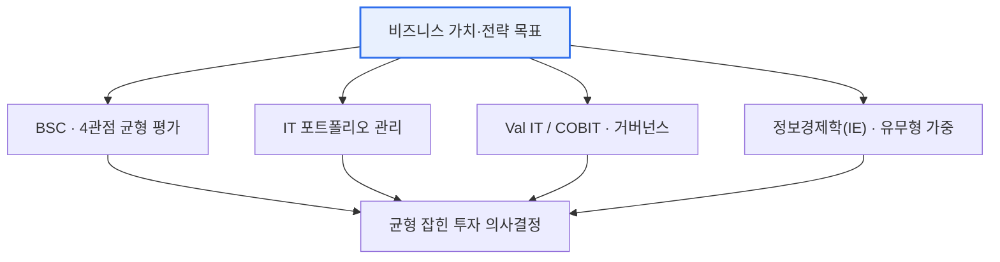

# IT 투자분석 — 프로세스, 프레임워크, 분석 방법론

## 1. 개요

### 가. 정의
> **IT 투자분석**은 IT 투자가 비즈니스 가치와 전략 목표에 얼마나 기여하는지를 **정량·정성적으로 평가**하여, 한정된 예산 안에서 투자 우선순위를 정하고 집행 후 성과를 관리·환류하는 일련의 경영 활동이다.

IT 투자분석이 필요한 근본 이유는 '**IT 투자는 크지만 그 효과가 눈에 잘 보이지 않는다**'는 구조적 특성에 있다. 기업은 매년 매출의 상당 비율을 IT에 지출하지만, 그 투자가 실제로 매출을 늘렸는지, 비용을 줄였는지, 여러 후보 중 무엇을 먼저 해야 하는지 판단하기 어렵다. 그 까닭은 IT의 효과가 재무 성과로 곧바로 환산되지 않는 무형 가치(고객 만족·업무 효율·의사결정 속도·전략적 유연성)를 크게 포함하기 때문이다. 예컨대 새 ERP 도입의 효과는 '재고 회전율 개선'처럼 일부는 계량화되지만, '데이터 기반 의사결정 문화 정착'처럼 상당 부분은 수치로 잡히지 않는다. 이 때문에 IT 투자는 종종 '비용 센터'로 오해받거나, 반대로 근거 없이 유행을 좇아 과잉 집행되기도 한다.

IT 투자분석은 이 어려움을 체계적 프로세스·프레임워크·방법론으로 다뤄, 한정된 예산을 가치가 큰 곳에 배분하고, 투자 결정을 경영진과 이해관계자에게 정당화하며, 집행 후 성과를 검증해 다음 투자에 반영한다. 즉 "IT에 **얼마를, 어디에, 왜** 투자하고, 그 **결과가 무엇인가**"에 답하는 경영 도구다. 이는 개별 프로젝트의 타당성 검토(feasibility)를 넘어, 조직 전체의 IT 투자를 하나의 포트폴리오로 보고 위험과 수익을 균형 있게 관리하는 IT 거버넌스의 핵심 영역이기도 하다.

### 나. 필요성
IT 투자는 규모가 크고 되돌리기 어려우며, 그 성패가 조직의 경쟁력을 좌우한다는 점에서 다른 투자와 구별된다. 잘못된 대형 시스템 도입은 매몰 비용뿐 아니라 업무 마비·기회 상실이라는 이차 손실을 낳는다.

IT 예산 제약과 투자 실패 위험이 커지면서, '감(感)'이 아니라 근거에 기반해 투자를 결정·통제할 필요가 커졌다. 대규모 IT 프로젝트의 상당수가 예산 초과·일정 지연·기대 효과 미달로 어려움을 겪는다는 경험적 관찰이 반복되면서, 투자 이전에 타당성을 객관적으로 따지고 이후에 성과를 검증하는 체계가 요구되었다. IT 투자분석은 (1) **자원 배분의 합리화**(가치 높은 곳에 우선 배분), (2) **투자 정당화**(경영진·주주 설득), (3) **성과 책임성 확보**(사후 검증과 환류)를 통해 이 요구를 충족한다. 특히 디지털 전환(DX)으로 IT가 전사 전략의 중심이 된 오늘날, IT 투자분석은 전략 실행의 나침반 역할을 한다.

## 2. IT 투자분석 프로세스

IT 투자분석은 일회성 심사가 아니라 투자 생명주기를 따라 순환하는 관리 과정이다. 첫 단계인 **계획·후보 도출**에서는 사업 목표와 IT 전략을 정렬(alignment)하고, 그 목표를 달성할 투자 후보를 식별한다. 이때 후보는 현업 요구·규제 대응·인프라 교체·신사업 지원 등 다양한 출처에서 나오며, 각 후보가 '어떤 경영 목표에 기여하는가'를 분명히 연결 짓는 것이 이후 평가의 기준선이 된다. 목표와의 연결이 약한 후보는 아무리 기술적으로 매력적이어도 우선순위에서 밀린다.

두 번째 **분석·평가** 단계에서는 각 후보의 비용·효과·리스크를 정량·정성적으로 따진다. 비용은 도입비만이 아니라 운영·유지보수까지 아우르는 총소유비용(TCO) 관점으로 산정하고, 효과는 재무적 편익(비용 절감·매출 증대)과 무형 편익(만족·유연성)을 함께 추정한다. 리스크는 기술·일정·시장 불확실성을 반영해 시나리오별로 검토한다. 이 단계가 분석의 심장부이며, 뒤에서 다룰 방법론(NPV·ROI·AHP 등)이 집중적으로 동원된다.

세 번째 **우선순위·선정** 단계에서는 개별 후보의 평가 결과를 포트폴리오 관점에서 종합해, 예산·인력 제약 안에서 실행할 조합을 결정한다. 개별 프로젝트가 각각 타당하더라도 전체 예산·리스크 한도를 초과할 수 있으므로, 위험-수익 균형과 전략 기여도를 함께 보아 조합을 최적화한다. 이후 **집행·모니터링** 단계에서 진척·예산·품질을 통제하고, 마지막 **사후 성과 평가** 단계에서 목표 대비 실제 성과를 검증해 그 교훈을 다음 투자 계획으로 **환류**한다. 이 사전(Pre)·집행 중·사후(Post) 평가의 순환이 투자 관리의 핵심이며, 환류 고리가 끊기면 같은 실패가 반복된다.

| 단계 | 핵심 활동 | 산출물 |
|---|---|---|
| **계획·후보 도출** | 사업 목표 정렬, 투자 후보 식별 | 투자 후보 목록·정렬표 |
| **분석·평가** | 비용·효과·리스크 정량·정성 분석 | 타당성 분석서·평가 점수 |
| **우선순위·선정** | 포트폴리오 관점 우선순위 결정 | 투자 포트폴리오·예산안 |
| **집행·모니터링** | 진척·예산·품질 통제 | 진척 보고·EVM 지표 |
| **사후 성과 평가** | 목표 대비 성과 검증·환류 | 성과 평가서·개선 과제 |

## 3. IT 투자분석 프레임워크

프레임워크는 투자를 '어떤 관점에서 균형 있게 바라볼 것인가'를 규정하는 사고의 틀이다. 재무 성과 하나만 보면 전략적·무형적 가치를 놓치기 쉬우므로, 다면적 관점을 강제하는 프레임워크가 필요하다.

**BSC(Balanced Scorecard, 균형성과표)** 는 투자를 재무·고객·내부프로세스·학습성장의 네 관점에서 평가한다. 예컨대 협업 플랫폼 투자는 단기 재무 효과는 미미해도 '학습성장'과 '내부프로세스' 관점에서 큰 가치를 지닐 수 있는데, BSC는 이런 균형을 명시적으로 드러내 재무 편중을 교정한다. **IT 포트폴리오 관리**는 개별 프로젝트가 아니라 전체 투자 집합을 하나의 포트폴리오로 보고, 고위험·고수익(혁신)과 저위험·안정(유지보수) 투자를 적절히 섞어 조직 전체의 위험-수익을 최적화한다. 이는 금융 포트폴리오 이론을 IT 투자에 적용한 것으로, '어느 하나에 몰지 않는' 분산 원리를 따른다.

이 두 프레임워크가 상보적인 이유는 관점이 다르기 때문이다. BSC가 '무엇을 측정할 것인가'(성과의 다면성)를 다룬다면, IT 포트폴리오 관리는 '무엇을 선택할 것인가'(투자 조합의 최적화)를 다룬다. 실무에서는 각 투자 후보를 BSC 4관점으로 평가해 점수를 매긴 뒤, 그 점수와 위험도를 좌표축으로 포트폴리오 매트릭스에 배치해 '고가치·저위험' 투자를 우선 선정하는 식으로 두 프레임워크를 연결해 쓴다.

**Val IT / COBIT** 은 ISACA가 제시한 IT 거버넌스 프레임워크로, IT 투자의 가치 창출·위험 관리·자원 관리를 조직 차원에서 통제하는 원칙과 프로세스를 제공한다. Val IT는 특히 '투자가 실제 가치를 내는가(Are we getting the benefits?)'를 지속적으로 묻는 가치 거버넌스에 초점을 둔다. **정보경제학(Information Economics, IE)** 은 전통적 비용편익분석이 담지 못하는 무형 효과(전략 부합·경쟁 대응·조직 위험)를 가중치로 점수화해 순위를 매기는 기법으로, 정량화가 어려운 IT 편익을 의사결정에 반영하려는 대표적 시도다.

| 프레임워크 | 초점 | 핵심 아이디어 |
|---|---|---|
| **BSC(균형성과표)** | 다면적 성과 | 재무·고객·프로세스·학습성장 4관점 균형 |
| **IT 포트폴리오 관리** | 위험-수익 균형 | 투자를 포트폴리오로 보고 분산·최적화 |
| **Val IT / COBIT** | 거버넌스 | IT 투자 가치·위험·자원의 조직적 통제 |
| **정보경제학(IE)** | 무형 가치 | 유·무형 효과를 가중치로 점수화 |

## 4. 분석 방법론 (정량·정성·위험)

IT 투자의 효과는 재무(정량)와 무형(정성)이 섞여 있으므로, 어느 한 계열의 방법만으로는 온전한 평가가 되지 않는다. 정량 기법으로 '돈으로 환산되는 부분'을 엄밀히 따지고, 정성 기법으로 '돈으로 환산되지 않는 전략 가치'를 보완하며, 위험 기법으로 '불확실성'을 반영하는 삼중 구조가 실무의 정석이다.

**정량(재무) 기법**은 편익과 비용을 화폐 가치로 환산해 투자 타당성을 계산한다. **NPV(순현재가치)** 는 미래 현금흐름을 할인율로 현재가치화해 합산한 값으로, 0보다 크면 투자 가치가 있다고 본다. 화폐의 시간가치를 반영한다는 점에서 가장 이론적으로 견고한 지표다. **IRR(내부수익률)** 은 NPV를 0으로 만드는 할인율로, 투자의 수익률을 백분율로 보여줘 자본비용과 직접 비교하기 좋다. **ROI(투자수익률)** 는 '(편익−비용)/비용'으로 직관적이지만 시간가치를 반영하지 못하는 한계가 있다. **TCO(총소유비용)** 는 도입비뿐 아니라 운영·교육·유지보수·폐기까지 전 생명주기 비용을 포괄해, 초기 가격만 보고 판단하는 오류를 막는다. **회수기간(Payback Period)** 은 투자금을 되찾는 데 걸리는 기간으로 이해가 쉬우나 회수 이후 편익을 무시한다.

이 재무 지표들은 서로 보완적이라 하나만으로는 오판을 부른다. ROI는 계산이 쉽지만 시간가치를 무시하고, 회수기간은 직관적이지만 회수 이후의 장기 편익을 놓친다. NPV는 이론적으로 가장 견고하나 할인율 가정에 민감하고, IRR은 현금흐름 부호가 여러 번 바뀌면 해가 여럿 나오는 한계가 있다. 그래서 실무에서는 NPV로 절대 가치를, IRR로 수익률을, 회수기간으로 유동성 회복 속도를, TCO로 전 생명주기 비용을 함께 보아 다각도로 교차 검증한다.

한 가지 유의할 점은 이들 재무 기법이 모두 '편익을 신뢰성 있게 추정할 수 있다'는 전제 위에 선다는 것이다. IT 투자에서는 이 편익 추정 자체가 가장 어려운 부분이라, 아무리 정교한 NPV 모델도 입력값(예상 절감액·매출 증대)이 부실하면 결과가 왜곡된다. 그래서 재무 분석의 품질은 계산식이 아니라 '편익 추정의 근거와 가정'에서 갈리며, 낙관 편향을 견제하기 위해 보수적 추정과 사후 실측 비교(추정 대비 실현)를 병행하는 규율이 중요하다.

**정성 기법**은 무형 가치와 전략 기여를 구조화해 평가한다. 대표적으로 **AHP(계층분석법)** 는 평가 기준을 계층으로 나누고 쌍대비교(pairwise comparison)를 통해 가중치를 산출한 뒤, 각 대안을 점수화해 우선순위를 정한다. AHP는 정성적 판단을 정량적 순위로 전환한다는 점에서, 전략 정렬도·고객 가치 같은 무형 편익을 의사결정에 체계적으로 녹여 넣는 데 널리 쓰인다. **위험 기법**은 불확실성을 반영하는데, **민감도 분석**은 핵심 변수(할인율·수요)를 바꿔가며 결과 변동을 보고, **시나리오 분석**은 낙관·비관·기준의 몇 가지 상황을 상정하며, **몬테카를로 시뮬레이션**은 변수의 확률 분포로 수천 번 시행해 결과의 확률 분포를 얻는다.

| 구분 | 방법 | 특징·용도 |
|---|---|---|
| **정량(재무)** | NPV·IRR·ROI·TCO·회수기간 | 화폐 가치로 투자 타당성 평가(시간가치는 NPV·IRR) |
| **정성** | AHP·가중치 평가·전략 정렬도 | 무형 가치·전략 기여를 구조화해 점수화 |
| **위험** | 민감도·시나리오·몬테카를로 | 불확실성·변동성을 확률적으로 반영 |

예를 들어 3년간 3억 원을 투자해 매년 1.5억 원의 비용을 절감하는 자동화 프로젝트라면, 단순 ROI는 '(4.5억−3억)/3억 = 50%'로 매력적으로 보이지만, 할인율 10%로 NPV를 계산하면 미래 절감액의 현재가치가 줄어 실제 순현재가치는 그보다 작아진다. 여기에 '자동화로 확보되는 인력의 고부가 업무 전환'이라는 무형 편익을 AHP로 가중해 더하면, 재무 지표만으로는 후순위였던 투자가 상위로 올라오기도 한다. 이처럼 여러 기법을 병용해야 편향 없는 결론에 이른다.

### 가. 정량·정성 기법의 선택 기준
어떤 기법을 쓸지는 투자의 성격에 달려 있다. 편익이 명확히 화폐로 환산되는 비용 절감형 투자(인프라 통합·자동화)는 NPV·IRR·TCO 같은 재무 기법이 주력이 된다. 반대로 전략적·혁신적 투자(신규 플랫폼·데이터 기반 사업)는 편익이 불확실하고 무형적이라 AHP·정보경제학·BSC 같은 정성 기법의 비중이 커진다. 실제 의사결정에서는 재무 기법으로 '경제성의 하한선'을 확인한 뒤, 정성 기법으로 '전략 부합도'를 얹어 종합 순위를 내는 2단계 접근이 흔하다.

또한 불확실성이 큰 투자일수록 위험 기법의 역할이 커진다. 결과가 몇 개의 뚜렷한 상황으로 갈리면 시나리오 분석이, 여러 변수가 연속적으로 변동하면 몬테카를로 시뮬레이션이 적합하다. 어떤 조합을 쓰든, 방법론은 '정답을 자동으로 내는 계산기'가 아니라 '판단의 근거를 투명하게 만드는 도구'라는 점을 유념해야 한다. 가정(할인율·편익 추정·가중치)이 바뀌면 결론도 바뀌므로, 가정을 명시하고 민감도로 그 견고성을 함께 보고하는 것이 신뢰받는 분석의 요건이다.

## 5. 심화: 디지털 전환 시대의 IT 투자분석과 예상 출제 방향

디지털 전환(DX)과 클라우드·AI 확산은 IT 투자분석의 전제를 바꾸고 있다. 첫째, **비용 구조가 CapEx에서 OpEx로 이동**했다. 과거에는 서버·라이선스를 자산으로 구매(CapEx)해 감가상각했지만, 클라우드는 사용량 기반 과금(OpEx)이라 초기 투자 부담은 줄고 대신 지속 지출이 발생한다. 이 때문에 TCO 산정과 NPV 모델링에서 '탄력적 사용량'을 반영하는 방식이 중요해졌고, FinOps라 불리는 클라우드 비용 최적화 실천이 IT 투자 관리의 새 축으로 떠올랐다. 둘째, **AI·데이터 투자처럼 효과가 불확실하고 옵션 가치가 큰 투자**가 늘면서, 전통적 NPV의 한계를 보완하는 실물옵션(Real Option) 관점이 주목받는다. '지금은 소규모로 시작하되 성과가 좋으면 확장한다'는 단계적 투자의 유연성 자체를 가치로 평가하는 것이다.

이런 변화는 평가 지표 자체의 재해석을 요구한다. 예컨대 클라우드 전환은 초기 CapEx를 줄이는 대신 사용량에 비례한 OpEx를 발생시키므로, 단순 회수기간으로만 보면 '초기 비용이 낮아 매력적'으로 보이지만 3~5년 누적 TCO에서는 온프레미스보다 비쌀 수도 있다. 따라서 전환 투자는 사용량 성장 시나리오별로 다년간 TCO를 비교하고, 오토스케일링·예약 인스턴스 같은 최적화 여지를 편익에 반영해야 균형 잡힌 결론에 이른다. FinOps는 바로 이 지속적 비용 가시화·최적화를 조직 문화로 정착시키려는 움직임이다.

셋째, **가치 실현(Benefits Realization) 관리**가 강조된다. 투자 전 타당성 평가에만 힘을 쏟고 집행 후 성과를 방치하면 '계획된 편익'과 '실현된 편익'의 간극이 방치된다. 그래서 Val IT·BSC를 사후 평가에 연결해, 목표 편익의 달성 여부를 KPI로 추적하고 미달 시 원인을 분석·시정하는 폐루프 관리가 모범 사례로 자리 잡았다. 기술사 시험 관점에서 이 주제는 (1) 프로세스와 프레임워크·방법론을 구조적으로 연결해 서술하고, (2) NPV·ROI·AHP의 개념과 한계를 대비시키며, (3) 무형 가치 평가와 사후 환류의 중요성을 결론에서 강조하고, (4) 최근 클라우드·AI·DX 맥락(OpEx 전환·FinOps·실물옵션)을 심화 논거로 덧붙이는 답안이 높은 평가를 받는다. 소문항으로 '정량 vs 정성 비교', '특정 방법론(AHP·NPV)의 절차', 'BSC 4관점 적용'이 자주 출제되므로 각 요소를 독립적으로도 설명할 수 있어야 한다.

## 6. 고려사항 및 시사점

1. **무형 가치의 평가가 관건이다.** IT의 상당한 효과가 재무로 환산되지 않는 무형 가치이므로, 정량 지표만 보면 전략적 투자를 놓친다. AHP·정보경제학·BSC로 무형 편익을 구조화해 정량·정성을 균형 있게 결합해야 하며, 무형 가치를 무리하게 화폐화하기보다 가중치·점수 체계로 투명하게 드러내는 편이 설득력이 높다.
2. **사전·사후 평가의 연계(폐루프)가 중요하다.** 투자 전 타당성만 따지고 사후 성과를 검증하지 않으면 투자 관리가 반쪽이 된다. 계획된 편익과 실현된 편익을 KPI로 대조하고 그 교훈을 다음 투자에 환류하는 Benefits Realization 체계가 있어야, 조직의 투자 역량이 누적적으로 개선된다.
3. **경영전략과의 정렬(Alignment)이 근본이다.** IT 투자는 그 자체가 목적이 아니라 비즈니스 목표 달성 수단이므로, BSC·COBIT·IT 거버넌스로 전략과 정렬된 투자를 우선해야 한다. 전략 연결이 약한 '기술 매력' 중심 투자는 경계 대상이다.
4. **포트폴리오·리스크 관점의 균형이 필요하다.** 개별 프로젝트의 타당성을 넘어, 혁신·유지·인프라 투자를 하나의 포트폴리오로 보고 위험-수익을 분산·최적화해야 한다. 불확실성이 큰 투자는 민감도·시나리오·실물옵션으로 리스크를 계량화하고 단계적 투자로 하방 위험을 제한하는 전략이 유효하다.
5. **클라우드·DX 환경 변화에 맞춘 비용 모델 갱신이 요구된다.** CapEx→OpEx 전환, 사용량 기반 과금, FinOps 최적화를 반영해 TCO·NPV 모델을 재정비하고, AI·데이터처럼 효과가 불확실한 투자는 옵션 가치를 함께 평가하는 등 방법론 자체를 시대 변화에 맞게 진화시켜야 한다.

## 참고자료
- ISACA, Val IT Framework / COBIT — https://www.isaca.org/resources/cobit
- Kaplan & Norton, The Balanced Scorecard 개요 — https://www.investopedia.com/terms/b/balancedscorecard.asp
- IT 투자 성과관리 일반(정보경제학·IT 포트폴리오) — https://en.wikipedia.org/wiki/IT_portfolio_management

---

> **한 줄 요약**: IT 투자분석은 *IT 투자의 비즈니스 가치를 정량·정성적으로 평가* 하는 활동으로, 계획→분석→선정→모니터링→사후평가의 순환 프로세스와 BSC·포트폴리오·Val IT 프레임워크, NPV·ROI·TCO(정량)·AHP(정성)·시나리오(위험) 방법론을 병용해 무형 가치까지 균형 있게 평가하고, 전략과 정렬된 투자를 포트폴리오·폐루프 관점에서 관리하는 경영 도구다.
