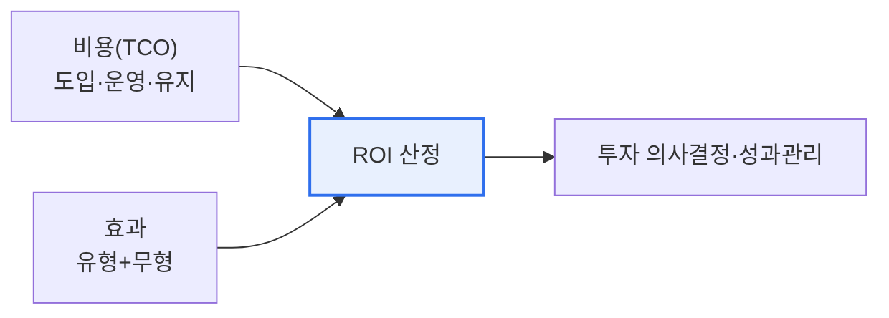

# IT-ROI 투자 성과평가 모델

## 1. 개요

### 가. 정의
> **IT-ROI(Return On Investment)** 는 IT 투자에 들인 비용 대비 얻은 효과(수익·절감)를 정량적으로 측정해, IT 투자의 **경제적 타당성과 성과를 평가**하는 모델이다. 기본 공식은 `(효과 − 비용) / 비용 × 100`이다.

IT-ROI가 필요한 근본 이유는 '**IT 투자의 성과를 경영진이 이해하는 언어(돈)로 증명**'하기 위함이다. IT 부서는 늘 투자를 요청하지만, "이 시스템이 얼마의 가치를 만들었는가"를 숫자로 보여주지 못하면 투자 정당성을 확보하기 어렵다. IT-ROI는 투자 비용(TCO)과 효과를 화폐 단위로 환산해 비교함으로써, 투자 우선순위를 정하고 사후 성과를 검증한다. 다만 IT의 효과에는 매출 증대·비용 절감 같은 **유형 효과** 뿐 아니라, 고객 만족·업무 효율·전략적 유연성 같은 **무형 효과** 가 크게 포함되어, 단순 재무 ROI만으로는 온전히 평가되지 않는다는 근본적 한계가 있다. 그래서 IT-ROI 모델은 무형 효과를 어떻게 정량화하느냐가 핵심 과제다.

### 나. 필요성
IT 예산 제약과 투자 실패 위험 속에서, 감이 아니라 근거에 기반한 투자 결정과 성과 관리가 요구된다. IT-ROI는 투자의 경제성을 객관적으로 뒷받침한다.

## 2. 평가 구성요소

| 구성 | 내용 |
|---|---|
| **비용(TCO)** | 도입·운영·유지보수 총소유비용 |
| **유형 효과** | 매출 증대, 비용·인력 절감(정량) |
| **무형 효과** | 고객 만족, 업무 효율, 전략 기여(정성) |

## 3. 주요 평가 기법

| 기법 | 내용 |
|---|---|
| **ROI** | (효과−비용)/비용 × 100 |
| **NPV** | 미래 현금흐름의 현재가치 합 |
| **IRR** | NPV=0이 되는 할인율(수익률) |
| **회수기간** | 투자비 회수까지 걸린 기간 |
| **TCO** | 총소유비용(숨은 비용 포함) |
| **정보경제학(IE)** | 유·무형 효과를 가중 평가 |

재무 기법(ROI·NPV·IRR)은 유형 효과 평가에 강하지만, 무형 효과는 정보경제학·가중치·AHP 같은 정성 기법으로 보완해야 온전한 평가가 된다.

## 4. 고려사항 및 시사점

1. **무형 효과의 정량화가 관건**이다. IT의 상당한 가치가 무형이므로, 이를 대리지표(고객 유지율·처리시간 단축 등)로 환산하지 않으면 전략적 투자를 저평가하게 된다.
2. **TCO 관점의 비용 산정**이 중요하다. 도입 비용만 보지 말고 운영·유지보수·교육 등 숨은 비용까지 포함한 총소유비용으로 계산해야 정확한 ROI가 나온다.
3. **BSC·IT 거버넌스와 연계**한다. 단순 재무 ROI를 넘어 균형성과표(재무·고객·프로세스·학습성장)로 다면 평가하고, 경영전략과 정렬된 투자를 우선해야 한다.

---

> **한 줄 요약**: IT-ROI는 *IT 투자 비용(TCO) 대비 효과를 정량 평가* 하는 모델로, ROI·NPV·IRR 재무 기법과 정보경제학·BSC로 유형·무형 효과를 균형 있게 측정하되 무형 효과의 정량화가 핵심 과제다.
