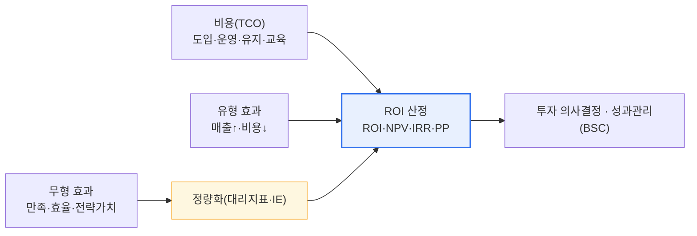
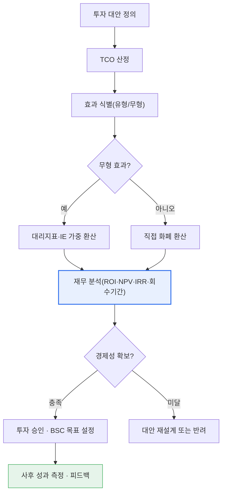

# IT-ROI 투자 성과평가 모델

## 1. 개요

### 가. 정의
> **IT-ROI(Return On Investment)** 는 IT 투자에 투입한 비용 대비 그로부터 얻은 효과(수익 증대·비용 절감·리스크 회피 등)를 정량적으로 측정하여 **IT 투자의 경제적 타당성과 성과를 화폐 단위로 평가**하는 모델이다. 가장 기본이 되는 공식은 `ROI(%) = (효과 − 비용) / 비용 × 100` 이며, 여기에 화폐의 시간가치를 반영한 NPV·IRR, 총비용을 포괄하는 TCO, 무형 효과를 가중 평가하는 정보경제학(IE) 기법이 결합되어 하나의 평가 체계를 이룬다.

IT-ROI가 요구되는 근본 이유는 '**IT 투자의 성과를 경영진이 이해하는 언어(돈)로 증명**'해야 한다는 데 있다. IT 조직은 인프라 교체, 신규 시스템 구축, 클라우드 전환, AI 도입 등 끊임없이 투자를 요청하지만, "그 투자가 결국 얼마의 가치를 만들어냈는가"를 숫자로 제시하지 못하면 CFO·이사회로부터 예산 정당성을 확보하기 어렵다. 전통적으로 IT는 비용센터(cost center)로 인식되어 왔고, 투자 대비 효과가 불투명하다는 이유로 경기 침체기마다 가장 먼저 삭감되는 예산이었다. IT-ROI는 이러한 인식을 바꾸기 위해, 투입 비용(TCO)과 산출 효과를 동일한 화폐 척도로 환산하여 비교함으로써 투자 우선순위를 정하고 사후 성과를 검증하는 근거를 제공한다.

그러나 IT의 효과에는 매출 증대·인건비 절감 같은 **유형 효과(tangible)** 뿐 아니라, 고객 만족도 향상·의사결정 속도 개선·업무 몰입·전략적 유연성(옵션 가치) 같은 **무형 효과(intangible)** 가 크게 포함된다. 특히 디지털 전환기의 IT 투자는 유형 효과보다 무형·전략적 효과의 비중이 더 커지는 경향이 있어, 단순 재무 ROI만으로는 투자 가치를 온전히 담아내지 못한다는 근본적 한계가 있다. 따라서 IT-ROI 모델의 실질적 핵심은 '무형 효과를 어떻게 신뢰성 있게 정량화(monetization)하느냐'에 있으며, 이 지점에서 정보경제학·BSC·실물옵션 같은 보완 기법이 등장한다.

### 나. 등장 배경과 필요성
IT-ROI가 하나의 방법론으로 정착한 배경에는 1990년대 이후 확대된 대규모 IT 투자와, 이에 비례해 빈발한 투자 실패 경험이 있다. 미국을 중심으로 "IT에 막대한 돈을 쓰는데 생산성은 왜 오르지 않는가"라는 이른바 **생산성 역설(productivity paradox)** 논쟁이 벌어졌고, 이는 IT 투자 효과를 엄밀히 측정하려는 학문적·실무적 노력을 촉발했다. 국내에서도 공공·금융권의 대형 정보화 사업이 늘면서, 예산 편성 단계에서 경제적 타당성을 사전에 검증하고(선투자 평가), 사업 종료 후 실제 성과를 검증하는(사후 평가) 절차가 제도화되었다.

필요성은 세 가지로 요약된다. 첫째, **자원 배분의 합리화**다. 한정된 IT 예산 안에서 어느 사업에 먼저 투자할지를 감(感)이 아니라 정량 근거로 결정해야 한다. 둘째, **책임성(accountability)** 이다. 투자 이후 실제 효과를 측정해 계획 대비 실적을 검증함으로써 IT 거버넌스의 투명성을 확보한다. 셋째, **의사소통**이다. IT 성과를 재무 언어로 번역해 경영진·현업과 공감대를 형성하고 지속적 투자 동력을 확보한다.

## 2. IT-ROI 평가 프레임워크와 구성요소

IT-ROI 평가는 비용을 산정하고, 유형·무형 효과를 측정하며, 이를 재무 기법으로 종합해 의사결정에 연결하는 일련의 흐름으로 이루어진다. 아래 구조도는 평가에 들어가는 입력(비용·효과)과 산출(투자 의사결정·성과관리)의 관계를 보여준다.

```mermaid
flowchart LR
  C["비용(TCO)<br/>도입·운영·유지·교육"] --> R["ROI 산정<br/>ROI·NPV·IRR·PP"]
  T["유형 효과<br/>매출↑·비용↓"] --> R
  I["무형 효과<br/>만족·효율·전략가치"] --> Q["정량화(대리지표·IE)"]
  Q --> R
  R --> D["투자 의사결정 · 성과관리(BSC)"]
  style R fill:#e8f0fe,stroke:#2f6fed,stroke-width:2px
  style Q fill:#fef7e0,stroke:#f9a825,stroke-width:1px
```

**비용(TCO) 측면**을 먼저 정확히 잡는 것이 ROI 신뢰성의 출발점이다. 초심자가 흔히 저지르는 오류는 하드웨어·소프트웨어 도입비 같은 눈에 보이는 초기 비용만 계산하는 것이다. 그러나 실제 비용의 상당 부분은 도입 이후에 발생한다. 운영·유지보수, 라이선스 갱신, 장애 대응, 사용자 교육, 조직 변화관리, 심지어 시스템 폐기 비용까지 포함해야 진짜 투자 규모가 드러난다. 이를 총소유비용(TCO, Total Cost of Ownership)이라 하며, 일반적으로 시스템 생애주기 전체 비용에서 초기 도입비가 차지하는 비중은 20~30%에 불과하고 나머지 70~80%가 운영·유지 단계에서 발생한다고 알려져 있다. TCO를 과소평가하면 ROI는 실제보다 부풀려져 잘못된 투자 결정을 낳는다.

**유형 효과 측면**은 화폐로 직접 환산 가능한 효과다. 예컨대 콜센터 상담 자동화로 상담원 20명분 인건비를 절감했다면 이는 명확한 정량 효과이며, 이커머스 추천 시스템 도입으로 객단가가 8% 상승했다면 매출 증대분을 계산할 수 있다. 유형 효과는 재무 기법(ROI·NPV·IRR)으로 비교적 정확히 평가된다는 장점이 있으나, IT 투자 가치의 일부만을 설명한다는 점을 늘 유의해야 한다.

**무형 효과 측면**은 IT-ROI의 가장 어려운 영역이다. 고객 만족도 향상, 의사결정 정확도 개선, 브랜드 신뢰, 규제 리스크 감소, 미래 확장을 위한 전략적 유연성 등은 그 자체로는 화폐 단위가 아니다. 그러나 무형이라 하여 측정을 포기하면 전략적으로 중요한 투자일수록 저평가되는 역설이 생긴다. 따라서 실무에서는 **대리지표(proxy metric)** 를 설정해 간접 화폐화한다. 예를 들어 고객 만족도 향상은 '이탈률 감소 → 고객 생애가치(LTV) 유지 → 매출 방어액'으로, 업무 효율 개선은 '처리 시간 단축 × 시간당 인건비 × 처리 건수'로 환산한다. 이처럼 무형 효과를 정량화하는 체계적 접근이 정보경제학(IE)이다.

| 구성요소 | 세부 내용 | 평가 시 유의점 |
|---|---|---|
| **비용(TCO)** | 도입·운영·유지보수·교육·변화관리·폐기 | 초기비만 계산하는 오류 경계, 생애주기 전체 반영 |
| **유형 효과** | 매출 증대, 인건·재고·시간 비용 절감 | 재무 기법으로 정량화 용이 |
| **무형 효과** | 고객 만족, 업무 효율, 리스크 감소, 전략적 유연성 | 대리지표·가중치로 간접 화폐화 필요 |

## 3. 주요 평가 기법과 산정 절차

IT-ROI 평가에는 여러 재무·정성 기법이 함께 쓰인다. 아래 프로세스 다이어그램은 투자 대안이 들어와 최종 성과관리로 이어지기까지의 절차를 보여준다.

```mermaid
flowchart TB
  A["투자 대안 정의"] --> B["TCO 산정"]
  B --> C["효과 식별(유형/무형)"]
  C --> D{"무형 효과?"}
  D -->|"예"| E["대리지표·IE 가중 환산"]
  D -->|"아니오"| F["직접 화폐 환산"]
  E --> G["재무 분석(ROI·NPV·IRR·회수기간)"]
  F --> G
  G --> H{"경제성 확보?"}
  H -->|"충족"| I["투자 승인 · BSC 목표 설정"]
  H -->|"미달"| J["대안 재설계 또는 반려"]
  I --> K["사후 성과 측정 · 피드백"]
  style G fill:#e8f0fe,stroke:#2f6fed,stroke-width:2px
  style K fill:#e6f4ea,stroke:#34a853,stroke-width:1px
```

### 가. 재무 기법
재무 기법은 유형 효과를 평가하는 데 강력하다. **ROI**는 `(효과−비용)/비용×100`으로 직관적이지만, 화폐의 시간가치와 투자 기간을 반영하지 못한다는 약점이 있다. 이를 보완하는 것이 **NPV(순현재가치)** 로, 미래에 발생할 현금흐름을 적정 할인율로 현재가치화해 합산한 뒤 초기 투자액을 빼서 구한다. NPV가 0보다 크면 그 투자는 자본비용 이상을 벌어들이는 경제적 투자다. **IRR(내부수익률)** 은 NPV를 0으로 만드는 할인율로, 투자의 수익률을 백분율로 나타내 서로 다른 규모의 사업을 비교할 때 유용하다. **회수기간(Payback Period)** 은 투자비를 회수하는 데 걸리는 기간으로, 계산이 쉽고 리스크 감각을 주지만 회수 이후의 효과와 시간가치를 무시한다.

이 기법들은 상호 보완적으로 쓰인다. 예를 들어 두 사업의 ROI가 같아도, 초기에 효과가 몰리는 사업이 NPV·IRR에서 유리하다. 실무에서는 NPV로 절대 가치를, IRR로 상대 수익률을, 회수기간으로 리스크 노출 기간을 함께 보는 다면 평가가 표준이다.

### 나. TCO와 정보경제학(IE)
**TCO**는 앞서 설명한 대로 비용의 완전성을 확보하는 기법이며, 클라우드 전환 같은 의사결정에서 온프레미스 대비 5년 TCO를 비교하는 방식으로 자주 활용된다. **정보경제학(Information Economics)** 은 재무 ROI에 무형·전략 가치를 가중치로 더해 평가하는 확장 기법이다. 순수 재무 ROI 점수에 '경영전략 부합도', '경쟁우위 기여', '조직 리스크' 같은 항목별 가치·리스크 점수를 가중 합산함으로써, 재무 수치만으로는 드러나지 않는 전략적 가치를 평가에 반영한다. 무형 효과의 가중치를 정할 때는 AHP(계층분석) 같은 다기준 의사결정 기법을 함께 쓰기도 한다.

| 기법 | 산출 방식 | 강점 | 한계 |
|---|---|---|---|
| **ROI** | (효과−비용)/비용×100 | 직관적, 소통 용이 | 시간가치·기간 미반영 |
| **NPV** | Σ 현금흐름 현재가치 − 투자액 | 시간가치 반영, 절대 가치 | 할인율 가정에 민감 |
| **IRR** | NPV=0 할인율 | 규모 다른 사업 비교 | 복수해·비현실 재투자 가정 |
| **회수기간(PP)** | 투자비 회수 기간 | 리스크 직관 | 회수 후 효과·시간가치 무시 |
| **TCO** | 생애주기 총비용 | 숨은 비용 포착 | 효과 측면은 별도 |
| **정보경제학(IE)** | 재무 ROI + 무형·전략 가중 | 무형 가치 반영 | 가중치 주관성 |

## 4. 적용 사례와 비교

기법 선택은 투자 성격에 따라 달라진다. 이 차이가 생기는 이유는 투자마다 효과의 유형·발생 시점·전략성이 다르기 때문이다. 예를 들어 **비용 절감형 투자**(예: 노후 서버 통합, RPA 도입)는 효과가 대부분 유형이고 단기에 실현되므로 ROI·회수기간만으로도 충분히 설득력 있는 평가가 가능하다. 실제로 반복 수작업을 RPA로 대체해 연 1만 시간의 업무를 자동화하고 시간당 처리 비용을 계산해 12개월 내 회수를 입증하는 식이다.

반면 **전략형·플랫폼형 투자**(예: 데이터 플랫폼 구축, 클라우드 전환, AI 도입)는 효과가 장기에 걸쳐 무형으로 나타나므로 단순 ROI로는 저평가되기 쉽다. 이 경우 NPV로 다년간 효과를 현재가치화하고, 정보경제학으로 전략적 유연성(향후 신규 서비스를 빠르게 얹을 수 있는 옵션 가치)을 가중 반영해야 투자 타당성이 드러난다. 클라우드 전환 사례에서는 온프레미스 5년 TCO와 클라우드 5년 TCO를 비교하되, 단순 비용뿐 아니라 탄력적 확장으로 인한 기회비용 절감·출시 시간 단축 같은 무형 효과를 함께 계량하는 것이 정석이다.

세 번째로 **규제 대응·리스크 회피형 투자**(예: 보안 강화, 개인정보보호 시스템)는 매출을 늘리지 않으므로 전통적 ROI가 음수처럼 보일 수 있으나, '침해 사고 발생 확률 × 예상 피해액'으로 회피 가치(risk-adjusted return)를 계산하면 투자 정당성이 확보된다. 이처럼 같은 IT-ROI라도 투자 유형에 따라 어떤 기법을 전면에 세우고 무엇을 보완 기법으로 쓸지가 달라진다.

### 가. 간단한 산정 예시
개념을 구체화하기 위해 예시를 들어본다. 어떤 기업이 문서 처리 자동화 시스템에 초기 도입비 3억 원을 투입하고, 이후 4년간 매년 유지·운영비로 5천만 원이 든다고 하자. 이 시스템으로 연간 반복 수작업 8천 시간을 자동화하고 시간당 처리 비용을 2만 5천 원으로 환산하면, 연간 절감 효과는 약 2억 원이다. 단순 누적 ROI를 4년 기준으로 보면 총효과 8억 원, 총비용 5억 원(도입 3억 + 유지 2억)으로 `(8−5)/5×100 = 60%`가 된다. 여기에 화폐의 시간가치를 반영해 할인율 8%로 NPV를 계산하면 미래 효과의 현재가치가 줄어들어 순현재가치는 60%보다 보수적인 값이 나온다. 회수기간은 초기비 3억 원을 연 순효과(2억−0.5억=1.5억)로 나눠 약 2년으로 산정된다. 이처럼 동일한 투자라도 어떤 기법으로 보느냐에 따라 '경제성이 있다'는 결론의 강도가 달라지므로, 복수 기법을 함께 제시하는 것이 정석이다. (위 수치는 원리 설명을 위한 가정치이며 실제 프로젝트에서는 조직 데이터로 산정해야 한다.)

## 5. 심화: BSC 연계와 최근 동향

IT-ROI는 단독으로 쓰이기보다 **균형성과표(BSC, Balanced Scorecard)** 와 결합될 때 완성도가 높아진다. BSC는 재무 관점 하나에 갇히지 않고 고객·내부 프로세스·학습과 성장의 네 관점으로 성과를 균형 있게 본다. IT 투자의 무형 효과 상당수는 고객·프로세스·학습성장 관점에 자연스럽게 매핑되므로, IT-ROI의 재무 수치와 BSC의 비재무 지표를 함께 배치하면 재무 ROI가 놓치는 전략적 가치를 보완할 수 있다. 실제로 많은 조직이 IT 투자 심의에서 재무 타당성(NPV·IRR)과 전략 정합성(BSC·정보경제학 점수)을 두 축으로 하는 평가표를 사용한다.

최근 동향으로는 첫째, **가치 실현(Value Realization) 관점의 강화**가 있다. 투자 승인 시점의 사전 ROI로 끝내지 않고, 프로젝트 종료 후 실제 효과를 지속 추적해 계획 대비 실적을 관리하는 벤핏 매니지먼트(benefits management)가 IT 거버넌스(COBIT 등)에서 강조된다. 둘째, **디지털 전환·AI 투자의 ROI 측정 난제**다. 생성형 AI 도입처럼 효과가 광범위하고 무형적인 투자는 전통적 ROI 산정이 특히 어려워, 생산성 향상 시간·품질 개선율 같은 대리지표와 파일럿 기반 단계적 투자(옵션적 접근)로 평가하는 방식이 확산되고 있다. 셋째, **ESG·지속가능성 가치의 반영**으로, IT 투자의 탄소 절감·에너지 효율 같은 비재무 효과를 성과에 포함하려는 시도가 늘고 있다. 다만 이러한 최신 지표의 표준화 정도는 아직 조직마다 편차가 크므로 단정보다는 조직 맥락에 맞춘 신중한 설계가 필요하다.

## 6. 고려사항 및 시사점 (기술사 관점)

1. **무형 효과의 정량화가 성패를 좌우한다.** IT 가치의 상당 부분이 무형이므로, 대리지표(고객 유지율·처리시간 단축·리스크 회피액)로 체계적으로 환산하지 않으면 전략적으로 중요한 투자일수록 저평가되는 역설이 생긴다. 정보경제학·AHP·실물옵션 등 보완 기법을 상황에 맞게 조합해야 한다.

2. **TCO 관점의 완전한 비용 산정이 전제다.** 도입비만 보는 오류를 피하고, 운영·유지보수·교육·변화관리·폐기까지 생애주기 전체 비용을 반영해야 ROI가 왜곡되지 않는다. 특히 클라우드·구독형 모델에서는 장기 운영비가 초기비를 크게 상회할 수 있음을 유의한다.

3. **BSC·IT 거버넌스와 연계해 다면 평가한다.** 단일 재무 ROI에 매몰되지 말고 재무·고객·프로세스·학습성장의 균형 관점으로 평가하며, COBIT 등 거버넌스 프레임워크의 가치 실현 프로세스와 연결해 사전 평가–사후 검증의 폐루프를 만든다.

4. **사전 평가와 사후 성과관리를 폐루프로 운영한다.** 투자 승인 시의 추정 ROI로 끝내지 않고, 실제 효과를 지속 측정해 계획 대비 실적을 검증하고 다음 투자 의사결정에 환류해야 IT-ROI가 형식이 아닌 실질적 경영 도구가 된다.

5. **트레이드오프와 가정의 투명성을 확보한다.** 할인율·효과 추정치·무형 가중치 등 ROI 산정에는 다수의 가정이 개입되므로, 민감도 분석을 통해 가정 변화에 따른 결과 변동을 함께 제시해야 의사결정의 신뢰성이 높아진다. 특히 무형 효과의 대리지표는 그 자체가 추정이므로, 낙관·비관 시나리오를 병렬로 제시하는 것이 과대 포장이라는 비판을 피하는 길이다.

6. **투자 유형별로 기법을 달리 적용한다.** 비용 절감형은 ROI·회수기간으로 충분하지만, 전략·플랫폼형은 NPV·실물옵션·정보경제학으로 장기·무형 가치를 반영하고, 리스크 회피형은 회피 가치(확률×피해액)로 평가해야 한다. 하나의 잣대를 모든 투자에 획일 적용하면 전략적 투자를 저평가하는 오류가 발생한다.

종합하면 IT-ROI는 계산 공식 자체가 아니라 '무형 가치를 어떻게 신뢰성 있게 화폐로 번역하고, 그 가정을 투명하게 드러내며, 사전 판단과 사후 검증을 잇는 관리 체계로 운영하느냐'가 본질이다. 기술사 관점에서는 개별 기법의 계산법을 넘어, 조직의 IT 거버넌스·전략과 정렬된 투자 의사결정 체계로서 IT-ROI를 설계·운영하는 역량이 요구된다.

## 참고자료
- ISACA, COBIT 2019 — Governance and management objectives (가치 실현/벤핏 매니지먼트): https://www.isaca.org/resources/cobit
- Kaplan & Norton, Balanced Scorecard (Harvard Business Review 개요): https://hbr.org/1992/01/the-balanced-scorecard-measures-that-drive-performance-2
- Brynjolfsson, IT 생산성 역설(Productivity Paradox) 논의 개요: https://en.wikipedia.org/wiki/Productivity_paradox

---

> **한 줄 요약**: IT-ROI는 *IT 투자 비용(TCO) 대비 효과를 정량 평가* 하는 모델로, ROI·NPV·IRR·회수기간의 재무 기법과 정보경제학·BSC를 결합해 유형·무형 효과를 균형 있게 측정하되, **무형 효과의 정량화와 사전–사후 폐루프 성과관리**가 핵심 과제다.
