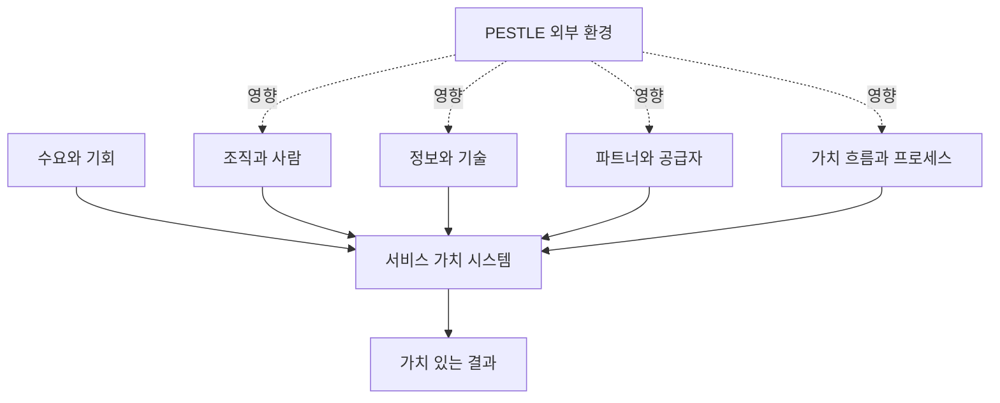
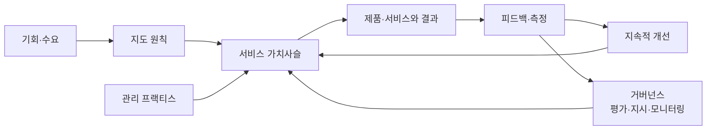
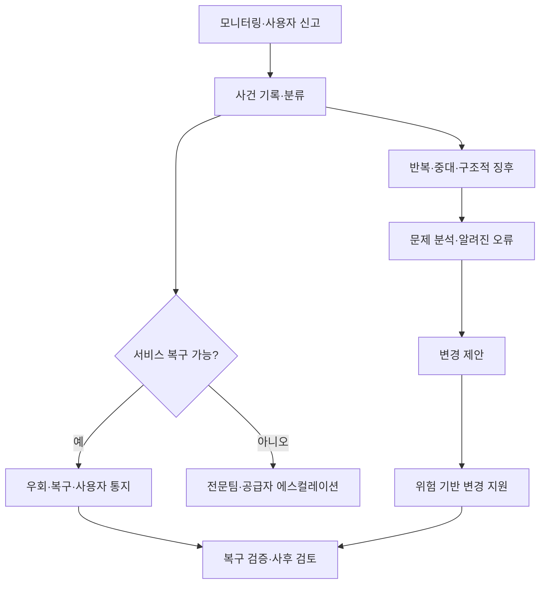

# ITIL 4(정보기술 인프라 라이브러리)와 서비스 관리

## 1. 개요

> ITIL 4는 조직이 디지털 제품과 서비스를 설계·전환·운영·개선하면서 고객 및 이해관계자와 함께 가치를 창출하도록 돕는 서비스 관리 프레임워크이다.

ITIL(Information Technology Infrastructure Library)은 IT를 기술 구성요소의 운영이 아니라 서비스의 품질과 가치를 관리하는 관점으로 전환하기 위한 실무 지침이다. IT가 업무를 지원하는 수준을 넘어 업무 성과, 고객 경험, 규제 준수, 비용 효율을 좌우하면서 장애 건수만 줄이는 운영관리로는 경영 목표를 설명하기 어려워졌다.

ITIL 4는 정해진 절차를 모든 조직에 강제하는 프로세스 표준이 아니다. 서비스가 창출하는 가치와 이해관계자 결과를 출발점으로 삼고, 조직의 규모·위험·기술·공급망에 맞춰 가치 흐름과 관리 프랙티스를 조합한다. 따라서 동일한 프랙티스라도 금융기관의 핵심계정 서비스와 스타트업의 실험 서비스에는 서로 다른 통제 수준이 적용될 수 있다.

기존 ITIL v3가 서비스 수명주기와 프로세스별 통제를 강조했다면, ITIL 4는 서비스 가치 시스템(SVS), 가치사슬 활동, 4차원 관점, 7대 지도 원칙을 중심으로 민첩성·협업·자동화까지 포괄한다. 이 변화는 DevOps, 애자일, 클라우드, SRE와 IT 서비스 관리가 서로 배타적이지 않으며, 공통의 가치 목표 아래 결합될 수 있음을 의미한다.

기술사 답안에서는 ITIL 4를 단순히 34개 프랙티스의 목록으로 쓰기보다, 수요와 기회를 입력으로 받아 서비스 관계를 통해 결과를 만들고, 거버넌스와 지속적 개선으로 다시 학습하는 폐쇄형 관리체계로 설명해야 한다.

### 1.1 등장 배경과 필요성

첫째, 서비스 소비자는 가동률 자체보다 업무 결과를 원한다. 온라인 쇼핑몰은 서버가 살아 있는지보다 주문이 정상 접수되고 결제가 완료되는지를 중요하게 본다. IT 운영지표와 비즈니스 성과지표를 연결하지 않으면 높은 가동률을 달성하고도 고객 가치를 만들지 못할 수 있다.

둘째, 클라우드와 SaaS 확산으로 서비스 구성요소의 경계가 조직 밖으로 확장되었다. 내부 서버, 퍼블릭 클라우드, 외부 API, 오픈소스, 협력사 운영이 하나의 서비스 흐름을 구성하므로 공급자 관리와 계약상의 책임 경계가 필수적이다.

셋째, 애자일과 DevOps는 빠른 변경을 가능하게 하지만, 변경 속도만 높이면 장애·보안사고·감사 추적성 문제가 커질 수 있다. ITIL 4의 변경 지원, 배포, 사건, 문제, 서비스 수준 관리 프랙티스는 속도와 통제를 상충시키는 대신 위험 기반으로 균형을 잡는다.

넷째, 데이터와 자동화가 운영 의사결정의 중심이 되었다. 관측성 데이터, 구성정보, 사용자 피드백, 비용정보를 한 서비스 맥락으로 연결해야 문제를 조기에 발견하고 개선 투자 우선순위를 정할 수 있다.

### 1.2 핵심 특징

ITIL 4의 핵심은 프로세스 준수율이 아니라 가치 공동창출이다. 서비스 제공자만 가치를 만드는 것이 아니라 소비자의 역량, 사용 방식, 업무 맥락이 결합될 때 결과가 실현된다.

또한 프랙티스는 사람·정보·기술·파트너·가치 흐름을 함께 고려하는 실행 역량이다. 문서에 절차를 써 두는 것만으로 프랙티스가 성숙해지는 것이 아니며, 책임과 권한, 도구, 데이터, 숙련도, 측정과 개선이 함께 작동해야 한다.

## 2. 서비스 관리의 기본 개념

### 2.1 서비스·가치·결과

서비스는 고객이 특정 비용과 위험을 직접 부담하지 않고도 원하는 결과를 얻도록 제공자가 수행하는 활동의 묶음이다. 여기서 제공자가 모든 기술 구성요소를 고객에게 이전하지 않는다는 점이 중요하다. 고객은 서버를 구매하는 것이 아니라 업무 결과를 얻기 위한 능력을 소비한다.

가치는 유용성(utility)과 보증(warranty)이 결합되어 인식된다. 유용성은 서비스가 무엇을 해 주는가에 관한 기능과 목적 적합성이고, 보증은 약속된 조건에서 얼마나 안정적으로 제공되는가에 관한 품질과 사용 적합성이다.

예를 들어 모바일 뱅킹 서비스가 이체 기능을 제공하는 것은 유용성이다. 거래가 정해진 시간 안에 처리되고, 장애 시 복구되며, 개인정보가 보호되는 것은 보증이다. 기능이 많아도 보증이 부족하면 사용자는 서비스 가치를 낮게 평가한다.

서비스 관계는 제공자와 소비자가 서비스 제공·소비를 위해 협력하는 관계이다. 관계에는 서비스 제공, 서비스 소비, 관계 관리가 포함된다. SLA 문서만 교환하는 관계가 아니라 목표·위험·피드백·개선 우선순위를 함께 조정하는 운영관계로 보아야 한다.

### 2.2 비용과 위험의 관점

서비스 소비자는 직접 비용과 간접 비용을 함께 부담한다. 직접 비용은 이용료, 라이선스, 인력비처럼 계약이나 예산에 나타나는 항목이고, 간접 비용은 교육, 전환, 지연, 장애로 인한 기회손실처럼 서비스 사용 과정에서 발생한다.

위험은 서비스가 결과를 만들지 못하게 하는 불확실성이다. 제공자가 위험의 일부를 관리하더라도 소비자 조직의 데이터 품질, 사용자 교육, 업무 프로세스가 부적절하면 전체 결과는 나빠진다. 따라서 서비스 수준 협의에서는 제공자가 통제할 수 있는 위험과 소비자가 관리해야 하는 위험을 구분한다.

기술사는 서비스 카탈로그와 SLA에 기능 목록만 기록하지 말고, 주요 결과·품질조건·비용요소·위험 소유자·측정방법을 함께 정의해야 한다. 이 구조가 있어야 장애 우선순위와 투자 타당성을 경영 언어로 설명할 수 있다.

| 개념 | 핵심 질문 | 실무 관리 포인트 |
|---|---|---|
| 유용성 | 서비스가 어떤 업무를 가능하게 하는가? | 기능, 사용 시나리오, 결과지표 |
| 보증 | 약속된 조건에서 안정적으로 쓸 수 있는가? | 가용성, 용량, 보안, 연속성 |
| 비용 | 제공·소비에 얼마의 자원이 드는가? | TCO, 단위비용, 라이선스, 인력 |
| 위험 | 결과를 방해할 불확실성은 무엇인가? | 위험등록부, 통제, 잔여위험 |
| 결과 | 이해관계자가 얻는 변화는 무엇인가? | KPI, 고객성과, 업무효과 |

## 3. ITIL 4의 4차원 관점

서비스 관리 의사결정은 한 차원만 최적화해서는 안 된다. ITIL 4는 조직과 사람, 정보와 기술, 파트너와 공급자, 가치 흐름과 프로세스라는 네 차원을 균형 있게 검토한다. 외부 환경인 PESTLE도 네 차원에 영향을 주므로 규제·경제·사회·기술·법·환경 변화를 함께 살펴야 한다.

### 3.1 조직과 사람

조직 구조, 역할과 책임, 권한 위임, 역량, 문화, 커뮤니케이션을 포함한다. 서비스 데스크와 개발팀이 서로 다른 목표를 가지면 사건을 빠르게 해결하기보다 책임을 전가하게 된다. 따라서 RACI, 온콜 체계, 에스컬레이션 경로, 학습시간을 서비스 운영모델에 반영해야 한다.

사람을 단순 운영비로만 보면 자동화 도입이 실패하기 쉽다. 자동화로 반복작업을 줄인 뒤 분석, 설계, 고객 커뮤니케이션, 위험관리 역량을 강화하는 재배치 계획이 필요하다. 역할 기반 교육과 현장 코칭도 프랙티스 성숙도의 일부이다.

### 3.2 정보와 기술

서비스를 설계·운영하는 데 필요한 데이터와 도구를 다룬다. 구성관리 데이터베이스(CMDB), 모니터링, 로그·트레이스, 서비스 카탈로그, 지식베이스, 배포 파이프라인, ITSM 도구가 대표적이다.

도구를 많이 도입하는 것보다 데이터의 의미와 품질이 중요하다. 자산 식별자가 서로 다르면 사건과 구성항목을 연결할 수 없고, 모니터링 경보가 업무 영향으로 번역되지 않는다. 정보 분류, 보존, 접근통제, 데이터 품질 규칙을 설계해야 한다.

### 3.3 파트너와 공급자

클라우드 사업자, 네트워크 사업자, 패키지 공급자, 외주 운영사, 오픈소스 커뮤니티 등 서비스에 참여하는 외부 주체를 관리한다. 공급자 성과는 계약서의 가동률만으로 평가하지 않고 장애 협업, 보안 통지, 복구훈련, 데이터 반출, 종료 지원까지 포함해야 한다.

다중 클라우드에서는 공급자별 책임분계가 특히 중요하다. 제공자의 플랫폼 장애와 고객의 잘못된 구성은 대응 주체가 다르므로 서비스 모델과 운영분장표를 문서화하고 정기적으로 검증해야 한다.

### 3.4 가치 흐름과 프로세스

수요가 결과로 전환되는 활동의 순서, 통제, 대기, 인계, 자동화를 다룬다. 프로세스는 업무를 통제하는 규칙이라면 가치 흐름은 특정 제품·서비스에서 실제로 가치가 이동하는 전체 경로다.

예를 들어 신규 고객용 모바일 기능의 가치 흐름은 아이디어, 요구사항, 설계, 개발, 테스트, 배포, 관측, 피드백으로 이어진다. 각 단계의 승인만 늘리면 병목이 생기므로 위험이 높은 변경에 통제를 집중하고 저위험 표준변경은 자동화하는 것이 바람직하다.

| 차원 | 점검 질문 | 대표 산출물 |
|---|---|---|
| 조직과 사람 | 누가 결정하고 어떤 역량이 필요한가? | 운영모델, RACI, 역량계획 |
| 정보와 기술 | 어떤 데이터와 도구가 연결되어야 하는가? | CMDB, 지식베이스, 관측성 설계 |
| 파트너와 공급자 | 외부 의존성과 책임경계는 명확한가? | 계약, OLA, 공급자 평가표 |
| 가치 흐름과 프로세스 | 어디서 대기·재작업·통제가 발생하는가? | 가치흐름지도, 절차, 자동화 규칙 |

## 4. 서비스 가치 시스템(SVS)

ITIL 4의 SVS는 조직의 모든 구성요소와 활동이 하나의 시스템으로 결합되어 가치를 창출하는 방식을 설명한다. 입력은 기회와 수요이고, 출력은 제품·서비스를 통한 가치다. SVS의 다섯 구성요소는 지도 원칙, 거버넌스, 서비스 가치사슬, 관리 프랙티스, 지속적 개선이다.

### 4.1 일곱 가지 지도 원칙

지도 원칙은 특정 도구나 조직에 종속되지 않는 의사결정 기준이다. 원칙은 체크리스트처럼 하나만 선택하는 것이 아니라 상황에 따라 함께 적용한다.

첫째, 가치에 집중한다. 활동 자체의 완료보다 고객·사용자·조직이 얻는 결과를 확인한다. 둘째, 현재에서 시작한다. 기존 자산과 역량을 진단하지 않고 전면 교체하면 비용과 전환 위험이 커진다.

셋째, 피드백을 반영하며 반복적으로 진행한다. 큰 설계를 한 번에 확정하기보다 작은 변경을 측정하고 학습한다. 넷째, 협업하고 가시성을 높인다. 개발·운영·보안·사업이 같은 현황판과 용어를 사용해야 숨겨진 대기와 책임 공백이 줄어든다.

다섯째, 전체적으로 생각하고 일한다. 특정 팀의 처리량을 높여도 전체 서비스 흐름이 느려지면 최적화가 아니다. 여섯째, 단순하고 실용적으로 유지한다. 통제 목적과 위험을 설명하지 못하는 승인·보고 절차는 제거하거나 자동화한다.

일곱째, 최적화하고 자동화한다. 먼저 낭비와 병목을 분석한 뒤 안정적인 반복 업무를 자동화한다. 나쁜 절차를 그대로 자동화하면 오류가 더 빠르게 확산되므로 자동화 전 표준화와 예외처리가 필요하다.

### 4.2 거버넌스와 지속적 개선

거버넌스는 조직을 평가하고, 방향을 지시하고, 결과를 모니터링하는 체계다. 경영진은 서비스 포트폴리오, 위험허용수준, 투자, 규제준수, 공급망 원칙을 결정하고, 실무조직은 그 방향을 가치 흐름과 프랙티스로 구현한다.

지속적 개선은 별도 혁신팀의 일회성 프로젝트가 아니라 모든 수준에서 반복되는 운영활동이다. 개선기회 등록, 우선순위 결정, 기준선 측정, 작은 실행, 결과 검증, 지식 확산의 순환을 만들어야 한다.

개선 우선순위는 불만이 큰 항목만으로 정하지 않는다. 고객 영향, 위험 감소, 비용 절감, 규제 중요도, 구현 난이도, 학습효과를 함께 평가하고, 개선 백로그를 제품·서비스 로드맵과 연결한다.

## 5. 서비스 가치사슬과 가치 흐름

서비스 가치사슬은 조직이 가치를 제공하고 실현하기 위해 수행하는 상호연결 활동의 운영모델이다. 여섯 활동은 Plan, Improve, Engage, Design & Transition, Obtain/Build, Deliver & Support이다. 모든 서비스가 여섯 활동을 같은 순서로 거치는 것은 아니며, 수요의 유형에 따라 경로가 달라진다.

| 활동 | 목적 | 대표 산출물 |
|---|---|---|
| Plan | 비전·현황·개선 방향의 공통 이해 | 전략, 포트폴리오, 정책 |
| Improve | 제품·서비스·프랙티스의 지속적 개선 | 개선 백로그, 회고 결과 |
| Engage | 이해관계자 수요·투명성·관계 관리 | 요구사항, 피드백, SLA |
| Design & Transition | 품질·비용·시장출시 목표에 맞는 설계와 전환 | 설계서, 릴리스 계획 |
| Obtain/Build | 필요한 서비스 구성요소를 확보·개발 | 코드, 인프라, 공급계약 |
| Deliver & Support | 합의된 조건에 따라 서비스 제공·지원 | 운영, 사건처리, 지식 |

### 5.1 신규 서비스의 가치 흐름 예시

온라인 교육기관이 실시간 강의 자막 기능을 출시한다고 하자. Engage에서 장애학생, 강사, 고객센터의 요구를 수집하고, Plan에서 개인정보와 비용 목표를 정한다. Design & Transition에서 지연시간, 정확도, 보관기간, 장애 시 대체수단을 설계한다.

Obtain/Build에서는 음성인식 API와 자막 저장소를 구성하고 테스트 데이터를 준비한다. Deliver & Support에서는 배포 후 품질·지연·오류율을 관측하고, 사건이 발생하면 서비스 데스크와 공급자가 함께 대응한다. Improve에서는 실제 사용자 피드백을 바탕으로 사전과 모델을 개선한다.

이 흐름에서 각 활동을 담당하는 팀의 생산성만 측정하면 전체 경험을 놓친다. 강의 재생 성공률, 자막 도달시간, 오류 신고 해결시간, 기능 이용률처럼 결과와 연결된 지표를 함께 측정해야 한다.

### 5.2 가치 흐름 설계 원칙

가치 흐름을 그릴 때는 활동명만 나열하지 않고 고객 요청부터 결과 확인까지의 시작·종료 조건, 입력·출력, 담당자, 대기시간, 재작업, 통제, 자동화를 표시한다. 실제 데이터를 사용해 리드타임과 처리시간을 구분해야 병목이 보인다.

저위험 표준요청은 카탈로그와 자동승인으로 처리하고, 고위험 변경은 영향평가와 승인·검증을 강화한다. 이렇게 위험에 비례하는 통제를 적용하면 ITIL의 통제성과 DevOps의 속도를 동시에 달성할 수 있다.

## 6. 주요 관리 프랙티스와 운영 연계

ITIL 4는 14개 일반 관리 프랙티스, 17개 서비스 관리 프랙티스, 3개 기술 관리 프랙티스로 구성된 34개 관리 프랙티스를 제시한다. 프랙티스는 프로세스보다 넓은 개념으로, 목적 달성에 필요한 사람·책임·지식·기술·공급자·가치 흐름을 함께 포함한다.

일반 관리에는 전략·포트폴리오·위험·정보보안·공급자·관계·프로젝트·조직변경·측정과 보고 등이 포함된다. 서비스 관리에는 사건, 문제, 변경지원, 서비스 데스크, 서비스 수준, 서비스 요청, 구성, 자산, 가용성·용량·연속성 등이 포함된다. 기술 관리에는 배포·인프라·플랫폼, 소프트웨어 개발·관리, 기술 아키텍처 관련 역량이 포함된다.

### 6.1 사건·문제·변경의 연계

사건(incident)은 서비스의 계획되지 않은 중단이나 품질 저하이며, 사건관리는 가능한 한 빨리 합의된 서비스 수준으로 복구하는 데 목적이 있다. 근본원인을 찾는 일이 복구를 지연시키면 우회조치를 먼저 적용하고 문제관리로 후속 분석을 분리한다.

문제(problem)는 하나 이상의 사건을 일으키거나 일으킬 수 있는 원인 또는 잠재적 원인이다. 문제관리는 반복사건과 구조적 결함을 분석하고 알려진 오류와 우회방법을 관리하여 재발을 줄인다.

변경(enablement)은 서비스에 영향을 주는 변경을 위험에 맞게 평가·승인·예약·구현하는 능력이다. 모든 변경을 동일하게 승인하면 병목이 되고, 모든 변경을 무통제 배포하면 장애 위험이 커진다. 표준·정상·긴급 변경으로 위험 수준을 구분하고 자동화 수준을 다르게 해야 한다.

### 6.2 서비스 데스크와 서비스 수준 관리

서비스 데스크는 사용자와 서비스 제공자의 진입점이며, 단순 전화접수 창구가 아니라 수요·기대·경험을 관리하는 핵심 프랙티스다. 다채널 접점, 지식검색, 자동분류, 사용자 인증, 의사소통 템플릿, 피드백 수집을 통합해야 한다.

서비스 수준 관리는 사업 요구를 측정 가능한 서비스 목표로 번역하고, 목표 달성 여부와 개선을 관리한다. SLA에는 가용성만 넣지 말고 응답·복구시간, 처리량, 데이터 복구, 보안통지, 사용자 경험, 측정 제외조건과 책임경계를 포함한다.

SLA가 너무 많은 지표를 포함하면 운영자가 목표를 형식적으로 맞추는 데 집중한다. 핵심 여정과 비즈니스 결과를 대표하는 소수의 지표를 선택하고, 내부 OLA와 공급자 계약의 측정기준을 정렬해야 한다.

### 6.3 구성·자산·지식 관리

서비스 구성관리는 서비스 구성항목과 그 관계에 관한 신뢰할 수 있는 정보를 제공한다. 자산관리는 자산의 생애주기와 가치·비용·위험을 관리한다. 두 프랙티스는 연계되지만, 모든 자산이 서비스 구성항목인 것은 아니며 목적과 통제 수준도 다르다.

지식관리는 해결 방법과 의사결정 근거를 재사용 가능하게 만든다. 사건 종료 후 지식을 기록할 때는 단순 원문 복사보다 적용 조건, 위험, 검증 절차, 만료일, 소유자를 포함해야 한다. 그래야 자동추천이나 셀프서비스에서 잘못된 해결법이 반복되지 않는다.

## 7. ITIL 4와 관련 접근법 비교

ITIL 4는 서비스 관리의 운영체계와 공통언어를 제공하지만, 기업 전체 거버넌스나 개발방법론을 단독으로 대체하지는 않는다. COBIT은 기업 IT 거버넌스와 목표·통제에 강하고, ISO/IEC 20000은 서비스 관리시스템의 요구사항과 심사에 적합하며, DevOps와 SRE는 빠른 전달과 신뢰성 높은 운영을 위한 엔지니어링 실천에 강점이 있다.

| 접근법 | 주된 목적 | 강점 | 적용 시 유의점 |
|---|---|---|---|
| ITIL 4 | 서비스 가치 공동창출과 운영관리 | 가치사슬·프랙티스·공통언어 | 문서·승인 중심으로 오용하지 않기 |
| ISO/IEC 20000 | 서비스 관리시스템 요구사항과 적합성 | 감사·인증·시스템 관점 | 인증이 곧 서비스 품질은 아님 |
| COBIT | 기업 IT 거버넌스와 목표·통제 | 경영목표·위험·통제 연결 | 운영 실행 절차는 별도 설계 필요 |
| DevOps | 개발·운영 흐름과 배포속도 개선 | 자동화·협업·짧은 피드백 | 위험·규제 통제를 내장해야 함 |
| SRE | 신뢰성 목표와 엔지니어링 운영 | SLO·오류예산·자동화 | 비IT 이해관계자와 서비스 언어 정렬 필요 |

ITIL 4와 DevOps는 대립하지 않는다. 변경을 작은 단위로 배포하고 자동화된 검증을 수행하는 DevOps 파이프라인은 변경 지원과 배포 관리 프랙티스의 실행 수단이 될 수 있다. 반대로 ITIL의 서비스 수준과 사고 학습은 DevOps가 빠르게 만든 변경이 고객 결과에 기여하는지 확인하게 한다.

SRE의 오류예산은 허용 가능한 신뢰성 위험을 배포 의사결정과 연결한다. ITIL의 지속적 개선과 서비스 수준 관리에 오류예산을 결합하면, 목표를 달성하는 동안 혁신을 허용하고 예산을 소진하면 안정화에 집중하는 운영정책을 만들 수 있다.

## 8. 적용 사례

### 8.1 전자상거래 플랫폼의 결제 장애

대규모 할인 행사 중 결제 승인 지연이 발생했다고 가정한다. 모니터링은 API 지연과 실패율을 감지하고 서비스 데스크는 고객 신고를 묶어 중대 사건으로 분류한다. 사건관리의 1차 목표는 원인 규명보다 대체 결제 경로와 재처리 큐를 통해 주문 손실을 막는 것이다.

문제관리에서는 특정 결제사업자 타임아웃, 재시도 폭증, 데이터베이스 연결 고갈의 연쇄 원인을 분석한다. 변경 지원은 재시도 정책과 서킷 브레이커를 표준화하고, 다음 행사 전에 부하 시험과 장애훈련을 수행한다.

성과는 사건 건수 하나로 평가하지 않는다. 주문 성공률, 결제 지연의 백분위, 고객 환불 건수, 탐지부터 완화까지 시간, 재발률을 함께 본다. 이렇게 결과 중심 지표를 사용하면 인프라 팀의 단순 가용률보다 고객 가치를 직접 관리할 수 있다.

### 8.2 공공기관의 클라우드 전환

공공기관은 규정, 개인정보, 예산, 조달계약, 기존 시스템 의존성을 함께 고려해야 한다. Plan에서 서비스 포트폴리오와 규제 요구를 정리하고, Engage에서 현업·보안·감사·클라우드 공급자의 책임을 합의한다.

Design & Transition에서는 데이터 분류, 암호화, 백업, 복구목표, 접근통제, 로그 보존, 종료 시 데이터 반출을 설계한다. Obtain/Build 단계에서 인프라를 코드로 관리하고 구성기준선을 검증하면 변경 이력과 재현성을 높일 수 있다.

전환 이후 Deliver & Support에서는 공급자 모니터링과 내부 서비스 데스크를 연결한다. SLA가 충족되어도 민원 처리 지연이나 업무 중단이 발생하면 서비스 가치는 낮으므로, 업무 처리시간과 사용자 만족도를 추가로 측정한다.

### 8.3 데이터 플랫폼의 모델 변경

분석 플랫폼이 데이터 스키마를 변경하면 여러 보고서와 AI 모델이 영향을 받을 수 있다. 서비스 구성관리로 데이터 제품·파이프라인·소비자 관계를 파악하고, 변경 전 영향 분석과 하위 호환성 검증을 수행한다.

표준 변경은 자동 테스트와 승인정책으로 빠르게 처리하되, 개인정보 컬럼이나 규제 보고서에 영향을 주는 변경은 정상 변경으로 분류한다. 변경 후 데이터 품질, 파이프라인 지연, 보고서 오류, 모델 성능을 관측하고 이상이 있으면 롤백이나 호환 뷰를 제공한다.

이 사례는 ITIL 4가 전통적 인프라 운영만을 위한 프레임워크가 아니라 데이터·AI 서비스의 가치 흐름에도 적용될 수 있음을 보여 준다.

## 9. 심화: 디지털 서비스 시대의 ITIL 4 적용 방향

### 9.1 제품 중심 운영과 서비스 관리의 결합

제품팀이 백로그와 배포를 주도하더라도 서비스의 수명주기, 운영 책임, 고객 피드백, 비용·위험을 관리해야 한다. 제품팀의 완료 정의에 운영 준비도, 관측성, 보안, 지원 지식, 복구 훈련을 포함하면 개발과 운영의 단절을 줄일 수 있다.

서비스 카탈로그도 정적인 메뉴가 아니라 제품·API·데이터셋·플랫폼의 소비 조건을 보여 주는 디지털 포털로 발전할 수 있다. 카탈로그 항목에는 소유자, 비용 단위, SLO, 지원시간, 의존성, 데이터 분류, 요청·해지 방법을 포함하는 것이 좋다.

### 9.2 자동화·AIOps와 통제

이벤트 상관분석, 이상탐지, 티켓 분류, 지식 추천, 자동 복구는 Deliver & Support의 효율을 높인다. 그러나 모델의 오탐·누락·편향이 운영장애로 이어질 수 있으므로 자동화 수준을 위험별로 나누고, 승인·감사로그·중단 스위치를 둬야 한다.

생성형 AI를 서비스 데스크에 적용할 때는 답변 근거와 최신성, 민감정보 노출, 권한별 검색, 사람의 최종 확인을 관리한다. AI가 생성한 해결법은 검증된 지식과 분리하여 실험 상태로 저장하고, 적용 결과를 피드백 데이터로 남기는 것이 안전하다.

### 9.3 성숙도와 측정

성숙도 평가는 문서 보유 여부보다 목적 달성 능력을 측정해야 한다. 예를 들어 사건관리의 성숙도는 티켓 양식의 존재가 아니라 탐지 품질, 복구시간, 반복률, 사용자 커뮤니케이션, 사후 학습이 실제로 개선되는지로 평가한다.

측정체계는 입력·활동·출력·결과의 계층으로 구성한다. 입력에는 인력·예산·도구, 활동에는 변경·지원·개선, 출력에는 해결·배포·보고서, 결과에는 서비스 신뢰성·고객성과·비용·위험 감소를 둔다. 결과지표와 선행지표를 함께 써야 단기 목표 달성 때문에 장기 품질이 훼손되는 것을 막을 수 있다.

## 10. 고려사항 및 시사점

### 10.1 프레임워크의 과잉 도입 방지

ITIL 4의 모든 용어와 문서를 동시에 도입하면 현장 부담이 커지고 형식 준수로 변질된다. 핵심 서비스 한두 개를 선정해 가치 흐름과 주요 고통지점을 진단한 뒤, 효과가 확인된 프랙티스를 단계적으로 확장해야 한다.

### 10.2 가치와 위험 기반의 통제

조직마다 서비스 중요도와 위험 노출이 다르므로 동일한 승인 수준을 적용하지 않는다. 결제·의료·공공 핵심서비스에는 강한 추적성과 복구 검증을 두고, 내부 실험서비스에는 제한된 범위와 빠른 피드백을 적용하는 등 비례적 통제가 필요하다.

### 10.3 책임경계와 공급망 회복력

클라우드와 SaaS를 사용하면 운영 책임이 사라지는 것이 아니라 분할된다. 계약의 책임분계, 장애 통지, 데이터 이동, 하위 공급자, 종료계획, 복구훈련을 서비스 설계 단계에서 확인하고, 공급자 성과를 정기적으로 검증해야 한다.

### 10.4 데이터 품질과 관측성

CMDB, 로그, 지표, 트레이스, 카탈로그가 서로 연결되지 않으면 자동화와 분석의 신뢰도가 떨어진다. 공통 식별자와 태그 표준, 데이터 소유자, 보존정책, 품질검사를 정의하고 서비스 영향으로 번역되는 대시보드를 제공해야 한다.

### 10.5 DevOps·SRE와의 통합

변경을 느리게 만드는 승인 단계가 아니라 위험을 줄이는 자동검증, 점진배포, 롤백, 오류예산, 사후검토를 설계해야 한다. ITIL 4 프랙티스는 개발 파이프라인과 SRE 운영모델에 내장될 때 문서 부담보다 실제 신뢰성 향상에 기여한다.

### 10.6 사람과 문화의 변화

서비스 관리 개선은 도구 도입보다 협업 방식과 심리적 안전감의 변화가 어렵다. 사건을 개인의 실수로 처벌하면 숨김이 늘어나므로 비난 없는 사후검토와 학습 공유를 정착시키고, 새 역할에 필요한 교육과 경력 경로를 제공해야 한다.

### 10.7 측정의 부작용 관리

티켓 처리량이나 SLA 준수율 하나만 목표로 두면 복잡한 사건을 쪼개거나 고객에게 조기 종료를 유도하는 부작용이 생긴다. 고객 결과, 재발률, 품질, 직원 부담, 비용, 위험을 균형 있게 보고 지표 간 상충을 경영진이 검토해야 한다.

### 10.8 기술사 관점의 답안 전략

답안은 정의와 구성요소를 먼저 제시하고, SVS-4차원-가치사슬-프랙티스의 관계를 개념도로 연결한다. 이후 사건·문제·변경 사례를 통해 운영 적용을 설명하고, DevOps·SRE·ISO/IEC 20000·COBIT과의 차이 및 상호보완을 비교한다.

마지막으로 조직·기술·공급망·프로세스·데이터·문화 관점의 고려사항을 제시해야 한다. 단순 암기형 34개 목록보다 수요가 결과로 전환되는 가치 흐름과 지속적 개선의 피드백을 강조하는 것이 ITIL 4의 본질을 보여 준다.

## 참고자료

- PeopleCert, ITIL 4 Management Practices 2023: https://www.peoplecert.org/news-and-announcements/2023/itil-4-management-practices-2023
- ITIL, Introduction to the ITIL Maturity Model: https://itil.com/-/media/itilsite/site-assets/documents/capability-and-maturity/introduction-to-the-itil-mm.pdf
- Atlassian, ITIL 4 Guiding Principles and Practices: https://www.atlassian.com/itsm/itil

---

> **한 줄 요약**: ITIL 4는 서비스 수명주기 절차를 암기하는 체계가 아니라, SVS와 가치사슬·4차원·프랙티스를 결합해 수요를 측정 가능한 고객 가치로 전환하고 지속적으로 개선하는 서비스 관리 프레임워크다.
