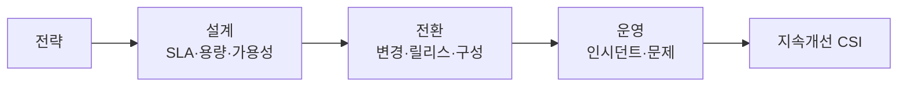

# IT 서비스 관리체계(ITSM)와 ISO/IEC 20000

## 1. 개요

### 가. 정의
> IT를 **비즈니스에 정렬된 서비스 관점**에서 계획·제공·개선하는 관리체계. **ISO/IEC 20000**은 그 국제표준(SMS, Service Management System)이며 ITIL을 참조.

### 나. 목적
- **서비스 품질·SLA 준수**, 프로세스 표준화, 지속적 개선(PDCA)

## 2. ISO/IEC 20000 서비스 관리 프로세스

| 영역 | 프로세스(예) |
|---|---|
| **서비스 제공** | SLM, 용량·가용성·연속성, 예산관리 |
| **관계** | 비즈니스 관계·공급자 관리 |
| **해결** | 인시던트·문제 관리 |
| **통제** | 구성·변경·릴리스 관리 |

## 3. 서비스 설계·구축·전환 활동

| 단계 | 활동 |
|---|---|
| **설계(Design)** | SLA 정의, 용량·가용성·연속성 설계, 보안 |
| **구축·전환(Transition)** | 변경·릴리스·배포, 구성관리(CMDB), 검증·테스트 |
| **운영·개선** | 인시던트·문제 처리, CSI(지속 개선) |

## 4. 시사점
- **IT 거버넌스·품질경영**과 연계, 클라우드·DevOps 환경에서도 서비스 관리 기반 제공

---

> **한 줄 요약**: ITSM은 *IT를 서비스 관점으로 관리* 하는 체계이며, ISO/IEC 20000은 설계(SLA·용량)→전환(변경·릴리스·구성)→운영(인시던트·문제)→개선의 프로세스로 서비스 품질을 보장한다.
