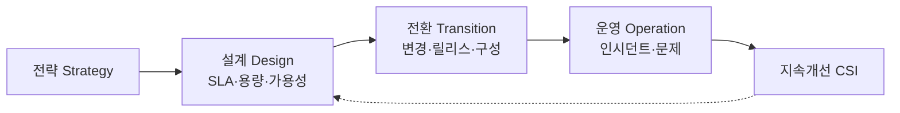

# IT 서비스 관리체계(ITSM)와 ISO/IEC 20000

## 1. 개요

### 가. 정의
> IT를 **비즈니스에 정렬된 서비스 관점**에서 계획·제공·운영·개선하는 관리체계. **ISO/IEC 20000**은 그 국제표준(SMS, Service Management System)이며, **ITIL**을 대표적 참조 프레임워크(모범사례 집합)로 활용한다.

전통적 IT 운영은 서버·네트워크 같은 "기술 자산"을 잘 굴리는 데 초점을 두었다. 그러나 사용자에게 중요한 것은 장비가 아니라 "**필요할 때 안정적으로 쓸 수 있는 서비스**"다. ITSM은 이 인식 전환을 담아, IT를 기술 덩어리가 아니라 고객에게 가치를 전달하는 **서비스의 묶음**으로 보고, 그 서비스의 품질을 SLA로 약속·측정·개선하는 프로세스 체계다. ISO/IEC 20000은 여기에 인증 가능한 요구사항(shall)을 부여해 조직이 국제 수준의 관리 역량을 갖췄음을 증명하게 한다.

### 나. 등장 배경 및 필요성
IT가 업무의 중심이 되면서 장애 한 번이 비즈니스 손실로 직결되고, 담당자 개인 역량에 의존하는 주먹구구식 운영으로는 품질을 보장할 수 없게 되었다. 조직은 (1) **일관된 서비스 품질과 SLA 준수**, (2) 사람이 바뀌어도 유지되는 **프로세스 표준화와 반복 가능성**, (3) 감사·규제에 대응하는 **IT 거버넌스**, (4) 비용 대비 효과의 **운영 효율화**를 요구하게 되었고, ITSM은 이를 PDCA(계획-실행-점검-개선) 순환으로 제도화한다. 특히 문제를 사후 대응하는 것을 넘어, 반복 장애의 근본원인을 제거하고 지속 개선하는 **선순환 구조**를 만드는 것이 핵심 가치다.

## 2. ISO/IEC 20000 서비스 관리 프로세스

ISO/IEC 20000의 프로세스는 서비스의 "제공-관계-해결-통제"라는 네 축으로 묶인다. 서비스 제공 프로세스가 SLA·용량·가용성 같은 **약속의 뼈대**를 세우면, 관계 프로세스가 고객·공급자와의 **접점**을 관리하고, 해결 프로세스가 발생한 장애를 **복구·근절**하며, 통제 프로세스가 변경으로 인한 위험을 관리해 이 모든 것을 떠받친다.

| 영역 | 프로세스(예) | 목적 |
|---|---|---|
| **서비스 제공** | SLM, 용량·가용성·연속성, 예산관리, 정보보안 | 서비스 수준 약속·설계 |
| **관계** | 비즈니스 관계·공급자 관리 | 고객·공급자 접점 관리 |
| **해결** | 인시던트·문제 관리 | 장애 복구와 근본원인 제거 |
| **통제** | 구성(CMDB)·변경·릴리스 관리 | 변경 위험 통제·형상 유지 |

## 3. 서비스 설계·구축·전환 활동(가/나/다/라)

서비스는 전략에서 시작해 설계·전환·운영을 거쳐 지속개선으로 되먹임되는 생애주기(ITIL의 서비스 라이프사이클)를 갖는다. 각 단계가 왜 필요한지가 중요하다.

**가. 설계(Design)** 는 서비스를 만들기 전에 "얼마나 빠르게, 얼마나 안 끊기게(SLA), 얼마나 많은 부하를(용량), 재난 시 어떻게 복구할지(연속성)"를 미리 규정한다. 여기서 정한 목표가 이후 모든 단계의 기준선이 된다. **나. 전환(Transition)** 은 설계된 서비스를 운영 환경으로 안전하게 넘기는 단계로, 변경이 예기치 않은 장애를 부르지 않도록 **변경·릴리스 관리**로 통제하고, 모든 구성항목(CI)과 그 관계를 **CMDB**에 기록해 영향도를 파악한다. 예컨대 특정 서버 패치를 계획할 때 CMDB로 그 서버에 의존하는 서비스를 미리 식별하면, 변경 실패 시 파급을 예측·차단할 수 있다. **다. 운영(Operation)** 은 실제 서비스를 돌리며, 서비스를 빨리 되살리는 **인시던트 관리**(증상 대응)와 반복 장애의 뿌리를 없애는 **문제 관리**(원인 제거)를 구분해 수행한다. **라. 지속개선(CSI)** 은 SLA 달성률·처리시간 등을 측정·분석해 프로세스를 PDCA로 다듬는다.

| 단계 | 핵심 활동 |
|---|---|
| **설계(Design)** | SLA 정의, 용량·가용성·연속성 설계, 정보보안 |
| **전환(Transition)** | 변경·릴리스·배포, 구성관리(CMDB), 검증·지식관리 |
| **운영(Operation)** | 인시던트·문제·요청 처리, 이벤트 관리 |
| **지속개선(CSI)** | 측정·분석·개선(PDCA) |

## 4. 관련 개념

서비스 수준 약속은 계층적으로 연결된다. 고객과의 **SLA**를 지키려면 내부 팀 간 **OLA**와 외부 공급자와의 **UC**가 뒷받침되어야 하며, 어느 한 층만 무너져도 SLA가 깨진다. 이 연결을 뒷받침하는 것이 CI 간 관계를 담은 CMDB다.

| 개념 | 설명 |
|---|---|
| **SLA/OLA/UC** | 고객·내부팀·외부공급자 간 서비스 수준 협약(계층 연동) |
| **CMDB** | 구성항목(CI)·관계 관리로 영향도 분석 기반 제공 |
| **ITIL 4** | 서비스 가치 시스템(SVS)·가치 흐름·4대 차원 중심으로 진화 |

## 5. 고려사항 및 시사점
기술사 관점에서 ITSM 도입의 성패는 표준 준수 여부가 아니라 **정착 방식**에 달려 있다. 프로세스 문서만 갖추고 현장 문화·역량·도구가 따르지 않으면 형식적 인증에 그친다. 따라서 ITSM 솔루션(티켓·CMDB 자동화)과 함께 **책임·역할(RACI)** 을 명확히 하는 조직 변화 관리가 병행되어야 한다. 최근에는 변화 속도가 빨라지며 무거운 변경 통제가 병목이 되어, ITSM이 **DevOps·SRE와 융합**하는 추세다. SRE의 **오류예산(Error Budget)** 은 "안정성과 배포 속도"의 트레이드오프를 정량화해 변경 관리를 유연화하고, 자동화가 반복 운영을 대체한다. 결국 ITSM은 COBIT 같은 IT 거버넌스, 품질경영과 연계되어 **비즈니스 가치 중심의 서비스 거버넌스**로 확장되고 있다.

---

> **한 줄 요약**: ITSM은 *IT를 비즈니스 정렬된 서비스 관점으로 관리* 하는 체계이며, ISO/IEC 20000은 설계(SLA·용량)→전환(변경·릴리스·CMDB)→운영(인시던트·문제)→지속개선(CSI)의 프로세스로 품질을 보장하고, 최근 DevOps·SRE와 융합해 진화한다.
