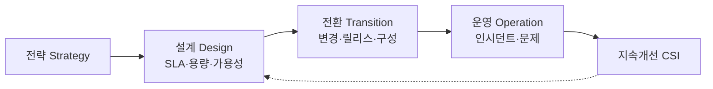

# IT 서비스 관리체계(ITSM)와 ISO/IEC 20000

## 1. 개요

### 가. 정의
> IT를 **비즈니스에 정렬된 서비스 관점**에서 계획·제공·개선하는 관리체계. **ISO/IEC 20000**은 그 국제표준(SMS, Service Management System)이며 **ITIL**을 참조 프레임워크로 사용.

### 나. 필요성
- IT의 **서비스 품질·SLA 준수**, 프로세스 표준화·지속 개선(PDCA)
- IT 거버넌스·감사 대응, 운영 효율화

## 2. ISO/IEC 20000 서비스 관리 프로세스

| 영역 | 프로세스(예) |
|---|---|
| **서비스 제공** | SLM(서비스수준), 용량·가용성·연속성, 예산관리, 정보보안 |
| **관계** | 비즈니스 관계·공급자 관리 |
| **해결** | 인시던트·문제 관리 |
| **통제** | 구성(CMDB)·변경·릴리스 관리 |

## 3. 서비스 설계·구축·전환 활동

| 단계 | 활동 |
|---|---|
| **설계(Design)** | SLA 정의, 용량·가용성·연속성 설계, 정보보안 |
| **구축·전환(Transition)** | 변경·릴리스·배포 관리, **구성관리(CMDB)**, 검증·테스트, 지식관리 |
| **운영(Operation)** | 인시던트·문제·요청 처리, 이벤트 관리 |
| **지속개선(CSI)** | 측정·분석·개선(PDCA) |

## 4. 관련 개념

| 개념 | 설명 |
|---|---|
| **SLA/OLA/UC** | 고객·내부·외부 공급자 간 서비스 수준 협약 |
| **CMDB** | 구성항목(CI)·관계 관리 |
| **ITIL 4** | 가치 흐름·4대 차원·서비스 가치 시스템 |

## 5. 고려사항 및 시사점
- 프로세스 도입만이 아닌 **문화·역량·도구(ITSM 솔루션)** 병행
- 클라우드·DevOps·SRE와 융합(오류예산·자동화)으로 진화
- IT 거버넌스(COBIT)·품질경영과 연계

---

> **한 줄 요약**: ITSM은 *IT를 서비스 관점으로 관리* 하는 체계이며, ISO/IEC 20000은 설계(SLA·용량)→전환(변경·릴리스·구성)→운영(인시던트·문제)→지속개선(CSI)의 프로세스로 서비스 품질을 보장한다.
