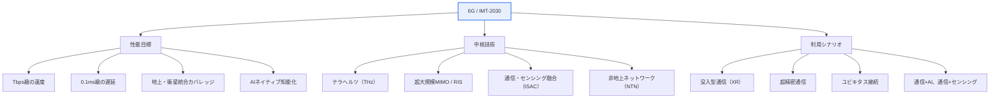
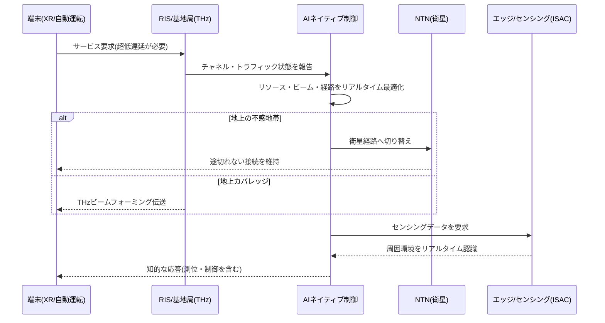

# 6G移動通信

## 1. 概要

### A. 定義
> 6G（6th Generation Mobile Communication）は5Gに続く次世代移動通信であり、**毎秒テラビット（Tbps）級の伝送速度、超低遅延（数十μs）、地上・空中・衛星を包括する統合カバレッジ、そして通信・センシング・演算・知能が一体化したインフラ**を志向する、2030年頃の商用化を目標とする技術である。

6Gの方向性は5Gの単なる延長ではなく、「**物理世界とデジタル世界の完全な融合**」という質的飛躍にある。5Gは超高速（eMBB）・超低遅延（URLLC）・超多数接続（mMTC）を掲げたが、ホログラム通信、リアルタイムのデジタルツイン、完全自動運転（Level 5）、触覚まで伝達する没入型拡張現実（XR）といったサービスを完全に実現するには、帯域幅と遅延がなお不足している。6Gはこの限界を超えるため、はるかに高い周波数である**テラヘルツ（THz）帯**を開拓し、ネットワーク自らがリソースと品質を最適化する**AIネイティブ（AI-Native）**構造を採用する。すなわち、人が画面を見る通信を超えて、物理空間をリアルタイムにデジタルへ複製し制御するインフラを志向するのである。

注目すべき点は、6Gが「速度競争」だけの世代ではないということである。世代ごとに最高速度が約10〜100倍向上してきたのは事実だが、6Gにおけるより本質的な変化は**ネットワークの役割の再定義**である。通信網が単にデータを運ぶパイプから脱し、電波で周囲環境を認識（センシング）し、エッジで演算を行い、AIで自ら判断する「知能型プラットフォーム」へと進化する。ITU-Rはこうした将来像を2023年11月に承認した**IMT-2030フレームワーク勧告（Recommendation ITU-R M.2160）**として公式化し、そこで6Gの6つの利用シナリオと15の能力（capabilities）を提示した。

### B. 登場背景および必要性
6G研究を促した第一の要因は、**データトラフィックの指数関数的な増加**である。グローバルなモバイルトラフィックは毎年30〜40%前後で増加してきており、生成AI・8Kストリーミング・クラウドゲーミング・XRが大衆化すれば、5Gのセル当たり容量では対応が困難になる。トラフィックの量だけでなく「質」も変わる。ホログラムやデジタルツインのように遅延に極めて敏感なトラフィックは、単なる帯域幅の拡大だけでは解決できない。

第二の要因は、**超臨場感・超精密サービスの登場**である。自動運転車両は周辺車両・インフラとミリ秒単位で状態を交換しなければならず、遠隔ロボット手術は触覚フィードバックまでリアルタイムに伝達しなければならず、スマートファクトリーの協働ロボットは数十μsの遅延ゆらぎも許容しない。こうしたサービスは「平均性能」ではなく「保証された最悪性能（bounded worst-case）」を要求するため、決定論的（deterministic）ネットワークが必要となる。

第三の要因は、**カバレッジの地理的限界**である。5Gまでの地上基地局中心の構造では、海洋・砂漠・山岳・空中など地球表面の相当部分がいまだに不感地帯として残る。スターリンク（Starlink）に代表される低軌道衛星（LEO）インターネットの急成長は、「地上網と衛星網の境界を取り払う」非地上ネットワーク（NTN, Non-Terrestrial Network）の実現可能性を示し、6Gはこれを標準の中に取り込もうとしている。最後に、**持続可能性（カーボンニュートラル）**への要求がある。ICTの電力消費が社会的課題となる中、6Gは性能だけでなく、ビット当たりのエネルギー消費を飛躍的に低減する**グリーンネットワーク**を設計目標としている。

## 2. 6Gの目標性能と全体構造

6Gが提示する性能目標は、5Gと比べてすべての指標で飛躍的である。伝送速度は最大1Tbps（ユーザー体感で数百Mbps〜Gbps）、遅延は無線区間で0.1ms水準、接続密度は1㎢当たり1,000万台、移動性のサポートは最大時速1,000km（航空機）まで拡張される。ただし、これらの数値は「理論上の上限」であり、実際の商用サービスがすべての指標を同時に満たすわけではない点に留意すべきである。利用シナリオごとに重視される能力は異なる。

上の構造図が示すように、6Gは性能目標、それを支える中核技術、そしてその上で実現される利用シナリオが階層を成している。ITU-R M.2160は利用シナリオを大きく**没入型通信（Immersive Communication）、超高信頼・超低遅延通信、超大規模接続（Massive Communication）、ユビキタス接続（Ubiquitous Connectivity）、AIと通信の融合（Integrated AI and Communication）、センシングと通信の融合（Integrated Sensing and Communication）**の6つに整理した。前の3つは5GのeMBB/URLLC/mMTCを拡張したものであり、後の3つが6Gで新たに追加された軸である。すなわち「ユビキタス（衛星統合）」「AI融合」「センシング融合」が、6Gを従来世代と区別するアイデンティティである。

## 3. 中核要素技術の詳細

### A. テラヘルツ（THz）帯と超大規模MIMO
6GがTbps級の速度を狙う物理的根拠は、**広い周波数帯域幅**である。シャノン容量の式（C = B·log₂(1+SNR)）において容量は帯域幅Bに線形比例するため、数十〜数百GHzの広帯域を確保できる0.1〜10THz帯が有力な候補となる。5GのmmWave（24〜52GHz）より一段高いこの帯域は、理論上100GHz以上の連続帯域を提供でき、超広帯域伝送の土台となる。

しかしTHzは「諸刃の剣」である。周波数が高いほど波長が短くなって直進性が極端に強くなり、大気中の水蒸気・酸素分子による吸収損失が大きくなり、壁や木の葉のような障害物さえ透過できない。その結果、到達距離が数十m程度に短くなり、リンクが容易に途切れる。これを補うのが**超大規模MIMO（Ultra-Massive MIMO）**であり、数百〜数千個の超小型アンテナを集積してエネルギーを特定方向へ狭く集中させるビームフォーミング（beamforming）を行う。波長が短いほどアンテナをより高密度に集積できるという点は、THzの短所を逆手に取る設計ポイントである。

ここに**インテリジェント反射面（RIS, Reconfigurable Intelligent Surface）**が組み合わされる。RISは多数の微細素子からなる平面パネルで、各素子の位相を電子的に制御して入射した電波を所望の方向へ反射・屈折させる。直進性が強く障害物に弱いTHz信号に対し、建物の外壁や室内の壁面に取り付けたRISで「迂回経路」を作り、不感地帯をなくすのである。RISは能動素子なしに電波環境そのものをプログラミングするという点で、「スマート無線環境（Smart Radio Environment）」の中核として注目されている。

### B. AIネイティブネットワーク
5GでもAIは運用自動化（SON）などに部分的に用いられていたが、6GのAIは設計段階からネットワークに組み込まれる**AIネイティブ**である。これは物理層・MAC・リソース管理・セキュリティなど全レイヤーでAIが第一の制御主体になることを意味する。例えば、AIがチャネル状態を予測して変調・符号化をリアルタイムに調整し、トラフィックパターンを学習してリソースを先行割り当てし、異常トラフィックを検知してセキュリティ脅威に対応する。

特に注目されているのが**エアインタフェースのAI化**である。従来、送受信機のチャネル推定・等化・復調は数学的モデルに基づくアルゴリズムで設計されていたが、6Gではこれをエンドツーエンド（end-to-end）で学習されたニューラルネットワークに置き換えようとする研究が活発である。3GPPもRelease 18（5G-Advanced）からAI/MLを標準に反映し始め、チャネル状態情報（CSI）フィードバック・ビーム管理・測位にAIを適用する作業を進めている。この流れは6Gで本格化する見通しである。

AIネイティブのもう一つの軸は、**ネットワークがAIサービスのためのインフラになること（AI as a Service）**である。分散したエッジリソースを活用して連合学習（Federated Learning）や分散推論を行い、ネットワーク全体を一つの巨大なAI演算・データプラットフォームとして活用する。すなわち「AIでネットワークを運用」すると同時に「ネットワークでAIをサービス」するという双方向の融合が、6G AIネイティブの完成形である。

### C. 非地上ネットワーク（NTN）と通信・センシング融合（ISAC）
**非地上ネットワーク（NTN）**は、低軌道（LEO）・中軌道（MEO）・静止軌道（GEO）衛星と高高度プラットフォーム（HAPS）を地上の移動通信網と一つの体系に統合する。3GPPはRelease 17からNTNの標準化を開始し、2022年以降、スマートフォンの衛星直接通信（D2D, Direct-to-Device）が商用化段階に入った。6Gでは単なる緊急メッセージを超えて広帯域データまで衛星でやり取りする完全統合を目標とし、ユーザーが地上網・衛星網を意識することなく、どこでも途切れなく接続される「ユビキタスカバレッジ」を実現する。

**通信・センシング融合（ISAC, Integrated Sensing and Communication）**は、6Gの最も革新的な概念の一つである。通信に用いる無線信号をレーダーのように活用して周囲の物体の距離・速度・形状を検知するもので、別途のセンサーなしに基地局が通信とセンシングを同時に行う。THzの短い波長はmm単位の超精密測位とイメージングを可能にし、自動運転車両の死角検知、屋内の人物検知、ジェスチャー認識、環境マッピングなどに活用できる。通信インフラがそのままセンシングインフラとなるため、追加投資なしに「物理世界のリアルタイムなデジタル化」が可能になる。

さらに**超低消費電力・グリーンネットワーク**が持続可能性を支える。THz帯と超大規模アンテナは膨大な電力を消費しかねないため、AIベースの省エネルギー、セルのオン/オフ（cell sleeping）、低消費電力半導体設計が不可欠である。6Gは「性能向上」と「ビット当たりのエネルギー削減」を同時に達成しなければならない課題を抱えている。

## 4. 世代別の進化と5Gとの深掘り比較

世代別の比較を単なるスペックの羅列として見ると本質を見落とす。各世代が何を「新たな軸」として追加したかを見ることが重要である。3Gがデータ（パケット）、4Gがモバイルブロードバンド（オールIP）、5Gが産業用の低遅延・超多数接続を追加したとすれば、**6Gは衛星統合・AI・センシングを追加**する。以下の処理フローは、6Gにおいて一つのサービス要求がどのように知的に処理されるかを示している。

| 区分 | 4G(LTE) | 5G | 6G(目標/IMT-2030) |
|---|---|---|---|
| **最高速度** | 1Gbps | 20Gbps | 1Tbps級 |
| **体感遅延** | 10ms | 1ms | 0.1ms水準 |
| **周波数** | 〜6GHz | mmWave(〜52GHz) | THz(0.1〜10THz) |
| **カバレッジ** | 地上 | 地上中心 | 地上・空中・衛星統合 |
| **知能化** | なし | 部分的(SON) | AIネイティブ(全レイヤー) |
| **センシング** | なし | 実験的 | 通信・センシング融合(ISAC) |
| **代表サービス** | モバイル動画 | スマートファクトリー・V2X | ホログラム・デジタルツイン・完全自動運転 |

この比較で差が生じる根本的な理由は、「要求されるサービスが物理世界により密着するため」である。4Gまでは人が画面で消費するコンテンツが中心であったため、遅延に比較的寛容であった。5Gから機械・産業がユーザーとなり、遅延・信頼性が決定的な指標となった。6Gではそこに「リアルタイムな物理空間の認識・制御」が加わり、センシング・AI・衛星が必須となる。実務的な含意は明確である。6G投資は通信機器だけでなく、AI演算インフラ・衛星・半導体までを包括する融合投資となり、通信事業者のビジネスモデルも「接続の販売」から「知能・センシング・プラットフォームサービス」へと転換する。

## 5. 深掘り：最新の標準化動向と産業事例

6Gはまだ商用化前であるが、標準化ロードマップは具体化しつつある。**ITU-R**は2023年11月にIMT-2030フレームワーク（M.2160）を承認して6Gのビジョンと能力を確定し、2027年頃の技術性能要件（TPR）確定を経て、2030年前後に標準を完成させる計画である。**3GPP**は5G-Advanced（Release 18〜20）でAI/ML・NTN・ISACの基盤技術を固めており、6G仕様は通常**Release 21から**本格化すると見込まれている。3GPPは2025年前後に6Gのスタディを開始し、最初の6G仕様を2028〜2029年頃に完成させる日程を議論している。

産業界の準備も活発である。韓国ではサムスン電子が2020年に「6G白書」を発刊してTHz・AIのビジョンを示し、SKテレコム・KT・LGユープラスとETRIがTHz素子・NTN・AIネイティブの研究を進めている。欧州は**Hexa-XおよびHexa-X-II**プロジェクトで6Gのアーキテクチャとユースケースを定義しており、米国はNextG Alliance（ATIS主管）を通じて6Gのロードマップと技術的リーダーシップを推進している。ノキア・エリクソンはRIS・ISACの実証を、中国は衛星・地上統合の試験網をそれぞれ前面に打ち出している。

注目すべき事例として、すでに商用化された**衛星D2D**は6G NTNの前哨戦という性格を持つ。スマートフォンが別途のアンテナなしに衛星と直接テキスト・低速データをやり取りするサービスが2022年以降拡大しており、これは6Gが志向する地上・衛星の完全統合の現実的な出発点である。また「**メタバース・デジタルツイン製造**」分野では、工場全体をリアルタイム3Dで複製して遠隔制御する実証が進められているが、これは6Gの超低遅延・ISACが成熟して初めて完全となる代表的な応用である。

## 6. 考慮事項および示唆（技術士の観点）

1. **THz電波特性の克服が最大の技術課題であり、これは単一技術ではなく組み合わせで解決しなければならない。** 到達距離・直進性・吸収損失の問題を超大規模MIMO・RIS・セルの超高密度化で補う必要があり、これは基地局密度の増加に伴うCAPEX上昇・バックホール負担という経済性の問題に直結する。したがって、THzはホットスポット・屋内など局所領域に優先適用し、広域カバレッジはsub-7GHz・NTNが担う**周波数階層化戦略**が現実的である。

2. **標準・周波数の先取りが産業競争力を左右する。** 6Gは標準必須特許（SEP）競争であると同時に国家の技術主権の問題であり、ITU・3GPPでの主導権確保とTHz帯の国際分配（WRC）が鍵となる。我々の観点では、素材・部品・素子（THz半導体、RIS素材）の源泉技術の確保が標準採用に直結するため、標準化活動とR&Dを連携させた国家的対応が求められる。

3. **セキュリティ・プライバシーの脅威が質的に拡大する。** 超多数接続により攻撃対象領域が広がり、ISACは通信網が人や環境を常時検知するため、プライバシー侵害のおそれが大きい。量子コンピュータの商用化に備えた**耐量子暗号（PQC）**の適用とAIベースのリアルタイム脅威検知、そしてセンシングデータに対する個人情報保護ガバナンスが、設計段階から内在化（security/privacy by design）されなければならない。

4. **エネルギー効率と持続可能性が商用化の前提条件である。** THz・超大規模アンテナ・AI演算は電力消費を増大させるため、ビット当たりのエネルギーを飛躍的に低減できなければカーボンニュートラル政策と衝突する。AIベースのエネルギー最適化・低消費電力半導体・セルスリーピングを組み合わせたグリーン6G設計が不可欠である。

5. **投資・ビジネスモデル転換に対する戦略的判断が必要である。** 6Gは通信・AI・衛星・半導体が融合した大規模投資であるため、5G投資の回収が終わっていない通信事業者にとっては時期・範囲の選択が重要である。「接続の販売」を超えて、センシング・AI・デジタルツインなど付加価値プラットフォームへ収益源を拡張する方向でビジネスモデルを再設計することが、トレードオフの核心である。

## 参考資料
- ITU-R, "Framework and overall objectives of the future development of IMT for 2030 and beyond (Recommendation ITU-R M.2160)": https://www.itu.int/rec/R-REC-M.2160/en
- 3GPP, "Releases"（5G-Advanced/6Gロードマップ）: https://www.3gpp.org/specifications-technologies/releases
- Samsung, "6G: The Next Hyper-Connected Experience for All": https://www.samsung.com/global/business/networks/insights/6g/
- Hexa-X (EU 6G Flagship): https://hexa-x.eu/

---

> **一言まとめ**: 6Gは*Tbps超高速・0.1ms級超低遅延・地上衛星統合（NTN）・AIネイティブ・通信センシング融合（ISAC）*を志向する次世代移動通信（ITU-R IMT-2030）であり、THz帯と超大規模MIMO・RISによってホログラム・デジタルツインなどの超臨場感サービスを実現するが、THz電波の限界克服・標準の先取り・セキュリティ/プライバシー・エネルギー効率が商用化の中核課題である。
