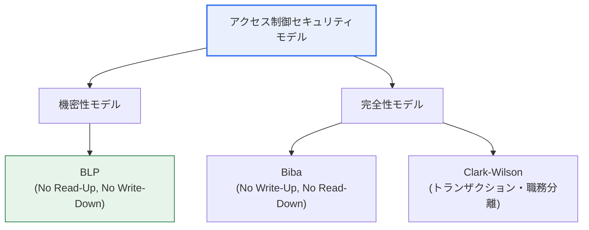
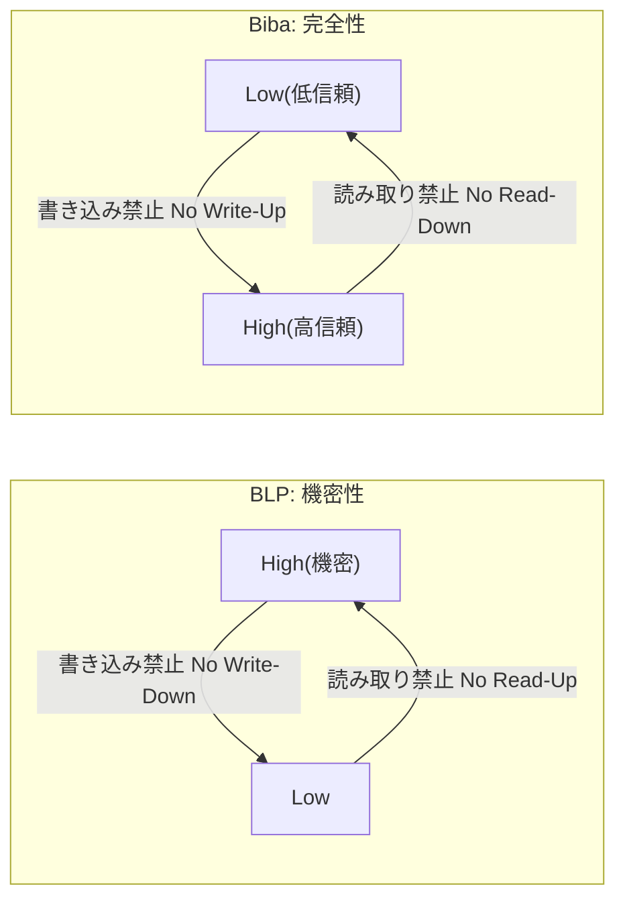

# アクセス制御セキュリティモデル — BLP · Biba · Clark-Wilson

## 1. 概要

### A. 定義
> **アクセス制御セキュリティモデル（Access Control Security Model）**は、主体（Subject、ユーザー・プロセス）が客体（Object、ファイル・資源）にアクセスする際に守るべき規則を数学的・形式的に定義したものであり、何を保護するかによって**機密性（BLP）**モデルと**完全性（Biba・Clark-Wilson）**モデルに分けられる。

この三つのモデルをまとめて理解する鍵は、「**各モデルが異なるセキュリティ目標を正反対の規則で達成する**」という点にある。機密性を守ろうとするBLPは「秘密情報が低いレベルへ漏れ出さないように」防ぎ、完全性を守ろうとするBibaは「信頼できないデータが重要な資源を汚染しないように」防ぐ。興味深いことに、二つのモデルの規則は方向が正確に対称を成す。機密性モデルは「上へ書き、下を読む（Write-Up, Read-Down）」、完全性モデルは「下を読めず、上へ書けない（No Read-Down, No Write-Up）」。目標が逆であるため、規則も逆になるのである。

Clark-Wilsonはここからさらに一歩進む。BLP・Bibaが軍事的なセキュリティ「レベル（Label）」を前提としたのに対し、Clark-Wilsonはレベルという概念になじみのない商業環境において、**整形式トランザクション（Well-formed Transaction）**と**職務分離（Separation of Duty）**によって完全性を達成する。整理すると、三つのモデルは「何を守ろうとするか（機密性 vs 完全性）」と「どのような環境か（軍事 vs 商業）」という二つの軸で区別される。

### B. 登場背景および必要性
1970年代、米国防総省は複数のレベルの機密を一つのシステムで扱う多重レベルセキュリティ（MLS）環境において、人の判断ではなく**システムが強制する規則**によって情報漏えいを防ぐ必要があった。この要求がBLPという最初の形式的セキュリティモデルを生んだ。しかしBLPは機密性のみを扱い、データが不適切に「改ざん」されることは防げなかった。この空白を埋めるために完全性に焦点を当てたBibaが、そしてレベル体系のない企業の会計・取引環境のためのClark-Wilsonが順に提案された。すなわち、三つのモデルは互いに競合関係にあるのではなく、現実の異なるセキュリティ要求を順次補完してきた系譜として理解すべきである。

これらの古典モデルは、今日そのまま実装されるよりも、RBAC・ABAC・ゼロトラストといった現代のアクセス制御の**設計原理**として継承されているという点で、依然として重要である。最小権限・職務分離・強制的規則という概念の根源はここにある。

## 2. BLP（Bell-LaPadula）モデル — 機密性

> 米国防総省の軍事機密保護のために提案された代表的な**機密性（Confidentiality）モデル**であり、情報が高いレベルから低いレベルへ漏えいすることを強制的に遮断する。一般に「**Write-Up, Read-Down（上へ書き、下を読む）**」と要約される。

BLPの二つの中核規則は、いずれも「機密情報の下方漏えいの遮断」という単一の目標を実現する。第一の規則である**単純セキュリティ特性（ss-property, No Read-Up）**は、主体が自身の認可レベルより高い客体を読めないようにする。秘（Secret）レベルのユーザーが極秘（Top Secret）文書を閲覧できないようにするもので、直感的で自然な規則である。

第二の規則である**スター特性（\*-property, No Write-Down）**は、むしろ直感に反するように見えるが、BLPの核心である。高いレベルの主体が低いレベルの客体に書き込めないようにする。なぜなら、極秘を知るユーザーがその内容を過失であれ悪意であれ公開（Unclassified）文書に書き写せば、レベルの低い者も機密を見ることになり、漏えいが発生するからである。特に、トロイの木馬がユーザー権限を悪用して機密を低いレベルへ流す攻撃を、この規則が根本から遮断する。

BLPには、規則の安定性を保証する**平静原則（Tranquility Principle）**という前提がある。強い平静性はシステム運用中に主体・客体のセキュリティレベルがまったく変化しないことを、弱い平静性はセキュリティポリシーに違反する方向にはレベルが変化しないことを意味する。もしレベルが任意に変更できるならNo Write-Down規則を迂回できるため、この原則はモデルの整合性を支える隠れた柱である。限界も明確である。BLPは機密性のみを保証し、データの改ざんは統制できない。むしろ低いレベルのユーザーが高いレベルの客体に書き込むこと（Write-Up）は許可するため、完全性の観点からは危険になり得る。

| 規則 | 正式名称 | 内容 |
|---|---|---|
| **No Read-Up** | 単純セキュリティ特性（ss） | 自分より高いレベルの情報を読むことができない |
| **No Write-Down** | スター特性（\*） | 自分より低いレベルに書き込むことができない（機密の下方漏えい防止） |
| **任意規則** | ds-特性 | アクセス制御行列（DAC）で詳細な権限を追加統制 |

## 3. Bibaモデル — 完全性

> データの**完全性（Integrity）保護**のためのモデルであり、信頼度の低い情報が完全性の高い資源を汚染することを防ぐ。BLPと規則の方向が正確に正反対であるため、「**No Read-Down, No Write-Up**」と要約される。

Bibaが扱うのは「機密」ではなく「汚染」である。例えば、検証されていない外部入力や信頼度の低いプロセスが、システムの中核設定ファイルや会計元帳のような高完全性の資源をむやみに変更すれば、データの正確性と信頼性が崩れる。Bibaはこれを二つの規則で遮断する。

**完全性スター特性（No Write-Up）**は、主体が自分より高い完全性レベルの客体に書き込めないようにする。信頼度の低い主体が重要なデータを変更して汚染することを防ぐ規則であり、BLPのNo Write-Downとは方向が逆である。**単純完全性特性（No Read-Down）**は、主体が自分より低い完全性レベルの客体を読めないようにする。信頼度の高いプロセスが汚染された（信頼度の低い）データを読み込んで自ら汚染されることを防ぐためである。

BLPとBibaを一つのシステムに同時に完全適用すると、規則が互いに衝突してアクセスが過度に制限されるという点が実務的な含意である。機密性の観点では下を読まなければならず（Read-Down）、完全性の観点では下を読んではならない（No Read-Down）からである。したがって現実のシステムは、保護の優先順位に応じて一方を主に採用するか、レベル体系を分離して折衷する。また、Bibaは完全性のみを扱うため、機密性には別途の統制が必要である。

| 規則 | 内容 | BLPとの対比 |
|---|---|---|
| **No Write-Up** | 高い完全性レベルに書き込めない（汚染防止） | BLPはNo Write-Down |
| **No Read-Down** | 低い完全性レベルを読めない | BLPはRead-Downを許可 |

## 4. Clark-Wilsonモデル — 商業的完全性

> 銀行・会計といった商業環境の完全性のためのモデルであり、軍事的なレベルの代わりに**整形式トランザクションと職務分離**を通じて、データが正当な手続きによってのみ変更されることを保証する。

Clark-Wilsonの出発点は、「企業環境における完全性とは何か」という問いである。銀行で重要なのは「誰がどれだけ秘密を知っているか」ではなく、「取引が正確かつ一貫して、認可された手続きによってのみ処理されるか」である。このため本モデルは、保護対象データを**CDI（Constrained Data Item、制約付きデータ項目）**として定義し、ユーザーがデータに直接触れられないようにしたうえで、認証されたプログラムである**TP（Transformation Procedure、変換手続き）**を通じてのみ変更するよう強制する。

**整形式トランザクション**とは、このTPの概念を指す。ユーザーが口座残高を任意に修正するのではなく、「入金」「出金」という検証済みのプログラムを経由させることで、データが常に一貫した状態から一貫した状態へのみ遷移するようにする。**完全性検証手続き（IVP, Integrity Verification Procedure）**は、CDIが有効な状態にあるかを定期的に確認し、例えば借方・貸方の合計が一致するかといった一貫性を検証する。

**職務分離（Separation of Duty）**は、不正を防ぐ組織的統制である。一人が取引の申請・承認・記録の全過程を単独で行うと横領・改ざんが容易になるため、これを複数のロールに分割する。例えば代金支払いにおいて支出申請者と承認者を分離すれば、不正を働くには最低二人の共謀が必要となり、統制の強度が大きく高まる。こうした商業的完全性の原理は、今日ではSOX（サーベンス・オクスリー）法などの会計内部統制要件に直結しており、ERP・会計システム設計の基本原則として定着している。

| 要素 | 内容 |
|---|---|
| **CDI/UDI** | 保護対象データ（CDI）と非制約データ（UDI）を区分 |
| **整形式トランザクション（TP）** | 認可された手続き（プログラム）によってのみCDIを変更 |
| **職務分離（SoD）** | 申請・承認・記録を分離して単独不正を防止 |
| **完全性検証（IVP）** | CDIの一貫性・有効性を定期的に検証 |

## 5. 比較および示唆

三つのモデルを一覧で比較すると、保護目標（機密性/完全性）と適用環境（軍事/商業）という二つの基準で明確に分かれる。以下の構造図はこの分類を可視化したものである。

以下のプロセス観点の図は、三つのモデルがそれぞれ「読み取り/書き込み」をどの方向に許可・遮断するかを対比して示している。規則の方向性が目標から必然的に導かれることが確認できる。

| モデル | 保護目標 | 環境 | 中核規則 |
|---|---|---|---|
| **BLP** | 機密性 | 軍事・情報機関 | No Read-Up, No Write-Down |
| **Biba** | 完全性 | 信頼度の統制が必要なシステム | No Write-Up, No Read-Down |
| **Clark-Wilson** | 商業的完全性 | 金融・会計 | トランザクション・職務分離・完全性検証 |

差が生じる根本的な理由は、「漏えい」と「汚染」という脅威の方向が正反対だからである。機密は上から下へ漏れ出すため下方への書き込みを防ぎ、汚染は下から上へ染み込むため上方への書き込みを防ぐ。この対称性を理解すれば、規則を暗記しなくても再構成できる。

具体的な事例で三つのモデルの使い方を対比してみよう。第一に、軍の指揮統制システムで極秘の作戦計画を扱う将校が一般レベルの掲示板に要約を掲載しようとすると、BLPのNo Write-Downがこれを遮断する。第二に、サーバー運用環境において信頼度の低いユーザーがアップロードしたスクリプトがシステムの中核設定ファイルを変更しようとすると、BibaのNo Write-Upが汚染を防ぐ。第三に、銀行の勘定系で一人の職員が自分の口座への振替を申請し、自ら承認しようとすると、Clark-Wilsonの職務分離がこれを許さず、別の承認者を強制する。三つの事例はいずれも「人の善意」ではなく「システムが強制する規則」によって事故を予防するという共通点があり、これが形式的セキュリティモデルの本質的な価値である。

一つ留意すべき点は、これらのモデルが現実には純粋な形で実装されるよりも、互いに補完的に組み合わされるということである。例えば多重レベルのオペレーティングシステム（SELinuxなど）は、BLP・Bibaの強制的規則をカーネルレベルで実装しつつ、実運用の利便性のためにロール・タイプベースのポリシー（RBAC/TE）を併用する。したがって技術士の観点では、個々のモデルの規則を暗記するにとどまらず、目標・環境に応じてこれらをどのように組み合わせ・折衷するかを設計する眼識が求められる。

## 6. 考慮事項および示唆（技術士の観点）

1. **保護目標に合ったモデル選択が最優先である。** 軍事・情報機関のように機密性が最優先であればBLPを、金融・製造・会計のようにデータの正確性が最優先であればBiba・Clark-Wilsonを基盤として設計すべきである。システムの中核資産が「秘密」なのか「正確性」なのかを先に規定することが出発点である。
2. **機密性と完全性の規則の相反を折衷しなければならない。** BLPとBibaはRead/Writeの方向が逆であるため、同時に完全適用すると可用性が著しく低下する。実務では優先度の高い目標を主モデルとし、レベル体系を分離するか例外を最小化する方式で組み合わせる。
3. **強制的統制（MAC）の限界と運用負担を考慮する。** これらのモデルは強力だが、レベルの付与・維持コストが大きく柔軟性が低い。そのため今日では純粋な実装よりも、RBACでロールベースの管理の利便性を加え、ABACで状況（属性）ベースのきめ細かな統制を組み合わせるハイブリッドが一般的である。
4. **現代アーキテクチャへの継承を認識する。** 最小権限・職務分離・強制規則という古典的原理は、ゼロトラスト（決して信頼せず常に検証する）と最小権限アクセス、クラウドIAMのポリシーベース統制へと直接つながっている。古典モデルは現代の統制の「設計言語」であるため、原理の理解が実務設計能力に直結する。
5. **規制遵守（Compliance）との連携を設計に反映する。** Clark-Wilsonの職務分離・完全性検証の原理はSOX・電子金融監督規定などの内部統制要件に直結するため、アクセス制御の設計時には監査証跡・エビデンスの確保まで併せて考慮してこそ実効性がある。

## 参考資料
- Bell–LaPadula model (Wikipedia): https://en.wikipedia.org/wiki/Bell%E2%80%93LaPadula_model
- Formal Security Models Explained: Bell-LaPadula, Biba, Clark-Wilson: https://inventivehq.com/blog/formal-security-models-bell-lapadula-biba-clark-wilson

---

> **一言まとめ**: アクセス制御モデルは*BLP（機密性: No Read-Up・No Write-Down）・Biba（完全性: No Write-Up・No Read-Down）・Clark-Wilson（商業的完全性: トランザクション・職務分離）*に分けられ、「漏えいは下方、汚染は上方」という脅威方向の対称性から規則が導かれ、保護目標・環境に合わせて選択・組み合わせることでRBAC・ABAC・ゼロトラストへと継承・拡張されている。
