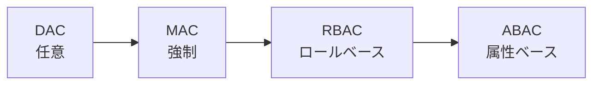

# アクセス制御（Access Control）

## 1. 概要

### A. 定義
> 認証された**主体（Subject）**が**客体（Object）**に対して**許可された権限（Right）の範囲内でのみアクセス**するよう統制する情報セキュリティのメカニズム。

情報セキュリティは大きく、データそのものを判読できなくする**暗号化**と、データに近づく行為を防ぐ**アクセス制御**に分けられる。暗号化が「盗まれても読めない」ようにする防御だとすれば、アクセス制御は「そもそも手を触れさせない」防御である。二つの防御線は相互補完的であり、アクセス制御はシステムの資源（ファイル・DB・機能）へのアクセスをポリシーに従って許可・拒否することで、**機密性・完全性・可用性**をともに支えるセキュリティの基本骨格である。

### B. 3大要素と必要性
アクセス制御は一般にAAAと要約される三段階で動作する。まず「あなたは誰か」を確認する**識別・認証（Authentication）**、次に「何をしてよいか」を判定する**認可（Authorization）**、最後に「何をしたか」を記録する**責任追跡性（Accounting）**である。この三段階が順序どおりに噛み合わなければならない点が重要である。認証のない認可はなりすましを招き、認可のない認証は統制を失い、監査のないアクセスは事故発生時に責任を問えない。内部者脅威・アカウント乗っ取りがセキュリティ事故の大きな比重を占める現実において、「誰が何にアクセスできるか」を規律するアクセス制御は、事実上すべてのシステムセキュリティの出発点となる。

## 2. アクセス制御ポリシー（Policy）

ポリシーは「権限を誰が、どのような基準で付与するか」によって分類される。DACからABACへ進むほど、統制の主体が個人からシステムへ、判断基準が静的な身元から動的な状況へと移り、**セキュリティ強度と柔軟性がともに高まる代わりに、ポリシーの複雑さも増大**する。

**DAC**は客体の所有者が自らの裁量で権限を分け与える方式（UNIXのファイル権限が代表例）で柔軟だが、権限を受け取ったプログラムが密かに情報を流出させる**トロイの木馬に脆弱**である。**MAC**は所有者の意思とは無関係にシステムがセキュリティレベル・ラベルを比較して強制するため（軍・機密システムのBLPモデル）非常に強力だが、柔軟性は低い。**RBAC**は権限を個人ではなく**ロール（Role）**に付与し、ユーザーにロールを割り当てる方式であり、人事異動の際にはロールを変更するだけで済むため大規模組織の管理効率が高く、企業の標準となった。**ABAC**は主体・客体・環境の**属性と状況**（部署、時刻、接続場所など）を組み合わせてアクセスを動的に決定するため、最もきめ細かい。

| ポリシー | 原理 | 長所・短所 |
|---|---|---|
| **DAC（任意）** | 客体の所有者が権限を付与 | 柔軟 / 統制が弱い、トロイの木馬に脆弱 |
| **MAC（強制）** | セキュリティレベル・ラベルでシステムが強制 | 強固なセキュリティ（軍・機密） / 柔軟性が低い |
| **RBAC（ロールベース）** | ロールに権限を付与、ユーザーにロールを割当て | 管理効率・企業標準 |
| **ABAC（属性ベース）** | 主体・客体・環境の属性で動的に決定 | きめ細かく柔軟 / ポリシーが複雑 |

## 3. アクセス制御の手順

アクセス制御が実際に動作する流れは、身元確認から監査まで続く。この流れにおいて決定的な役割を担うのが、すべてのアクセス要求を必ず経由させる**参照モニタ（Reference Monitor）**である。

各段階は次のとおりである。識別・認証では身元を知識（パスワード）・所持（トークン）・生体の要素で検証し、認可ではポリシーに従って権限を判断し、参照モニタが**すべてのアクセスを例外なく仲介・強制**する。参照モニタが備えるべき三条件――迂回不可能（すべてのアクセスが必ず経由する）、改ざん不可能、検証可能（小さく分析可能）――が守られてこそ、統制は信頼される。

| 段階 | 内容 |
|---|---|
| **識別・認証** | 身元の提示・検証（知識・所持・生体） |
| **認可** | アクセスポリシーに従って権限を判断 |
| **仲介・執行** | 参照モニタがすべてのアクセスを強制的に統制 |
| **監査** | アクセス履歴の記録・モニタリング（責任追跡） |

## 4. 実装メカニズム

ポリシーを実際のシステムに組み込む概念的な原型は、主体×客体の権限を埋めた**アクセス制御行列（ACM）**である。しかしこの行列は大部分が空であるため、丸ごと保存すると非効率であり、実務ではこれを列単位で切り出した**ACL**と、行単位で切り出した**Capability**に分けて実装する。ACLは客体の立場から「誰が自分にアクセスできるか」をファイルごとに付与する方式であるため客体中心の管理に便利であり、Capabilityは主体が権限トークンを携帯する方式であるため、主体中心・分散環境に有利である。

| メカニズム | 説明 |
|---|---|
| **アクセス制御行列（ACM）** | 主体×客体の権限表（概念モデル） |
| **ACL** | 客体ごとのアクセス権限リスト（列単位） |
| **Capability List** | 主体ごとの権限トークン（行単位） |
| **セキュリティラベル** | レベル比較により判定（MAC） |
| **参照モニタ** | すべてのアクセスを仲介・強制（TCB）、迂回不可・検証可能 |

## 5. 考慮事項および示唆
技術士の観点から、アクセス制御設計の二大原則は**最小権限（Least Privilege）**と**職務分離（SoD）**である。各主体に業務上必要最小限の権限のみを付与すればアカウント乗っ取り時の被害が減り、申請・承認・実行を別々の人が担当するようにすれば単独での不正が根本から遮断される。近年、境界は根本的に移動している。クラウド・リモートワークの拡大により「内部網は信頼できる」という前提が崩れ、すべてのアクセスを毎回検証する**ゼロトラスト（ZTNA）**へとパラダイムが移行している。この流れは状況（デバイス状態・位置・振る舞い）を反映する**ABACと継続的認証**を要求し、アカウントのライフサイクル全体を管理する**IAM**と、管理者・サーバーアカウントを特別に統制する**PAM（特権アカウント管理）**を組み合わせた、統合アクセスガバナンスへと発展している。

---

> **一言まとめ**: アクセス制御は*識別・認証→認可→参照モニタによる仲介→監査*の手順で主体の客体へのアクセスを統制し、DAC・MAC・RBAC・ABACのポリシーをACL・Capability・参照モニタで実装し、最小権限・職務分離を土台としてゼロトラスト・ABACへと進化している。
