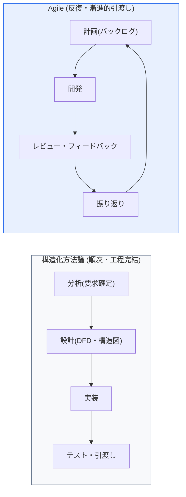
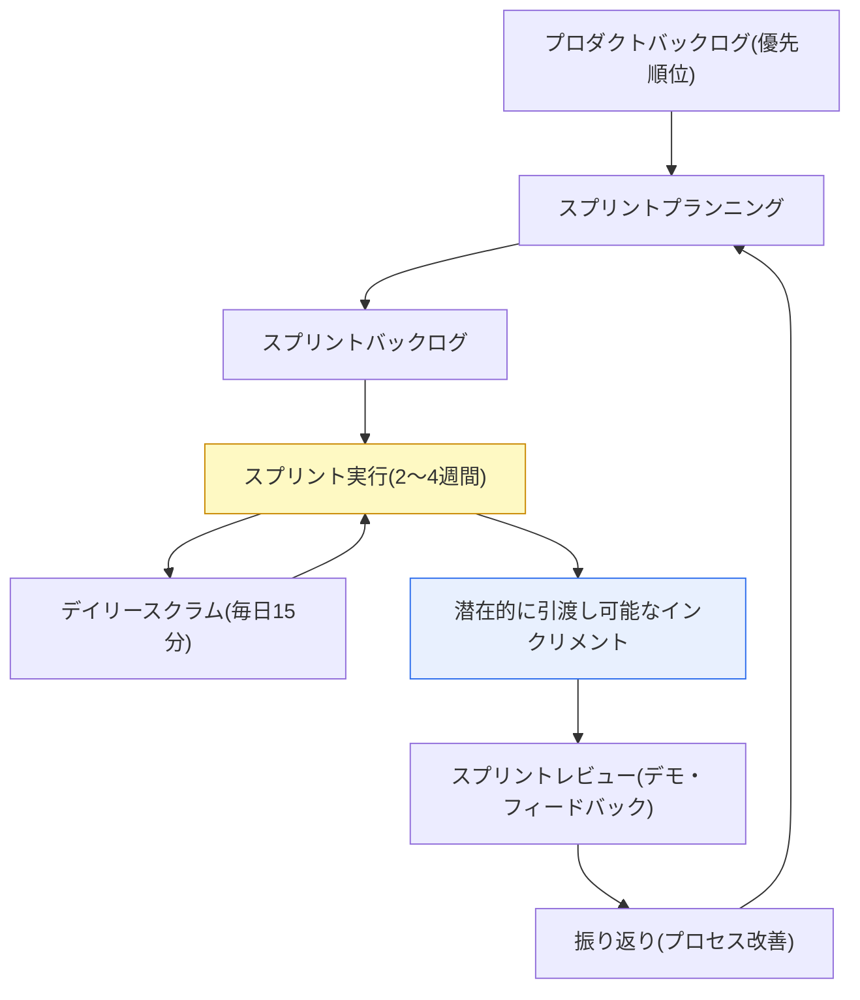

# 構造化方法論とAgile方法論（Scrum・Kanban）

## 1. 概要

### A. 定義

> **構造化方法論（Structured Methodology）**は、システムを機能中心にトップダウンで分割・定義し、分析→設計→実装→テストを順次進める伝統的な開発方法論であり、**Agile方法論**は、短い反復（Iteration）で動作するソフトウェアを漸進的に引き渡し、要求の変化に柔軟に対応する軽量（Lightweight）な方法論である。

二つの方法論の根本的な違いは、「**計画に従うのか、変化に対応するのか**」という開発哲学上の姿勢の違いにある。構造化方法論は前工程で要求を確定し、詳細な文書で成果物を統制することで**予測可能性（Predictability）**を確保しようとする。データフロー図（DFD）・データ辞書（DD）・ミニスペック（Mini-spec）・構造図（Structure Chart）といったツールでシステム機能をトップダウン（Top-down）に分割し、各工程が完結してから次工程へ進むウォーターフォール（Waterfall）のライフサイクルを基本とする。この方式は工程ごとのレビュー・承認（Gate）が明確で監査・追跡が容易であり、要求が安定していて成果物の責任を契約で規定しなければならない公共・金融・国防といった規制産業において、今なお強みを持つ。

一方Agileは、「要求はプロジェクト期間中ずっと変化する」という前提のもと、2〜4週間単位の反復ごとに実際に動作する成果物（Working Software）を引き渡し、顧客のフィードバックで次の方向を調整する。2001年に発表された**Agile Manifesto（アジャイルソフトウェア開発宣言）**は、①プロセスやツールよりも個人と対話、②包括的なドキュメントよりも動くソフトウェア、③契約交渉よりも顧客との協調、④計画に従うことよりも変化への対応に価値を置くという4つの価値と12の原則を示した。すなわちAgileは特定の手順ではなく**価値・原則の集合**であり、これを実践する代表的なフレームワークがScrum（チーム協働・タイムボックス）とKanban（フロー最適化）、そしてXP（技術プラクティス）である。

要求が明確かつ安定しており大規模・高信頼性が必要であれば構造化方法論が、要求が不確実で市場への対応速度が重要であればAgileが有利であるという点が選択の基準となる。実際には、上位の計画・アーキテクチャは構造的に統制し、開発の実行はAgileで反復する**ハイブリッド**形態が、大企業のSI・公共事業で増えている。

### B. 導入背景および必要性

伝統的な方法論は、要求が頻繁に変わる現代のソフトウェア環境において三つの限界を露呈した。第一に、前工程ですべての要求を確定するという仮定が非現実的であり、市場・ビジネスが変われば確定した設計がすぐに陳腐化する。第二に、欠陥が後半のテスト工程でまとめて発見されるため、修正コストが指数関数的に増大する（要求工程で1なら運用工程では100程度）。第三に、中間成果物は多くても「動くもの」はプロジェクト後半にならないと出てこないため、顧客が価値を確認するのが遅れる。

Agileはこうした限界への対応として、**小さく分けて素早く引き渡し、フィードバックで方向を修正する**アプローチを取る。クラウド・DevOps・CI/CDの普及により短周期のビルド・デプロイが技術的に可能になると、「迅速な市場投入（Time-to-Market）と変化への対応」というビジネス要求と結びつき、Agileは事実上ソフトウェア開発の主流として定着した。

## 2. 構造化方法論とAgileの概念比較

上の構造図に見るように、構造化方法論は工程が**一方向に流れて完結**するのに対し、Agileは計画・開発・レビュー・振り返りが**閉じた循環（Loop）**を成す。この構造の違いが、要求変更への対応、成果物の形態、リスク管理方式の違いを生む。

最大の違いは**要求変更に対する姿勢**である。構造化方法論は変更を「統制・最小化の対象」とみなし、変更管理委員会（CCB）と構成管理で厳格に抑制する。変更が前工程の成果物全体を揺るがすからである。Agileは変更を「競争優位の源泉」とみなし、反復の区切りごとにバックログの優先順位を再調整する。ただしこれは、スプリントの「進行中」の無秩序な変更を許容するという意味ではなく、**変更の受け入れ地点を反復の区切りとして定例化**したという意味である。

第二の違いは**リスクが顕在化する時点**である。構造化方法論では統合・負荷の問題のような大きなリスクが後半のテストに集中して現れ（リスクの後行性）、発見が遅く修正コストが大きい。Agileは反復ごとに動作するソフトウェアを作り、統合・性能の問題を早期に露出させるため、リスクを前倒しで管理する。

| 区分 | 構造化方法論 | Agile方法論 |
|---|---|---|
| **進め方** | 順次・工程完結（Waterfall） | 反復・漸進（Iterative・Incremental） |
| **要求変更** | 統制・最小化（CCB） | 反復の区切りで積極的に受容 |
| **中核価値** | 詳細文書・計画・予測可能性 | 動作するSW・顧客協調・変化への対応 |
| **主なツール** | DFD・データ辞書・構造図 | バックログ・スプリント・ボード・バーンダウン |
| **リスク露出** | 後半に集中（後行） | 反復ごとに早期露出 |
| **適合状況** | 要求安定・大規模・規制産業 | 要求不確実・迅速な市場対応 |

## 3. Agile実装フレームワーク：ScrumとKanban

Agileの価値を実際の開発手順として実装した二大代表フレームワークがScrumとKanbanである。どちらも「小さく、頻繁に、透明に」という原則を共有するが、Scrumは**タイムボックスとロール・イベントでリズムを作る**方式であり、Kanbanは**作業の流れそのものを可視化・最適化する**方式であるという点で、アプローチが異なる。

### A. Scrum — タイムボックスベースの反復

Scrumは2〜4週間の固定期間である**スプリント（Sprint）**を単位とし、計画した作業をその期間内に完了（Done）させることを目標とするフレームワークである。中核は3つのロール、5つのイベント、3つの成果物で構成される。ロールは、プロダクトの価値とバックログの優先順位に責任を持つ**プロダクトオーナー（Product Owner）**、プロセスを促進し障害を取り除く**スクラムマスター（Scrum Master）**、自己組織化して実際に作る**開発チーム（Dev Team）**に分かれる。

このロール分離が重要な理由は、「何を作るか（PO）」と「どうすればうまく作れるか（チーム）」、そして「プロセスがうまく回るように（SM）」という責任を分離し、一人に権限が集中することを防ぐからである。特にスクラムマスターは指示者ではなく**サーバントリーダー（Servant Leader）**として、チームが自ら問題を解決できるよう支援するファシリテーターの役割を担う。

イベントは、スプリントのゴールと作業を決める**スプリントプランニング**、毎日15分間で進捗と障害を共有する**デイリースクラム**、成果物を利害関係者にデモしてフィードバックを受ける**スプリントレビュー**、プロセスを改善する**振り返り（Retrospective）**で構成される。成果物は、プロダクトバックログ、スプリントバックログ、そして実際に引き渡し可能な**インクリメント（Increment）**である。進捗状況は、残作業量を可視化した**バーンダウンチャート（Burndown Chart）**で透明に共有する。

### B. Kanban — フロー（Flow）ベースの連続処理

Kanbanは、決まった反復周期を持たず、作業をボード（To Do → In Progress → Done）上のカードとして可視化し、各工程の**同時進行作業数（WIP, Work In Progress）を制限**することでフローを最適化する方式である。WIP制限が中核的な仕組みである理由は、一人が複数の仕事を同時に抱えると、コンテキストスイッチのコストと待ち時間が増え、かえって全体のスループットが低下するからである。WIPを制限するとボトルネック（Bottleneck）工程が目に見えて明らかになり、チームは新しい仕事を始めるよりも「溜まった仕事を終わらせる」ことに集中するようになる。

Kanbanは定型化されたロール・イベントを強制しないため導入時の抵抗が少なく、進行中のプロセスの上にそのまま載せられるという利点がある。そのため、要求が随時入ってくる**運用・保守・技術サポート**業務に特によく適合する。フローの成果は、一つの作業が開始から完了までにかかった時間である**リードタイム（Lead Time）**、単位時間当たりの完了量である**スループット（Throughput）**、そして時間に伴う作業分布を示す**累積フロー図（CFD）**で測定する。

### C. ScrumとKanbanの比較

| 区分 | Scrum | Kanban |
|---|---|---|
| **周期** | 固定スプリント（タイムボックス） | 連続フロー（周期なし） |
| **ロール** | PO・SM・開発チーム（定型） | 別途規定なし（柔軟） |
| **作業調整** | スプリント単位のコミット | WIP制限でフローを調整 |
| **中核指標** | ベロシティ（Velocity）・バーンダウン | リードタイム・スループット・CFD |
| **変更受容** | スプリント中の変更は避ける | いつでも再優先順位付け |
| **適合状況** | 機能開発・明確な反復 | 運用・サポート・連続処理 |

二つのフレームワークは排他的ではない。Scrumのリズム（スプリント・振り返り）にKanbanのフロー管理（WIP制限・ボード）を組み合わせた**Scrumban**が実務で広く使われており、開発はScrumで、運用・バグ対応はKanbanで分けて運営する組織も多い。選択の基準は、「仕事が計画可能なバッチ（Batch）単位で入ってくるのか、流れるように連続的に入ってくるのか」である。

## 4. Agileの効率的な遂行方策と適用事例

Agileを形だけ真似しても、「名ばかりのAgile（Cargo-cult Agile）」にとどまる。実際に成果を上げるには、次のことが併せて進められなければならない。

第一に、**段階的な導入と文化の定着**である。全面的な転換よりもパイロットチームから始めて成功体験を組織に広げ、自律・透明性・振り返りによる継続的改善の文化を併せて醸成しなければならない。Agileは自己組織化チームを前提とするため、指示・統制型の管理文化が残っていると形式だけが残る。

第二に、**DevOps・CI/CDとの結合**である。短い反復による「迅速な価値の引渡し」は、ビルド・テスト・デプロイの自動化に支えられて初めて実際に実現する。自動化されたパイプラインがなければ、反復周期ごとに手動デプロイ・回帰テストの負担が蓄積し、反復がかえってチームを疲弊させる。例えばNetflix・Amazonは自動化されたデプロイパイプラインの上で1日に数千件のデプロイを行っているが、これはAgileの反復がDevOpsと結合して初めてスケールした速度が出ることを示している。

第三に、**大規模スケーリングフレームワークの活用**である。チームが数十に増えるとチーム間の依存関係・整合の問題が生じるため、複数のアジャイルチームを調整する**SAFe（Scaled Agile Framework）**、**LeSS（Large-Scale Scrum）**、**Spotifyモデル（Squad・Tribe・Chapter・Guild）**といったスケーリング体系で折衷する。韓国でも大手金融・通信事業者が次世代システム・デジタルトランスフォーメーション事業にSAFeを導入し、上位計画は整合させつつチームの実行は自律に委ねる方式を採用した事例が増えている。

第四に、**適切な指標で改善を導く**。Scrumはベロシティ（Velocity）・バーンダウンで予測可能性を、Kanbanはリードタイム・スループットでフローを管理するが、指標をチームの統制手段ではなく振り返りの材料としなければならない。ベロシティをチーム間の比較・競争に使うと、見積りの水増しのような逆効果が生じる。

## 5. 深掘り：最新動向と予想出題方向

近年のAgileの議論は、「チーム単位の実践」を超えて組織全体の**ビジネスアジリティ（Business Agility）**へと拡張している。開発チームだけが素早く反復しても、企画・予算・調達が年単位のウォーターフォールであれば全体のリードタイムが延びるため、予算・ガバナンスまでフローに合わせようとする**Beyond Budgeting**、価値の流れ全体を管理する**バリューストリームマネジメント（VSM, Value Stream Management）**が注目されている。また、AIコーディングアシスタント（Copilot系）の普及で反復内の開発速度が上がるにつれ、バックログ管理・受け入れ基準（AC）の定義・自動テストの品質がボトルネックとして浮上している。

技術士の観点から、このテーマは①構造化 vs Agileを「要求の安定性・リスク露出の時点」で比較させる、②ScrumとKanbanを「周期・ロール・指標」の軸で区別させる、③大規模組織におけるAgile展開方策（SAFe・DevOps結合）を論述させる、といった形で出題されやすい。答案は、「方法論は目的ではなく手段であり、プロジェクトの特性（要求の不確実性・規模・規制）に合わせて選択・混合すべきである」というバランスの取れた結論で締めくくるのが有利である。

## 6. 考慮事項および示唆

1. **方法論よりもチームの能力・文化が成否を左右する。** Agileは自律的・協力的なチーム文化なしには、イベントだけが残る形式主義に陥る。組織文化・リーダーシップの変革が方法論の導入と並行しなければならない。
2. **文書の最小化は文書の廃棄ではない。** 追跡性・保守・監査に必要な最小限の文書（アーキテクチャ決定記録、受け入れ基準、リリースノート）は維持すべきであり、特に規制産業ではAgileの中でも必須成果物を定義しなければならない。
3. **ハイブリッドが現実的な解である。** 上位の計画・予算・アーキテクチャは構造的に統制し、開発の実行はAgileで反復する混合が、要求の安定性と変化への対応が共存する大規模な公共・SI事業における実用的な折衷案である。
4. **自動化（DevOps・CI/CD）のないAgileは持続不可能である。** 反復周期が短くなるほど手動テスト・デプロイの負担が蓄積するため、パイプラインの自動化がAgileの前提条件であることを認識し、投資しなければならない。
5. **指標は統制ではなく改善の材料として使う。** ベロシティ・リードタイムをチーム間の比較・評価に使うと、見積りの歪み・バーンアウトを招く。指標はチームが自ら振り返り、ボトルネックを見つけるためのツールでなければならない。

## 参考資料

- Agile Manifesto, https://agilemanifesto.org/
- Scrum Guide (Schwaber·Sutherland), https://scrumguides.org/
- Kanban University, https://kanban.university/
- Scaled Agile Framework (SAFe), https://scaledagileframework.com/

---

> **一言まとめ**: 構造化方法論は*順次・計画中心の予測可能性*を、Agileは*反復・変化対応の柔軟性*を提供し、Agileの実装形態であるScrum（タイムボックス・ロール・イベント）とKanban（WIP制限・フロー最適化）をプロジェクトの特性に合わせて選択・混合するが、チーム文化とDevOps・CI/CDとの結合、指標の正しい活用が成否を左右する。
