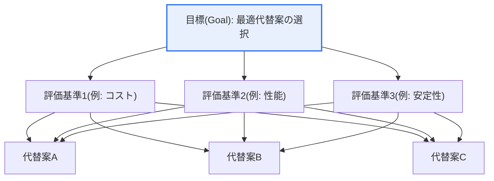
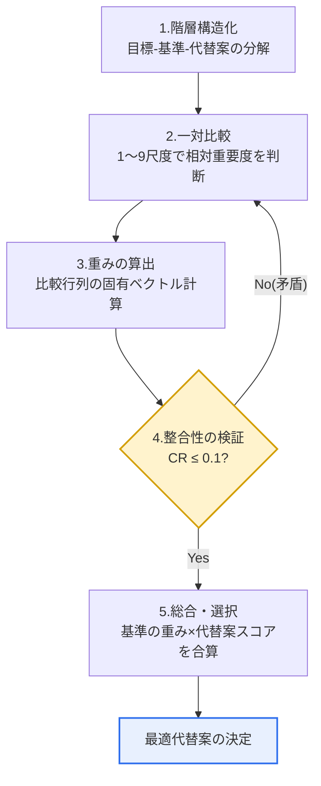

# AHP（Analytic Hierarchy Process、階層分析法）

## 1. 概要

### A. 定義

> Thomas Saatyが1970年代に提案した**多基準意思決定（MCDM, Multi-Criteria Decision Making）手法**であり、複雑な意思決定問題を「目標–評価基準–代替案」の**階層構造（Hierarchy）**に分解し、各階層の要素間の**一対比較（Pairwise Comparison）**を通じて相対的な重みを算出し、最適な代替案を選択する方法論である。

AHPの本質的な強みは、「**定性的・主観的な判断を定量的な優先順位に変換**」することにある。人間の認知は、複数の基準（価格・性能・デザイン・ブランド・維持費など）を一度に比較衡量することが非常に苦手である。心理学の「マジカルナンバー7±2」の研究が示唆するように、人が同時に安定して比較・処理できる項目数には限界があるからである。しかし二つずつ並べて「AはBよりどれだけ重要か」を判断することは、比較的容易かつ一貫して行うことができる。AHPはこの一対比較の結果を行列にまとめ、固有ベクトル（eigenvector）を計算して各要素の重みを導出するため、直感と経験だけに頼っていた意思決定プロセスに、論理と再現可能な客観性を与える。

もう一つの決定的な差別化要素は、判断の論理的一貫性を**整合度比率（CR, Consistency Ratio）**で定量的に検証できることである。例えば「価格は性能より重要で（A>B）、性能はデザインより重要だが（B>C）、デザインは価格より重要である（C>A）」といった循環的矛盾（非推移性）や強度の不一致をCR値で捉える。単純な加重和（weighted sum）やスコアリングモデルが回答者の論理的矛盾をそのまま通過させてしまうのとは異なり、AHPはこの検証段階を内蔵しており、意思決定の信頼性を自ら担保する。

### B. 登場背景および必要性

投資の優先順位決定、サプライヤー・ソリューションの選定、政策代替案の評価、情報化事業の妥当性検討のように、互いに異質な複数の基準を総合しなければならない意思決定は、明示的な根拠なしに行われると、説得力と組織内での受容性が急激に低下する。特に、定量化が難しい要素（ブランドの信頼度、政策の波及効果、ユーザー満足度）と定量的要素（コスト、処理速度）が混在する状況では、担当者の勘に頼った決定が事後に反発や監査での指摘を招く。

AHPはこうした判断プロセスを階層構造で透明に構造化し、どの基準にどれだけの重みを置き、なぜその代替案が選ばれたのかを数値で説明できるようにする。この「説明可能性（traceability）」は利害関係者間の合意を導き、公共事業においては政策決定の正当性を確保する根拠となる。実際に韓国で、予備妥当性調査（予備妥当性審査）の総合評価（AHP）や情報化事業の優先順位算定、調達における交渉による契約の提案書評価などで、AHPまたはその変形が標準的なツールとして活用されてきたのもこのためである。

## 2. 階層構造と構成要素

AHPは問題を、最上位の目標（Goal）、中間の評価基準（Criteria）と下位基準（Sub-criteria）、最下位の代替案（Alternatives）に分け、上から下へ流れる階層としてモデル化する。この構造そのものが、「何のために（目標）、何を基準に（基準）、何の中から選ぶのか（代替案）」を強制的に分離して考えさせ、問題定義の曖昧さを減らす。

最上位階層の**目標**は、意思決定が最終的に達成しようとすることを一文で定義する。「次世代システム構築事業者の選定」のように具体的であるほど、下位基準の導出が明確になる。目標が曖昧だと以降のすべての比較が揺らぐため、目標の操作的定義がAHPの品質の出発点となる。

中間階層の**評価基準**は、目標達成に影響を与える観点を、相互排他的かつ全体を網羅するように（MECEに近く）設定する。基準が多くなると後述する一対比較の回数が急増するため、一般に一つの階層で7個以内にまとめ、必要であれば下位基準に細分するのが実務上の慣行である。例えば「技術性」の下に「アーキテクチャ適合性・拡張性・セキュリティ」を下位基準として置く、といった具合である。

最下位階層の**代替案**は、実際の選択候補である。代替案はすべての基準について評価され、各基準の観点から代替案同士が再び一対比較される。代替案が定量指標（価格など）を持つ場合には、実測値を正規化して一対比較の代わりとすることもある。このように定性・定量の要素を一つの優先順位体系に統合できる柔軟性が、AHPの実務的な魅力である。

## 3. AHPの実施手順

全体の流れは、階層構造化 → 一対比較行列の作成 → 重み（固有ベクトル）の算出 → 整合性の検証 → 総合および最適代替案の選択の5段階で進められ、整合性の検証で不合格となると一対比較へ戻るフィードバックループを持つ。

### A. 階層構造化および一対比較尺度

第一段階で問題を前述の階層に分解した後、各階層内で要素を二つずつ組にして相対的な重要度を判断する。このときSaatyが提案した**1〜9の基本尺度（Fundamental Scale）**を用いる。1は二つの要素が同等に重要であること、3は一方がやや重要であること（weakly more important）、5は強く重要であること（strongly）、7は非常に強く、9は絶対的に重要であること（absolutely）を意味し、2・4・6・8はその中間値である。逆方向の比較は逆数（例：AがBより5ならBはAより1/5）で自動的に埋められる。

この尺度は単に順序だけを付ける順序尺度ではなく、「強度」まで含むという点が核心である。「AはBより重要である」にとどまらず、「5倍ほど強く重要である」を表現するため、その後の固有ベクトル計算で比率尺度（ratio scale）レベルの重みを引き出すことができる。ただし、9を超える極端な差を表現しにくいという尺度の上限が存在し、これは互いに格差の大きい代替案を一まとめで比較する際に歪みを生じ得るため、基準を階層で細かく分けることで緩和する。

### B. 重み（固有ベクトル）の算出

n個の要素に対する一対比較の結果は、n×nの**比較行列A**に整理される。この行列において優先順位ベクトル（重み）は、最大固有値（λmax）に対応する固有ベクトルを正規化して求める。実務では、各列をその合計で割って正規化した後に行ごとの平均を取る近似法（幾何平均法または算術平均法）がよく用いられるが、結果は正式な固有ベクトル法とほぼ一致する。

例えば「コスト・性能・安定性」の三つの基準について、回答者がコストを性能より3倍、安定性をコストより2倍重要と見なした場合、計算結果として安定性≈0.54、コスト≈0.30、性能≈0.16といった重みベクトルが得られる。こうして算出された値は合計が1になるよう正規化されているため、そのまま代替案のスコアと掛け合わせて総合できる。各基準の下で代替案同士も同様の方法で比較し、基準ごとの代替案の重みを求める。

### C. 整合性の検証

算出された判断が論理的に一貫しているかを、**整合度指数（CI, Consistency Index）**と**整合度比率（CR）**で検証する。CIはCI = (λmax − n) / (n − 1)で定義され、完全に一貫した判断ではλmax = nとなり、CI = 0となる。CRはこのCIを、ランダムに埋めた比較行列の平均整合度指数である**ランダム指数（RI, Random Index）**で割った値、すなわちCR = CI / RIである。RIは要素数nに応じて定まる定数で、n=3のとき0.58、n=4のとき0.90、n=5のとき1.12、n=6のとき1.24、n=7のとき1.32などとして知られている。

慣例的に**CR ≤ 0.1（10%）**であれば、判断は許容できる水準で一貫していると見なす。CRが0.1を超える場合は回答に論理的矛盾が大きいというシグナルであるため、どの比較が他の比較と食い違っているかを見直して再回答する。この閾値（0.1）は絶対的な真理ではなく、Saatyの経験則に基づく慣行的な基準であり、対象・分野に応じて緩和・強化して解釈するのが望ましい。重要なのは、CRという仕組みが「判断の品質」を事後に定量的に監査できるようにしてくれるという点である。

### D. 総合および最適代替案の選択

最後に、各基準の重みと、その基準で評価した代替案ごとのスコアを掛け合わせて合算する**加重和による総合**を行う。代替案iの総合スコア = Σ（基準jの重み × 基準jにおける代替案iのスコア）で計算され、総合スコアが最も高い代替案が最終的に選択される。例えば安定性の重みが0.54と支配的であれば、安定性に優れた代替案が他の基準でやや劣っていても総合1位となり得る。この段階で、重みの変化によって順位がどれほど敏感に変わるかを見る**感度分析（Sensitivity Analysis）**を併せて実施すれば、結論の頑健性（robustness）を点検し、利害関係者を説得するうえで大いに役立つ。

## 4. 特徴・長所短所と類似手法の比較

AHPは、定性・定量を一つの優先順位体系に統合し、判断プロセスを体系的に構造化し、整合性を検証でき、階層ごとの比較を通じて利害関係者の合意を導くという強みを持つ。一方、基準・代替案が増えると一対比較の回数がn(n−1)/2で急増して回答疲れと整合性の低下を招き、尺度付けに主観が入り込み、新しい代替案を追加した際に既存の順位が覆る**順位逆転（Rank Reversal）**が発生し得る。

| 区分 | 長所 | 短所 |
|---|---|---|
| **判断の統合** | 定性・定量要素を比率尺度で統合 | 尺度付けに主観が介入 |
| **論理性** | CRで整合性を定量的に検証可能 | CR閾値（0.1）の理論的根拠に論争 |
| **拡張性** | 階層の細分化で複雑な問題に対応 | 要素増加時に比較回数が激増（疲労） |
| **安定性** | 感度分析で頑健性を点検 | 代替案追加時に順位逆転の可能性 |

基準数nに応じた比較回数は、n=4なら6回、n=7なら21回、n=10なら45回と増加する。このため実務では、一つの階層の要素を7個以下に制限し、超える場合は下位階層に分けて各グループの比較回数を管理する。

AHPとよく比較される代表的なMCDM手法として、TOPSISとANPがある。**TOPSIS**は理想解（ideal solution）との距離を計算して順位付けする手法であり、計算が速く代替案が多くても扱いやすいが、基準の重みを別途定める必要があり、整合性の検証機構がない。実務では、AHPで基準の重みを求めTOPSISで代替案を順位付けする**AHP-TOPSIS結合**が広く用いられている。**ANP（Analytic Network Process）**はAHPの階層（上下一方向）という仮定を緩和し、基準間の相互依存とフィードバックをネットワークとして表現する拡張であり、現実の複雑な相互作用を反映できるが、モデリングと計算がはるかに複雑である。

### 実際の適用事例

第一に、**公共の予備妥当性調査**では、経済性（B/C比率）・政策性・地域均衡発展などの異なる評価項目を総合するためにAHPベースの総合評価を活用し、計量化の難しい政策的価値を定量スコアに換算して事業推進の可否を判定する。第二に、**次世代情報システム事業者の選定**において、技術性・事業遂行能力・価格を上位基準とし、下位基準まで階層化したうえで評価委員の一対比較を総合すれば、特定委員の偏りが全体の結果に与える影響を、重みと整合性指標で牽制できる。第三に、**ITソリューション・サプライヤーの選定**において、総所有コスト（TCO）・性能・セキュリティ・保守サポートを基準として複数のベンダーを比較する際、定量指標（価格）と定性指標（サポート品質）を一つのスコア体系にまとめ、意思決定の根拠を文書化する用途で用いられる。

## 5. 深掘り：拡張手法と予想出題方向

純粋なAHPの仮定（基準の独立性、判断の明確性）を補完するための拡張系統が、継続的に研究・適用されている。**ANP**は前述のとおり基準間の相互依存を扱い、**ファジィAHP（Fuzzy AHP）**は、回答者が「3〜5程度」のように不確実かつ曖昧に感じる判断を三角ファジィ数（TFN）などのファジィ集合で表現し、人間の判断の曖昧さをモデルに反映する。また**グループAHP**では、複数の評価者の個別比較値を幾何平均で総合する（AIJ, Aggregation of Individual Judgments）か、個別の優先順位を総合する（AIP）ことで、集団意思決定を支援する。近年は、AHPで定めた重みをTOPSIS・VIKOR・DEMATELなどと組み合わせたハイブリッドモデルが、論文や実務の評価体系で標準のように活用されている。

技術士の観点から、このテーマは「多基準意思決定」または「情報化事業の評価・優先順位算定」の文脈で出題される傾向がある。答案を構成する際は、①定義と階層構造、②5段階の手順（特に一対比較→固有ベクトル→整合性検証）、③CI・CR・RIの数式とCR ≤ 0.1の基準、④順位逆転・比較回数の激増といった限界と、ANP・ファジィAHP・AHP-TOPSIS結合による補完を段階的に展開し、最後に公共の予備妥当性調査や事業者選定といった具体的事例で実務的な含意を付け加えれば、論述の深さを確保できる。

## 6. 考慮事項および示唆

1. **整合度比率（CR）がAHPの信頼性を担保する中核的な仕組みである。** CR ≤ 0.1という基準は判断の品質を事後に監査できるようにし、この検証機能がAHPを単純な加重和・スコアリングモデルと根本的に区別している。ただし0.1という閾値は経験則であるため、対象ドメインの特性に応じて解釈に柔軟性を持たせるべきである。

2. **問題構造化の品質が結果の品質を左右する。** 目標の操作的定義、基準のMECE設計、一階層当たりの要素数の制限（7個以内を推奨）が守られなければ、いかに精緻な計算でも歪んだ結論を生む。すなわちAHPは「計算手法」である前に「問題定義手法」であることに留意すべきである。

3. **順位逆転と比較回数の激増という限界を設計で管理しなければならない。** 代替案の追加時に順位が覆り得るため、絶対測定（rating）モードの活用や感度分析で頑健性を点検し、要素が多い場合は階層を細分化するかTOPSISなどと組み合わせて比較の負担を減らす戦略が必要である。

4. **集団意思決定ツールとしての価値を活かすべきである。** グループAHPは各利害関係者の判断を透明に示して総合することで、決定の正当性と組織の受容性を高める。特に公共事業・調達評価におけるAHPの真の効用は「正解の算出」よりも「合意形成と説明可能性」にあることを認識し、結果の数値を絶対視するよりも、意思決定におけるコミュニケーションの根拠として活用する姿勢が求められる。

## 参考資料

- Saaty, T. L., "Decision making with the analytic hierarchy process", International Journal of Services Sciences, 2008. https://www.rafikulislam.com/uploads/resources/187224511185ad17066bdb.pdf
- Wikipedia, "Analytic hierarchy process". https://en.wikipedia.org/wiki/Analytic_hierarchy_process
- Wikipedia, "Analytic hierarchy process – car example (consistency, RI)". https://en.wikipedia.org/wiki/Analytic_hierarchy_process_%E2%80%93_car_example

---

> **一言まとめ**: AHPは問題を*目標–基準–代替案の階層に分解*し、一対比較（1〜9尺度）の固有ベクトルで重みを算出して最適代替案を選択する多基準意思決定手法であり、CI・CR・RIに基づく整合性検証（CR ≤ 0.1）で判断の論理性を担保し、順位逆転・比較回数激増の限界はANP・ファジィAHP・AHP-TOPSIS結合で補完する。
