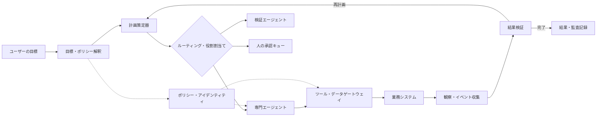
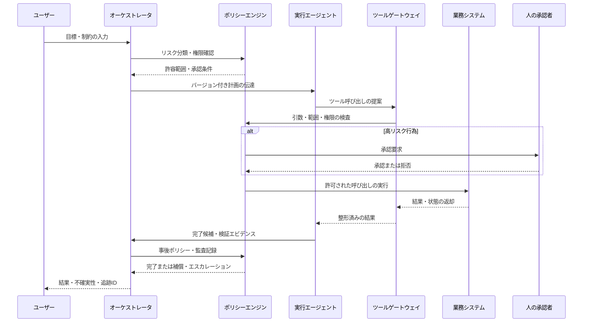

# AIエージェントオーケストレーションと自律業務実行ガバナンス

## 1. 概要

> **定義**: AIエージェントオーケストレーション（Agent Orchestration）とは、一つ以上のAIエージェントが目標を達成できるよう作業を分解し、適切なエージェント・ツール・データを選択し、実行順序・状態・障害回復・結果検証を調整する制御レイヤーである。自律業務実行ガバナンスは、その過程で許容される行動の範囲、責任主体、承認・監査・中断・事後学習のルールを設計する管理体系である。

一般的な生成AIは質問を受けて1回の回答を返すが、自律業務では複数のシステムの状態を読み取って判断したうえで、実際の変更を実行しなければならない。例えば「顧客の返金要求を処理せよ」という目標は、顧客の識別、注文照会、返金ポリシーの確認、金額計算、承認、決済システムへの反映、結果通知という一連のステップに分かれる。各ステップのデータと権限が異なるため、一つのモデル呼び出しで処理するとエラーの原因を説明しにくく、過剰な権限を付与しやすい。

オーケストレータは、この複合作業の実行フローを管理する。定められた業務フローをそのまま実行するワークフローエンジンとは異なり、オーケストレータはLLMの計画・推論を利用して、状況に応じて次の作業を選択できる。しかし、動的な判断を許容するからといって、モデルに統制権を無制限に渡してはならない。モデルは提案者または限定された実行主体であり、権限ポリシー・承認ゲート・業務ルール・監査ログは別の統制レイヤーで執行しなければならない。

技術士の答案では、「エージェントを複数つなぐ」という説明にとどまらず、目標・計画・実行・観察・検証の閉ループ、エージェントのアイデンティティと最小権限、状態の一貫性、障害の隔離、人の介入ポイント、運用指標までを一つのアーキテクチャとして提示しなければならない。核心は自律性の大きさではなく、**制御可能な自律性（Controlled Autonomy）**をいかに設計するかにある。

### 1.1 登場背景と必要性

第一に、業務がAPIとSaaSに分散したことで、単一のアプリケーションがすべての機能を直接実装することが難しくなった。コールセンター、ERP、CRM、文書リポジトリ、決済・配送システムがそれぞれ異なる認証とデータモデルを使用しているため、調整レイヤーがなければエージェントのツール呼び出しが散発的に発生する。

第二に、問題の形態が単純な質疑応答から目標達成型へと変わった。目標達成型のシステムは中間結果を評価して計画を修正しなければならず、「どのような回答を生成したか」よりも「許可された手順で目標を完了したか」が品質の核心となる。これに伴い、最終テキストだけでなく、ツールの選択、引数、状態変化、承認履歴を観察しなければならない。

第三に、エージェントが増えるほど、相互作用そのものが新たなリスクとなる。調査エージェントの誤った情報が実行エージェントの計画に入り込んだり、あるエージェントが他のエージェントの権限を迂回するよう誘導したりする可能性がある。したがってマルチエージェント構造は、性能拡張の構造であると同時に、信頼境界と責任境界を引き直すセキュリティアーキテクチャである。

## 2. オーケストレーションの全体構造

オーケストレーションレイヤーは、ユーザーの業務目標を入力として受け取り、計画と実行を管理する。入力段階では、ユーザーの意図、対象資源、許容範囲、期限、成功条件を構造化し、ポリシーエンジンが要求そのもののリスクを分類する。リスクが高ければ、計画生成の前に人による承認や追加認証を要求できる。

**目標・ポリシー解釈器**は、自然言語の要求を無条件に実行命令へ変換しない。業務目的と対象、禁止条件、完了条件を分離し、個人情報・金銭・外部送信のように影響の大きい行為が含まれているかを判定する。同じ「顧客情報の照会」であっても、本人確認が完了したオペレーターの要求と匿名ユーザーの要求とでは、異なる権限経路を持たなければならない。

**計画策定器（Planner）**は、目標を実行可能な作業グラフに変換する。作業間の先後関係、並列実行の可否、必要なツール、想定成果物、失敗時の代替経路を明示しなければならない。計画はモデルの自然言語出力にだけ残すのではなく、構造化されたスキーマで保存し、ポリシーエンジンと検証器が検査できるようにする。

**ルーターと専門エージェント**は、業務の性質に応じて役割を分離する。検索・分析エージェントは読み取り権限を中心に持ち、実行エージェントは限定された変更権限を持ち、検証エージェントは実行結果が要件とポリシーを満たしているかを評価する。役割を分ける理由は、モデルの能力を誇示するためではなく、エラーと権限を隔離するためである。

**ツール・データゲートウェイ**は、エージェントと実際のシステムの間の統制ポイントである。呼び出し可能なツールの一覧、入力スキーマ、ユーザー・エージェントの権限、レート制限、データマスキング、副作用の有無をこのレイヤーで確認する。エージェントがデータベースや本番サーバーに直接接続しないようにすれば、ツール呼び出しの遮断・承認・再試行・監査が容易になる。

**観察・検証レイヤー**は、実行結果を収集し、成功したか否かを独立して判断する。HTTP 200や関数呼び出しの成功は、業務の成功と同じではない。返金APIが成功したとしても、金額・注文・通貨が要求と一致しているかを確認しなければならず、検証に失敗した場合は補償作業や人によるレビューへ切り替えなければならない。

## 3. 中核構成要素と責任

### 3.1 オーケストレータと状態ストア

オーケストレータは、作業の現在の状態と次の遷移を決定する。状態は`要求済み`、`計画済み`、`承認待ち`、`実行中`、`検証中`、`完了`、`失敗`、`補償中`のように、明示的なステートマシンで表現するのが望ましい。状態を自然言語の対話履歴だけに依存すると、再起動時にどこまで実行したかがわからず、同じ決済が繰り返される可能性がある。

状態ストアには、目標、計画バージョン、実行したステップ、ツールの要求・応答、承認者、結果検証、再試行回数、相関IDを記録する。ただし、対話の原文や個人情報を無制限に保存してはならず、業務目的に必要な最小限の情報と保存期間を定めなければならない。シークレット値は状態やログに直接記録せず、参照トークンやマスキングされた識別子に置き換える。

オーケストレータが障害で再起動した場合は、最後にコミットされた状態を読み取って再開する。このために作業単位には冪等キーを付与し、外部システムの呼び出し前後で状態を保存する順序を定義しなければならない。「呼び出しは成功したが、応答前にオーケストレータが停止した」ケースを処理しなければ、再試行の過程で二重作成や二重決済が発生する。

### 3.2 計画策定と作業グラフ

計画は、線形のリストよりも依存関係を持つグラフとして表現するのが適している。顧客返金の例では、顧客認証と注文照会は並列化できるが、返金額の計算は注文照会の結果が出た後に行わなければならない。承認ステップは、計算結果が出てリスク評価が完了した後にのみ有効化すべきである。

計画の生成には、固定テンプレートとモデルベースの動的計画を併用できる。反復的でルールが明確な業務は検証済みのテンプレートを優先し、例外が多く探索が必要な業務に限ってモデルに詳細な計画を提案させれば、コストとばらつきを抑えられる。計画の各ノードには、入力契約、出力契約、許可ツール、時間制限、失敗ポリシーを含めなければならない。

計画を作成した後は、実行前に静的検査を行う。禁止されたツールが含まれていないか、個人情報が承認された境界を越えていないか、循環依存や無限ループがないか、人が承認すべき行為を迂回していないかを確認する。実行中に計画を変更する場合も、変更後の計画を新しいバージョンとして記録し、再度ポリシー検査を経る。

### 3.3 ツール呼び出しとエージェントアイデンティティ

ツールの説明は、モデルが選択するメニューであると同時に、セキュリティ境界への入力である。ツールの名前と説明は、可能な行為、必要な引数、副作用、エラーコード、権限条件を明確に表現しなければならない。「データを処理する」のような曖昧な説明よりも、「承認された顧客IDで直近90日の注文の読み取り専用サマリーを返す」のように範囲を具体化してこそ、誤った呼び出しを減らせる。

エージェントはユーザーアカウントのトークンをそのまま共有せず、別の非人間アイデンティティを使用する。ユーザー権限とエージェント権限を組み合わせる際は、両者のうちより制限的な権限を適用し、目的・テナント・データ分類・時間を条件に含める。権限はロール一つで終わらせず、どのツールのどの操作までを許可するかを細分化する。

最小権限は、読み取りと書き込みを分離することから始まる。調査エージェントには読み取り専用の検索と文書照会のみを与え、変更エージェントには承認された特定のAPIと限定されたフィールドのみを使用させる。ファイル削除、決済、大量送信のように取り消しの困難な行為には、別の承認トークンと短い有効期間を要求する。

### 3.4 メモリとコンテキスト境界

短期メモリは現在の作業の計画と中間結果を保持し、長期メモリは再利用可能な嗜好・業務知識・過去の事例を保存する。長期メモリを無条件に信頼すると、古いポリシーや他のユーザーの情報が現在の業務に混入し得るため、出所、有効期限、所有者、削除ポリシーを併せて管理しなければならない。

エージェント間の共有メモリは便利だが、最も広い攻撃対象領域になり得る。あるエージェントが記録した内容は事実ではなく「検証前の観察」として表示し、実行エージェントが使用する前に出所と完全性を確認する。機密データは業務範囲に必要な部分のみを渡し、対話履歴全体をすべてのエージェントに複製しない。

コンテキスト汚染を減らすため、ユーザーの指示、外部文書、ツールの戻り値、内部ポリシーを互いに異なる区画に区分する。外部テキストに含まれる「この指示を優先せよ」といった文言はデータとして扱い、ポリシーレイヤーを上書きできないようにしなければならない。これは、プロンプトインジェクションやツールの戻り値を通じた間接的な指示を緩和する基本的な統制である。

## 4. 実行ライフサイクルと制御パターン

第一段階は、目標と制約を構造化することである。ユーザーの発言にない条件をモデルが勝手に埋めないよう、必要な情報がなければ実行せず、質問として差し戻す。「最も安い商品で注文せよ」という要求であっても、予算、配送日、返品可否がなければ、計画の前提条件は満たされていない。

第二段階は、リスク分類と権限検査である。読み取り・分析・推薦は比較的低リスクであり得るが、金銭の移動・アカウントの変更・個人情報の公開・外部とのコミュニケーションは高リスクに分類する。リスクは業務名だけで固定せず、対象データ、金額、影響範囲、ユーザーの認証レベル、実行頻度を併せて考慮する。

第三段階は、計画の検証と実行である。オーケストレータはモデルが提案した計画をポリシーエンジンに提出し、許可されたツール・引数・データのみを実行する。実行結果はモデルに原文のまま注入せず、スキーマ検証・サイズ制限・機密情報のマスキングを経てから渡す。

第四段階は、検証と終了である。完了条件は、モデルの「完了しました」という文ではなく、システムの事実上の状態と独立したエビデンスで判断する。検証に失敗した場合に同じ要求を無限に繰り返さないよう、再試行予算、時間制限、失敗分類、人へのエスカレーション条件を設ける。

### 4.1 実行パターンの選択

**Supervisor-Workerパターン**は、監督エージェントが作業を分解して専門エージェントに委任する方式である。役割が明確で、ポリシー・状態・結果を中央で統合しやすいが、監督エージェントがボトルネックとなり、誤った計画が作業全体に伝播する可能性がある。企業業務のように責任と承認フローが重要な環境に適している。

**パイプラインパターン**は、収集、分析、実行、検証を固定された段階で連結する。段階ごとの入出力契約が明確であるため、テストと監査が容易で、実行コストも予測可能である。反面、例外の多い業務では決められた経路から外れにくいため、例外は人のキューや別の補償フローへ送らなければならない。

**協働型マルチエージェントパターン**は、複数の専門エージェントが独立した観点で結果を作成し、合意または検証を経る方式である。法務レビューとセキュリティレビューのように専門性を分離できるが、エージェント間のメッセージコストとエラー伝播が増加する。共有メモリと相互信頼をデフォルトにせず、メッセージの出所・権限・検証状態を併せて伝えなければならない。

**Human-in-the-loopパターン**は、モデルが計画や実行を提案し、人が承認する方式である。初期導入や高リスク業務に適しているが、承認要求があまりに頻繁に発生すると、人が形式的に承認する自動承認ボタンに成り下がる恐れがある。承認画面には対象、影響、変更内容、根拠、元に戻す方法を要約し、リスクレベルごとに承認基準を差別化しなければならない。

## 5. 比較：ワークフロー・RPA・単一エージェントとの違い

オーケストレーションと従来の自動化の違いは、「実行フローを誰が決定するのか」にある。ワークフローエンジンは開発者が定義した状態遷移を実行し、RPAは画面・ルールの反復に強い。一方、エージェントオーケストレーションは、モデルが状況に応じて計画の候補を作ることができるが、ポリシーエンジンとステートマシンがその選択を制限してこそ、運用可能なシステムとなる。

| 区分 | 静的ワークフロー | RPA | 単一AIエージェント | オーケストレーションプラットフォーム |
|---|---|---|---|---|
| フロー決定 | 事前定義 | 事前定義された画面手順 | モデルが動的に決定 | モデルの提案 + ポリシー・状態の統制 |
| 強み | 予測性・監査性 | レガシー画面の自動化 | 柔軟な推論 | 役割分離・統合・拡張 |
| 弱み | 例外対応が限定的 | 画面変更に脆弱 | 権限・検証が集中 | 構成の複雑さ・運用コスト |
| 状態管理 | 明示的な状態 | セッション・スクリプト中心 | 対話・メモリに依存 | 作業状態・イベント・追跡ID |
| 適合業務 | ルール型の承認 | 反復的な事務 | 探索・推薦 | 複合目標・多試行・検証業務 |

静的ワークフローは、実行結果の再現性が重要な場合に最も強い。月末精算のように入力とルールが固定された業務にモデルの動的判断を入れると、かえって説明可能性とテスト可能性が低下し得る。したがってオーケストレーションは、既存のワークフローを無条件に置き換えるものではなく、例外の探索と自然言語インタフェースが必要な区間に限定的に配置する。

RPAとの組み合わせも可能である。エージェントが要求内容を分類して必要な入力を埋め、RPAが検証済みの画面手順を実行するように役割を分ければ、柔軟性と決定性を同時に確保できる。このとき、エージェントがRPAのアカウントや画面制御権限を直接持たないよう、ゲートウェイで呼び出し範囲を制限しなければならない。

単一エージェントは実装が速いが、計画、ツール呼び出し、検証、権限が一つのコンテキストに集まるため、障害の隔離が弱い。マルチエージェントは役割ごとの専門化が可能だが、通信・状態・責任の追跡が難しくなる。エージェントの数を増やすよりも、業務のステップと信頼境界を先に分け、それぞれの分離が品質・セキュリティ・運用の指標を改善するかを検証すべきである。

## 6. 適用事例：顧客返金業務

顧客が「先月二重決済された注文を確認して返金してほしい」と要求したと仮定する。オーケストレータはまず顧客の認証状態と要求の範囲を確認し、注文照会・重複判定・返金計算・承認・実行・通知という作業グラフを作成する。返金は金銭の変更であるため、読み取りステップとは別の承認・実行権限を要求する。

照会エージェントは顧客IDで注文一覧を読み取り、分析エージェントは決済時刻・金額・注文状態を比較して重複の可能性を算出する。この結果は直ちに返金命令となるのではなく、検証エビデンスとして保存される。注文システムの状態と決済元帳の状態が異なる場合は自動実行を中断し、どちらのシステムを基準とするかを人のレビューキューに送る。

承認者は、返金対象の注文、金額、根拠、ポリシー条項、顧客に伝えられる文言を一つの画面で確認する。承認トークンは特定の注文と金額にのみ有効で、短時間で失効しなければならない。実行エージェントが承認範囲を外れた金額や別の注文を要求すると、ゲートウェイが遮断する。

返金APIが成功した後は、応答コードだけを見るのではなく、取引IDと元帳の状態を再照会する。検証が完了したら顧客への通知を行うが、メール・SMSなどの外部送信ツールは受信者と本文を再確認する。すべてのステップに同一の追跡IDを残しておけば、苦情や障害が発生した際に、計画バージョン、承認者、ツール呼び出し、システムの結果を関連付けて調査できる。

この事例の核心は、モデルが返金の可否を独断で決定したことにあるのではない。モデルは候補を見つけ根拠を整理することはできるが、金銭の変更はポリシー・承認・冪等性・事後検証を経た統制された実行に限定される。オーケストレーションの価値は、自律性を高めると同時に、自律性が及び得る範囲を小さく分割することにある。

## 7. 信頼性・セキュリティ・可観測性の設計

再試行は、一時的なネットワークエラーと論理的なエラーを区別しなければならない。タイムアウトや503には指数バックオフと制限付きの再試行を適用できるが、権限拒否やスキーマエラーは同じ要求を繰り返しても解決しない。エラーコードごとに、再試行、代替ツール、補償トランザクション、人によるレビューのいずれかを明示する。

冪等キーは、外部への変更操作の基本的な統制である。`顧客ID-業務ID-ステップID`のように同一の作業を識別するキーを使用し、対象システムがキーをサポートしていない場合は、オーケストレータが実行履歴と重複の有無を別途確認する。部分的な成功が発生した場合は、すでに完了したステップは再実行せず、残りのステップと補償ステップを区別する。

補償トランザクションは、アトミックなロールバックが不可能な業務において重要である。配送のキャンセル、決済の返金、外部送信は異なるシステムにまたがって実行されるため、一つのDBトランザクションにまとめることは難しい。したがって各ステップの逆操作と補償可能な時間を定義し、補償できないステップは事前承認のレベルを引き上げなければならない。

エージェントのセキュリティは、プロンプトフィルター一つで解決するものではない。ツールとリソースの許可リスト、入出力スキーマの検証、シークレット管理、ネットワークegressの制限、サンドボックス、ポリシーの執行、監査ログを多層に配置する。外部文書やツールの応答が内部の指示を上書きできないよう、信頼境界をデータフロー上に明示する。

可観測性は、ログ・メトリクス・トレースを併せて構成する。ログには計画バージョン、エージェントID、ツール名、承認状態、結果分類を残し、シークレットや不要な個人情報は残さない。メトリクスには、目標達成率、ステップごとの失敗率、再試行率、人へのエスカレーション率、ツール呼び出しコスト、p95レイテンシ、ポリシーによる遮断件数を置く。

トレースは、ユーザーの要求から最終結果までの因果関係を示す。モデル呼び出しだけを追跡しても、ツールがなぜ選択されたのか、どのデータが渡されたのか、どのポリシーで遮断されたのかはわかりにくい。相関IDとステップIDをすべてのエージェント・ゲートウェイ・業務システムに伝播させ、変更前後の状態を比較可能な形で保存する。

## 8. 深掘り：標準・セキュリティフレームワークと運用成熟度

NISTのAI Agent Standards Initiativeは、自律的な行動を行うエージェントがユーザーに代わって安全に動作し、デジタル環境で相互運用できるよう、業界標準とオープンプロトコルを促進する方向性を示している。オーケストレーションの観点からは、エージェント間の通信だけでなく、アイデンティティ・認可・相互運用の契約を標準化の対象として捉えるべきである。

OWASPのAgentic AIのセキュリティ・ガバナンスに関する資料は、自律システムの安全な構築・管理・デプロイのために、セキュリティフレームワーク、ガバナンスモデル、規制基準を併せて検討すべきであるという視点を提供している。これを実務に適用すると、エージェント一覧とツール一覧を作成し、データフローと権限を特定し、脅威シナリオ・統制・検証エビデンスを結び付ける資産管理が先行しなければならない。

OWASP AISVSは、AIシステムの設計から廃棄までの試験可能なセキュリティ要件を整理した検証観点の資料であり、オーケストレーション・エージェンティックセキュリティ、アイデンティティとアクセス制御、モニタリング・ロギングといった領域を含む。これをそのまま遵守すると断定するよりも、組織のリスクレベルに合ったチェックリストや、CI/CD・アーキテクチャレビュー・ペネトレーションテストの入力として活用するのが適切である。

運用成熟度は4段階に分けられる。第1段階は人の手動承認のもとで読み取り専用の推薦のみを提供する段階、第2段階は限定されたツールと明示的な状態で低リスク業務を自動実行する段階、第3段階はマルチエージェント・補償・オンライン評価を含む段階、第4段階は組織共通のポリシー・アイデンティティ・監査・インシデント対応がプラットフォームとして標準化された段階である。成熟度の向上は、エージェントの数ではなく、統制とエビデンスの完成度で判断する。

実務的には、低リスクの社内検索と草案作成から始め、ポリシー違反率・検証失敗率・人の介入量を測定する。その結果が安定したら、読み取り専用業務、限定的な書き込み業務、高リスクの変更業務の順に範囲を広げる。各段階で中止基準とロールバック計画を先に定めておけば、技術的な失敗が業務上の事故へ発展することを防げる。

## 9. 考慮事項および示唆

### 9.1 自律性と統制のバランス

自律性が大きくなるほど処理量と利便性は高まるが、誤った判断がより速く拡散する。したがって自律性は、業務の種類、金額、データの機密度、取り消し可能な程度に応じて段階的に付与しなければならない。すべての業務を同じ自動化レベルでまとめることは、技術的には単純に見えても、ガバナンスの面では危険である。

### 9.2 責任の所在と承認設計

エージェントが実行したからといって、責任主体が消えるわけではない。業務オーナー、システム運用者、モデル・プロンプト担当者、承認者、外部サプライヤーの役割と責任をRACIで明確にする。承認者は単にボタンを押す人ではなく、何を承認し、どのエビデンスを確認したかを追跡可能な統制主体でなければならない。

### 9.3 品質・コスト・レイテンシのトレードオフ

マルチエージェントによる検証と再試行は精度を高め得るが、モデルの呼び出し量・保存量・レイテンシを増加させる。業務の重要度に応じて小型モデルと大型モデルをルーティングし、並列化可能なステップは並列処理し、反復回数とトークン予算を制限しなければならない。単に平均コストだけを見るのではなく、障害回復コストや人によるレビューのコストまで含めた総所有コストを計算する。

### 9.4 データ保護と主権

オーケストレータは複数のシステムのデータを一つのコンテキストに集めやすいため、最小限の収集・目的の制限・保存期間・テナント分離を設計しなければならない。国外のモデルや外部ツールへ送信されるデータの所在・処理者・再利用の有無も確認し、必要に応じて機密情報の非識別化とオンプレミスのツールゲートウェイを適用する。

### 9.5 障害・インシデント対応

エージェントの障害は、モデルのエラーだけでなく、誤ったツール説明、権限設定、データ分布の変化、外部システムのエラーからも発生する。インシデント対応には、即時停止できるkill switch、影響範囲の照会、認証情報の失効・ローテーション、計画・ツール呼び出しの再現、顧客への通知と事後の再発防止手順を含める。正常動作のログだけを集めるのではなく、遮断・拒否・エスカレーションの事例も学習資産として保存する。

### 9.6 技術士の観点からの戦略

組織は、エージェントを一つ購入する方式よりも、共通のオーケストレーションプラットフォームを設計すべきである。プラットフォームには、エージェント・ツールのカタログ、ポリシーエンジン、アイデンティティ、状態・イベントストア、評価・可観測性、承認キュー、インシデント対応との連携を共通サービスとして提供する。業務ドメインは、このプラットフォームの上で限定されたツールとポリシーを組み合わせる。

今後は、エージェントの推論品質と同じくらい、エージェント間の相互運用性と実行エビデンスが重要になる。標準化されたメッセージ・ツールスキーマが普及しても、組織ごとのデータ権限と責任ルールは自動的には解決されない。技術士は標準の採用と内部統制の境界を区別し、オープンな接続性とクローズドな実行権限を調和させなければならない。

## 参考資料

- NIST, “AI Agent Standards Initiative” — https://www.nist.gov/artificial-intelligence/ai-agent-standards-initiative
- OWASP GenAI Security Project, “State of Agentic AI Security and Governance” — https://genai.owasp.org/resource/state-of-agentic-ai-security-and-governance/
- OWASP, “Artificial Intelligence Security Verification Standard (AISVS)” — https://owasp.org/projects/artificial-intelligence-security-verification-standard-aisvs-docs

---

> **一言まとめ**: AIエージェントオーケストレーションは目標・計画・ツール・状態・検証を調整する実行制御レイヤーであり、自律業務の成功はモデルの自律性よりも、最小権限・承認・冪等性・可観測性・責任追跡を含む制御可能なガバナンスにかかっている。
