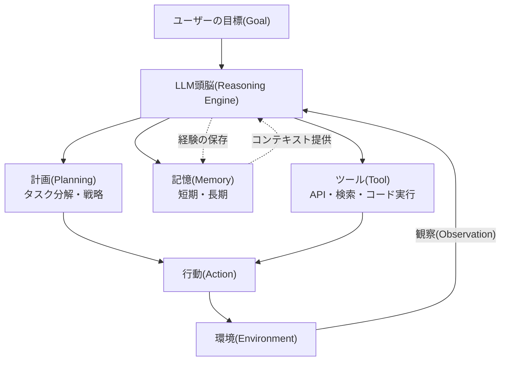
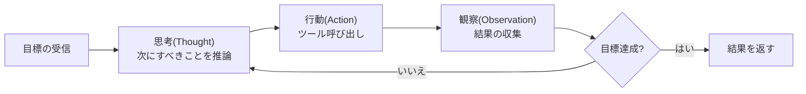

# AIエージェント（AI Agent）とエージェンティックAI（Agentic AI）

## 1. 概要

> **AIエージェント（AI Agent）**とは、大規模言語モデル（LLM）などの基盤モデルを推論エンジンとし、与えられた目標（Goal）を達成するために**自ら計画（Planning）を立て、ツール（Tool）を呼び出し、環境と相互作用するプロセスを自律的に反復（Loop）**する知能型ソフトウェアシステムをいう。複数のエージェントが協働したり、人間の介入を最小化した自律実行を志向するパラダイムを、特に**エージェンティックAI（Agentic AI）**という。

従来のLLM活用は、ユーザーがプロンプトを入力するとモデルが単発（One-shot）のテキストを生成する**質疑応答型（Chatbot）**にとどまっていた。しかし、この方式は三つの根本的な限界を抱えていた。第一に、モデルは学習時点以降の最新情報や企業内部のデータにアクセスできず、**知識の断絶（Knowledge Cutoff）**とハルシネーション（Hallucination）に弱い。第二に、テキストの生成しかできず、実際の照会・予約・決済・コード実行といった**行動（Action）**を実行できない。第三に、複雑な問題を複数のステップに分割して順次解決する**多段階推論（Multi-step Reasoning）**の能力が、プロンプト1回の応答では不十分である。

AIエージェントは、まさにこの限界を克服するために登場した。LLMを単なる「生成器」ではなく「**頭脳（Reasoning Engine）**」として再定義し、その頭脳に記憶（Memory）・ツール（Tool）・計画（Planning）という手足を付けて、目標が達成されるまで観察・思考・行動を自ら反復させるようにしたのである。例えば「来週のソウル出張の航空券と宿泊先を予算100万ウォン以内で予約せよ」という目標が与えられると、エージェントは自らサブタスクを分解し、検索・比較・予約のAPIを呼び出し、制約を満たすまで反復する。2023年のAutoGPTの登場を契機に概念が大衆化し、2024〜2025年には**関数呼び出し（Function Calling）**の高度化、**MCP（Model Context Protocol）**のような標準化されたツール接続規約、マルチエージェントフレームワークの成熟により、実務への適用が本格化している。

## 2. AIエージェントの中核構成要素と動作構造

AIエージェントは、LLMの頭脳を中心に**計画・記憶・ツール・行動**のモジュールが有機的に結合した構造を持つ。各構成要素は、人間が問題を解く方法――目標を分け、知っていることを思い出し、必要なツールを使い、結果を見て再び判断するプロセス――をソフトウェアとして形式化したものである。

**計画（Planning）**は、複雑な目標を実行可能なサブタスク（Subtask）に分解し、順序を決める能力である。一度に答えを出す代わりに、「まず何をして、その結果に応じて次に何をするか」を思考の連鎖（Chain-of-Thought）として展開する。代表的な手法である**ReAct（Reasoning + Acting）**は、「思考（Thought）→行動（Action）→観察（Observation）」を交互に反復し、各ステップのツール実行結果を次の推論に反映させることで、ハルシネーションを減らし根拠のある行動を導く。ここに自らの実行結果を自ら批判・修正する**Reflexion（自己省察）**が組み合わされると、エラーからの回復力が大きく向上する。

**記憶（Memory）**は、エージェントがコンテキストを維持し経験を蓄積する保存領域である。進行中の対話・中間結果を保持する**短期記憶（Short-term、コンテキストウィンドウ）**と、過去の相互作用・知識をベクトル埋め込みとして保存し、必要に応じて検索（RAG）する**長期記憶（Long-term、ベクトルDB）**に分けられる。長期記憶のおかげで、エージェントはセッションを越えてユーザーの嗜好を記憶し、膨大なナレッジベースを参照して根拠のある応答を生成できる。

**ツール（Tool）**は、エージェントが外部世界と実際に相互作用する手段である。LLMは「どのツールを、どの引数で呼び出すか」を構造化された形式（JSONなど）で出力し（**関数呼び出し、Function Calling**）、ランタイムがそれを実行して結果を再びモデルに返す。Web検索、データベース照会、社内API、コードインタプリタ、ファイルシステムなどがツールとなり、近年はこの接続を標準化した**MCP（Model Context Protocol）**が普及し、ツール・データソースとエージェントを疎結合（Loose Coupling）する事実上の標準として定着しつつある。

| 構成要素 | 役割 | 代表技術 | 欠如時の問題 |
|---|---|---|---|
| 計画(Planning) | 目標分解・戦略策定 | ReAct, ToT, Reflexion | 複雑なタスクの解決に失敗 |
| 記憶(Memory) | コンテキスト維持・経験蓄積 | コンテキストウィンドウ, ベクトルDB | セッション間の一貫性を喪失 |
| ツール(Tool) | 外部世界への作用 | Function Calling, MCP | 実行・最新情報へのアクセス不可 |
| 行動(Action) | 実際の実行・反復 | Agent Loop, Orchestrator | 単発の応答にとどまる |

## 3. エージェントの推論・制御手法と自律性レベル

エージェントの知能は「どれだけうまく計画し、失敗からどれだけうまく回復するか」にかかっており、これを左右するのが推論・制御手法である。代表的なものとして、**ReAct**は推論と行動を交互に行い、**ToT（Tree of Thoughts）**は複数の思考経路をツリーとして探索して最善を選び、**Plan-and-Execute**は全体計画を先に立ててからサブタスクを順次実行する。これらの共通点は、単線的な生成ではなく**探索・評価・修正の反復構造**を導入したことである。

自律性のレベルは、人間の介入の程度に応じて段階的に区分される。最も低い段階は人が各ステップを承認する**人間主導（Human-in-the-loop）**、中間は人が監督するが介入は例外時のみとする**人間監督（Human-on-the-loop）**、最も高い段階は人の介入なしに目標まで完走する**完全自律（Full Autonomy）**である。自律性が高いほど生産性は高まるが、誤った行動がそのまま現実世界に反映されるリスクも同時に高まるため、決済・削除・外部送信のように取り消しが困難な（Irreversible）行動には必ず**承認ゲート（Approval Gate）**を設けることが実務上の原則である。

一方、単一のエージェントでは対応しきれない複合的な業務は、**マルチエージェントシステム（Multi-Agent System）**で分業する。統括管理者（Orchestrator/Supervisor）エージェントが作業を分割して専門エージェント（例：リサーチャー・コーダー・検証者）に委任し、結果を統合する構造であり、役割の特化によって精度と拡張性を高める。ただし、エージェント間の通信オーバーヘッドとエラー伝播（一つのエージェントのミスが連鎖する）のリスクがあるため、明確なインタフェースと検証エージェントの配置が重要である。

## 4. RAG・ワークフロー自動化との比較

AIエージェントはRAGや従来のワークフロー自動化（RPA）と混同されやすいが、**自律的な意思決定と反復実行の有無**において本質的に異なる。その違いが生じる理由は、「誰が実行フロー（Control Flow）を決定するのか」にある。従来の自動化とRAGは、フローが開発者によってあらかじめ定義された固定経路に従うが、エージェントはLLMがその都度状況を見て次の行動を**動的に決定**する。

| 区分 | 単純なLLMチャットボット | RAG | AIエージェント |
|---|---|---|---|
| 実行フローの決定 | なし(単発応答) | 固定(検索→生成) | LLMが動的に決定 |
| 外部ツールの使用 | 不可 | 検索のみ | 多様なツール・API |
| 多段階の反復 | なし | なし | 目標まで反復 |
| 状態・記憶 | なし/短期 | なし | 短期+長期 |
| 代表的用途 | Q&A | 根拠に基づく回答 | 自律的なタスク遂行 |

RAGは「知識へのアクセス」を解決するが、依然として決められた1回の検索・生成で終わり、自ら行動することはない。反対にRPAは、決められた画面・ルールをそのまま繰り返すだけで、例外的な状況に柔軟に対応できない。エージェントはこの両者を包含する――必要であればRAGで知識を取得し、必要であればAPIを呼び出し、結果が期待と異なれば計画を修正する。実際の**具体的事例**を見ると、ソフトウェア開発支援エージェントはバグレポートを受け取ると関連コードを自ら検索（RAG）し、修正案を生成した後、テストを実行（ツール）して合格するまで反復し、最終的にPRを作成（行動）する。単発のコード生成ツールが通常一度で正解を出せないのとは異なり、この反復ループのおかげで実際の問題解決率が有意に向上すると報告されている。

## 5. 深掘り：実務適用の動向と標準化

エージェント技術は2024〜2025年を経て、「実験」から「運用」へと移行しつつある。産業の現場では、顧客対応（問い合わせ分類→内部システム照会→回答・措置）、ソフトウェアエンジニアリング（課題解決・コードレビュー）、データ分析（自然言語による質問→SQL生成・実行・可視化）、バックオフィス自動化（文書処理・承認ワークフロー）などで、パイロットと商用化が広がっている。この過程で、二つの標準化の流れが際立っている。

第一に、**ツール接続の標準化**である。Anthropicが2024年末に公開した**MCP（Model Context Protocol）**は、エージェントと外部データ・ツールをつなぐオープンな規約であり、ツールごとに個別の統合コードを書いていた負担を減らし、再利用可能なコネクタのエコシステムを形成している。第二に、**エージェント間の相互運用標準**である。異なるベンダーのエージェントが協働できるようにするA2A（Agent-to-Agent）系のプロトコルの議論が進められており、これは将来、異種のエージェントが一つの目標をめぐって協力する「エージェントWeb（Agentic Web）」の土台になると見込まれている。ただし、こうした最新の規約・バージョンは急速に変化するため、導入時には各規約の最新仕様と成熟度を確認することが望ましい。

技術的な成熟とは別に、**ガバナンス**の課題も浮上している。自律エージェントが誤ったツールを呼び出したり、悪意のあるプロンプトインジェクション（Prompt Injection）によって乗っ取られたりした場合には実害が発生し得るため、行動範囲の制限（最小権限）、監査ログ（Observability）、承認ゲート、サンドボックス実行といった安全装置が、アーキテクチャの必須要素として求められている。EU AI Actなどの規制環境においても、自律性の高いシステムほど透明性・制御可能性の要件が強化される傾向にある。

## 6. 考慮事項および示唆

AIエージェントの導入は単なるモデルの採用ではなく、**自律性と統制の間のバランスを設計するアーキテクチャ上の意思決定**である。技術士の観点から、次の点を総合的に考慮しなければならない。

- **自律性と安全性のトレードオフ**: 自律性を高めると生産性は上がるが、誤作動のリスクも大きくなる。取り消せない行動（決済・削除・外部送信）には承認ゲートを、ツールの権限には最小権限の原則を適用し、リスクを制御可能な範囲に限定しなければならない。
- **信頼性と検証体制**: LLMの確率的な特性上、エージェントは非決定的に動作する。自己検証（Self-critique）・検証エージェント・人によるレビューを階層的に配置し、再現可能な評価（Eval）パイプラインで品質を継続的に測定する体制が不可欠である。
- **コスト・性能・レイテンシの最適化**: 反復ループとマルチエージェントは、トークンコストと応答レイテンシを急増させる。タスクの複雑さに応じて大型・小型モデルを併用（ルーティング）し、不要な反復を制限（ステップ上限）し、キャッシング・並列化で効率を確保する設計が必要である。
- **セキュリティ・ガバナンスの内在化**: プロンプトインジェクション・ツールの誤用・データ流出に備え、入力検証、サンドボックス、監査ログ（Observability）、アクセス制御をアーキテクチャ段階から内在化（Security by Design）しなければならず、規制要件（透明性・説明可能性・責任の所在）を満たす必要がある。
- **段階的導入戦略**: 最初から完全自律を追求するよりも、Human-in-the-loopから始め、信頼が検証された領域から自律性を段階的に拡大する成熟度ベースのアプローチが、失敗のリスクを下げる。

展望としては、AIエージェントは個別業務の補助を超えて組織のワークフローを再構成する**デジタルワークフォース（Digital Workforce）**へと進化し、標準化されたツール・エージェントのエコシステムの上で相互に協力する方向へ進むであろう。技術士はこうした流れの中で、自律性の価値を活用しつつ、統制・信頼・安全を併せて設計するバランスの取れた視点を堅持すべきである。

## 参考資料

- Anthropic, "Model Context Protocol" — https://modelcontextprotocol.io/
- Yao et al., "ReAct: Synergizing Reasoning and Acting in Language Models" — https://arxiv.org/abs/2210.03629
- Shinn et al., "Reflexion: Language Agents with Verbal Reinforcement Learning" — https://arxiv.org/abs/2303.11366

---

> **一言まとめ**: AIエージェントはLLMの頭脳に計画・記憶・ツール・行動を結合し、目標達成まで観察・思考・行動を自律的に反復するシステムであり、ReAct・マルチエージェント・MCP標準を軸に普及しつつあり、自律性と統制・安全のバランス設計が中核課題である。
