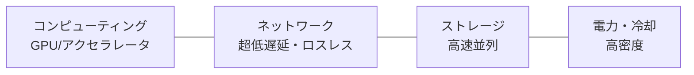

# 大規模AIサービスのためのデータセンター構築技術

## 1. 概要

### A. 定義
> 超大規模AI（LLM）の学習・推論のために、**数千〜数万個のGPU/アクセラレータを超低遅延・広帯域のネットワークで接続**し、高密度の電力・冷却を備えたAI特化型データセンターであり、一般に**AI Factory**とも呼ばれる。

### B. 登場背景および必要性
LLMのパラメータと学習データが爆発的に増加したことで、単一のGPUはもちろん、単一のサーバーでもモデルを収容できなくなった。数千個のGPUが一つのモデルを**分担して学習（分散学習）**しなければならないが、このときGPU同士はステップごとに勾配をやり取りするため、**GPU間の通信速度が全体の学習速度を左右**する。すなわち、AIデータセンターの中核的な難題は演算ではなく「**通信のボトルネックと電力・発熱**」である。一般的なIDCはGPUの集積密度（ラック当たり数十kW）・発熱・超高速通信に対応できないため、AI専用インフラの設計が別途求められるようになった。

## 2. 中核要件

AIデータセンターは四つの要素がバランスを保たなければならず、いずれか一つでもボトルネックになると、高価なGPUが遊んでしまう。特に**ネットワーク**が決定的である。分散学習においてGPUが通信を待つ時間が長いと、演算ユニットの利用率（MFU）が急落するからである。

| 要件 | 内容 |
|---|---|
| コンピューティング | GPU・NPU・TPUクラスタ、高密度集積 |
| ネットワーク | 超低遅延・ロスレス — 通信が学習性能を左右 |
| ストレージ | 大容量・高速並列ファイルシステム（チェックポイント） |
| 電力・冷却 | ラック当たり数十kW、液浸・水冷冷却 |

チェックポイント一つが数TBに達し、これを随時保存・復旧しなければならないため、ストレージにも高速並列（例：Lustre・GPFS）が必須である。

## 3. 低遅延・スケーリング技術（A）

GPU間の通信は二つの階層で最適化される。**ノード内部**ではGPU同士をPCIeよりはるかに高速な専用リンクで直結し、**ノード間**ではCPUを迂回する超低遅延ネットワークを用いる。CPUを経由すると遅延が大きくなるため、**RDMA（Remote Direct Memory Access）**によってCPUの介在なしにリモートGPUのメモリへ直接アクセスすることが中核原理である。

| 技術 | 原理・説明 |
|---|---|
| **RDMA(RoCE)** | CPUの介在なしにメモリへ直接転送して低遅延を実現 |
| **InfiniBand** | ロスレス・超低遅延のインターコネクト（HPC標準） |
| **NVLink/NVSwitch** | ノード内のGPU間を超広帯域で直接接続 |
| **GPUDirect** | GPUがネットワーク・ストレージと直接通信 |
| **集団通信(NCCL)** | All-Reduceなど分散学習の通信パターンを最適化 |

分散学習では、モデル・データをどのように分割するかによって、三種類の並列化を組み合わせる（3D並列）。それぞれが解決する問題は異なる。

| 並列化 | 原理 | 解決する問題 |
|---|---|---|
| **データ並列** | バッチを分割して各GPUが処理した後、勾配をAll-Reduce | 学習速度の向上 |
| **モデル/テンソル並列** | レイヤー・行列演算をGPUに分割 | モデルがGPUメモリを超過 |
| **パイプライン並列** | レイヤーを段階ごとにパイプライン処理 | 深いモデルのメモリ・効率 |

例えばGPT級のモデルは、テンソル並列で一つのレイヤーを複数のGPUに分割し、パイプライン並列でレイヤー群をノードに配置し、その上にデータ並列を重ねて数千個のGPUを同時に稼働させる。このとき通信量が膨大であるため、InfiniBand・NVLinkがなければスケールさせることは不可能である。

## 4. DCI（Data Center Interconnect）技術（B）

> 地理的に分散したデータセンターを**超高速・低遅延の光伝送**で接続し、容量拡張・災害復旧・負荷分散を実現する技術。

単一のデータセンターの電力・スペースには限界があるため、複数のDCを一つのように束ねるDCIが必要となる。一本の光ファイバーでできるだけ多くのデータを送らなければならないため、異なる波長（色）にデータを載せて同時に伝送する**DWDM**が基盤技術である。

| 技術 | 原理・説明 |
|---|---|
| **DWDM** | 波長分割多重化により単一の光ファイバーで大容量伝送 |
| **OTN** | 光伝送網の標準、大容量・低遅延のバックボーン |
| **コヒーレント光伝送** | 位相・振幅変調により400G/800Gの長距離高速伝送 |
| **活用** | DC間のデータ複製、災害復旧(DR)、ワークロード分散、クラスタ拡張 |

## 5. 考慮事項および示唆
- **ネットワークのボトルネックがすなわち性能**: GPUの利用率と学習速度はネットワークが左右するため、任意の二つのノード間で均等な帯域を持つよう、**Fat-Tree（リーフ・スパイン）**のようなノンブロッキングトポロジを設計する。
- **電力・炭素**: ラック密度が高いため、**PUEの改善**とともに再生可能エネルギー電力（RE100）・**液浸冷却**でグリーンデータセンターを志向する。電力調達そのものが立地の制約となる。
- **次世代技術**: メモリのボトルネックを緩和する**CXL・PIM**、複数のDCにまたがる分散学習への拡張が進行中である。
- **国家戦略**: AIデータセンターは**ソブリンAI（主権型AI）**の中核インフラであり、大規模な投資・集積化が国家競争力の観点から加速している。

---

> **一言まとめ**: 大規模AIデータセンターは*GPUクラスタをRDMA・InfiniBand・NVLinkで超低遅延に接続*し、データ・テンソル・パイプライン並列で分散学習を行い、DWDM・OTNベースのDCIと高密度電力・液浸冷却で超大規模AIを支えるソブリンAIインフラである。
