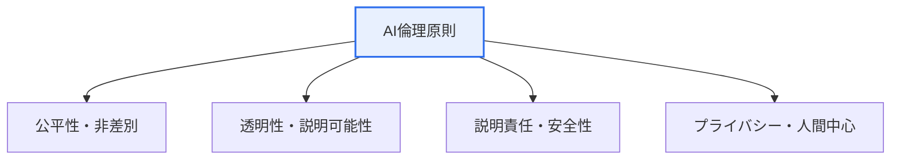
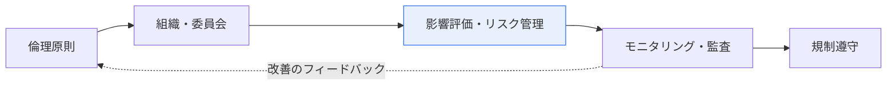

# AI倫理とガバナンスモデル

## 1. 概要

### A. 定義
> AIを開発・適用する過程で守るべき**倫理原則**と、AIを効果的に管理・規制するための**ガバナンス体系（モデル）**。信頼できるAI（Trustworthy AI）の実現を目的とする。

AI倫理がとりわけ重要になった理由は、AIの決定がもはや推薦広告のような些細な領域にとどまらず、**採用・融資・医療・刑事司法のように人の人生を左右する領域**に入り込んできたからである。性能さえ良ければよかった時代を過ぎ、「このAIは特定の集団を差別していないか（公平性）、なぜそのような決定を下したのか説明できるか（透明性）、誤った場合に誰が責任を負うのか（説明責任）」がAI導入の前提条件となった。ここで倫理原則が「何を守るべきか」を規定するとすれば、ガバナンスモデルは「その原則を組織と社会がいかに強制し管理するか」という実行体系を提供する。原則だけがあってガバナンスがなければ宣言にとどまり、ガバナンスだけがあって原則がなければ方向性を見失う。

### B. 登場背景
生成AIの大衆化により強力なAIを誰もが使えるようになったことで、バイアス・偽情報・著作権・プライバシーの問題が社会の表面に現れ、EU AI Act・韓国のAI基本法などの規制が強化されるにつれ、AIに関する課題の先制的な管理が企業の存続に直結するようになった。

## 2. AI倫理の主要原則

AI倫理の中核原則は互いに絡み合っている。**公平性**はデータ・アルゴリズムのバイアスを除去して差別を防ぐことであるが、バイアスは多くの場合、学習データにすでに存在していた社会的偏見がモデルに反映・増幅された結果であるため、データの段階から点検しなければならない。**透明性・説明可能性**はAIがなぜそのような判断をしたのか根拠を提示すること（XAI）であり、公平性を検証する前提となる。**説明責任**は結果に対する責任主体を明確にすることであり、**安全性**は誤作動・悪用を防ぐことであり、**プライバシー・人間中心**は個人情報を保護し、最終判断に人間が介入する（Human-in-the-loop）ことを保証することである。

| 原則 | 内容 |
|---|---|
| **公平性** | データ・アルゴリズムのバイアス除去、差別防止 |
| **透明性・説明可能性** | 判断根拠の公開（XAI）、理解可能性 |
| **説明責任** | 結果に対する責任主体の明確化 |
| **安全性・堅牢性** | 誤作動・敵対的攻撃の防止 |
| **プライバシー・人間中心** | 個人情報保護、人間による監督の維持 |

## 3. AIガバナンスモデル

ガバナンスモデルは、倫理原則を実際の組織運営へと移す階層構造である。最上位に**原則・ポリシー**（AI倫理基準・内部ガイドライン）があり、これを実行する**組織・体制**（AI倫理委員会、責任者）が構成される。その下で**プロセス**（AI影響評価、リスク分類・管理、監査）が回り、**技術・運用**（XAI、MLOpsモニタリング、バイアス・ドリフト監視）がこれを支え、全体が**規制対応**（EU AI Act、NIST AI RMF、ISO/IEC 42001）と整合される。

| 階層 | 構成 |
|---|---|
| **原則・ポリシー** | AI倫理基準、内部ポリシー |
| **組織・体制** | AI倫理委員会、責任者（CAIO） |
| **プロセス** | AI影響評価、リスク分類・管理、監査 |
| **技術・運用** | XAI、MLOpsモニタリング、バイアス監視 |
| **規制対応** | EU AI Act（リスクベース）、NIST AI RMF、ISO 42001 |

## 4. 考慮事項および示唆

1. **設計段階からの内在化（Responsible AI by Design）**が核心である。問題が起きてから対応すると信頼回復のコストがはるかに大きくなるため、開発の初期からバイアス・説明可能性・安全性を要件として組み込む。
2. **自主規制（倫理）と他律的規制（法）のバランス**が必要である。リスクの大きい用途（高リスクAI）は強く規制し、低リスクのものは自主に委ねるリスクベースのアプローチが、イノベーションと安全を調和させる。
3. **人間による監督（Human-in-the-loop）の維持**が最後の安全装置である。特に高リスク領域では、AIが最終決定を独占せず、人間がレビューし責任を負うように設計しなければならない。

---

> **一言まとめ**: AI倫理は*公平性・透明性・説明責任・プライバシー・人間中心*の原則を扱い、ガバナンスモデルはこれを*原則→組織→影響評価→モニタリング→規制遵守*の階層で実行し、設計段階からの内在化と人間による監督によって信頼できるAIを実現する。
