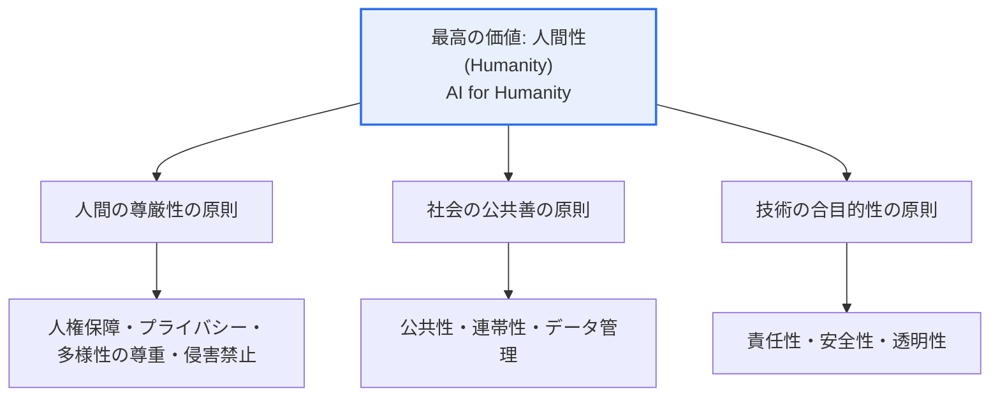
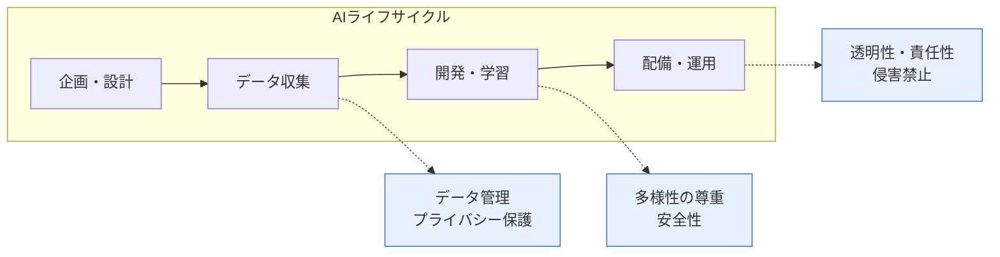

# 人工知能（AI）倫理基準 — 3大基本原則と10大中核要件

## 1. 概要

### A. 定義
> **国家人工知能倫理基準**は、韓国の科学技術情報通信部が情報通信政策研究院（KISDI）とともに発表した（2020.12）ものであり、人工知能の開発・活用の全過程で守るべき最高の価値である「**人間性（Humanity）**」を実現するための**3大基本原則と10大中核要件**を示した自主規範である。

この倫理基準の中核的な指向点は、「**人間性のための人工知能（AI for Humanity）**」である。すなわち、AIは人間を代替したり脅かしたりするものではなく、人間の尊厳と生活の質を高める道具でなければならないという大原則のもとに、3大基本原則と10大要件が配置されている。この文書を理解する際に見落としやすいのが、その**規範的性格**である。これは違反時に制裁が伴う強行規制ではなく、開発者・運営者・利用者が自主的に実践するよう方向性を示すソフトロー（soft law）である。そのため、「何をしてはならない」という禁止リストではなく、AIが目指すべき価値と守るべき要件を示した**羅針盤**としての性格を持つ。

また、この基準は特定の技術・産業にとらわれない**一般原則（general principle）**として設計されている。顔認識であれ自動運転であれ生成AIであれ、技術の種類を問わず共通して適用できるよう、抽象度を高く設定したのである。これは、技術の発展速度が規制の速度を上回るAI分野において、特定の技術を固定した規定がすぐに陳腐化してしまう問題を避けるための意図的な設計である。その代わり、抽象的である分、実際の現場でいかに具体化するかが鍵となり、この点が後続のガイドライン・自主点検表・AI基本法へとつながる背景となる。

### B. 登場背景
AIが採用・融資・医療・刑事司法など社会全般の意思決定に浸透するにつれ、学習データに内在する**バイアス（bias）**が特定集団への差別として増幅されたり、大規模な個人情報の収集によって**プライバシー**が侵害されたり、自律システムの誤作動によって**安全**が脅かされたりする事例が相次いだ。代表的なものとして、偏ったデータで学習し、特定の人種・性別に不利に作動した海外の採用・再犯予測アルゴリズムをめぐる論争は、「AIは中立である」という通念を打ち砕いた。これにより、信頼できるAIエコシステムを構築するための国家レベルの共通基準が必要となり、EU・OECDなど国際社会のAI倫理に関する議論の流れと歩調を合わせて、韓国政府も2020年12月に国家AI倫理基準を策定した。

### C. 位置付けと適用対象
この基準はAIのライフサイクル（企画→データ収集→開発→配備→運用→廃棄）全般に適用され、適用主体を**開発者・運営者（供給者）**と**利用者（需要者）**に幅広く想定している。いずれか一方の主体の責任に還元されることなく、AIを作る人・サービスを提供する人・使う人のすべてがともに守るべき社会的合意であるという点で、他の技術標準とは性格が異なる。

## 2. 最高の価値と3大基本原則 — 全体構造

3大基本原則は、「人間性」という大原則を三つの異なる方向から具体化したものである。それぞれは独立しているというよりも人間性を支える三本の柱であり、ともに機能するときに完全な意味を持つ。

**人間の尊厳性の原則**は、AIが人間の生命・身体の安全と基本的人権を侵害せず、人間を手段ではなく**目的そのもの**として扱わなければならないというものである。カント的人間観をAIに投影したものであり、AIの効率性がいかに大きくても、人間の尊厳を道具化する方向には使えないという限界線を引く。例えば、社会的統制・監視のための無差別な顔認識や、人間の判断を完全に排除したまま生命に関わる決定を自動化することは、この原則に反する。

**社会の公共善の原則**は、AIが少数者・社会的弱者を含む**すべての社会構成員**に等しく恩恵が行き渡るようにし、公共の利益と持続可能性に貢献しなければならないというものである。AIの便益が少数に集中してデジタル格差を拡大させたり、環境的・社会的コストを外部化したりすることを警戒する。これは、AIは「誰のための技術なのか」という分配的正義の問いを含んでいる。

**技術の合目的性の原則**は、AI技術が人類にとって有益な目的のために開発・活用されなければならず、その目的を達成する**過程と手段もまた倫理的**でなければならないというものである。目的が善であるという理由で、不当なデータ収集や不透明な方法が正当化されることはないことを意味する。この原則は、後述する責任性・透明性の要件と直接結び付いている。

| 基本原則 | 中核内容 | 対応する観念 |
|---|---|---|
| **人間の尊厳性** | 生命・安全・基本的人権の保護、人間を目的として扱う | 人権・尊厳 |
| **社会の公共善** | 社会的弱者への配慮、公共の利益・持続可能性・格差の解消 | 分配的正義 |
| **技術の合目的性** | 人類に有益な目的 + 倫理的な過程・手段 | 目的・手段の正当性 |

## 3. 10大中核要件 — 原則の実践項目

10大中核要件は、抽象的な3大原則を実際の開発・運用の現場で守るための**実践チェックポイント**である。前の構造図に見るように、各要件は特定の基本原則に根ざしつつも、実際には複数の原則にまたがって機能する。

各要件をもう少し詳しく見ると、次のとおりである。**人権保障・プライバシー保護・多様性の尊重**は人間の尊厳性の原則の実践であり、AIが人間の権利・自由を守り、個人情報と私生活を保護し、偏りなく公正に機能することを求める。特に多様性の尊重は、学習データ・アルゴリズムのバイアスを除去して性別・年齢・障害・人種などによる差別を防止せよという、AI倫理における最も実務的な論点を含んでいる。**侵害禁止・公共性・連帯性**は、AIが人間に直接的・間接的な害を及ぼさず、公益と社会的便益を志向し、利害関係者間の協力・共生を追求せよという要件である。**データ管理・責任性・安全性・透明性**は技術的・ガバナンス的な要件であり、データを目的の範囲内で品質を保って管理し、結果に対する責任主体を明確にし、誤作動・リスクを制御し、判断の根拠を説明・公開できなければならないことを意味する。

| 中核要件 | 要旨 | 関連概念 |
|---|---|---|
| **人権保障** | 人間の権利・自由の保護 | 基本的人権 |
| **プライバシー保護** | 個人情報・私生活の保護 | 個人情報保護法 |
| **多様性の尊重** | バイアス除去・公平性・多様性への配慮 | アルゴリズムの公平性 |
| **侵害禁止** | 人間への直接的・間接的な害の禁止 | 安全・責任 |
| **公共性** | 公益・社会的便益の追求 | 公共善 |
| **連帯性** | 利害関係者の協力・共生・世代間の配慮 | 持続可能性 |
| **データ管理** | データ品質・目的内での活用 | データガバナンス |
| **責任性** | 結果に対する責任主体の明確化 | AIガバナンス |
| **安全性** | 誤作動・リスクの制御、堅牢性 | AIの信頼性 |
| **透明性** | 説明可能性・情報公開 | XAI |

## 4. 比較と位置付け — 国際規範との関係

韓国の国家AI倫理基準は、国際社会の流れと軌を一にしながらも、強調点に違いがある。**OECD AI原則（2019）**は包摂的成長・人間中心の価値・透明性・堅牢性・説明責任を示し、**EUの信頼できるAIのための倫理ガイドライン（2019）**は、人間による監督・技術的堅牢性・プライバシー・透明性・多様性・社会的ウェルビーイング・説明責任の7大要件を挙げている。三つの規範はいずれも「人間中心・透明性・説明責任・公平性」という共通の骨格を共有している。ただし、韓国の基準は「**人間性（Humanity）**」という単一の最高価値を頂点に置き、3原則・10要件として階層化した点、そして当初から自主規範であることを明確にした点が特徴である。

このような違いが生じる理由と実務的な含意は、次のとおりである。EUは早くから**AI Act**という強行規制（リスクベースの差等規律）へと進み、違反時には制裁金を科すのに対し、韓国は自主規範から出発して産業の萎縮を最小化しつつ、段階的に法制化のステップを踏む戦略を選んだ。その結果、韓国でも自主規範だけでは実効性が不十分であるという指摘が続き、これが後述するAI基本法の制定へとつながった。すなわち、倫理基準は「価値の宣言」、AI基本法は「履行の強制」という相互補完の関係として理解すべきである。

## 5. 深掘り — 自主規範からAI基本法へ

国家AI倫理基準（2020）の最も重要な後続の流れは**法制化**である。自主的な実践だけではバイアス・安全・透明性の問題を実効的に扱うことは難しいという共通認識のもと、「**人工知能の発展と信頼基盤の造成等に関する基本法**」（略称**AI基本法**）が制定され、**2026年1月の施行**を控えることとなった。この法律は2020年の倫理基準の価値を継承しつつも、国民の生命・安全・基本的人権に重大な影響を及ぼす「**高影響AI（high-impact AI）**」と生成AIについて事業者の責務（リスク管理・説明・表示・安全性の確保など）を規定しているという点で、自主規範を超えた履行規範としての性格を持つ。実際に、下位規範である施行令・ガイドライン（透明性・安全性の確保、高影響AI事業者の責務など）に関する意見聴取の手続きが進められ、具体化が進んでいる。

一方、政府は2020年の倫理基準そのものについても、時代の変化に合わせて改定を推進している。エージェンティックAI（自ら計画・行動する自律エージェント）、フィジカルAI（ロボット・自動運転など物理世界との結合）といった新たな技術の流れと、AI基本法の施行以降に変化した政策環境を反映した、新たなAI倫理原則が準備されている。これは、倫理規範が「一度作れば終わり」ではなく、技術の発展に合わせて**継続的に更新**されなければならないことを示している。技術士の観点からこのテーマを答案にまとめる際には、「2020年の自主規範（価値の宣言）→自主点検表・ガイドライン（具体化）→AI基本法（履行の強制、2026年施行）→倫理原則の改定（新技術の反映）」という進化の軸を描き、最新動向まで結び付ければ差別化できる。関連テーマとして、AIの信頼性（[[ai-trustworthiness]]）、AIガバナンス（[[ai-ethics-governance]]）、AI個人情報自主点検表（[[ai-privacy-checklist]]）、ISO/IEC 42001 AIマネジメントシステム（[[iso-42001-ai-management-system]]）とまとめて学習するのが効果的である。

## 6. 考慮事項および示唆

1. **自主規範から法制化への流れを統合的に理解しなければならない。** 国家AI倫理基準（2020）は自主的な実践を志向するが、EU AI Actと韓国のAI基本法（2026.1施行）によって履行規範が整備され、実効性が強化されつつある。倫理基準は価値の宣言、基本法は強制的な履行という相補関係として把握すべきである。
2. **設計段階での内在化（Ethics by Design）が核心である。** 事後の点検ではなく、開発の初期段階から透明性・公平性・安全性・プライバシーを要件として反映してこそ、実質的な遵守が可能となる。これは個人情報保護におけるPbD（[[privacy-by-design]]）と同じ原理であり、後から付け加えるコストのほうが、最初から設計するコストよりもはるかに大きいからである。
3. **抽象的な原則を実行可能な手順へと具体化しなければならない。** 10大要件はそれ自体では抽象的であるため、組織のAIガバナンス体制・AI影響評価・自主点検表・モデル文書化（model card）・バイアステストといった具体的な統制へと翻訳されなければならない。特に多様性の尊重・透明性は、バイアス測定指標と説明可能なAI（XAI）の手法に裏付けられて初めて検証可能となる。
4. **責任主体とガバナンス体制を明確にしなければならない。** AIの誤作動・差別による被害が発生した際に、開発者・運営者・利用者のうち誰がどのような責任を負うのかが不明確であれば、要件は空虚なものとなる。責任性の要件を、組織内の意思決定権限・監督構造・インシデント対応手順として制度化することが求められる。
5. **展望：新技術に対応する継続的な更新が必要である。** 生成AI・エージェンティックAI・フィジカルAIの登場によってリスクの様相が変化するため、倫理規範もこれを反映して改定を重ねなければならない。技術士は特定時点の条文の暗記ではなく、人間性という不変の価値を軸として、変化する規制の地形を解釈・適用する能力を備えなければならない。

## 参考資料
- 科学技術情報通信部「国家人工知能倫理基準」（2020.12）報道資料および原文: https://www.msit.go.kr
- 「AIを作り使うときに守るべきAI倫理…規制ではなく自主規範」（フィナンシャルニュース、2026）: https://www.fnnews.com/news/202608141218124650
- 「AI基本法、2026年施行…高影響AI・生成AIの義務事項」（ピカブーラボ）: https://peekaboolabs.ai/blog/ai-basic-law-guide
- 人工知能基本法施行令の立法予告（Lexology）: https://www.lexology.com/library/detail.aspx?g=790de95e-d2c2-4504-ab14-4d399c8f69c9

---

> **一言まとめ**: 国家AI倫理基準（2020.12）は「人間性（AI for Humanity）」を最高の価値とし、*人間の尊厳性・社会の公共善・技術の合目的性*の3大基本原則と、人権保障・プライバシー・多様性の尊重・透明性など10大中核要件を示した自主規範であり、設計段階での内在化（Ethics by Design）とAIガバナンスとの連携によって実践され、AI基本法（2026.1施行）によって履行規範が強化され、新技術に合わせて継続的に更新される。
