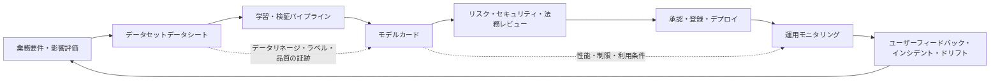
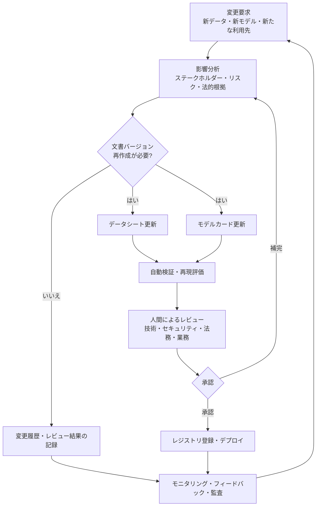

# AIモデルカード（Model Card）とデータセットデータシート（Datasheet）に基づくAIの透明性

## 1. 概要

> **定義**: AIモデルカードは、学習・デプロイされたモデルの目的、性能、適用範囲、限界、リスクおよび評価条件を記録する文書であり、データセットデータシートは、データセットの作成・収集・構成・利用目的・品質・バイアス・制約を記録する文書である。

人工知能システムの品質を精度一つで説明することが難しいのは、モデルの挙動がデータ、学習手順、評価環境、運用コンテキストの組み合わせによって決まるからである。同じモデルであっても、学習データとは異なる人口集団や言語、照明、業務プロセスにおいては性能が変わり得る。したがって「何パーセントの精度を得た」という数値だけでは、利用可能性やリスクを判断することはできない。

モデルカードとデータシートは、こうしたブラックボックス問題を文書化と説明責任の問題へと転換する。モデルカードは、モデルの利用者がどのような状況でモデルを使うべきか、またどのような状況では使うべきでないかを判断する助けとなる。データシートは、データの生産者と利用者がデータの出所と構成、欠落、ラベリング方式、社会的影響をともに検討できるようにする。

これらの文書の核心は、文書を形式的に作ることにあるのではない。実際に価値を持つためには、文書の項目がデータリネージ、実験記録、モデルレジストリ、承認手続き、モニタリング結果と結び付いていなければならない。手作業で作成した宣言文はデプロイ時点で陳腐化しやすいが、パイプラインで自動生成され責任者がレビューした証跡の束は、運用統制の一部となる。

Google Researchのモデルカード提案は、モデルの意図された用途と、多様な条件・サブグループにおける性能を併せて公開するという方向性を示した。データセットデータシートの研究は、データセットがどのように作られ、どのような特性や潜在的な歪みを持つのかを説明する標準化された質問の必要性を提起した。両文書は互いに代替する関係ではなく、データとモデルの双方の境界を説明する補完関係にある。

技術士は、モデルカードとデータシートをAIガバナンスの付属文書としてだけ捉えるのではなく、要件分析から廃棄まで続くAIシステムライフサイクルの統制点として設計しなければならない。文書の作成主体、承認基準、変更時の再レビュー条件、外部公開範囲、個人情報保護の水準までを運用モデルに含める必要がある。

## 2. 透明性文書の全体構造

AIの透明性とは、データの出所だけを公開する活動でも、モデルの構造だけを公開する活動でもない。影響を受けるステークホルダーがリスクを理解し、異議を申し立て、適切な利用可否を判断できるよう、必要な情報を目的に応じて提供する活動である。研究者、開発者、調達担当者、現場ユーザー、監査人、規制当局、影響を受ける市民は、それぞれ異なる水準の情報を必要とする。

モデルカードとデータシートは、これらのステークホルダーに同じ原文を渡すのではなく、共通の事実を中心に役割別の表現と公開範囲を設計する。内部には詳細なデータセットのバージョン、実験ログ、セキュリティ脆弱性、個人情報処理の根拠を保管し、外部には安全な要約と利用条件を提供することができる。ただし、公開用文書が内部文書と矛盾してはならず、非公開とした理由とレビュー責任も残しておかなければならない。

上記の流れにおいて、データシートはモデル学習前に一度だけ作成する文書ではない。データセットが追加されたり、ラベルポリシーが変わったり、収集地域が拡大されたりすれば、新しいバージョンを作成しなければならない。同様に、モデルカードはモデルパラメータが変わる場合だけでなく、推論プロンプト、前処理、しきい値、保護措置、利用対象が変わる場合にも、影響分析を行ったうえで更新しなければならない。

文書とシステムを結び付けるには、各文書に一意の識別子とバージョンを付与する。`dataset_id`、`dataset_version`、`model_id`、`model_version`、評価実行ID、承認チケットを相互に参照させれば、どのモデルがどのデータと実験結果に基づいていたかを再現できる。ファイル名だけでバージョンを管理すると、同名のファイルが上書きされて監査証跡が弱くなる。

透明性は公開の量ではなく、意思決定に必要な情報の適合性で評価する。営業秘密をすべて公開しなくても、モデルの利用禁止領域、既知の誤り、監督方法、異議申立ての経路を明確に示すことはできる。逆に、数十ページの表を公開しながら実際のユーザーにとって危険なケースを説明できなければ、形式的な透明性にとどまる。

## 3. モデルカードの構成と作成原理

### A. モデルの識別と意図された用途

モデルカードの出発点は、モデル名、バージョン、所有組織、担当者、リリース日、基盤モデルおよびライセンスである。モデルのパラメータを識別するだけでは十分ではなく、トークナイザ、前処理、後処理、プロンプトテンプレート、検索インデックス、安全フィルタのように結果に影響を与える構成も範囲に含めなければならない。運用モデルとは学習成果物単体ではなく、周辺の構成まで含めたデプロイ単位だからである。

意図された用途は「分類モデル」のように抽象的に書かない。入力の対象、利用者、出力の意思決定上の位置付け、許容される自動化の水準、人間がレビューすべき条件を具体的に記述する。たとえば、顧客からの問い合わせを優先度別に分類する補助モデルと、融資承認の可否を自動決定するモデルとでは、同じ分類問題であっても許容できる誤りと統制の水準が異なる。

禁止用途または非推奨用途も同等の重要度で記録する。学習データが特定の言語や地域に偏っているのであれば、他言語の法律文書の自動判定には使用すべきではない。人の安全、雇用、信用、福祉に関わる高リスク領域では、モデルの出力が最終決定を代替しないという原則と、例外承認の手続きを明記しなければならない。

### B. 性能と評価条件

性能表には、指標名、評価データのバージョン、サンプリング方法、ベースライン、信頼区間またはばらつき、評価期間を併せて記録する。精度、適合率、再現率、F1、AUROCが何を意味するのかを業務コンテキストで説明しなければ、数値の比較が誤解を生む。不均衡データにおいて精度だけを提示すると、少数クラスの誤りを覆い隠す結果になりかねない。

全体平均とサブグループの性能を分けて示す。性別、年齢、地域、言語、障害、デバイス、チャネルのように結果の差が懸念される軸を事前に定め、個人を再識別しない集計水準で評価する。サブグループを追加で公開する際は、サンプル数が小さすぎて個人が推定されないかを確認し、統計的な不確実性を併記する。

オフラインベンチマークのスコアと実際の運用性能は異なり得る。実ユーザーの入力は学習・評価データと分布が異なり、ユーザーがモデルの誤りを報告する方法も結果に影響を与える。したがってモデルカードには、オフライン性能と運用モニタリング指標を区別して記載し、デプロイ後の再評価周期と停止基準を定めておく。

### C. 限界、リスク、安全措置

限界は「完全ではない可能性がある」といった包括的な文ではなく、失敗条件とその影響として記述する。画像モデルの暗所での誤り、音声モデルの方言認識の低下、生成モデルの根拠のない応答、分類モデルの新規類型の未検知のように、観察可能な状況を提示する。可能であれば、代表的な誤りの事例と再現条件を内部の証跡に紐付ける。

リスクはモデル自体の誤りだけでなく、モデルが業務プロセスに組み込まれる方法からも生じる。現場ユーザーが確率スコアを確定的な判断と誤解したり、組織がモデルの推薦をレビューなしで大量に自動化したり、攻撃者が入力を操作して安全措置を回避したりするケースがある。モデルカードは、運用手順、権限分離、人間によるレビュー、ロギング、異議申立てと併せて読まれなければならない。

安全措置はモデルカード上の宣言ではなく、検証可能な統制でなければならない。入力検証、機微情報のマスキング、プロンプト・出力フィルタ、不確実性のしきい値、拒否応答、人間による承認、監査ログ、ロールバック用モデルを、それぞれ誰が運用するのかを定める。統制が失敗した場合に、デプロイ停止とインシデント対応へ移行する条件も明記する。

| 領域 | モデルカードに記録すべき中核的な問い | 運用上の証跡 |
|---|---|---|
| 目的 | 誰のどの業務を、どの水準まで支援するのか？ | 要件・承認範囲・ユーザー向け案内 |
| データ | どのようなデータと前処理で学習・検証したのか？ | データシート・リネージ・品質レポート |
| 性能 | どのような条件で、どの程度の誤りが発生するのか？ | 再現可能な評価実行・サブグループ指標 |
| 安全 | どのような誤用と攻撃を考慮したのか？ | レッドチーム・セキュリティテスト・統制ログ |
| 運用 | いつ再評価・停止・ロールバックするのか？ | モニタリングダッシュボード・インシデントチケット |

表の項目は文書の目次であると同時に、承認のチェックポイントでもある。性能値が埋まっただけでモデルカードが完成したとみなすのではなく、実際の運用で検証可能な証跡の所在を紐付けなければならない。特にリスクと運用の項目が空欄のモデルは、研究用としては残せても、業務サービスに自動承認してはならない。

## 4. データセットデータシートの構成と作成原理

### A. 動機・構成・収集プロセス

データシートは、データセットの名前や規模よりも先に、なぜ作られたのかを説明する。本来の目的が研究なのか商用サービスなのか、どのようなユーザーのためのものなのか、どのような利用は想定していなかったのかを記録する。目的が変更された場合は、同一データセットの単純な再利用とみなさず、目的適合性と権利・リスクを改めて検討する。

構成の項目には、レコード数、ファイル形式、変数とラベルの定義、欠損値、重複、時間範囲、地域範囲、言語とドメインを含める。単純な統計だけでなく、データが代表していない集団や観測されていない状況も記述する。データの不在はモデルの限界につながるため、「不明」も重要なメタデータである。

収集プロセスでは、ソース、収集時点、収集ツール、同意または利用根拠、フィルタリングルール、ラベラーと品質管理方法を追跡する。公開データセットを再加工したのであれば、元のバージョンと変換コード、削除・追加された項目、ライセンス条件を残す。サプライヤーがデータを提供する場合、契約上の再利用・監査・削除の可否もデータシートの範囲である。

### B. ラベル・品質・バイアス

ラベルは客観的な真値ではなく、定義と判断過程を伴う観測値である場合がある。ラベリングガイド、ラベラーの資格、複数ラベラー間の不一致の処理、曖昧な事例の処理、品質の抜き取り検査結果を記録する。自動生成ラベルや弱教師あり学習を用いたのであれば、誤りの伝播可能性とクレンジング方法も公開する。

品質は、完全性、正確性、一貫性、適時性、一意性、代表性の観点に分けて捉える。欠損率が低くても、特定の集団にだけ欠損が集中していれば公平性の問題が残る。重複除去率が高くても、時系列やソースごとの重複を誤って除去すれば、重要な事象を消してしまう可能性がある。

バイアス分析とは、データセットに「バイアスなし」と宣言することではない。どのような基準で代表性を評価したのか、どの集団や状況を含められなかったのか、その限界をモデルの利用条件にどう反映するのかを記録するプロセスである。公開文書では機微な属性を慎重に扱いつつも、リスクを隠す根拠として個人情報保護を用いることのないよう、集計・匿名化と説明のバランスを取る。

### C. 権利・セキュリティ・保存

データシートには、著作権、個人情報、営業秘密、肖像・音声・位置情報、契約上の利用制限を含める。法的な利用可能性は技術的なアクセス可能性を意味しない。ダウンロードできるという理由だけで学習・再配布が許容されるわけではないため、法務部門とデータ保護責任者が確認した根拠を残す。

セキュリティの面では、悪意あるファイル、プロンプトインジェクションデータ、データポイズニング、サプライヤーアカウントの乗っ取り、学習データの漏えいを考慮する。ハッシュと署名でバージョンを検証し、原本とクレンジング済みデータのアクセス権限を分離し、機微情報を含むデータには最小権限と保存期間を適用する。データセットの公開版と内部原本が存在するのであれば、両者の関係と差異を説明する。

保存と削除はモデル学習後まで続く。原データの削除要求があった場合に、モデルの再学習が必要か、派生特徴量とキャッシュをどう処理するか、バックアップからいつ消えるかを決めなければならない。データシートにこれらの手続きを記録しておけば、データ主体の権利とモデル運用者の再現性との衝突を調整できる。

## 5. 作成・検証・デプロイのプロセス

文書作成をプロジェクト終盤の報告書作業に先送りしてはならない。要件定義の段階で意図された用途と禁止用途を定め、データ準備の段階でデータシートの草案を作成する。学習段階では実験IDとモデルバージョンを記録し、評価段階では性能・公平性・頑健性・セキュリティを併せて検証する。

自動検証は、リンクが存在するかを確認するレベルを超えなければならない。文書上のモデルバージョンがレジストリのバージョンと一致するか、評価データのバージョンが実行記録と一致するか、利用禁止領域がサービス設定に反映されているかを検査する。データシートに記録されたラベルスキーマと実際の学習パイプラインのスキーマが異なる場合は、承認前に失敗するようにする。

人間によるレビューは、文書の表現を整える手続きではなく、責任を分担する手続きである。データ担当者は出所と品質を、モデル開発者は性能と限界を、セキュリティ担当者は攻撃と統制を、法務・個人情報担当者は権利と公開を、業務責任者は実際の影響と異議申立てをレビューする。各レビュー担当者は承認の範囲と条件を記録しなければならない。

デプロイ後は、文書に記録された前提が依然として成り立っているかを確認する。データ分布、誤り率、サブグループ間の格差、拒否率、人間によるオーバーライドの比率、ユーザーからの報告、セキュリティイベントをモニタリングする。しきい値を超えた場合に、再評価・警告・部分停止・全面ロールバックのいずれで対応するかを事前に定めておく。

## 6. モデルカードとデータシートの比較と連携

モデルカードはモデルの挙動と利用条件を説明し、データシートはデータの出所と構成、生成の文脈を説明する。前者はモデル利用者に近い文書であり、後者はデータの生産・管理者とモデル開発者に近い文書であるが、実際のリスクを説明するには両方の文書を併せて読む必要がある。

たとえば、モデルカードに特定言語の性能が低いと記録されており、データシートにその言語の学習サンプルが不足しているという事実があれば、原因と緩和の方向性を結び付けることができる。逆に、モデルカードの性能が高くても、データシートに同意範囲が不明確であることやラベルの社会的バイアスが記録されていれば、商用デプロイの承認根拠としては十分ではない。

| 区分 | モデルカード | データセットデータシート | 連携上の問い |
|---|---|---|---|
| 主な対象 | 学習・デプロイされたモデル | 学習・評価用データセット | このモデルはどのデータに基づいているか？ |
| 中核的な焦点 | 性能・限界・利用・リスク | 出所・構成・ラベル・権利 | データの特性がモデルの誤りと結び付いているか？ |
| 主なバージョン | モデル・パイプラインのバージョン | データ・スキーマ・ラベルのバージョン | 両バージョンの組み合わせを再現できるか？ |
| 責任主体 | モデル・サービスの所有者 | データの所有・収集・管理者 | 変更の承認者は誰か？ |
| 更新条件 | モデル・設定・用途の変更 | データ・目的・権利の変更 | 変更の影響は再評価されたか？ |

二つの文書を統合すれば簡潔に見えるかもしれないが、データソースの詳細情報とモデルデプロイの詳細な統制が異なる読者を持つという点が見失われやすい。単一のポータルで連携させつつ文書は分離し、共通IDとリンクで関係を表現する方式が実務的に有利である。機微なソース情報は権限に応じて異なるビューを提供しつつ、非公開の決定と公開要約を監査可能にする。

## 7. 適用事例：金融相談支援モデル

金融機関が、顧客相談の内容を要約し、関連商品の説明を推薦する生成モデルを導入すると仮定する。このモデルは融資承認そのものを決定せず相談員の業務を支援するものであるが、誤った金利・資格条件・顧客の個人情報が出力されれば、顧客被害と規制リスクが生じる。モデルカードの意図された用途には相談要約と内部検索支援のみを許可し、顧客に直接確定的な金融アドバイスを提供する用途は除外する。

データシートには、相談記録の期間、チャネル、言語、匿名化の方法、ラベラーの要約基準、商品文書の有効期限を記録する。古い商品約款を学習データに含めると、モデルが過去の条件を現在の条件のように述べる可能性があるため、データのバージョンと文書の有効期限を検索段階で検証しなければならない。個人情報のマスキングが住民登録番号にのみ適用され、口座番号・住所・稀な事象の記述を見落とせば、再識別のリスクが残る。

モデルカードの評価には、要約の事実性、欠落率、機微情報の露出率、商品条件の検索精度、拒否応答の適切性、相談員による修正率を含める。全体平均だけでなく、高齢の顧客、非定型の発話、方言、相談チャネル別の結果も個別に分析する。相談員がモデルの出力をそのままコピーする比率が高まれば、人間によるレビューが形骸化していることを意味するため、教育と画面設計を併せて見直さなければならない。

運用では、最新の商品文書を根拠に回答するよう検索拡張（RAG）構成を用い、根拠文書のバージョンと引用箇所を画面に表示する。モデルが根拠を見つけられない場合は推測による回答をせず、相談員に確認を求める。金利や資格のように変更される可能性が高い項目は、モデルの自由生成よりもルール・照会APIの結果を優先するよう業務上の境界を定める。

この事例において、文書の成否はカードやデータシートの文の数ではなく、インシデント対応力で評価される。誤った推薦が報告されたときに、どのデータ・モデル・プロンプト・商品文書が使われたかを再現し、影響を受けた顧客を推定し、該当バージョンを停止できなければならない。文書IDがログと結び付いていなければ、原因分析と責任ある通知が遅れる。

## 8. 品質指標と統制の設計

文書の品質は、完成度、正確性、最新性、追跡可能性、理解可能性の五つの軸で評価できる。完成度は必須項目が埋まっているか、正確性は文書の値が実際のシステムと一致しているか、最新性は変更後に定められた期限内に更新されているか、追跡可能性は根拠と実行記録へ辿れるか、理解可能性は非専門家でもリスクを判断できるかを意味する。

組織は次の指標をダッシュボードで運用できる。第一に、承認済みモデルのうち最新のカードが紐付いている比率である。第二に、運用モデルのデータシート・評価実行への紐付け率である。第三に、変更後の再評価が期限内に完了した比率である。第四に、文書上の宣言と実際のモニタリング指標との不一致件数である。第五に、モデル関連のインシデントにおいて原因となったモデルとデータセットを再現するまでに要した時間である。

指標を高めるために文書を自動生成すれば、形式的な完成度は上がるが、意味のある説明が保証されるわけではない。自動生成する項目と人間が判断すべき項目を区別する。学習データのハッシュ、評価数値、実行時刻は自動抽出する一方、意図された用途、禁止用途、社会的影響と残余リスクは担当者が記述し承認しなければならない。

アクセス権限も差別化する。公開文書はユーザーに必要な安全情報を、内部文書は運用・セキュリティ・契約の詳細を、制限文書は個人情報と脆弱性の証跡を含めることができる。ただし、アクセス制限が文書の存在自体を隠す方式になってはならず、誰がいつどのような理由で制限したのかというメタデータを保存する。

## 9. 深掘り：AIガバナンスと技術士答案との連携

NIST AI RMFは、信頼できるAIの特性として、妥当性・信頼性、安全性、セキュリティ・レジリエンス、説明責任・透明性、説明可能性・解釈可能性、プライバシー強化、公平性と有害なバイアスの管理を提示している。モデルカードとデータシートはこれらの特性を実現する唯一の解決策ではないが、各リスクの前提・証跡・責任者を結び付ける実務的な手段となり得る。

OECD AI原則における透明性と責任ある開示の方向性も、すべての内部情報を公開せよという意味に解釈するより、状況に応じた意味のある情報を提供せよという方向性として理解すべきである。高リスクシステムでは、影響を受ける人が結果の理由と異議申立ての経路を知る必要があり、組織は変更とインシデントを追跡できなければならない。したがって、公開文書、内部監査文書、規制当局への提出文書の目的と範囲を設計する。

技術士試験の答案では、モデルカードとデータシートを「AI倫理の文書」としてだけ書くと深みが不足する。問題をデータガバナンス、MLOps、品質管理、個人情報保護、セキュリティ、ITサービス運用の連携問題へと拡張する。データリネージとモデルレジストリ、CI/CDゲート、バイアス・頑健性評価、モニタリングとインシデント対応を一つのライフサイクルアーキテクチャとして提示すれば、技術的な実行可能性と管理上の責任を併せて説明できる。

想定される論点は、生成AIと基盤モデルの利用条件、外部モデル・データのサプライチェーン、自動化された文書生成の信頼性、モデル更新に伴う再承認、個人情報削除要求と再学習、説明可能性と営業秘密のバランスである。それぞれについて「何を公開するか」よりも、「どのようなリスク判断を可能にし、どのような証跡で検証するか」を中心に答案を構成する。

## 10. 考慮事項および示唆

### A. 目的と影響を中心とした文書化

文書テンプレートを先に配布するよりも、AIが影響を及ぼす意思決定とステークホルダーをまず特定する。同じモデルであっても、内部検索支援と福祉受給者の判定に適用される統制の水準は異なるべきである。利用目的、禁止目的、人間の介入ポイントを承認基準に含めなければならない。

### B. 自動化と人間によるレビューのバランス

指標やバージョンのような反復的な項目はパイプラインで自動生成し、漏れや誤記を減らす。一方、バイアスの社会的影響、残余リスク、禁止用途は、自動生成された文章だけで承認しない。文書の自動化が責任回避の手段とならないよう、作成者と承認者を分離する。

### C. データ・モデル・サービスの追跡可能性

モデルカードとデータシートを、モデルレジストリ、データカタログ、実験トラッキング、デプロイパイプライン、ログと連携させる。問題が発生したときにモデルのバージョンだけを探すのではなく、入力スキーマ、プロンプト、検索文書、ポリシーのバージョンまで再現できなければならない。変更影響分析のための共通識別子とリネージが鍵となる。

### D. 個人情報と公開の調和

透明性を高めるために原データを公開すれば、個人情報とセキュリティのリスクが大きくなり得る。原データの代わりに集計・匿名化・サンプル・統計的要約を提供し、再識別の可能性と小標本の問題を検討する。公開しない情報については、その理由、保護期間、レビュー責任を残し、透明性の空白を管理する。

### E. サプライチェーンと外部モデルの統制

外部データセットや事前学習済みモデルを導入する際は、提供者の説明だけを信頼せず、契約、バージョン、ライセンス、評価の再現性、脆弱性通知を確認する。外部モデルのカードがない、あるいは内容が不十分であれば、自社評価と利用制限によってリスクを補完する。サプライチェーンに変更が生じた場合は、内部のモデルカードとサービス影響評価も更新する。

### F. 継続的な再評価と説明責任

モデルカードはリリース承認のための文書であると同時に、運用停止と再学習を決定する基準でもある。分布の変化、性能の低下、サブグループ間の格差、セキュリティインシデント、法令・ポリシーの変更を再評価のトリガーとして登録する。組織は文書を保管するだけで終わらせず、文書上の警告が実際のデプロイ・利用・インシデント対応に反映されているかを監査しなければならない。

## 参考資料

1. Google Research, “Model Cards for Model Reporting”, https://research.google/pubs/model-cards-for-model-reporting/
2. Timnit Gebru et al., “Datasheets for Datasets”, Stanford AI Lab PDF, https://ai.stanford.edu/~tgebru/papers/datasheets.pdf
3. NIST, “Artificial Intelligence Risk Management Framework (AI RMF 1.0)”, https://nvlpubs.nist.gov/nistpubs/ai/NIST.AI.100-1.pdf
4. NIST AI Resource Center, “AI Risks and Trustworthiness”, https://airc.nist.gov/airmf-resources/airmf/3-sec-characteristics/
5. OECD, “AI Principles”, https://www.oecd.org/en/topics/ai-principles.html

---

> **一言まとめ**: モデルカードはモデルの利用・性能・リスクを、データシートはデータの出所・品質・権利を説明するものであり、両文書をライフサイクル・リネージ・モニタリングと結び付けたとき、AIの透明性は実際の説明責任と統制へと転換される。
