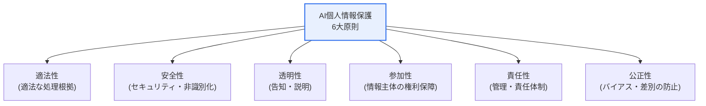
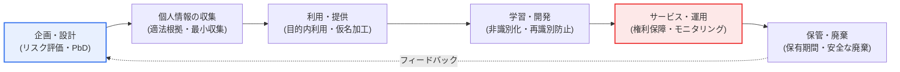

# AI個人情報保護自主点検表

## 1. 概要

### A. 概念

> **AI個人情報保護自主点検表**は、個人情報保護委員会が策定した指針であり、**AIサービスの企画・開発・運用の全過程において、個人情報を適法かつ安全に処理できるよう事業者が自ら点検**できるようにした自主規範である。個人情報保護委員会は2021年5月にこれを制定・公開し、個人情報保護法上の主要な義務と推奨事項をAI業務処理の段階に合わせて再配列し、事業者が自主的に履行状況を確認できるよう設計した。

この点検表が必要とされる根本的な理由は、「**AIは大量の個人情報を学習・活用するが、既存の規律だけでは新たなリスクを捉えきれない**」という点にある。AIは膨大なデータを学習することで性能を発揮する。そのデータには個人情報が大量に含まれやすく、学習・推論の過程で情報主体が予期しない方法で情報が処理されたり（目的外利用）、学習データから個人が再識別されたり、偏った結果によって差別が生じたりする可能性がある。たとえば2020年、韓国国内の対話型AIサービスが、学習データに含まれる実際の利用者の会話・個人情報を十分に仮名化・非識別化しないまま使用し、個人情報保護委員会の調査と課徴金・過料の賦課に至った事例は、データ収集段階の適法性と学習段階の非識別化が不十分であれば、サービス開始直後に大規模な侵害へと発展することを示した。このようなAI特有のプライバシーリスクは、事後規制だけでは防ぎにくい。

そこで、強制的な規制によってAIのイノベーションを萎縮させるよりも、事業者が開発段階から自ら個人情報リスクを点検・管理するよう誘導することが自主点検表の趣旨である。法は最低限の強行規範を定めるが、AI技術は法改正のスピードよりも速く進化する。したがって、詳細な技術については「何を確認すべきか」をチェックリスト形式で提供し、事業者が自社サービスの特性に合わせて柔軟に履行できるようにしたのである。AIライフサイクル（企画→データ収集→学習→サービス→管理）の各段階で、個人情報保護の原則（適法性・透明性・安全性など）を守っているかを自ら確認させることで、イノベーションと保護の調和を図るアプローチである。

これは、個人情報保護の原則を設計に内在化する「Privacy by Design」の実践でもある。すなわち、個人情報保護を事後対応（問題が起きてから措置を講じること）ではなく、事前設計（問題が起きないようアーキテクチャ・プロセスに組み込むこと）へと移す思想であり、自主点検表はその実践ツールを段階別の確認項目として具体化したものである。[[privacy-by-design]]

### B. 登場の背景と目的

自主点検表が登場した背景には、三つの流れが重なっている。第一に、データ3法の改正（2020年）によって仮名情報の概念が導入され、AI学習用データ活用の法的根拠が整備されたものの、実務において「どこまでが適法なのか」について事業者の混乱が大きかった。第二に、対話型・推薦型AIが実サービスに急速に普及し、学習データの再識別・目的外利用といった新種のリスクが現実化した。第三に、EUをはじめとする国際社会がAI規制（後のEU AI Actなど）を準備する中で、韓国国内でも先制的なガイドラインの必要性が提起された。こうした文脈の中で、個人情報保護委員会は強制規制に先立つ段階のソフトロー（soft law）として自主点検表を公表した。

目的は明確である。**AIの開発・運用過程における個人情報侵害リスクを事業者が先制的に診断・予防し、AIのイノベーションと個人情報保護を調和させること**である。規制遵守の負担を最小化しつつ情報主体の信頼を確保し、結果としてAIサービスの持続可能性を高めることが究極的な目標である。

## 2. 基本原則（6大原則）

自主点検表は、個人情報保護の原則をAIの文脈に合わせて六つに整理して提示している。各原則は互いに独立しておらず、かみ合って機能する。以下の表は比較・整理を助ける補助手段であり、各原則が「なぜ必要なのか」は続く段落で説明する。

| 原則 | 内容 | AI特有の含意 |
|---|---|---|
| **適法性** | 個人情報の収集・利用に関する適法な根拠の確保 | クローリング・公開データ学習の根拠の正当性 |
| **安全性** | 仮名・匿名加工、アクセス制御などの安全管理措置 | 学習データの再識別防止 |
| **透明性** | 処理の事実・目的の告知、自動化された決定の説明 | アルゴリズムの説明可能性（XAI） |
| **参加性** | 閲覧・訂正・削除など情報主体の権利保障 | 学習データの削除要求権（忘れられる権利） |
| **責任性** | 処理の全過程にわたる管理・責任体制 | AIガバナンス・DPOの指定 |
| **公正性** | バイアス・差別のない処理 | データ・モデルのバイアス緩和 |

**適法性**はあらゆる処理の出発点である。AI学習で特に問題となるのはWebクローリング・公開データの活用であるが、「公開されている」という事実だけで無制限の学習が正当化されるわけではない。情報主体が公開した目的や合理的に予見可能な範囲を逸脱すれば違法となり得るため、収集根拠（同意・法令・正当な利益など）を学習データ単位で管理しなければならない。

**安全性**は、AIにおいては再識別の防止として具体化される。仮名加工を施していても、他の情報と結合すれば個人が特定され得る（リンケージ攻撃）し、モデルが学習データをそのまま記憶して出力する暗記（memorization）現象によって原本が再現され得る。したがって非識別化措置は一回限りのものではなく、結合リスク・モデル出力リスクまで考慮した継続的な管理でなければならない。

**透明性・参加性・責任性・公正性**は、情報主体との信頼の軸である。自動化された意思決定（例：AIによる融資審査の拒否）についてその根拠を説明し（透明性）、情報主体が異議を申し立て、自身のデータの削除を要求できるようにし（参加性）、これを組織として責任を負い（責任性）、特定の集団に不利なバイアスを取り除く（公正性）ということである。この四つの原則が崩れれば、技術的に安全であっても社会的受容性を失う。

## 3. AIライフサイクルの段階別点検フロー

自主点検表は、AIサービスのライフサイクル（業務処理の段階）に沿って点検項目を配置している。個人情報保護委員会はこれを概ね、企画・設計 → 個人情報の収集 → 利用・提供 → 保管・廃棄 → サービスの管理・監督 → 利用者保護に至る流れとして構成し、段階別の点検項目と詳細な確認事項（数十項目規模）を提示している。各段階で事業者は、個人情報処理の適法性・安全性を自ら確認する。

**A. 企画・設計段階.** この段階の核心は、「後から直すのが難しいことを今決める」という点にある。サービスアーキテクチャが確定してしまうと、個人情報の流れを変えるコストが急増するため、企画の時点で個人情報影響評価（PIA）とPrivacy by Designの観点を反映しなければならない。どのようなデータをなぜ収集するのか、匿名・仮名で代替可能か、処理の最小化が可能かを設計図に明確に刻み込んでこそ実効性がある。この段階を飛ばせば、その後のすべての点検が後の祭りとなる。

**B. 個人情報の収集段階.** 適法根拠の確保、最小限の収集、収集目的の明確化が要諦である。AIには「多ければ多いほどよい」というデータへの貪欲さがあるため、目的と無関係な情報まで根こそぎ集めがちである。収集段階で目的適合性と最小性を検証しなければ、その後の学習・サービスの全過程が違法の種を抱えたまま進むことになる。同意を根拠とするのであれば、その同意が学習への利用までカバーしているか、正当な利益を根拠とするのであれば、情報主体の権利利益との比較衡量が行われたかを確認する。

**C. 学習・開発段階.** 仮名・非識別化処理と再識別の防止が中心となる。学習データから個人識別子を除去しつつ、前述の結合攻撃・モデルによる暗記のリスクを考慮する。近年では、差分プライバシー（differential privacy）、連合学習（federated learning）のようなプライバシー強化技術（PET）を適用し、原データを露出させずに学習する方式も確認項目に含まれ得る。開発者は「非識別化したから安全だ」という仮定を検証（再識別を試みるテスト）しなければならない。

**D. サービス・運用・廃棄段階.** 情報主体の権利（閲覧・訂正・削除）の保障、継続的なモニタリング、インシデント対応、保有期間経過後の安全な廃棄が核心である。AIにおいて削除権は特に厄介であるが、それはすでに学習済みのモデルから特定個人の影響を消すこと（machine unlearning）が技術的に難しいためである。したがって、削除要求にどのように対応するかを運用手順としてあらかじめ定めておかなければならない。運用中に新たなリスクが発見されれば、企画段階へフィードバックして改善する循環構造が望ましい。

## 4. 類似の制度・規範との比較

自主点検表を正しく理解するには、隣接する規範との関係を見る必要がある。以下の比較は、項目の羅列ではなく「なぜこのように分かれるのか」という観点から整理したものである。

| 区分 | AI自主点検表 | 個人情報影響評価（PIA） | EU AI Act |
|---|---|---|---|
| **性格** | 自主規範（soft law） | 法定義務（公共機関など） | 強行規制（hard law） |
| **焦点** | AIライフサイクルの個人情報 | 特定システムのリスク診断 | AIのリスク等級別の義務 |
| **強制性** | 勧告・自主 | 対象機関の義務 | 違反時に制裁 |
| **適用時点** | 全過程で常時 | 構築前 | 市場投入・運用 |

自主点検表とPIAは「事前のリスク診断」という点で似ているが、PIAが特定システムの構築前に一度実施する定型化された法定手続きであるのに対し、自主点検表はAIライフサイクル全般にわたって常時自ら確認するソフトローであるという違いがある。実務的には、PIAの結果を自主点検表の企画・設計段階の点検に入力値として連携させれば、重複を減らし整合性を高めることができる。

EU AI Actと比較すると、アプローチの哲学の違いが際立つ。AI ActはAIをリスク等級（禁止・高リスク・限定的・最小）に分類し、高リスクAIに強行的な義務を課す「規制優先」方式である。一方、韓国の自主点検表は、まず自主規範によって事業者の責任を誘導し、必要に応じて法制化へと進む「自主優先」方式である。この違いは、イノベーションの促進と権利保護の間で重心をどこに置くかという政策選択を反映している。ただし、韓国でも今後AI関連の法制（人工知能基本法など）が整備されれば、自主規範と強行規範の役割分担は再編されるとみられる。

## 5. 深掘り — 生成AI時代における拡張と実務適用

自主点検表の制定当時（2021年）と比べると、生成AI（LLM）の大衆化は個人情報リスクの様相を大きく変えた。第一に、**学習データ規模の爆発的増加**である。数千億トークン規模のWebデータを学習する大規模言語モデルでは、その中に含まれる個人情報の出所・適法性を個別に確認することは事実上不可能である。これは適法性・最小収集の原則と真正面から緊張関係にある。第二に、**暗記・再現リスクの深刻化**である。LLMが学習データ中の氏名・住所・電話番号を特定のプロンプトに対してそのまま吐き出す事例が報告されたことで、非識別化の実効性の検証が必須となった。第三に、**プロンプトを通じた新たな収集**である。利用者が対話画面に入力した機微情報が再び学習に使われる経路が生じたことで、収集・利用段階の点検をサービス運用中も継続しなければならなくなった。

第四に、**グローバルな規制強化との同調**である。EUが2024年にAI Actを確定し、GDPR上の自動化された決定・プロファイリングの規律を強化したことで、韓国の事業者も海外向けサービスのために同水準の事前点検を求められるようになった。自主点検表は、こうした国際規制に対応するための国内の基準線（baseline）としての役割を果たす。

実務適用の観点では、自主点検表は組織内の**AIガバナンス体制**の骨格として活用される。たとえば、ある公共機関が苦情相談チャットボットを導入する際、学習データに含まれる実際の申請者の氏名・連絡先を仮名加工しないまま使用していたところ、自主点検表の「学習・開発段階」の確認事項（再識別防止措置の有無）に引っかかり、サービス開始前に非識別化パイプラインを再構築した事例のように、点検表はリリース後の大規模インシデントを事前に食い止めるゲートとして機能する。たとえば金融・医療のように機微情報を扱う産業では、個人情報保護責任者（CPO/DPO）が自主点検表の項目を社内の開発標準（secure/privacy SDLC）に組み込み、モデル学習の着手前にデータ適法性レビュー（DPIA）と再識別テストをゲートとして設ける方式が広がっている。また、グローバル企業は自主点検表の精神をISO/IEC 42001（AIマネジメントシステム）・NIST AI RMFのような国際フレームワークとマッピングし、国内外の規制を一つの統制体系として統合管理することもある。このように自主点検表は単なるチェックリストを超え、個人情報保護を組織の開発・運用プロセスに組み込むガバナンスのアンカーとして機能する。[[genai-security]]

## 6. 考慮事項および示唆（技術士の観点）

1. **イノベーションと保護のバランスが核心である。** 自主規範は、強制規制の硬直性を避けつつ事業者の自発的な責任を誘導するアプローチであり、AIの発展を阻害せずに個人情報を保護しようとするバランス点である。ただし、自主性だけに委ねれば「守る者だけが損をする」という逆選択が生じ得るため、認証・インセンティブ（安全な処理を行う事業者に対する規制緩和）と組み合わせることで実効性が高まる。

2. **設計段階での内在化（Privacy by Design）が鍵である。** 事後点検ではなく、企画・設計の段階から個人情報リスクを考慮してこそ実効性があり、自主点検表はこれを各段階の点検によって誘導する。技術士の観点からは、個人情報フロー図（data flow）をアーキテクチャ設計の成果物として明示化し、プライバシー要件を非機能要件として管理する方策が必要である。

3. **プライバシー強化技術（PET）との連携が今後の展望である。** 差分プライバシー・連合学習・準同型暗号・合成データなどは、「データを保護しながら学習・活用すること」を可能にする。自主点検表の安全性原則を技術的に裏付ける手段であり、今後、標準的な点検項目に組み込まれる可能性が高い。コスト・性能のトレードオフ（例：差分プライバシーによる精度低下）も併せて管理しなければならない。

4. **削除権・忘れられる権利とmachine unlearningの技術的難題に備えなければならない。** 学習済みのモデルから特定個人の痕跡を除去することは、再学習のコストが大きく、完全性の検証も難しい。政策的には、削除要求への対応手順（再学習の周期・近似的アンラーニング・出力フィルタリング）をあらかじめ設計しておくことが現実的な妥協点である。

5. **国際規制との整合性の確保が必要である。** EU AI Act・GDPR、ISO/IEC 42001、NIST AI RMFなどと国内の自主点検表を相互にマッピングし、一つの統制体系として運用すれば、グローバルサービスの規制対応コストを下げ、越境データ移転のリスクを低減できる。

6. **自主規範の限界と認証・監査との連携が課題である。** 自主点検は事業者の善意に依存するため、実際の履行水準を外部から検証しにくいという根本的な限界がある。したがって、個人情報保護認証（ISMS-Pなど）や第三者監査と連携させて自主点検結果の信頼性を担保し、不履行時に責任を問うことのできる事後検証体制を併せて整える方向へ進化する必要がある。

## 参考資料

- 個人情報保護委員会、「人工知能（AI）個人情報保護自主点検表」（2021年5月制定） — https://www.privacy.go.kr/front/bbs/bbsView.do?bbsNo=BBSMSTR_000000000049&bbscttNo=12468
- 大韓民国政策ブリーフィング、「個人情報保護委員会、人工知能（AI）関連の個人情報保護自主点検表を公開」報道資料 — https://m.korea.kr/briefing/pressReleaseView.do?newsId=156552450
- 個人情報保護委員会 個人情報保護総合ポータル — https://www.privacy.go.kr

---

> **一言まとめ**: AI個人情報保護自主点検表は、*個人情報保護委員会が2021年に策定した、AIライフサイクルの全過程において個人情報を適法かつ安全に処理できるよう事業者が自ら点検する自主規範* であり、適法性・安全性・透明性・参加性・責任性・公正性の6大原則を段階別に点検してイノベーションと保護を調和させるものであって、生成AI時代においてはPET・ガバナンスと結び付くことでその重要性が高まっている。
