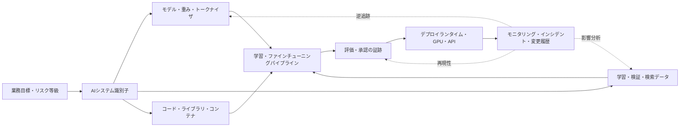
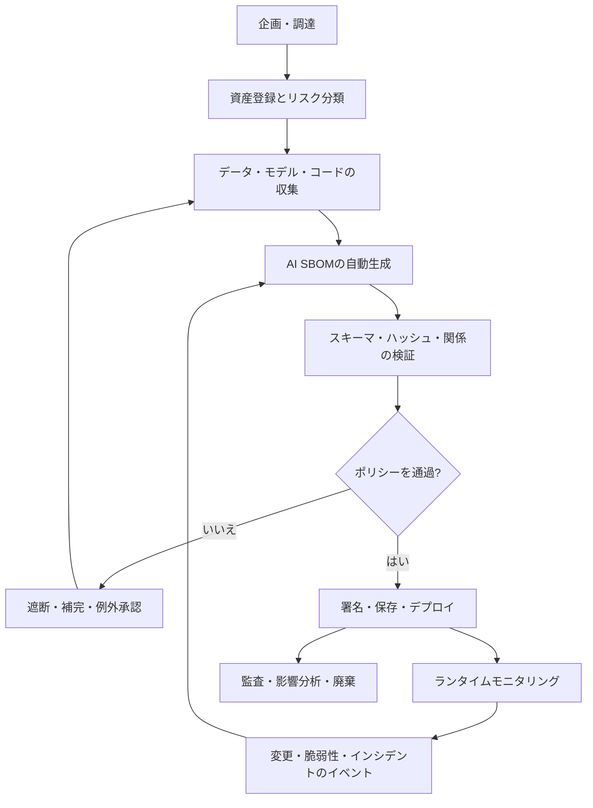

# AIソフトウェアBOM（AI SBOM）と人工知能サプライチェーンの透明性

## 1. 概要

> **定義**: AIソフトウェアBOM（AI Software Bill of Materials、AI SBOMまたはAIBOM）とは、人工知能システムを構成するモデル・データセット・ソフトウェア・パイプライン・インフラ・外部サービスと、それらの間のサプライチェーン関係を、バージョン、出所、ライセンス、完全性の情報とともに機械可読形式で記録する構成明細書である。

従来のSBOMは、アプリケーションを構成するパッケージ、ライブラリ、コンテナと依存関係を特定し、ソフトウェアサプライチェーンの可視性を高める。
AIシステムにはこれに加えて、モデルの重み、学習データ、ラベリングの過程、埋め込みモデル、プロンプト、検索インデックス、評価セット、GPUランタイム、外部推論APIに至るまで、結果に影響を与える資産が存在する。
したがって、コードの依存関係だけを列挙したSBOMでは、モデルの出所がどこか、どのようなデータで学習されたか、どのモデルを継承したか、デプロイ時にどのサービスと接続されるかを十分に説明することは難しい。

AI SBOMの目的は単なるリスト作成ではない。
構成要素の存在を確認し、構成要素間の関係を追跡し、変更が性能・セキュリティ・法的責任に及ぼす影響を迅速に判断することが核心である。
たとえばRAGサービスにおいて埋め込みモデルを差し替えるだけでも、検索結果の分布と個人情報露出の可能性が変わり得る。
AI SBOMがモデル・データ・インデックス・評価結果を結び付けていれば、変更されたノードから影響を受けるサービスと再検証項目を逆引きで見つけ出すことができる。

AIサプライチェーンの透明性は、開発組織だけの課題ではない。
調達担当者は外部モデルのライセンスと利用制限を確認しなければならず、セキュリティ担当者は悪意あるモデルファイルと脆弱なライブラリを点検しなければならず、個人情報担当者は学習・検索データの処理根拠と削除要求の反映状況を確認しなければならない。
運用組織はモデル更新後の品質低下とドリフトを追跡し、監査組織は意思決定時点の構成と承認の証跡を再現できなければならない。

本答案では、AI SBOMの構成原理、ライフサイクル別の生成・検証方式、CycloneDXとSPDXの活用、既存文書との違い、導入事例および技術士の観点からの考慮事項を論述する。
AI SBOMはモデルカードやデータシートを代替する単一の文書ではなく、複数の説明文書と自動生成された構成関係を結び付ける識別・追跡のレイヤーとして理解すべきである。

## 2. AI SBOMの構成原理と管理対象

### 2.1 従来のSBOMからAI SBOMへ拡張される理由

ソフトウェアパッケージは、バージョンとハッシュを比較すれば同一性を比較的明確に確認できる。
一方、モデルは同じ名前であっても、重みファイル、トークナイザ、量子化方式、システムプロンプト、推論ランタイムが異なれば異なる挙動を示す。
データセットもまた、元データの収集時点、フィルタリングルール、重複除去、ラベル品質によって実質的な学習結果が変わる。
すなわち、AI構成要素の識別子は単なる名前ではなく、バージョン・出所・変換履歴・関係の束でなければならない。

また、AIシステムのリスクは構成要素そのものだけでなく、結合の仕方からも生じる。
公開モデルそのものは安全であっても、権限の広いツール呼び出しエージェントと結合すれば新たな攻撃面となる。
正常なデータセットであっても、個人情報を含む埋め込みインデックスと公開検索APIが接続されれば、再識別のリスクが高まり得る。
AI SBOMはこうした結合関係を表現することで、管理範囲を「何が入っているか」から「どのようにつながり、どのような責任を生むか」へと広げる。

### 2.2 全体構成の概念図

まず最初に、業務目的とリスク等級をシステム識別子に結び付けなければならない。
同じ基盤モデルを顧客相談と医療意思決定支援に使用するのであれば、モデルは同じでも、利用の文脈、許容される誤り、監督要件は異なる。
したがって、AI SBOMの最上位の単位はモデルファイルだけでなく、目的と運用境界を持つAIシステムまたはデプロイ単位とすることが望ましい。

モデル領域には、モデル名、バージョン、アーキテクチャ、重みの識別子、基盤モデルの系譜、ファインチューニングの有無、トークナイザを記録する。
データ領域には、データセット名とバージョン、出所、収集・同意の根拠、前処理、ラベリング、分割、保存期間と削除処理を結び付ける。
コード領域は一般的なSBOMと重なるが、学習・推論フレームワークおよびモデル変換ツールまで含めなければならない。

パイプライン領域は、学習とデプロイの再現性に直結する。
学習コードのコミット、ハイパーパラメータ、使用GPU、評価セットと結果を一つの実験またはモデルリリースと結び付ければ、「同じモデル」という表現を検証できる。
RAGであれば、文書収集、チャンキング、埋め込み、ベクトルデータベース、検索ランキング、プロンプトテンプレートも関係として表現しなければならない。
運用領域には、デプロイリージョン、エンドポイント、外部API、権限、モニタリングとインシデントチケットを収め、実際に使用されている構成と開発成果物との差を縮める。

### 2.3 管理対象別の中核情報

| 管理対象 | 記録すべき中核情報 | 管理目的 |
|---|---|---|
| モデル・重み | 名前、バージョン、ハッシュ、基盤モデル、ファインチューニング・量子化の履歴、ライセンス | モデルの同一性・系譜・使用権の確認 |
| データセット | 出所、収集時点、処理・ラベリング、同意・ライセンス、分割、品質指標 | データの権利・品質・バイアス・削除への対応 |
| ソフトウェア | パッケージ、バージョン、ハッシュ、脆弱性、ライセンス、ビルド関係 | コードサプライチェーンの脆弱性と再現性の管理 |
| パイプライン | 学習・評価・検索の段階、コードコミット、パラメータ、ツールバージョン | 実験の再現と変更影響分析 |
| インフラ | GPU・TPU、ランタイム、コンテナ、リージョン、ストレージ、ネットワーク境界 | 運用セキュリティ・性能・コスト・障害分析 |
| 外部サービス | 提供者、APIバージョン、契約・SLA、データ処理の場所、障害履歴 | 第三者・N次サプライチェーンのリスク管理 |
| ガバナンス | 目的、リスク等級、承認者、評価結果、制限条件、廃棄計画 | 説明責任・監査可能性・規制対応 |

表の項目を埋めるだけで透明性が完成するわけではない。
たとえばデータセットの出所URLを記録していても、前処理でどのレコードが除去されたのか、モデルの重みがそのデータセットのどのバージョンを使用したのかが結び付いていなければ、追跡は途切れてしまう。
したがって各項目は一意の識別子と生成時刻を持ち、`derived-from`、`uses`、`trained-on`、`deployed-as`、`evaluated-by`といった関係を通じてグラフとして結び付けられなければならない。

## 3. ライフサイクル別の生成・検証プロセス

### 3.1 生成・消費・フィードバックの流れ

企画段階では、システムの目的、ユーザー、許容される自動化の水準とリスク等級を定める。
この段階から、AI資産の所有者と提供者にどのようなAI SBOMのフィールドを要求するかを、契約書と調達基準に盛り込まなければならない。
後になってモデル提供者が出所や学習データの情報を公開しなければ、運用段階で補完することは難しいからである。

開発段階では、手作業のアンケートよりも、リポジトリ、モデルレジストリ、データカタログ、実験トラッキングシステムとCI/CDから事実を収集する。
モデルファイルは強力なハッシュとモデルレジストリのバージョンを併せて記録し、データセットは原本と派生版の関係およびアクセス権限を記録する。
自動収集が不可能なポリシー・制限事項・人間による監督要件は、担当者が署名する証跡領域として分離しつつ、その値の根拠文書をリンクする。

検証段階では、形式の検証と内容の検証を分けて実施する。
形式の検証では、スキーマ、必須フィールド、識別子の文法と関係の参照整合性を確認する。
内容の検証では、モデルのハッシュが実際のデプロイファイルと一致するか、ライセンスが利用目的に対して許容されているか、データへのアクセス権限が承認されているか、評価結果が現在のバージョンに帰属しているかを確認する。

デプロイ段階では、AI SBOMをリリースアーティファクトとして署名し、モデル・コンテナ・マニフェストとともに保管する。
デプロイされたモデルのハッシュまたは外部APIのバージョンがAI SBOMと一致しなければ、ポリシーエンジンがデプロイを停止するか、例外承認の手続きへ回す。
運用段階における重要な原則は、SBOMを一度生成して忘れないことである。
モデルの更新、データの削除、脆弱性の公表、外部APIの変更、プロンプトの変更、インシデントが発生するたびに新しいバージョンを生成し、前のバージョンとの差分を残す。

### 3.2 最小データモデルと証跡の意味

AI SBOMのレコードは、概ね`component`、`version`、`supplier`、`license`、`hash`、`relationship`、`source`、`timestamp`、`lifecycle`、`evidence`という構造で設計できる。
`component`はモデル・データ・コード・サービスの種類を区別し、`relationship`は構成・派生・学習・デプロイ・評価の関係を表現する。
`evidence`には、モデルカード、データシート、評価報告書、契約書、承認チケットの識別子を結び付ける。
こうすることで、AI SBOMは説明文書の代替物ではなく、説明文書の真正性と適用範囲を確認するための索引となる。

識別子には、人が読むための名前と、機械が比較できる安定した識別子を併せて持たせる。
ファイルハッシュは同一ファイルかどうかの判定には有用であるが、データセットの意味的な変更や外部APIの挙動変更までは保証しない。
そのため、データセットについてはバージョン・スナップショット・収集条件を、APIについては提供者・契約バージョン・モデルルーティングポリシーを併せて記録しなければならない。
「不明」を空欄のままにしておくことも危険である。
確認できなかった値は`unknown`と明示し、責任者・確認期限・リスク受容の可否を併せて記録してこそ、管理の死角を浮かび上がらせることができる。

### 3.3 品質検証の指標

AI SBOMの品質は、文書の長さよりも、実際の意思決定に使用できる度合いで評価する。
第一に、完全性とは、既知のモデル・データ・コード・サービスが漏れなく表現されているかを意味する。
第二に、正確性とは、レコードが実際の成果物のバージョンとハッシュに一致しているかを意味する。
第三に、最新性とは、変更後に定められた時間内に再生成されているかを意味する。
第四に、追跡可能性とは、構成要素からデプロイされたサービスと承認の証跡まで双方向に辿れるかを意味する。

たとえば組織は、「重要システムのリリースにおけるAI SBOM生成成功率100%」「モデル・データ変更の24時間以内の反映率95%」「重要構成要素の所有者指定率100%」といった指標を設けることができる。
しかし、生成率だけを高めて必須の関係の正確性を確認しなければ、中身のない自動化となる。
サンプリングしたリリースについて、SBOMのモデルハッシュ、データスナップショット、デプロイマニフェストを実際のシステムと照合する品質監査が必要である。

## 4. 標準と類似文書の比較

### 4.1 CycloneDXとSPDXの活用

CycloneDXは、ソフトウェア・ハードウェア・サービス・依存関係・脆弱性と機械学習モデルを一つのBOMモデルで表現できる形式である。
2025年10月に公開されたCycloneDX 1.7は、2025年12月にECMA-424第2版として採択され、機械学習モデルとサプライチェーンの透明性を含む汎用BOMとして位置付けられている。
組織がすでに既存のSBOM生成パイプラインを使用しているのであれば、モデルとデータに関する要素を同じBOMエコシステムに結び付けやすいという利点がある。

SPDX 3.0系は、AI ProfileとDataset Profileを独立したプロファイルとして提供している。
AI ProfileはAIシステムとモデル成果物、関連するソフトウェア構成要素および依存関係の交換を扱い、Dataset Profileはデータセットの名前・バージョン・出所・ライセンス・特性といった情報を扱う。
したがって、AIの構成とデータの説明を細分化して交換しようとする組織に適しているが、複数のプロファイル間の関係を設計し、利用側ツールのサポート範囲を確認しなければならない。

| 比較基準 | CycloneDX 1.7 | SPDX 3.0系 |
|---|---|---|
| 中心となる観点 | 多様なBOMの種類を一つのオブジェクトモデルで表現 | プロファイルごとにBOMの交換範囲と適合性を表現 |
| AI・MLの表現 | 機械学習モデル、構成、系譜・出所を汎用BOMに統合 | AI ProfileとDataset ProfileでAI・データ領域を区分 |
| 標準化の文脈 | OWASPプロジェクトが基盤、ECMA-424第2版として採択 | SPDX国際標準の系譜と3.0のプロファイル構造 |
| 導入上の強み | CI/CDや既存のSBOMツールと結び付けやすい | AI・データ・ライセンスのプロファイル別の相互運用性 |
| 留意点 | 組織のAIガバナンスのフィールドを拡張設計する必要がある | プロファイルの組み合わせとツールのサポート状況を検証する必要がある |

二つの形式のうちいずれかを選ぶことが、そのままAIガバナンス設計の完了を意味するわけではない。
標準はデータの文法と意味をそろえるが、どのフィールドを必須とするか、機微な学習データの出所をどの水準まで公開するか、リスク承認を誰が行うかは組織のポリシーの問題である。
実務では、社内のパイプラインとツールがよくサポートする形式で生成し、提供者からの調達や監査での交換で求められる形式に変換するという戦略も可能である。
変換の過程でモデルの系譜やデータの関係が失われないよう、元の識別子と変換ログを保存しなければならない。

### 4.2 モデルカード・データシート・SBOMとの違い

モデルカードは、モデルの意図された用途、限界、評価結果と倫理的考慮事項を人が読みやすい形で説明する。
データシートまたはデータカードは、データの収集・構成・処理・品質・制約を説明する。
一般的なSBOMは、ソフトウェア構成要素と依存関係、脆弱性とライセンスを中心とする。
AI SBOMはこれらの文書を代替するのではなく、それぞれの成果物と実際のリリース構成要素を識別子と関係によって結び付ける。

| 文書 | 主な問い | 強み | AI SBOMとの関係 |
|---|---|---|---|
| モデルカード | このモデルはどのような用途と限界を持つのか？ | 解釈・利用ガイドと評価の記述 | モデルレコードの説明証跡 |
| データシート・データカード | データはどのように作られ、どのような制約があるのか？ | 出所・品質・バイアス・処理の背景 | データセットレコードの根拠 |
| 一般的なSBOM | ソフトウェアの構成と脆弱性は何か？ | パッケージ・バージョン・ライセンスの自動化 | AI SBOMのコード部分集合 |
| AI SBOM | 現在のAIシステムは何で構成され、どのようにつながっているのか？ | 系譜・変更・影響分析・サプライチェーン追跡 | 他の文書と成果物を結び付ける基準点 |

文書が増えるほど、重複入力を減らす設計が重要になる。
たとえば、モデルカードのモデルバージョンとAI SBOMのモデルバージョンが互いに異なれば、どちらの文書が最新なのか分からなくなる。
モデルレジストリの単一の識別子を基準に、説明文書、評価結果、デプロイBOMがそれを参照するようにし、文書本文には人のための説明を維持する方式が適切である。

## 5. 実装アーキテクチャと統制方策

### 5.1 参照アーキテクチャ

AI SBOMリポジトリは、データカタログ、モデルレジストリ、コードリポジトリ、CI/CD、評価プラットフォーム、デプロイプラットフォームと連携する。
コレクタは各システムから構成情報を読み取って標準オブジェクトに変換し、関係アナライザは学習・派生・デプロイ・評価の関係を補強する。
ポリシーエンジンは、ライセンス上の禁止、出所未確認、リスク評価未完了、脆弱なランタイム、ハッシュ不一致といった条件をリリースゲートとして検査する。
署名済みBOMリポジトリはリリースごとの不変性を保証し、検索インデックスは監査・影響分析を迅速に実施できるようにする。

権限は、生成者、利用者、監査者に分離する。
開発者はモデルとコードの構成要素を生成できるが、個人情報を含むデータの詳細な原文を閲覧する必要はない場合がある。
監査者は関係と承認の証跡を読めなければならないが、重みや原データのダウンロード権限まで持つ必要はない。
AI SBOM自体にも機微な提供者情報やセキュリティ脆弱性の情報が含まれ得るため、公開用、内部用、制限用のビューを分離する。

### 5.2 導入手順

1. まず業務システムとAI資産の範囲を定め、モデル・データ・コード・サービス・インフラの所有者を指定する。
2. 次に、既存のSBOM、データカタログ、モデルレジストリからすでに取得できるフィールドを調査し、重複した収集を減らす。
3. リスクの高い生成AI、外部モデルAPI、個人情報処理システムをパイロット対象として選定する。
4. 標準形式を定め、必須フィールド、許容される`unknown`、証跡の保存期間、変更イベントをポリシーとして文書化する。
5. CI/CDにおいて、コミット・ビルド・モデル登録の際にAI SBOMを自動生成し、生成失敗をリリース失敗として扱う。
6. デプロイマニフェストと署名済みBOMをともに保管し、ランタイムにおいて実際の構成と照合する。
7. 脆弱性・ライセンス・データ削除・モデルドリフトのイベントが発生した場合は、影響分析によって関連システムを特定し、再評価する。
8. 四半期ごとにサンプルリリースを選定し、完全性・正確性・最新性・追跡可能性を監査してポリシーを改善する。

### 5.3 セキュリティと個人情報の統制

AI SBOMは透明性を高める一方で、攻撃者に構成情報を与えてしまう可能性もある。
モデルファイルの場所、脆弱なライブラリ、内部APIやデータセット名を外部にそのまま公開すれば、サプライチェーン攻撃の偵察情報となる。
したがって、外部公開用のBOMは最小限の情報と要約された識別子のみを提供し、詳細なBOMは強力な認証と目的別の権限の下に置く。

学習データの出所を記録することと、元の個人情報をBOMにコピーすることは異なる。
BOMにはデータカタログの識別子、処理根拠、保存ポリシー、削除要求の状態を参照として残し、原文は別途の保護されたストレージに置く。
削除または訂正の要求があった場合には、該当するデータセットのバージョンから派生したモデル・埋め込み・キャッシュ・バックアップを特定し、再学習と再デプロイの範囲を決定しなければならない。
このとき、AI SBOMの`trained-on`と`derived-from`の関係が、個人情報処理の影響分析を助ける。

モデルの重みとBOMには電子署名を適用し、署名鍵は別の鍵管理システムで保護する。
BOMが改ざんされていないという事実だけでモデルが安全になるわけではないが、リリース時点の構成と事後の変更を区別できる基盤となる。
外部のモデルとデータは、信頼できる提供者、ハッシュ検証、悪意あるファイルの検査、ライセンス検査、評価結果の確認を通過した場合にのみレジストリに登録する。

## 6. 適用事例

### 6.1 事例1：社内ナレッジRAGサービス

ある企業が、社内規程とプロジェクト文書を検索して回答するRAGサービスを運用していると仮定する。
当初はLLMの名前とAPIキーだけを管理していたが、埋め込みモデルとチャンキングルールを変更した後、検索精度とアクセス制御が同時に揺らぐ可能性がある。
AI SBOMには、原文リポジトリのスナップショット、文書収集のコミット、チャンキングのバージョン、埋め込みモデルのハッシュ、ベクトルインデックスのバージョン、検索ランキングの設定、プロンプトテンプレート、外部LLM APIのバージョンを結び付ける。

個人情報の削除要求が発生した場合は、データカタログで削除対象を探し、AI SBOMの関係を辿って文書スナップショット・埋め込み・インデックス・キャッシュ・評価セットを照会する。
モデルを変更するデプロイでは、以前のBOMと新しいBOMの差分を算出し、検索品質、権限の迂回、ハルシネーション率の評価を改めて実施する。
この方式は、単に「RAGを使用している」と記録するよりも、変更の原因と影響を説明できるようにする。

### 6.2 事例2：外部基盤モデルの調達

ある金融会社が、外部提供者の基盤モデルを購入して相談支援に使用すると仮定する。
契約前には、モデルのバージョン・重みまたはAPIのバージョン、学習データの出所の公開範囲、商用利用権、入力データの再学習への利用有無、障害・更新の通知条件を要求する。
提供者が提供するAI SBOMとモデルカード、評価報告書を内部レコードと結び付け、公開されていないフィールドは`unknown`として残したうえで、リスク受容者と補完期限を指定する。

デプロイ後に提供者がモデルルーティングを変更すれば、同じAPI名であっても実質的な構成は変わる。
SLAに基づく変更通知のイベントを受けて新しいBOMを保存し、金融相談という利用目的に必要な精度・バイアス・個人情報・説明可能性の評価を改めて実施する。
契約終了時には、モデル・プロンプト・検索データ・ログ・派生成果物の返却と削除の範囲をBOMの関係によって確認する。
この事例において、AI SBOMは技術文書であると同時に、調達・監査・責任分界の基準点として機能する。

## 7. 深掘り：2026年の標準・政策動向と出題ポイント

最近のAIサプライチェーンに関する議論は、モデルの性能競争から、構成と出所の検証競争へと拡大している。
CISAと国際パートナーによるAI SBOMの最小要素に関するガイダンスは、従来のSBOMだけでは捉えにくいモデル・データ・システムレベルの透明性情報を補完する方向性を示している。
ただし、ガイダンス文書の最小要素は、あらゆる組織のリスクや業界規制を完全に代替する義務的チェックリストとして解釈すべきではなく、組織は利用の文脈とリスク等級に合わせてフィールドを拡張しなければならない。

CycloneDX 1.7およびECMA-424第2版は、ソフトウェアとハードウェアだけでなく、サービス、脆弱性、暗号資産、機械学習モデルをサプライチェーンの透明性の観点から表現できる汎用BOMへと発展した。
SPDX 3.0系は、AI ProfileとDataset Profileを通じて、AIシステム・モデルとデータセットの情報を交換するプロファイル構造を提供している。
両形式は、競合してどちらか一方だけを採用すべき関係というよりも、ツールエコシステム・調達要件・データガバナンスの成熟度に応じて選択または変換できる相互運用性の手段である。

技術士の答案では、AI SBOMを単なる「AI構成要素のリスト」と定義するだけでは不十分である。
第一に、既存のSBOMとの違いを、モデル・データ・パイプライン・外部サービスの関係によって説明しなければならない。
第二に、自動生成と署名、リリースゲート、ランタイムでの照合、変更影響分析という閉ループを提示しなければならない。
第三に、透明性と機密性のトレードオフ、データの最小収集と削除要求、提供者が公開しない情報の`unknown`処理までを併せて論じなければならない。
最後に、標準形式そのものよりも、責任者・品質指標・監査・例外承認というガバナンスこそが成功の条件であることを、結論で強調しなければならない。

## 8. 考慮事項および示唆

### 8.1 範囲と識別単位の一貫性

AI SBOMの最上位の単位をモデルとするかサービスとするかは、組織によって異なり得る。
しかし、プロジェクトごとに恣意的に定めると、同じモデルを何度も数えたり、一つのサービスに潜むデータ・ツールの依存関係を見落としたりすることになる。
業務目的・デプロイ境界・リスク等級を持つシステム識別子を基準とし、その下にモデル・データ・コード・サービスを階層的に結び付けなければならない。

### 8.2 自動化と人間の判断の分離

コード・コンテナ・モデルのハッシュ・パイプラインのバージョンは、可能な限り自動で生成してこそ最新性と正確性を高めることができる。
一方、利用目的、同意の根拠、バイアスの許容水準、人間による監督とリスク受容は、自動スキャンだけでは決定できない。
自動生成領域と責任者承認領域を区別し、手動入力についても根拠文書と有効期限を求めることが望ましい。

### 8.3 標準の採用よりも意味の保存

CycloneDXとSPDXの間で変換する際に名前とバージョンだけを移すと、モデルの系譜、データ処理、評価の証跡の意味が失われる可能性がある。
組織は標準を選択する前に必要な関係とフィールドをリスト化し、変換テストによって情報の損失を測定しなければならない。
変換できない値は恣意的に捨てるのではなく、拡張フィールドや外部参照として保存する。

### 8.4 セキュリティと公開性のバランス

透明性はサプライチェーンのリスクの発見を可能にするが、詳細なBOM自体が機微な運用情報となり得る。
外部の提供者・監査者・開発者・運用者ごとのビューを作成し、脆弱性と内部の所在情報は最小権限で制限しなければならない。
BOMの完全性・可用性・機密性を情報セキュリティマネジメントシステムの資産として分類し、保存・廃棄のポリシーを定める。

### 8.5 個人情報とデータ主権

データの出所と系譜を詳細に残すほど、元の個人情報を過度に複製するリスクも大きくなる。
AI SBOMは原本を保管する場所ではなく、データカタログと処理記録を参照する場所として設計し、削除・訂正の要求を派生モデルや埋め込みにまで結び付ける。
国外のクラウド・外部APIを使用する場合は、処理地域、再学習への利用有無、国外移転と委託関係を提供者のレコードに明記する。

### 8.6 継続的な品質・運用体制

AI SBOMはリリース一回きりの文書作業ではなく、変更管理と運用監視の一部である。
モデルドリフト、データ分布の変化、脆弱性の公表、外部APIの変更、インシデントチケットをSBOM更新イベントとして定義し、影響分析の結果が再評価へとつながるようにしなければならない。
完全性・正確性・最新性・追跡可能性の指標を経営陣と技術組織の双方に報告し、コストを統制しながらも重要システムの空白を優先して解消する。

## 参考資料

- CISA, Software Bill of Materials for AI - Minimum Elements: https://www.cisa.gov/resources-tools/resources/software-bill-materials-ai-minimum-elements
- CISA, 2026 Minimum Elements for a Software Bill of Materials: https://www.cisa.gov/resources-tools/resources/2026-minimum-elements-software-bill-materials-sbom
- Ecma International, ECMA-424, 2nd edition, December 2025: https://ecma-international.org/publications-and-standards/standards/ecma-424/
- CycloneDX Specification Overview: https://cyclonedx.org/specification/overview/
- CycloneDX Authoritative Guide to ML-BOM: https://cyclonedx.org/guides/OWASP_CycloneDX-Authoritative-Guide-to-AI-ML-BOM-en.pdf
- SPDX Specification 3.0.1 AI Profile: https://spdx.github.io/spdx-spec/v3.0.1/model/AI/AI/
- SPDX Specification 3.0.1 Conformance: https://spdx.github.io/spdx-spec/v3.0.1/conformance/
- NIST AI Risk Management Framework: https://www.nist.gov/itl/ai-risk-management-framework

---

> **一言まとめ**: AI SBOMは、モデル・データ・コード・パイプライン・サービスの構成と系譜を署名・検証可能な関係として管理することで、AIサプライチェーンの透明性、再現性、影響分析と説明責任を高める運用基盤である。
