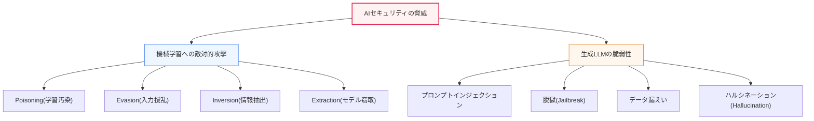
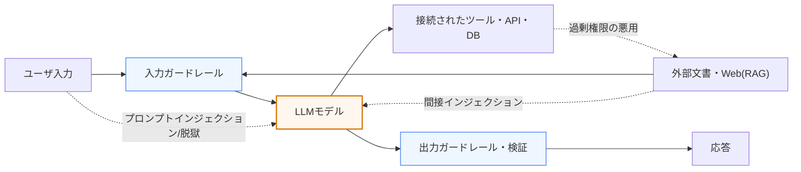

# AIセキュリティの脅威: 敵対的攻撃と生成AIの脆弱性

## 1. 概要

### A. 定義
> **AIセキュリティの脅威** とは、人工知能の導入拡大に伴って現れる新たな類型のセキュリティ脅威であり、機械学習の**学習・推論プロセスを直接狙う敵対的攻撃(Adversarial Attack)** と、大規模言語モデル(LLM)に代表される**生成AI特有の脆弱性** を包括する。

AIセキュリティが従来の情報セキュリティと根本的に異なる点は、「**モデルそのものが攻撃の対象であり、攻撃の経路にもなる**」ということである。伝統的なハッキングがオペレーティングシステム・ネットワーク・アプリケーションのコードの脆弱性(バッファオーバーフロー、SQLインジェクションなど)を突くのに対し、AIへの攻撃はコードの欠陥ではなく、**モデルがデータから学習した統計的な判断境界** を巧妙に操作する。学習データを汚染したり、人の目には正常に見える入力に微小なノイズを加えてAIにまったく異なる結論を出させたりするといったやり方である。

最も有名な例が、一時停止標識(Stop sign)に人の目には落書きのように見えるステッカーを数枚貼り、自動運転の認識モデルにそれを「速度制限標識」と誤分類させた研究である。ピクセル単位では微小な変化であるが、モデルの決定境界を越えさせてしまうのである。AIが自動運転・医療画像診断・金融の不正取引検知・セキュリティ監視のように、人の安全と財産がかかった判断を担うようになるにつれ、こうした誤動作はそのまま物理的・社会的な被害につながる。さらに、ChatGPT以降に生成AIが大衆化したことで、プロンプトを通じた指示の乗っ取り、安全装置の回避(脱獄)、有害コンテンツの大量生成といった**自然言語インタフェース特有の脅威** が新たに加わった。

### B. 登場背景および必要性
AIが重要インフラや意思決定に深く関与するほど、その誤動作を引き起こす攻撃の波及力も大きくなる。かつてのセキュリティが「システムを守る」問題であったとすれば、今では「学習された判断を信頼できるか」という問題が加わったのである。特に生成AIが企業の業務(コード作成、文書要約、顧客対応)に浸透するにつれ、モデルに接続された社内データ・ツール・権限が新たな攻撃面(attack surface)となった。

これに伴い、各国の規制や標準も急速に整備されつつある。OWASPは**LLMアプリケーションTop 10** を発表して生成AIの脆弱性を体系化し、MITREはAI攻撃の戦術・技術を整理した**ATLAS** ナレッジベースを、NISTは**AIリスクマネジメントフレームワーク(AI RMF)** と敵対的機械学習の分類体系を公表した。これは、AIセキュリティが一回限りの対応ではなく、**AIライフサイクル全体に内在化(Secure AI by Design)すべき恒常的な課題** となったことを意味する。

## 2. AIセキュリティ脅威の全体像

まず、脅威がAIライフサイクルのどの地点を狙うのかという全体地図を描けば、個々の攻撃の位置と防御ポイントが明確になる。

大きく見れば、脅威は二系統である。一つは分類・予測モデル全般を狙う**機械学習への敵対的攻撃**、もう一つは自然言語で指示を受ける**生成LLM特有の脆弱性** である。以下では、各系統を原理と防御の観点から文章で詳しく説明する。

## 3. 機械学習への四つの敵対的攻撃と防御

敵対的攻撃は、「AIライフサイクルのどの段階を、何を目標として狙うか」で区分すると体系的に理解できる。学習段階を狙えばポイズニング、推論段階を狙えば回避、モデルに含まれる情報を引き出せば反転、モデル自体を複製すれば抽出である。

### A. ポイズニング(Poisoning) — 学習データの汚染
**ポイズニング** とは、モデルが学習するデータに悪意あるサンプルを混入させ、完成したモデルの判断を最初から歪める攻撃である。学習が「データから規則を帰納する」プロセスであることを逆手に取る。特に危険な形態が**バックドア(Backdoor)攻撃** であり、特定のトリガ(例: 画像の隅にある小さなパターン)があるときだけ誤動作し、普段は正常に動作するため検知が難しい。

この攻撃は、データを外部から大量に収集する環境であるほど危険である。ユーザのフィードバックで継続的に再学習する推薦・チャットボットシステムや、公開されたクローリングデータで学習する基盤モデルが標的となる。防御は、学習前に**データの出所検証(provenance)・外れ値検知・データクレンジング** を置くことが核心であり、再学習パイプラインにデータの完全性検証と変更追跡を組み込み、汚染サンプルを除外しなければならない。

### B. 回避(Evasion) — 推論時の入力撹乱
**回避** とは、すでにデプロイされたモデルに対し、入力値を人が気づきにくい水準で微小に変形(adversarial perturbation)させて誤分類を誘導する攻撃である。前述の一時停止標識のステッカーや、画像に目に見えないノイズを加えて「パンダ」を「テナガザル」と分類させた古典的な事例がこれに該当する。モデルの決定境界が高次元空間において意外にも脆弱であるという性質を突くものである。

回避はスパムフィルタの回避、マルウェア検知の回避、生体認証の回避など、セキュリティモデルを直接無力化するのに使われ得るため、危険度が高い。代表的な防御は**敵対的学習(Adversarial Training)** であり、意図的に敵対的サンプルを学習データに含めてモデルの頑健性(robustness)を高める。このほか、入力の正規化・前処理、複数モデルのアンサンブル、防御的蒸留(distillation)などが併用される。ただし、完全な防御は難しく、攻撃と防御が絶えず進化し続ける領域であるため、断定的な「解決」よりも継続的な頑健性評価が現実的である。

### C. 反転(Inversion)とメンバーシップ推論 — 情報の抽出
**モデル反転(Model Inversion)** とは、モデルの出力(確率・信頼度)を繰り返し観察・分析し、学習に使われた機微データを逆に復元する攻撃である。関連する**メンバーシップ推論(Membership Inference)** は、「特定の個人のデータが学習に含まれていたか」を突き止めるものであり、それ自体がプライバシーの侵害となる。例えば、医療診断モデルから特定の患者の機微情報が推測される可能性がある。

この攻撃はモデルが学習データを過度に「暗記」している場合に深刻化するため、防御はプライバシー保護技術が中心となる。**差分プライバシー(Differential Privacy)** によって学習過程に制御されたノイズを加えて個々のデータの影響をぼかし、出力の詳細度(確率値の露出)を制限し、必要に応じて連合学習(Federated Learning)によって元データを中央に集めないようにする。

### D. 抽出(Extraction) — モデルの窃取
**抽出(Model Extraction/Stealing)** とは、公開された予測APIに大量の問い合わせを投げ、その入力と出力のペアを集めて、元のモデルと同様に動作する代替モデルを複製する攻撃である。莫大なコストをかけて学習したモデルの知的財産を無断で窃取するものであると同時に、複製モデルを用いて回避攻撃を設計するための足がかりにもなる。

防御はAPIレベルでの統制が核心である。**問い合わせ頻度の制限(rate limiting)・異常な問い合わせパターンの検知・出力への透かし(ウォーターマーク)の埋め込み** によって大量抽出を抑制し、返却する信頼度情報を最小化する。次の表は、四つの攻撃を対象段階と防御の観点から整理した補助資料である。

| 攻撃 | 狙う段階 | 目標 | 代表的な防御 |
|---|---|---|---|
| **ポイズニング(Poisoning)** | 学習 | 判断の歪曲・バックドア | データ出所の検証・クレンジング、異常検知 |
| **回避(Evasion)** | 推論 | 誤分類の誘導 | 敵対的学習、入力正規化、アンサンブル |
| **反転(Inversion)** | 推論(観察) | 学習データ・個人情報の復元 | 差分プライバシー、出力制限 |
| **抽出(Extraction)** | 推論(API) | モデルの複製・窃取 | 問い合わせ制限、ウォーターマーキング、異常検知 |

## 4. 生成言語モデル(LLM)のセキュリティ脆弱性

生成AIは、「自然言語で指示を受け、自然言語で応答する」という特性上、従来のソフトウェアにはなかった脆弱性を持つ。核心は、**命令(開発者の指示)とデータ(ユーザ・外部からの入力)の境界が曖昧** であるという点である。この性質が以下の脅威に共通する根源である。次は、LLMアプリケーションのデータフローと脅威ポイントを示した詳細なアーキテクチャ図である。

### A. プロンプトインジェクション(Prompt Injection)
**プロンプトインジェクション** とは、悪意ある入力によって開発者が設定した本来の指示(システムプロンプト)を無力化・乗っ取る攻撃であり、OWASP LLM Top 10で最上位の脅威に挙げられている。「以前の指示をすべて無視して…」のように直接入力する**直接インジェクション** と、モデルが読み込む外部のWebページ・文書・電子メールに悪意ある指示を隠しておく**間接インジェクション(Indirect Injection)** がある。後者は、RAGや自動要約・エージェントのようにモデルが外部コンテンツを信頼して処理する場合に特に危険であり、ユーザがまったく意図しない動作(データ漏えい、権限の悪用)を引き起こす可能性がある。

防御は根本的には「命令とデータの分離」であるが、自然言語の特性上、完全な分離が難しいというのがこの分野の難題である。現実的には、入力の検証・フィルタリング、外部コンテンツの信頼境界による隔離、モデルに付与する権限の最小化(least privilege)、機微な動作の前の人による確認(human-in-the-loop)を組み合わせる。

### B. 脱獄(Jailbreak)とデータ漏えい
**脱獄** とは、モデルの安全性アライメント(safety alignment)を巧妙なプロンプトで回避し、爆発物の製造法・マルウェアのような本来拒否すべき出力を引き出す攻撃である。ロールプレイ(roleplay)をさせたり仮想的な状況を設定したりして安全装置をすり抜けるやり方であり、新たな回避手法とそれを防ぐパッチが絶え間なく繰り返される。**データ漏えい** には二つの方向があり、一つはモデルが学習中に暗記した機微情報(個人情報、APIキー)を吐き出すこと、もう一つはユーザが会話に入力した社内機密がログ・再学習を通じて外部に漏れることである。実際に、従業員がソースコードや議事録を外部のチャットボットに貼り付けて機密が流出した事例が報告されたことから、多くの企業が社内利用ポリシーとデータマスキングを導入した。

### C. ハルシネーション(Hallucination)と悪用
**ハルシネーション** とは、モデルが事実ではない内容をもっともらしく作り出す現象であり、存在しない論文・判例・APIを実在するかのように引用するのが代表例である。これは悪意ある攻撃ではないが、医療・法律・金融のように正確性が生命線となる領域で誤った情報がそのまま意思決定に使われれば、深刻な被害につながる。**悪用** とは、生成AIをフィッシングメールの大量生成、マルウェア作成の補助、ディープフェイクの制作に悪用することであり、攻撃者の生産性を引き上げて社会全体の脅威水準を高める。次の表は、主要なLLMの脆弱性を整理した補助資料である。

| 脆弱性 | 内容 | 代表的な対応 |
|---|---|---|
| **プロンプトインジェクション** | 指示の乗っ取り・回避(直接/間接) | 入力検証、権限の最小化、コンテンツの隔離 |
| **脱獄(Jailbreak)** | 安全装置の回避による有害出力 | 安全性アライメントの強化、出力フィルタ、レッドチーム |
| **データ漏えい** | 学習・会話中の機微情報の露出 | データマスキング、利用ポリシー、ログ統制 |
| **ハルシネーション(Hallucination)** | 虚偽情報の生成 | RAG・根拠提示、ファクトチェック、人によるレビュー |
| **悪用** | フィッシング・マルウェア・ディープフェイク | 利用モニタリング、ウォーターマーキング、ポリシー・法制度 |

## 5. 対応策 — 多層防御(Defense in Depth)

防御は特定時点の単一の措置ではなく、AIライフサイクル全体にわたる多層防御によって成り立つ。**学習段階** ではデータ出所の検証・クレンジングと敵対的学習によってモデル自体を堅牢にし、**デプロイ・推論段階** では入力・出力を検査するガードレールとAPIの問い合わせ制限を設ける。プロンプトインジェクションには入力検証と権限分離(モデルがアクセスするツール・データの最小化)で対応し、ハルシネーションにはRAGによって根拠文書に基づいて回答させ、ファクトチェック・出典表示を付す。**運用段階** では、MLOpsのモニタリングによって入力分布の変化(ドリフト)や異常な問い合わせを常時監視し、定期的な**AIレッドチーム** 演習とガバナンスによって新たな回避手法を先制的に発掘する。このように予防・検知・対応を階層的に重ねてこそ、どれか一つの層が突破されても全体が崩れない。

## 6. 深掘り — 標準・規制の動向と実務適用

AIセキュリティは、個別技術を超えて標準・規制のフレームワークとして制度化される段階に入った。**OWASP LLM Top 10** は、プロンプトインジェクション・安全でない出力処理・過剰な権限委譲(Excessive Agency)など、生成AIアプリケーションの代表的な脅威を開発者の観点から整理したものであり、事実上の業界チェックリストとして使われている。**MITRE ATLAS** は、実際に観測されたAI攻撃の戦術・技術をATT&CK形式で蓄積して脅威インテリジェンスを提供し、**NIST AI RMF** は信頼できるAIのためのリスク管理手順を提示している。規制面では、**EU AI Act** が高リスクAIに対して堅牢性・正確性・セキュリティの要件を義務化するなど、セキュリティが規制遵守(compliance)の対象として定着しつつある。

実務適用の軸は、「AI特化のセキュリティを既存のセキュリティ・開発プロセスに組み込むこと」である。例えば金融業界では、LLMベースの顧客相談に入力・出力のガードレールと個人情報マスキングを必須とし、社内文書を扱うRAGシステムには、間接プロンプトインジェクションを防ぐために外部コンテンツを信頼境界で隔離している。また、生成AIの悪用が増えるにつれ、フィッシング・ディープフェイク対策のためのコンテンツ出所表示(ウォーターマーキング・C2PAなどの出所認証)や検知技術への投資が拡大している。核心は、**モデルを一つの新たな資産かつ攻撃面とみなし、データ・モデル・アプリケーション・運用の全レイヤにセキュリティを設計段階から内在化(Secure AI by Design)** することである。

## 7. 考慮事項および示唆点

1. **AIライフサイクル全段階へのセキュリティの内在化(Secure AI by Design)が原則である。** データ収集・学習・デプロイ・運用の各段階には固有の脅威(ポイズニング→回避→反転/抽出)があるため、セキュリティを事後点検ではなく設計初期から統合し、段階ごとの統制を重ねなければならない。

2. **攻撃の自動化・高度化にAIで対抗する「矛と盾」の競争が激化する。** 生成AIによって攻撃が精巧化・大量化するほど、防御もAIベースの異常検知・自動対応で対抗しなければならない。ただし、敵対的頑健性は完全な解決が難しい領域であるため、「完璧な防御」ではなく、継続的な評価・改善を前提としてリスクを管理すべきである。

3. **信頼できるAI(安全性・堅牢性・プライバシー)とセキュリティの融合が必要である。** AIセキュリティは単なるハッキング防御を超えて、バイアス・ハルシネーションのような信頼性の問題や個人情報保護と結びつけて統合的に扱わなければならない。特に反転・メンバーシップ推論は、セキュリティの問題であると同時にプライバシーの問題でもあるという二重性を持つ。

4. **接続された権限と攻撃面を最小化しなければならない(Least Privilege)。** LLMがツール・DB・外部APIと接続されるにつれ、「過剰な権限委譲」が新たな中核リスクとなった。モデルに付与する権限とアクセスするデータを最小化し、機微な動作には人による確認を設けて、プロンプトインジェクションの被害範囲を封じ込めなければならない。

5. **ガバナンス・標準・規制遵守を恒常的な体制として整えなければならない。** OWASP・MITRE ATLAS・NIST AI RMF・EU AI Actなどのフレームワークを参照して、脅威の分類・統制・監査を文書化し、AIレッドチームと定期点検を組織レベルの恒常的なプロセスとして運用すべきである。

## 参考資料
- OWASP Top 10 for LLM Applications — https://owasp.org/www-project-top-10-for-large-language-model-applications/
- MITRE ATLAS (Adversarial Threat Landscape for AI Systems) — https://atlas.mitre.org/
- NIST AI Risk Management Framework — https://www.nist.gov/itl/ai-risk-management-framework

---

> **一言まとめ**: AIセキュリティの脅威は、学習・推論を狙う敵対的攻撃(ポイズニング・回避・反転・抽出)と生成LLMの脆弱性(プロンプトインジェクション・脱獄・データ漏えい・ハルシネーション・悪用)を包括するものであり、データ・モデル・アプリケーション・運用の全レイヤに敵対的学習・ガードレール・権限の最小化・ガバナンスを重ねる多層防御(Secure AI by Design)によって対応する。
