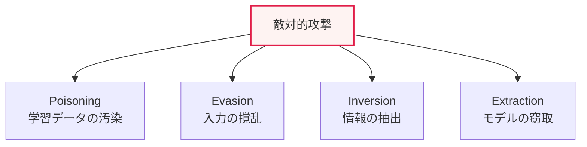

# AIセキュリティの脅威：敵対的攻撃と生成AIの脆弱性

## 1. 概要

### A. 定義
> AI技術の活用拡大に伴って現れるセキュリティ上の脅威であり、機械学習の**学習・推論過程を狙った敵対的攻撃（Adversarial Attack）** と、**生成言語モデル（LLM）特有の脆弱性** を含む。

AIセキュリティが従来の情報セキュリティと根本的に異なる点は、「**モデルそのものが攻撃の対象であり、かつ経路でもある**」ということである。従来のハッキングがシステムの脆弱性を突くものであるとすれば、AIへの攻撃は学習データ・モデルパラメータ・入力値を巧妙に操作し、AIに誤った判断を下させる。たとえば、一時停止標識に人の目には見えない微細なステッカーを貼り、自動運転車にそれを速度制限標識と誤認させるといった具合である。AIが自動運転・医療診断・セキュリティ監視のような重要な判断を担うようになるにつれ、こうした操作はそのまま物理的・社会的な被害へとつながる。さらに、生成AIの大衆化に伴い、プロンプトを通じた乗っ取りや有害コンテンツの生成といった新たな類型の脅威が加わった。

### B. 必要性
AIが基幹インフラや意思決定に深く関与するほど、その誤作動を引き起こす攻撃の波及力は大きくなる。AIライフサイクル全般にわたるセキュリティの内在化が必須の課題となった。

## 2. 機械学習に対する4つの敵対的攻撃と防御

敵対的攻撃は、AIライフサイクルのどの地点を狙うかによって分類される。**ポイズニング** は学習段階で悪意あるデータを注入してモデルを汚染し、**回避** は推論段階で入力を微細に撹乱して誤分類を誘導する。**反転** はモデルの出力を分析して学習に使われた個人情報を逆抽出し、**抽出** は反復的な問い合わせによってモデルを複製・窃取する。それぞれに対する防御は、データ検証、敵対的学習、プライバシー保護、問い合わせの制限である。

| 攻撃 | 内容 | 防御 |
|---|---|---|
| **ポイズニング（Poisoning）** | 学習データに悪意あるデータを注入 | データの検証・クレンジング、異常検知 |
| **回避（Evasion）** | 推論時に入力を微細に撹乱して誤分類させる | 敵対的学習、入力の正規化 |
| **反転（Inversion）** | 出力から学習データ・個人情報を抽出 | 差分プライバシー、出力の制限 |
| **抽出（Extraction）** | 問い合わせによるモデルの複製・窃取 | クエリ制限・ウォーターマーキング |

## 3. 生成言語モデル（LLM）のセキュリティ脆弱性

生成AIは、自然言語で指示を受けて応答するという特性上、新たな脆弱性を抱える。**プロンプトインジェクション** は悪意ある入力によって本来の指示を無力化または乗っ取り、**ジェイルブレイク（Jailbreak）** は安全機構を迂回して有害な出力を引き出す。学習・対話データが露出する**データ漏えい**、もっともらしい虚偽を生成する**ハルシネーション**、フィッシング・マルウェア・ディープフェイクの生成に悪用される**不正利用・誤用** も脅威である（OWASP LLM Top 10が代表的な分類である）。

| 脆弱性 | 内容 |
|---|---|
| **プロンプトインジェクション** | 悪意ある入力による指示の乗っ取り・迂回 |
| **ジェイルブレイク（Jailbreak）** | 安全機構の迂回による有害な出力の誘導 |
| **データ漏えい** | 学習・対話データ・機微情報の露出 |
| **ハルシネーション（Hallucination）** | 虚偽情報の生成による誤判断・虚偽の流布 |
| **不正利用・誤用** | フィッシング・マルウェア・ディープフェイクの生成 |

## 4. 対応方策

防御はAIライフサイクル全般にわたり多層的に行われる。敵対的学習と頑健性テストによってモデルを堅牢にし、入力・出力を検証するガードレールを設け、プロンプトインジェクションには入力検証・権限分離で対応する。RAGによってハルシネーションを減らしてファクトチェックを加え、MLOpsのモニタリングによって異常・ドリフトを監視し、AIレッドチーム・ガバナンスによって継続的に点検する。

## 5. 考慮事項および示唆

1. **AIライフサイクル全段階へのセキュリティの内在化（Secure AI）** が原則である。データ収集・学習・デプロイ・運用の各段階に固有の脅威が存在するため、セキュリティを設計の初期段階から統合しなければならない。
2. **攻撃の自動化・高度化にはAIで対応**する。生成AIによって攻撃が精巧になる分、防御側もAIベースの検知・対応で立ち向かう「矛と盾」の競争が激化している。
3. **信頼できるAI（安全性・頑健性）とセキュリティの融合**が必要である。AIセキュリティは単なるハッキング防御を超え、バイアス・ハルシネーションのような信頼性の問題と結び付けて統合的に扱わなければならない。

---

> **一言まとめ**: AIセキュリティの脅威は、*ポイズニング・回避・反転・抽出* の敵対的攻撃と、*プロンプトインジェクション・ジェイルブレイク・データ漏えい・ハルシネーション* などの生成LLMの脆弱性を含み、敵対的学習・ガードレール・ガバナンスによってAIライフサイクルの全段階で対応する。
