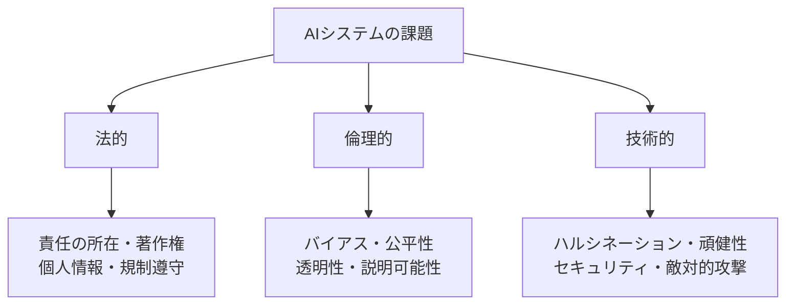
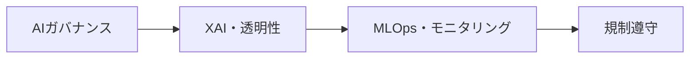

# AIシステムの法的・倫理的・技術的課題と解決方策

## 1. 概要

### A. 定義
> AIシステムの急速な普及に伴って生じる**法的責任・倫理的信頼・技術的安全性** の問題であり、これらを統合的に管理して**信頼できるAI（Trustworthy AI）** を実現することが課題である。

AIの課題が特別である理由は、三つの層が**互いに絡み合っている**からである。アルゴリズムのバイアス（倫理）はそのまま差別訴訟（法）へとつながり、ハルシネーション（技術）は虚偽情報の流布に伴う責任（法）の問題を生む。したがって、一つの層だけを扱えば問題が別の層へ移るだけであり、法・倫理・技術を**統合的に**扱わなければならない。

### B. 登場の背景と必要性
生成AIの大衆化によって誰もが強力なAIを手軽に使えるようになり、その分、責任の所在・バイアス・安全の問題が社会の表面に浮かび上がった。AIの下した決定が採用・融資・医療のように人々の生活に直接影響を及ぼすようになるにつれ、「機械の判断をどこまで信頼し、誰が責任を負うのか」という問いが規制へとつながった。EU AI Actや韓国のAI基本法のような制度が強化され、社会的受容性が求められるようになったことで、AIの課題を先制的に管理することが企業の存続に直結するようになった。

## 2. 課題の分類

課題はその性格によって三つに分けられる。**法的** 課題は制度・契約・権利の問題であり「誰が責任を負い、何が合法か」を扱い、**倫理的** 課題は規範・価値の問題であり「公正で透明か」を問う。**技術的** 課題はシステムそのものの欠陥であり「正確で安全か」の問題である。前述のとおり、この三つは独立しておらず、連鎖的に相互作用する。

## 3. 課題別の内容と解決方策

各層の課題は原因が異なるため、解決のアプローチも異ならなければならない。法的課題には制度・契約で、倫理的課題には検証・透明化で、技術的課題には工学的な防御で対応する。たとえば、学習データの著作権紛争（法的）には、ライセンスが明確なデータで学習し、利用の根拠を契約で確保しなければならない。採用AIの性別バイアス（倫理的）はデータの再均衡化と公平性指標の検証によって緩和し、チャットボットのハルシネーション（技術的）はRAGとファクトチェックによって抑制する。

| 区分 | 主な課題 | 解決方策 |
|---|---|---|
| **法的** | 事故時の責任の所在の不明確さ、学習データの著作権、個人情報の侵害 | AI基本法・規制の遵守、責任体制の確立、データの適法性（ライセンス）の確保 |
| **倫理的** | データ・アルゴリズムのバイアス、差別、不透明性 | バイアス緩和・公平性の検証、XAI（説明可能なAI）、AI倫理基準の遵守 |
| **技術的** | ハルシネーション（Hallucination）、頑健性の不足、敵対的攻撃、プライバシーの漏えい | RAG・ファクトチェック、頑健性テスト、敵対的防御、PET・差分プライバシー |

特にバイアスは、多くの場合**学習データにすでに存在していた社会的バイアス**がモデルに反映・増幅された結果であるため、アルゴリズムを手直しするだけでは不十分であり、データの段階から点検しなければならないという点が重要である。

## 4. 統合的な解決方策

個別の対応を超えて、開発・運用の全サイクルを貫く**ガバナンス体制**がなければ、課題は再発する。AIガバナンスが責任・倫理の原則を確立すれば、XAIが判断の根拠を透明にし、MLOpsが運用中の性能・バイアス・ドリフトを継続的に監視し、規制遵守がこれらすべてを法的要求に適合させる。

| 方策 | 内容 |
|---|---|
| **AIガバナンス** | 開発・運用の全サイクルにわたる責任・倫理体制、AI影響評価 |
| **XAI・透明性** | 判断根拠の説明、モデルカード・データシートの公開 |
| **MLOps・モニタリング** | 性能・バイアス・データドリフトの継続的な監視 |
| **規制遵守** | EU AI Act（リスクベース）、韓国AI基本法への対応 |

モデルを一度検証して終わりにせず、**MLOpsによって常時監視**しなければならない理由は、実際の運用データが学習時点と異なってくるデータドリフトによって、性能・公平性が徐々に崩れていく可能性があるからである。

## 5. 関連する規制・標準

規制・標準は、対応の基準線を示す。EU AI Actは、リスクが大きいほど強く規制する**リスクベース（risk-based）** のアプローチを採用し、ソーシャルスコアリングのような用途は禁止し、高リスク（医療・採用など）には厳格な義務を課す。NIST AI RMFとISO/IEC 42001は、これを組織内部で実行するためのマネジメント体系を提供する。

| 区分 | 内容 |
|---|---|
| **EU AI Act** | リスクベースの規制（禁止・高リスク・限定的リスク・最小リスク） |
| **NIST AI RMF** | Govern・Map・Measure・Manageのフレームワーク |
| **ISO/IEC 42001** | AIマネジメントシステム（AIMS）の国際標準 |

## 6. 考慮事項および示唆
技術士の観点から最も重要な原則は、**事後規制ではなく設計段階からの内在化（Responsible AI by Design）** である。問題が起きてから対応すれば信頼回復のコストがはるかに大きくなるため、開発初期からバイアスの点検・説明可能性・安全性を要件として組み込まなければならない。第二に、技術・制度・倫理の**三角バランス**が信頼できるAIの条件であり、いずれか一つだけが先行すれば全体の信頼が崩れる。第三に、特に高リスク領域では、AIが最終決定を独占しないよう**人間による監督（Human-in-the-loop）** を維持し、最終責任を人間に置く統制の仕組みが不可欠である。結局のところ、信頼できるAIは技術性能の問題ではなく社会的受容性の問題であり、これを確保する組織こそがAI時代の競争力を持つ。

---

> **一言まとめ**: AIシステムでは *法的（責任・著作権）・倫理的（バイアス・透明性）・技術的（ハルシネーション・セキュリティ）* 課題が相互に絡み合っており、AIガバナンス・XAI・MLOps・規制遵守を設計段階から統合し、人間による監督の下で信頼できるAIを実現することが核心である。
