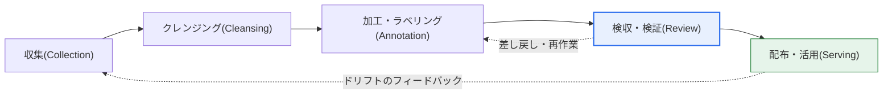
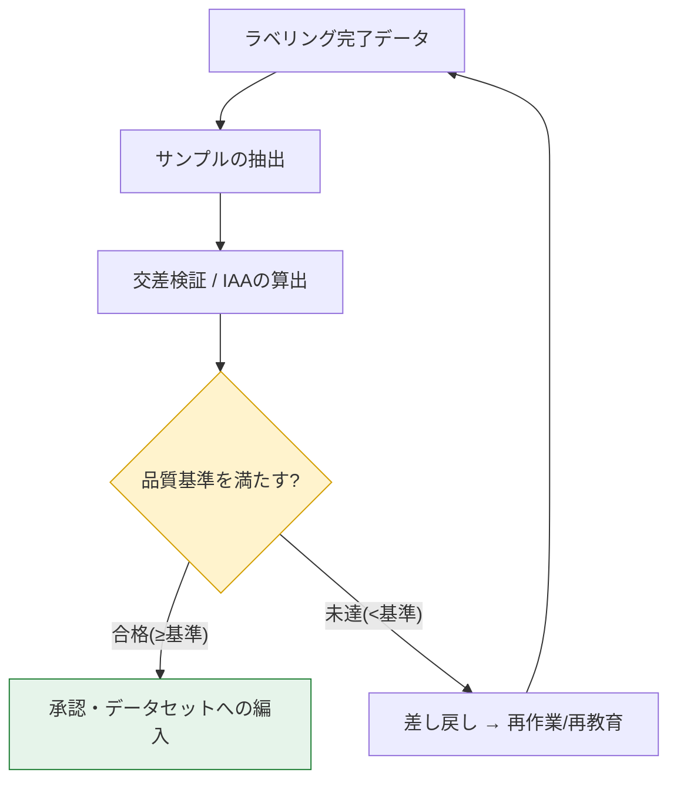

# AI学習用データセットの品質管理

## 1. 概要

### A. 定義

> **AI学習用データセットの品質管理** とは、AIモデルの学習に使用するデータを**収集・クレンジング・加工（ラベリング）・検収・活用** する全過程において、データの**正確性（Accuracy）・完全性（Completeness）・一貫性（Consistency）・代表性（Representativeness）・充足性（Sufficiency）** を確保・維持するための体系的な活動である。特に教師あり学習では、正解ラベルの品質が管理の中心となる。

AI学習用データの品質が決定的に重要である理由は、「**Garbage In, Garbage Out（GIGO）**」という古くからの真理にある。どれほど精巧なニューラルネットワークであっても、ラベルが誤っていたり偏っていたりするデータで学習すれば、その誤りとバイアスをそのまま内在化する。特に教師あり学習（Supervised Learning）では、正解（ラベル）の品質がそのまま**モデル性能の上限（Ceiling）** を決定する。人が誤ってラベリングしたデータで学習したモデルは、その誤りを「正解」として学ぶため、アルゴリズムをいくら改善してもその上限を超えることはできない。

このため、近年のAI開発の重心は「**モデル中心（Model-centric）**」から「**データ中心（Data-centric AI）**」へと移りつつある。アンドリュー・ン（Andrew Ng）が提唱したこの観点は、「モデル・コードは固定し、データ品質を体系的に引き上げることで性能を改善する」というものであり、実際の産業現場では、モデルアーキテクチャを変えるよりもラベルノイズを減らしデータの一貫性を高める方が、より大きく安定した性能向上をもたらす場合が多い。たとえば、欠陥検査・医療画像のようにデータが少なく精密さが求められるドメインでは、数千枚のデータを新たに集めるよりも、既存ラベルの誤り数百件を修正する方が精度を大きく引き上げるという事例が繰り返し報告されている。

### B. 登場の背景と必要性

品質管理が必須となった背景には、三つの流れがある。第一に、**AIの高リスク領域への拡大** である。自動運転の物体認識、医療画像の病変読影のように、誤りがそのまま事故・誤診につながる領域が増えるにつれ、データの欠陥が安全・生命・法的責任の問題に直結するようになった。第二に、**バイアスと公平性のリスク** である。特定の性別・人種・年齢・地域がデータ中で過小・過大に代表されると、モデルはその集団に不利な差別的判断を学習する。実際に、顔認識モデルが有色人種・女性において誤り率が大幅に高かった研究（例：MIT Media LabのGender Shades研究では、明るい肌の男性に比べて暗い肌の女性の誤分類率が著しく高く現れた）は、データの代表性の欠如が社会的差別へと帰結することを示している。第三に、**データハブ・公共データ事業の大規模化** である。大量のクラウドソーシングによるラベリングが行われるようになり、作業者間のばらつき・誤りを定量的に管理する体制なしには、規模に見合った品質を担保できなくなった。

## 2. データライフサイクルと品質確保活動の概念図

品質管理は特定の段階に限定された一回限りの活動ではなく、データが流れるライフサイクル全体にわたる活動である。まず、データがどのような段階を経るのか、そして検収で問題が発見された場合にどのようにフィードバックされるのかを、全体のフロー図で俯瞰する。

全体の流れが「収集→クレンジング→ラベリング→検収→活用」の循環であることを押さえたら、次に品質の最終関門である**検収段階の内部アーキテクチャ** を詳しく見る必要がある。検収は単なる目視検査ではなく、複数の作業者の結果を比較（IAA）し、サンプルを定量的に検査し、基準未達分を差し戻す判定ロジックによって構成される。

## 3. 段階別の品質確保活動

品質の確保は、ライフサイクルの各段階で異なる焦点をもって行われる。各段階が「何を、なぜ」点検するのかを、原理のレベルで見ていく。

### A. 収集（Collection） — 代表性と適法性

収集段階の中核的な問いは、「このデータは**解こうとしている問題を代表しているか**」である。学習データの分布が実際の運用環境（母集団）と異なれば、モデルは実験室でしか当てはまらない偏った判断を学ぶ。たとえば、昼間の晴天時の映像だけで学習した自動運転の認識モデルは、夜間・悪天候時に性能が急激に低下する。したがって、収集段階ではクラスのバランス、多様な環境・条件のカバレッジ、希少クラス（long-tail）の確保を点検する。同時に、**適法性・倫理** もこの段階で決まる。著作権のあるデータの無断収集、個人情報（顔・ナンバープレート・音声）の同意なき収集は、後の段階では取り返しのつかない法的リスクを残すため、収集時点で非識別化・同意・ライセンスを確認しなければならない。

### B. クレンジング（Cleansing） — ノイズの除去

クレンジング段階では、元データの欠損値・外れ値・重複・形式の不一致を除去し、後続のラベリング・学習の土台を固める。欠損値は単純に削除するか補完（imputation）するか、外れ値は誤りなのか実際の希少事例なのかを、ドメイン知識に基づいて判断しなければならない。重複データは特定のサンプルを過大に代表させてバイアスを引き起こし、特に学習・検証・テストセットに同じデータが混在する**データリーケージ（Data Leakage）** は、性能を実際よりも水増しする致命的な誤りであるため、クレンジング段階で必ず取り除かなければならない。

### C. 加工・ラベリング（Annotation） — 一貫性

ラベリングは人が介在する分、ばらつきが最も大きく生じる地点である。同じ画像を二人の作業者が異なるようにラベリングすれば、モデルは矛盾したシグナルを学習する。したがって、**明確なラベリングガイドライン（境界事例の規定を含む）と作業者教育** が一貫性の鍵となる。ガイドラインが曖昧であるほど作業者間の解釈の差は大きくなるため、曖昧な境界事例（例：「部分的に隠れた物体をラベリングするか」）を例示とともに明文化し、初期の少量ラベリングの結果でガイドラインを補正してから本作業に入る方式が効果的である。

ラベリング方式そのものも品質に影響を与える。画像のバウンディングボックス（Bounding Box）・セグメンテーション（Segmentation）、テキストの固有表現（NER）・分類、音声の書き起こし（STT）など、タスクの種類ごとに誤りの現れ方が異なるため、検収基準も異ならなければならない。たとえばバウンディングボックスでは「ボックスが物体をどれだけ正確に囲んでいるか（IoU）」が、分類では「ラベルそのものが正しいか」が中核的な誤りの軸である。また、コストを下げるための自動・半自動ラベリング（モデルの予測を人が確認・修正するHuman-in-the-loop）が増えているが、この場合はモデルの初期バイアスがラベルに転移しないよう、検収をむしろより厳格にしなければならない。

### D. 検収・検証（Review） — 定量的な関門

検収は品質の最終関門である。中核的なツールは**作業者間一致度（IAA, Inter-Annotator Agreement）** であり、複数の作業者が同じデータにどれだけ一貫してラベルを付けたかを、コーエン/フライスのカッパ（Cohen's/Fleiss' Kappa）などで定量化する。偶然による一致を補正したカッパ値が低ければ（例：0.6未満）、ガイドラインが曖昧であるか作業者教育が不足しているというシグナルであるため、再教育・ガイドライン改訂へと差し戻す。加えて、全数検査が不可能な大規模データでは、**サンプリング検査（例：AQLに基づくサンプル抽出）** によって誤り率を推定し、基準（例：誤り率2%以下）を超えるバッチは差し戻す。すなわち検収は「感覚」ではなく、統計的基準によって合格/差し戻しを判定する定量的な関門である。

| 活動 | 焦点 | 代表的な手法・指標 |
|---|---|---|
| **収集管理** | 代表性・適法性 | クラスのバランス、カバレッジの点検、非識別化・ライセンスの確認 |
| **クレンジング・加工** | ノイズの除去 | 欠損値・外れ値の処理、重複・データリーケージの除去 |
| **ラベリング** | 一貫性 | ガイドライン、作業者教育、境界事例の明文化 |
| **検収・検証** | 定量的な判定 | IAA（カッパ）、交差検証、サンプリング、誤り率の基準 |
| **品質指標** | 測定・管理 | 正確性・完全性・一貫性・妥当性の定量化 |

## 4. データライフサイクル別の品質管理手順と事例

品質管理は、計画→収集→加工→検収→活用の循環で運営される。計画段階で品質目標・基準・指標（KPI）を定義し、収集・加工・検収の段階でそれを適用・測定し、活用段階でも継続的にモニタリング・更新する。ここで特に重要なのが、運用中に発生する**データドリフト（Data Drift）とコンセプトドリフト（Concept Drift）** である。学習時点のデータ分布と実際の運用データが時間の経過とともに異なってくると（例：消費パターンの変化、季節性、新語の出現）、モデルの性能は徐々に低下する。したがって、運用データの分布の変化を検知して再学習に反映するフィードバックループを、手順に組み込まなければならない。

韓国の事例としては、科学技術情報通信部・NIAが推進した「AI学習用データ構築（データダム）」事業が代表的である。大規模なクラウドソーシングによるラベリングを実施する中で、構築ガイドライン、多段階の検収、定量的な品質指標（構文・意味の正確性など）を標準化し、公共データセットの品質を管理した。産業事例としては、自動運転企業が数億件規模の走行映像に対して二重・三重の検収と能動学習（Active Learning）に基づく優先ラベリングを組み合わせ、モデルが確信を持てない（不確実性の高い）データを選択的にラベリングすることで、コストに対する品質の効率を高めたことが挙げられる。

このフィードバックループがなぜ重要なのかは、失敗事例がよく示している。マイクロソフトの対話型チャットボット「Tay」（2016年）は、運用中に流入するユーザーデータをフィルタリングせずに学習に反映した結果、わずか一日でヘイト発言を連発し、サービスが停止された。これは、「収集→検収」の品質ゲートなしに運用データをそのまま学習に取り込んだ場合の危険性を象徴している。逆に、よく設計されたシステムは、運用データの分布の変化を指標で監視し、しきい値を超えると再収集・再ラベリング・再学習を自動的にトリガーして、性能の低下がインシデントへと発展する前に遮断する。すなわち、活用段階のモニタリングは、「終わったデータ」を再び「収集段階」へと戻す循環の出発点である。

| 段階 | 品質管理活動 | 成果物・基準 |
|---|---|---|
| **計画** | 品質目標・基準・指標（KPI）の定義 | 品質管理計画書、目標誤り率 |
| **収集** | ソースの適合性・代表性・適法性の検証 | データ仕様書、バイアス・ライセンスの点検表 |
| **加工・ラベリング** | 標準ガイドラインの適用、バイアスの点検 | ラベリングガイド、作業者教育の修了 |
| **検収** | 多段階の検収、IAA・サンプリング検査 | 検収レポート、合格/差し戻しの判定 |
| **活用・管理** | バージョン管理、ドリフトのモニタリング・更新 | データバージョン、再学習トリガー |

## 5. 深掘り — データ中心AIとMLOpsへの内在化の動向

データ品質管理は、「手作業による検収」から「**パイプラインに自動的に内在化された継続的検証**」へと進化している。第一に、**データ中心AI（Data-centric AI）** の方法論の台頭である。モデルを固定したまま、ラベルノイズの検出・自動修正、データスライス別の性能分析、体系的なデータ拡張によって品質を引き上げる。ラベルの誤りを統計的に検出するツール（例：cleanlab系）やデータ品質検証フレームワーク（例：Great Expectations、TFDV）が実務に広がっている。

第二に、**MLOpsパイプラインへの内在化** である。データが流入するたびにスキーマ検証・統計プロファイリング・異常検知を自動実行し、学習データとサービングデータの分布の差（Training-Serving Skew）とドリフトを常時モニタリングする。ここに**データ・モデルのバージョン管理（DVC、Feature Store）** と**データリネージ（Lineage）の追跡** が組み合わされることで、問題が生じた予測をデータのソースまで逆追跡できるようになる。

第三に、**生成AI時代の新たな課題** である。LLM・基盤モデルの学習データは規模が膨大で全数検収が不可能であるため、有害・バイアス・重複・個人情報を含むコンテンツの自動フィルタリング、著作権・ライセンスの整合性、そしてモデルが生成したデータで再び学習する際に品質が劣化する**モデル崩壊（Model Collapse）** のリスク管理が、新たな品質上の課題として浮上している。また、データの出所と処理履歴を文書化する**データシート（Datasheets for Datasets）・データカード** のような透明性の標準が求められている。

## 6. 考慮事項および示唆

1. **ラベル品質はモデル性能の上限**: 教師あり学習の性能の天井は、ラベルの品質が決める。したがって、IAA（カッパ）・二重/三重の検収・サンプリング検査のような定量的な検収体制、そして何よりも**明確なラベリングガイドライン** の確保が、品質管理の最優先課題である。ガイドラインの曖昧さがそのまま作業者間の不一致として現れるという点を、管理指標とすべきである。

2. **代表性の欠如は社会的差別に直結**: 特定集団の過小・過大な代表は、モデルの差別的な判断を生む（顔認識の誤り率の偏りの事例）。収集段階からクラス・集団のバランスとカバレッジを定量的に点検し、公平性指標によってバイアスを常時測定しなければならない。

3. **品質・コスト・時間のトレードオフ**: 全数検収・多重ラベリングは品質を高めるが、コスト・期間が急増する。能動学習（不確実なデータの優先ラベリング）、サンプルベースの検収、ラベル誤りの自動検出を組み合わせ、「限られた予算の中で最大の品質」を得る最適化戦略が必要である。

4. **品質検証の自動的な内在化（MLOps）**: 品質管理は構築時点の一回限りの活動ではなく、運用全体にわたる継続的な活動である。パイプラインにスキーマ・統計・ドリフトの検証を自動的に組み込み、データのバージョン・リネージを追跡して、再現性と逆追跡性を確保しなければならない。

5. **生成AI・ガバナンスへの対応**: 大規模データ・生成データの時代には、有害・バイアス・個人情報の自動フィルタリング、著作権の整合性、モデル崩壊の防止、データシート・データカードに基づく透明性が、新たな品質・規制要件として浮上する。品質管理をデータガバナンス・AI倫理の体系と連携させなければならない。

## 参考資料
- Andrew Ng, "Data-centric AI"の概念 — https://landing.ai/data-centric-ai
- Buolamwini & Gebru, "Gender Shades"（バイアス研究） — https://www.media.mit.edu/projects/gender-shades/
- Gebru et al., "Datasheets for Datasets" — https://arxiv.org/abs/1803.09010
- NIA（韓国知能情報社会振興院）、AI学習用データの構築・品質管理 — https://www.nia.or.kr/
- Google, "TensorFlow Data Validation(TFDV)" — https://www.tensorflow.org/tfx/guide/tfdv

---

> **一言まとめ**: AI学習用データの品質管理は、*収集→クレンジング→ラベリング→検収→活用* のライフサイクル全般にわたって正確性・一貫性・代表性を管理する活動であり、ラベルの検収（IAA）・バイアスの点検がモデル性能の上限と公平性を左右し、近年は**データ中心AIとMLOpsによる自動検証**へと進化している。
