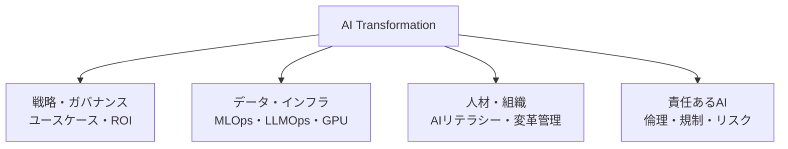

# AX（AI Transformation、AIトランスフォーメーション）

## 1. 概要

### A. 定義
> 企業の製品・サービス、業務プロセス、意思決定、さらにはビジネスモデル全般に**AIを中核的な原動力として内在化**し、運営体制そのものを再設計する全社的な変革活動。デジタルトランスフォーメーション（DX）の次の段階であり、「デジタル化されたもの」の上で**AIが判断・生成・自動化を担う**よう組織を再編することを目標とする。

AXの本質は、AIを**一つの機能・ツールではなく、運営の軸（operating backbone）へと引き上げる**ことにある。かつてのAI導入は、特定の部門がチャットボットや予測モデルを付け加える「点」単位のプロジェクトであったが、AXはデータ・インフラ・人材・プロセス・ガバナンスをまとめて変え、AIを組織全体に行き渡らせる「面」単位の転換である。すなわち、「AIを使う会社」から「AIで動く会社（AI-native）」へと体質を変えることがAXである。

### B. 登場の背景と必要性
AXが注目される決定的なきっかけとなったのは、**生成AI（LLM）の登場**である。かつてのAIは、専任のデータサイエンティストが課題ごとにモデルを学習させなければならない参入障壁の高い技術であったが、今や自然言語で指示すれば文書要約・コード生成・顧客対応を行う**汎用技術（GPT, General Purpose Technology）** となった。これにより、AIの活用が一部の専門家から全社員へと広がる条件が整い、競合他社がAIによって生産性を数十%引き上げれば、そうでない企業はコスト・スピードの面で後れを取るようになった。さらに、DXを通じて蓄積された膨大なデータがAIの「燃料」として使えるようになったことで、「蓄積したデータをいかに価値へと転換するか」という問いへの答えとしてAXが浮上した。要するに、AXは**選択ではなく、生き残りのための競争力の再編**という性格を帯びている。

## 2. AXの推進体系（構成要素）

AXはいずれか一つの軸だけでは成立しない。優れたモデルを導入してもデータが整備されていなければ成果は出ず、インフラがあっても社員が使えなければ無用であり、ガバナンスがなければハルシネーション・情報漏えいのインシデントによってかえってリスクが大きくなる。四つの軸がかみ合ってこそ、変革は持続する。

| 構成要素 | 中核的な内容 | なぜ必要か |
|---|---|---|
| **戦略・ガバナンス** | AIビジョン、ユースケースの発掘・優先順位付け、ROIの測定、CoE（専任組織） | 何を・なぜ行うのかがなければ「AIのためのAI」として漂流する |
| **データ・インフラ** | データパイプライン・品質、MLOps/LLMOps、GPU・クラウド、RAG・ベクトルDB | AIの性能は結局データ・運用基盤が左右する |
| **人材・組織** | AIリテラシー教育、リスキリング、働き方・プロセスの再設計 | 人が変わらなければ、技術導入はパイロットで止まる |
| **責任あるAI** | ハルシネーション・バイアス・著作権・プライバシーの統制、AI倫理・規制への対応 | 信頼がなければ普及そのものが不可能 |

**戦略・ガバナンス**はAXの羅針盤である。現場から出てくる数多くのアイデアを「効果の大きさ × 実現可能性」で優先順位付けし、散在する取り組みを調整する**AI CoE（Center of Excellence）** を置いて、重複投資と漂流を防ぐ。**データ・インフラ**はAXの土台であり、特に生成AIの時代には、社内のナレッジを回答に結び付ける**RAG（検索拡張生成）** とベクトルDB、そしてモデルのデプロイ・モニタリング・再学習を自動化する**LLMOps**が中核となる。**人材・組織**は最も難しく、かつ決定的な軸である。ツールをいくら導入しても、社員が業務の流れの中でAIを自然に使えなければ成果にはつながらないからである。そのため、リテラシー教育とともに**働き方そのものの再設計**を並行して進めなければならない。最後に、**責任あるAI**は普及の前提条件である。ハルシネーションによって誤った回答を顧客に提示したり、学習・プロンプトを通じて機密が漏えいしたりすれば、たった一度のインシデントで全社の信頼が崩れるため、統制の仕組みを先に整えてこそ普及が可能となる。

## 3. DXとAXの違い（比較）

AXを正確に理解するには、先行する**DX（デジタルトランスフォーメーション）** と対比するのが効果的である。両者は連続線上にあるが、**主体と目指すところ**が異なる。DXはアナログ・手作業のプロセスをデジタルへと移して**効率化・自動化**することに焦点があり、ここでは人が依然として判断の主体であり、システムはそれを補助する。一方AXは、そのようにデジタル化されたデータの上で**AIが判断・予測・生成を直接担う**ようにする**知能化**であり、人の役割は「実行」から「AIの結果を検証・調整する監督」へと移る。決定的な違いが生じる理由は、**データの位置付け**にある。DXにおいてデータはデジタル化の「成果物」であったが、AXにおいてデータはAIを学習・駆動する「燃料」となる。そのため、DXが不十分でデータが整備されていない組織は、AXにおいてすぐに壁に突き当たる。

| 区分 | DX（デジタルトランスフォーメーション） | AX（AIトランスフォーメーション） |
|---|---|---|
| **目指すところ** | 効率化・自動化（デジタル化） | 知能化・自律化（AIの内在化） |
| **中核的な主体** | 人（システムが補助） | AI（人が監督・検証） |
| **データの位置付け** | デジタル化の成果物 | AIを駆動する燃料 |
| **代表的な技術** | クラウド・モバイル・ビッグデータ | LLM・生成AI・MLOps・RAG |
| **成果指標** | 処理時間・コストの削減 | 意思決定の質・創造的な成果・自律運用 |

## 4. AXの成熟度段階

AXは一度に完成するものではなく、成熟度の段階を踏んで上っていく。各段階は前の段階の基盤の上でしか成り立たないため、データ・組織の準備なしに上位段階へ飛び越えようとする試みは、ほとんどが失敗する。

| 段階 | 状態 | 例 |
|---|---|---|
| **1. 導入（実験）** | 部門別のパイロット、個人用ツールの活用 | 社員がチャットボットで文書の草案を作成 |
| **2. 活用（部分統合）** | 特定業務へのAIの組み込み、ユースケースの拡大 | コールセンターでAI相談アシスタントを常時運用 |
| **3. 内在化（全社展開）** | 中核プロセス・意思決定へのAIの結合、データ・MLOpsの標準化 | 需要予測・価格設定をAIが常時実施 |
| **4. AI-Native（再創造）** | ビジネスモデルそのものがAIベースであり、AIなしでは運営不可能 | AIエージェントが業務を自律的に遂行 |

1・2段階から3段階へ移行する地点が最も難しい。個人・部門単位の実験は容易に始められるが、それを全社のプロセスに溶け込ませるには、データガバナンス・MLOps・組織変革が同時に支えなければならないからである。多くの企業が、ここでパイロットばかりが積み上がって展開されない「**PoCの沼**」に陥る。

## 5. 適用事例

AXの効果は、具体的な事例に表れる。**カスタマーセンター**では、相談員の傍らにリアルタイムで回答の草案とマニュアルを表示するAIアシスタントを付けることで、平均処理時間と新人相談員の習熟期間を短縮した事例が広く報告されている。**ソフトウェア開発**では、コードアシスタント（例：コードの自動補完・生成）を導入して反復的なコード作成の時間を減らし、開発者が設計・検証に集中できるよう役割を再配置する。**製造**では、設備のセンサーデータから故障を事前に予測する予知保全（PdM）によって計画外の停止を減らし、**製薬・素材**の分野では、AIが候補物質を探索することで新薬・新素材の開発サイクルを短縮する。共通点は、AIが人を代替するよりも、**人の生産性と判断を増幅（augmentation）** する方向で設計されているという点である。

## 6. 考慮事項および示唆（技術士の観点）
- **データガバナンスが前提**: AXの成否は、結局「信頼できるデータをどれだけ確保したか」に帰着する。DX・データ整備が不十分であればAXは砂上の楼閣となるため、データの品質・標準・アクセス権限の体系を先行して構築しなければならない。
- **ユースケースの優先順位とROI**: 技術そのものが目的化すると、「AIのためのAI」として漂流する。効果の大きさと実現可能性によってユースケースを選別し、成果を定量的に測定して展開の可否を判断する規律が必要である。
- **PoCの沼からの脱出**: パイロットの成功と全社展開はまったく別の問題である。最初から拡張（scale）を前提として、データ・MLOps・組織変革を併せて設計してこそ、3段階の内在化へと移行できる。
- **責任あるAI・シャドーAIの管理**: ハルシネーション・バイアス・著作権・個人情報のリスクに対する統制、そして社員が統制外の外部AIに機密を入力する**シャドーAI（Shadow AI）** を管理するための、社内の安全なAI活用ポリシー・プラットフォームが必要である。
- **変革管理とリスキリング**: AXの最大の障害は技術ではなく人である。AIは人を代替するのではなく役割を変えるものであることを理解させ、リスキリングとインセンティブによって抵抗を組織の能力へと転換しなければならない。
- **エージェントへの進化の展望**: 単一の質疑応答を超えて、自ら計画・ツール使用・実行を行う**AIエージェント**へと発展するにつれ、AXの目指すところは「補助」から「自律運用」へと移りつつある。これに見合った信頼性・統制体系の設計が次の課題である。

---

> **一言まとめ**: AXは、*戦略・データ/インフラ・人材・責任あるAI* の四つの軸によってAIを全社の運営に内在化する変革であり、プロセスをデジタル化するDXを超えて *AIが判断・生成を担う知能化* を目指し、データガバナンスを前提として、ユースケース・ROIの規律と変革管理によって「PoCの沼」を越え、AI-Nativeへと進んでいくものである。
