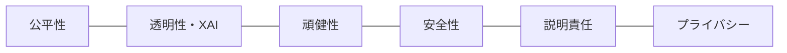
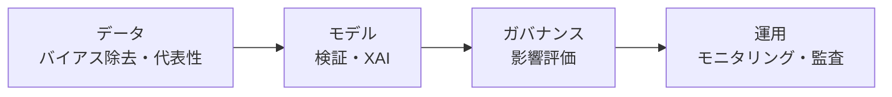

# 人工知能の信頼性（AI Trustworthiness）

## 1. 概要

### A. 定義
> AIシステムが**意図した目的どおりに安全・公正・透明に動作**し、その判断・結果を人が**信頼して活用できるよう**求められる属性の総体。EU AI Act・NIST AI RMF・ISO/IEC 42001・韓国のAI基本法などにおいて規範化が進んでいる。

信頼性は単一の機能ではなく、公平性・透明性・頑健性・安全性・説明責任・プライバシーといった**複数の属性が結合した性質**であり、モデルのアルゴリズムだけでなく、データ・運用・組織・ガバナンス全般において確保される。すなわち「精度の高いモデル」と「信頼できるAI」は異なる概念であり、どれほど正確であっても、判断の根拠を説明できなかったり特定の集団を差別したりすれば、信頼を得ることはできない。

### B. 登場の背景と必要性
AIが採用・融資・医療診断・刑事司法のように人の権利に直結する**高リスクな意思決定**に使われるようになるにつれ、学習データに含まれる社会的バイアスをそのまま拡大再生産したり（バイアス）、なぜそのような決定を下したのか分からなかったり（ブラックボックス）、予期しない入力に対して誤作動したり（頑健性の不足）、生成AIがもっともらしい虚偽を作り出したりする（ハルシネーション）リスクが明らかになった。こうしたリスクは個人の被害を超えて社会的受容性と企業責任の問題へと広がるため、各国は規制によって信頼性の確保を義務化する方向へ動いている。特に生成AIの普及によってリスクの表面が広がり、信頼性は選択ではなく導入の前提条件となった。

## 2. 中核的な属性

これら六つの属性は互いに補完的である一方、時に**相反**する。たとえば、透明性を高めるためにモデルの内部を公開すればプライバシーやセキュリティが弱まる可能性があり、公平性のために特定の変数を除外すれば精度が低下する可能性がある。そのため、信頼性の確保は単一属性の最大化ではなく、**属性間のバランス（トレードオフ）の管理**の問題である。

### A. 公平性（Fairness）
学習データに過去の差別が含まれていれば、モデルはそれを学習して特定の性別・人種・年齢に不利な決定を下す。たとえば、過去の合格者データで採用モデルを学習させれば、既存の性別バイアスをそのまま踏襲する。そのため、バイアスを定量的に測定し（集団間の性能・誤り率の格差）、データ・アルゴリズム・後処理の各段階で緩和する。

### B. 透明性・説明可能性（XAI）
判断の根拠を人が理解・検証できてこそ、異議申立てと責任追及が可能となる。SHAP・LIMEのようなXAI手法によって、「どの入力が決定にどれだけ寄与したか」を提示する。深層学習ほど性能は高いが解釈は難しく、性能と説明可能性の間のバランスが課題となる。

### C. 頑健性（Robustness）と D. 安全性（Safety）
頑健性は、敵対的入力（Adversarial Example）・ノイズ・分布の変化に対しても性能が崩れない性質であり、安全性は、誤作動が実際の危害につながらないよう統制する性質である。自動運転においてステッカー数枚で標識を誤認させる攻撃が代表的な事例であり、頑健性テスト（敵対的テスト）と安全機構（ヒューマンオーバーライド・フェイルセーフ）が併せて必要となる。

### E. 説明責任（Accountability）と F. プライバシー
説明責任とは、問題が発生した際に原因・責任を追跡できるよう、ログ・バージョン・意思決定の履歴を残し、ガバナンスを設けることであり、プライバシーとは、個人情報の最小収集・非識別化・差分プライバシー（DP）によってデータ主体を保護することである。

| 属性 | 説明 | 代表的な手法 |
|---|---|---|
| **公平性（Fairness）** | バイアスのない結果、差別の防止 | バイアスの測定・緩和、データのリバランシング |
| **透明性・説明可能性（XAI）** | 判断根拠の提示・解釈可能性 | SHAP・LIME・特徴量重要度 |
| **頑健性（Robustness）** | 敵対的入力・ノイズに対する安定性 | 敵対的学習・頑健性テスト |
| **安全性（Safety）** | 危害の防止、誤作動の統制 | フェイルセーフ・ヒューマンインザループ |
| **説明責任（Accountability）** | 結果に対する責任の追跡・ガバナンス | ロギング・バージョン管理・監査 |
| **プライバシー** | 個人情報の保護・データの最小化 | 非識別化・差分プライバシー（DP） |

## 3. 確保方策（ライフサイクル全体）

信頼性は、いずれか一つの段階の措置で完成するものではない。データが偏っていれば、どれほど優れたモデルも偏り（GIGO）、デプロイ後にデータ分布が変われば（ドリフト）初期の検証が無意味になるからである。したがって、データ－モデル－ガバナンス－運用の**ライフサイクル全体に統制を分散配置**しなければならない。

| 段階 | 活動 | 理由 |
|---|---|---|
| **データ** | バイアスの測定・緩和、品質・代表性の確保 | バイアスの源泉を上流で遮断する |
| **モデル** | XAIの適用、頑健性・敵対的テスト | デプロイ前に脆弱性・説明可能性を検証する |
| **ガバナンス** | AI影響評価（AIA）、リスク管理体制 | リスクを事前に特定・等級付けする |
| **運用** | 継続的モニタリング、ドリフト・異常の監視、監査 | 性能・公平性の低下を常時検知する |

## 4. 関連する規制・標準

| 区分 | 中核的な内容 | アプローチ |
|---|---|---|
| **EU AI Act** | リスクベースの4段階規制（禁止・高リスク・限定的リスク・最小リスク） | リスク等級別の差等的な義務 |
| **NIST AI RMF** | Govern・Map・Measure・Manageの4大機能 | 自主的なリスク管理フレームワーク |
| **ISO/IEC 42001** | AIマネジメントシステム（AIMS）の認証標準 | 組織レベルのマネジメント体系 |
| **韓国AI基本法** | 高影響AIの信頼性・安全性確保の義務 | 高影響領域の規律 |

EU AI Actがリスクを等級化し、高リスクAIに強い義務を課す**リスクベース規制**を採用した理由は、すべてのAIを一律に規制すればイノベーションを過度に抑制してしまうからである。リスクの大きいところに規制資源を集中させるこのアプローチは、NIST RMFのMap（リスクの特定）－Measure（測定）の流れとも軌を一にしている。

## 5. 考慮事項および示唆
- **ライフサイクル全体にわたるガバナンスが核心**: 信頼性はモデルのリリース後に一度点検すれば終わるものではなく、ドリフトのモニタリング・定期監査によって継続的に管理しなければならない。
- **属性間のトレードオフの管理**: 精度－公平性、性能－説明可能性、透明性－プライバシーのように相反する軸を、ドメインのリスク度に合わせて調整することが、技術士の判断領域である。
- **生成AIによる拡張**: ハルシネーション・有害コンテンツ・アライメント（Alignment）の問題が浮上し、ガードレール・RLHF・レッドチームテストなど、生成AI特有の信頼性統制が加わりつつある。
- **規制・認証への対応**: EU AI Actの高リスク等級に該当すれば、適合性評価・技術文書・市販後モニタリングが義務化されるため、韓国企業も輸出・グローバルサービスのために先制的な対応が必要である。

---

> **一言まとめ**: AIの信頼性とは、*公平性・透明性・頑健性・安全性・説明責任・プライバシー* を相互にバランスよく備える性質であり、データ－モデル－ガバナンス－運用の *ライフサイクル全体の管理* と、EU AI Act・NIST RMF・ISO 42001などのリスクベースの規制・標準への対応によって確保され、生成AIの普及によってその重要性が高まっている。
