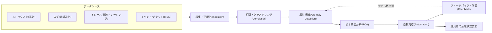
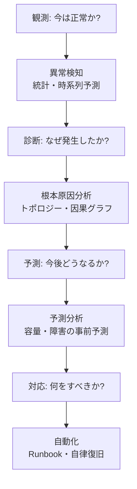

# AIOps（インテリジェントIT運用、AI for IT Operations）

## 1. 概要

> **定義**: AIOpsとは、ビッグデータと機械学習をIT運用に適用し、膨大な運用データ（メトリクス・ログ・トレース・イベント）から異常を自動的に検知し、根本原因を推論し、対応を自動化することによって、人中心の事後対応型の運用を、データに基づく予測・自律型の運用へと転換するアプローチである。

AIOpsという用語は、2016年にガートナーが「Algorithmic IT Operations」の意味で提示した後、「AI for IT Operations」として定着した。
登場の背景は、運用環境そのものの構造的な変化にある。
かつてのモノリシック・物理サーバーの時代には、管理対象が静的で数も少なく、熟練した運用者がしきい値ベースのアラートとダッシュボードで状況を統制することができた。
しかし、マイクロサービス・コンテナ・サーバーレス・マルチクラウドが普及するにつれ、一つのユーザーリクエストが数十のサービスを経由し、インスタンスは数分単位で生成・消滅し、一日に数十億件のイベントが押し寄せるようになった。
このような環境では、人がログを目で追って原因を探す方式は物理的に不可能となり、アラートの量もまた人が処理しきれない水準（alert storm）にまで急増した。

二つ目の背景は、データのサイロ化である。
モニタリングツールがメトリクス・ログ・APM・ネットワーク別に分かれているため、一つの障害について複数の画面を行き来しながら、手作業で相関関係を突き合わせなければならなかった。
AIOpsは、こうした異種データを一つのパイプラインで収集・正規化し、統計・機械学習によってシグナル対ノイズ比を高め、運用者が「何を見るべきか」をアルゴリズムが先に絞り込むことを目標とする。

三つ目の背景は、ビジネス上の要求である。
デジタルサービスがそのまま売上となる時代において、障害の平均復旧時間（MTTR）は直接的な損失につながる。
MTTRの大部分は検知ではなく「原因究明（診断）」に費やされるため、診断を自動化・加速するAIOpsは、信頼性（SRE）と事業継続の前提条件となる。

答案では、AIOpsが単一の製品ではなく、**データ収集 → 相関・クラスタリング → 異常検知 → 根本原因分析（RCA） → 自動対応**へと続く能力の集合であることを強調しなければならない。
また、AIOpsは運用者を代替するものではなく、反復的・大量の判断を自動化して運用者が高次元の意思決定に集中できるよう支援する**増強（augmentation）** の観点で理解することが、実務・試験のいずれにおいても妥当である。

## 2. AIOpsの全体構造とデータパイプライン

AIOpsは、異種のソースからデータを集め、段階的に価値を精製していくパイプライン構造を持つ。
以下の概念図は、データが収集から自律対応まで流れる全体の骨格を示している。

**データ収集・正規化** の段階は、互いに異なるフォーマット・タイムスタンプ・タグ体系を統一する作業である。
メトリクスは規則的な時系列であるが、ログは非構造化テキストであり、トレースはグラフ構造であるため、共通のエンティティ（サービス・ホスト・リクエストID）で結合（join）できるよう標準化する（例：OpenTelemetryの規約）ことが、その後のすべての分析の品質を左右する。
正規化が不十分であれば、異なるシグナルを同じ事象としてまとめることができず、後続の相関分析が無力化される。

**相関・クラスタリング** の段階は、急増するアラートをインシデント（incident）単位に圧縮する。
同一の原因から派生した数千件のアラートを、時間・トポロジー・テキストの類似度を基準にまとめ（alert clustering/de-duplication）、運用者が見るべき対象を数十件から一件へと減らす。
たとえば、一つのDBが遅くなると、それを呼び出す40のサービスが同時に遅延アラートを出すが、相関化によってこれを「DBの遅延」という単一のインシデントに統合する。

**異常検知** の段階は、静的なしきい値の限界を克服する。
従来の方式は「CPU 80%超過時にアラート」のように固定しきい値を用いるが、トラフィックは平日・週末・時間帯によって大きく変動するため、誤検知（false positive）と見逃し（false negative）が頻発する。
AIOpsは、季節性・トレンドを学習した動的ベースライン（dynamic baseline）を作成し、実測値が予測区間を外れたときにのみアラートを発する。

## 3. 中核的な手法と分析レイヤー

AIOpsの分析レイヤーは、目的に応じて異なる機械学習の手法を組み合わせる。
以下のダイアグラムは、各レイヤーがどのような問いに答えるのかを、プロセスの観点から表現したものである。

### A. 異常検知（Anomaly Detection）

異常検知はAIOpsの出発点であり、「何が普段と異なるのか」を判別する。
時系列指標については、季節性分解（STL）や指数平滑法・ARIMA系の予測モデルで期待値と予測区間を算出し、観測値がそれを外れれば異常として表示する。
非構造化ログについては、ログをテンプレートにパース（log parsing）した後、出現頻度・順序の急変を検知し、多次元指標についてはIsolation Forest・オートエンコーダのような教師なし学習によって、正常パターンから遠く離れた点を外れ値とみなす。
中核的な設計課題は、**誤検知と見逃しのバランス**である。
感度を上げればアラート疲れが増し、下げれば実際の障害を見逃す。
したがって、運用者による確認・棄却の結果を再び学習に反映するフィードバックループが、実用性の鍵となる。

### B. 相関分析とノイズ削減（Correlation & Noise Reduction）

大規模システムでは、一つの根本原因が多数の症状アラートを生む。
相関分析は、時間的な近接性、サービスの依存トポロジー、ログテキストの類似度を用いて、これらを一つのインシデントにまとめる。
実務では、この段階だけでアラート量を90%以上削減したという事例が報告されており、これは運用者の認知負荷を決定的に下げる。
トポロジー情報（サービスマップ、CMDB）を組み合わせれば、「上流（upstream）サービスの障害が下流へ伝播したもの」であることを区別し、真の原因に近いアラートだけを残すことができる。

### C. 根本原因分析（Root Cause Analysis, RCA）

RCAは、まとめられたインシデントから最初の原因を推論する、最も難しいレイヤーである。
サービスの依存グラフにおいて異常が伝播した経路を逆追跡し、変更イベント（デプロイ・設定変更・インフラのスケーリング）との時間的な因果関係を照合する。
「障害の直前にデプロイがあったか」「特定のノードでのみ発生しているか」といった特徴を組み合わせて、原因候補の順位付けを行う。
最近では、因果推論（causal inference）やグラフニューラルネットワークを活用して相関と因果を区別しようとする研究が活発であり、LLMを組み合わせてログ・変更履歴を自然言語で要約し仮説を提示する方向性（生成AIOps）も台頭している。

### D. 予測分析と自動化（Prediction & Automation）

予測分析は、トレンドを学習して容量の枯渇時点やディスクの飽和、性能の低下を事前に警告する（例：「3日後にストレージが95%に到達」）。
自動化（自律復旧）は、検知・診断の結果を事前に定義されたランブック（runbook）やポリシーと結び付けて措置を実行する。
自動スケールアウト、Podの再起動、トラフィックの迂回、チケットの自動生成・分類などが代表的である。
自動化は、信頼の水準に応じて**人による承認型（human-in-the-loop） → 推奨型 → 完全自律型**へと段階的に拡大することが安全である。

以下の表は、各レイヤーの目的と代表的な手法を整理した補助資料である。

| レイヤー | 答える問い | 代表的な手法 | 成果物 |
|------|------------|-----------|--------|
| 異常検知 | 今、異常か | STL・ARIMA・オートエンコーダ・Isolation Forest | 異常シグナル |
| 相関・クラスタリング | 同じインシデントか | 時間・トポロジー・テキスト類似度によるクラスタリング | 統合されたインシデント |
| 根本原因分析 | なぜ発生したか | 依存グラフ・変更の照合・因果推論 | 原因候補の順位 |
| 予測分析 | 今後どうなるか | 時系列予測・回帰 | 容量・障害の予測 |
| 自動化 | 何をすべきか | ランブック・ポリシーエンジン・RPA | 自律/推奨の措置 |

## 4. 類似概念との比較と導入事例

AIOpsは隣接する概念としばしば混同されるため、その違いを原理のレベルで区別しなければならない。
従来の**モニタリング**は、人が定義したしきい値・ルールに依存して「既知の障害」だけを検知するが、AIOpsは学習したベースラインによって「未知の異常」まで扱う。
**オブザーバビリティ**はシステムが十分なテレメトリを出力するようにする*性質*であり、AIOpsはそのテレメトリを*インテリジェントに分析*するレイヤーである。オブザーバビリティが良質な入力データを生み出せばAIOpsの精度が高まるという、相互補完的な関係にある。
**MLOps**は機械学習モデルそのものの開発・デプロイ・運用のライフサイクルを管理するものであるのに対し、AIOpsはITインフラ・サービスの運用に機械学習を*適用*するものであり、目的が異なる。
**DevOps**が開発と運用のプロセス・文化の統合であるとすれば、AIOpsはその運用段階をデータによってインテリジェント化する技術的な補強といえる。

導入事例を見ると、大手のEコマース・金融企業は、ブラックフライデーや祝祭日などのトラフィック急増期間において、動的ベースラインに基づく異常検知によって誤検知アラートを大幅に減らし、相関化によって障害インシデントの件数を数千件から数十件へと圧縮したと報告している。
通信・クラウド事業者は、ネットワーク機器のログに予測モデルを適用して障害を事前に察知し、自動的に迂回させることでMTTRを短縮した事例を提示している。
韓国国内でも、大規模な公共・金融システムの運用において異常検知・アラート統合を優先的に適用し、夜間・週末の運用人員の負担を下げる方向で普及が進んでいる。
ただし、こうした成果はデータ品質とトポロジー情報の整合性に大きく左右されるため、事例の数値を一般化するよりも、自社環境のデータ成熟度に合わせて期待値を調整しなければならない。

## 5. 深掘り：導入の成熟度と最新動向

AIOpsの導入は一足飛びに自律運用へ到達するものではなく、成熟度の段階を踏むことが現実的である。
第1段階は**データの統合・可視化**によってサイロをなくすこと、第2段階は**異常検知・アラート統合**によってノイズを減らすこと、第3段階は**根本原因分析・予測**によって診断を加速すること、第4段階は**自律復旧**によって対応まで自動化することである。
多くの組織が第2～3段階にとどまっているが、これは完全な自律化が、誤った自動措置によって障害を拡大させるリスク（automation risk）を伴うからである。

最新動向としては、**生成AI・LLMとの結合**が際立っている。
LLMは膨大なログ・変更履歴・文書を自然言語で要約し、「なぜこの障害が起き、何をすべきか」を対話形式で提示するコパイロット（copilot）の形で運用者を補助する。
ただし、LLMのハルシネーション（hallucination）のリスクがあるため、根拠データに基づく検証（RAG・引用）と人による確認を並行しなければならない。
また、観測データには個人情報・機密が含まれ得るため、学習・推論過程におけるデータの最小化とアクセス制御が、信頼性確保の必須条件として浮上している。
標準化の面では、OpenTelemetryがテレメトリ収集の事実上の標準として定着してベンダーロックインを低減しており、AIOpsツール選択の柔軟性を高める基盤となっている。

## 6. 考慮事項および示唆

技術士の観点から、AIOpsの導入にあたっては次の点を総合的に考慮しなければならない。

- **データ品質が成否を左右する**: タグ体系・タイムスタンプ・トポロジー（CMDB）の整合性が低ければ、どのようなアルゴリズムも誤った答えを出す。AIOpsへの投資に先立って、データの標準化（OpenTelemetryなど）とサービスマップの整備を先行させなければならず、「ゴミを入れればゴミが出てくる」という原則がそのまま当てはまる。
- **誤検知・見逃しと信頼のトレードオフ**: 感度を上げればアラート疲れが、下げれば障害の見逃しが発生する。初期は推奨型で運用しながらフィードバックによってモデルを補正し、信頼が蓄積されたシナリオから段階的に自動化を拡大していくアプローチが安全である。
- **自動化のリスクと統制の仕組み**: 自律復旧は効率を高めるが、誤った措置が障害を増幅させる可能性がある。措置範囲の制限、ロールバック戦略、サーキットブレーカー、人による承認ゲートといった安全機構を併せて設計しなければならない。
- **組織・プロセスの変化（文化）**: AIOpsはツールの導入ではなく、運用方式の転換である。運用者の役割は「アラートの処理者」から「モデルを飼い慣らし検証する監督者」へと変わり、ITSMプロセス・SRE文化との整合が必要となる。
- **セキュリティ・プライバシー・ガバナンス**: 運用データには機微情報が混在し得るし、自動措置には監査証跡が必要である。データの最小化・アクセス制御・措置のロギングを備え、説明可能性と責任追跡性を確保しなければならない。
- **展望と連携技術**: オブザーバビリティ・SRE・MLOps・プラットフォームエンジニアリングと結び付き、「観測 → 分析 → 自律対応」の閉ループを形成する方向へと進化しており、生成AIのコパイロットと因果推論の成熟に伴って、診断の自動化の水準がさらに高まると見込まれる。

---

> **一言まとめ**: AIOpsは、ビッグデータ・機械学習によってIT運用の異常検知・相関分析・根本原因分析・予測・自動対応をインテリジェント化し、事後対応型の運用を予測・自律型へと転換するアプローチであり、データ品質と段階的な自動化、安全機構の設計が成否を分ける。
