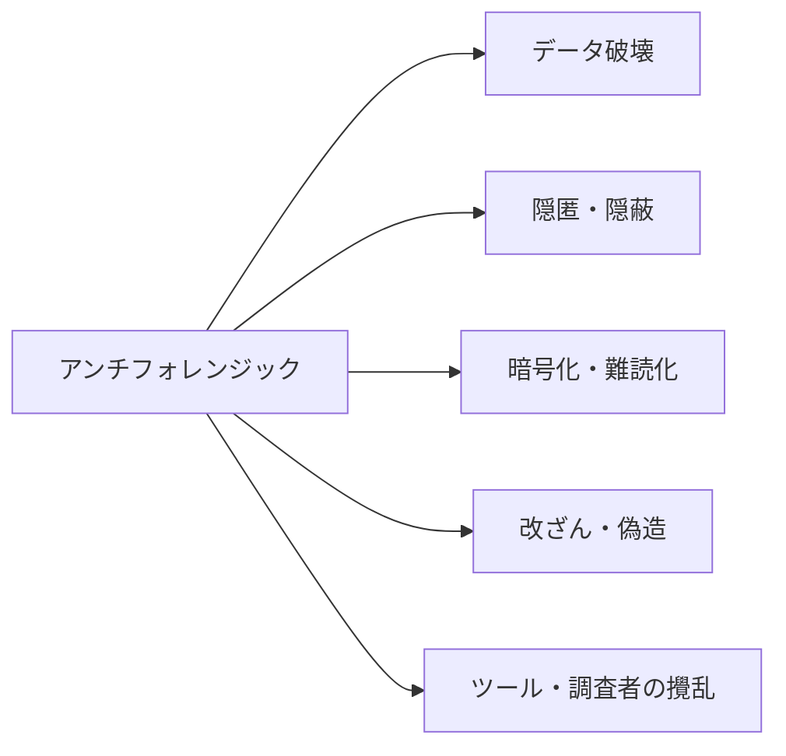
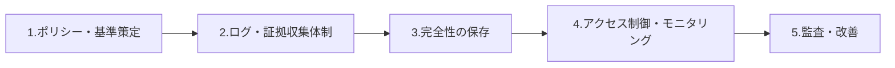

# アンチフォレンジック(Anti-Forensic)と対応コンプライアンス

## 1. 概要

### A. 定義
> デジタルフォレンジックの **証拠収集・分析・法的提出** を妨害・回避・無力化する目的で、データを **隠匿・削除・改ざん・偽造** したり、分析ツールや調査者を攪乱したりする技術および行為の総称。

アンチフォレンジックはフォレンジックと **矛と盾の関係** にある。フォレンジックが削除されたデータを復元し、行為の痕跡をタイムラインとして再構成する技術を発展させるほど、それを無力化しようとするアンチフォレンジックも精巧になる。目的は、証拠の3つの属性すなわち **存在・完全性・解釈可能性** のうち1つ以上を破壊し、証拠としての価値や法的な証拠能力を低下させることにある。

### B. 登場背景および必要性
フォレンジック捜査手法が高度化・標準化されると、その反作用として痕跡消去ツールが大衆化し、犯罪の隠蔽・内部情報流出の証拠隠滅・ランサムウェアやハッキングの痕跡削除などで広く使われている。これに加え、フルディスク暗号化の標準搭載、クラウド・大容量記憶媒体の普及、メモリ常駐型(ファイルレス)攻撃の増加により、**証拠が隠れうる表面そのものが広がった**。このため企業・機関は事故後の対応ではなく、証拠が削除される前にあらかじめ確保・保存する **先制的コンプライアンス体制** を整える必要がある。

## 2. アンチフォレンジック技術の分類

手法は、証拠を「**なくすのか**(破壊)、**隠すのか**(隠匿・暗号化)、**欺くのか**(改ざん・偽造)、**分析を妨げるのか**(ツール攪乱)」という目的によって分けられる。目的が異なるため対応方法も異なり、破壊には事前バックアップで、隠匿には探索手法で、改ざんには完全性検証で、ツール攪乱には複数ツール・ライブフォレンジックでそれぞれ対抗する。

| 類型 | 詳細手法 | 対応難易度 | 対応の焦点 |
|---|---|---|---|
| **データ破壊** | ワイピング(Gutmann・DoD方式)、消磁(デガウス)、物理破壊 | 復元はほぼ不可能 | 削除前の先制収集・バックアップ |
| **隠匿(Hiding)** | ステガノグラフィ、スラック領域・HPA/DCO、隠しパーティション、ADS | 高い | 低レベルイメージング・隠匿領域の探索 |
| **暗号化・難読化** | フルディスク暗号化(BitLocker)、ボリューム暗号化、パッキング | 鍵の確保が鍵 | ライブフォレンジック・鍵/メモリの確保 |
| **改ざん・偽造** | タイムスタンプ改ざん(Timestomp)、ログ削除・偽造、メタデータ操作 | 完全性の相互検証が必要 | 複数ソースの突合・ハッシュ検証 |
| **ツール攪乱** | フォレンジックツールの脆弱性悪用、アンチデバッグ、メモリ常駐型(ファイルレス) | 非常に高い | メモリフォレンジック・複数ツール |

特に **データ破壊** がなぜ対応困難かというと、Gutmann・DoD方式の多重上書きや消磁は磁気記録そのものを物理的に消去するため、事後の復元が事実上不可能だからである。そのためこの類型に限っては「**削除される前にすでに収集しておくこと**」が唯一確実な対応であり、これが以下のコンプライアンス体制の設計原理となる。

## 3. 対応: コンプライアンスシステム構築プロセス

コンプライアンス体制の中核的な設計原則は「**先制性**」と「**完全性**」である。アンチフォレンジックの多くは証拠を後から消したり変えたりすることを狙うため、防御は証拠を **リアルタイムで外部の変更不可能なストレージに複製・保存** することに焦点を置く。

| 段階 | 活動内容 | なぜ必要か |
|---|---|---|
| **ポリシー・基準策定** | 証拠管理ポリシー、法的要件(電子文書法・刑事訴訟法)の定義、保存期間 | 適正手続・証拠能力の根拠づくり |
| **ログ・証拠収集** | 統合ログ(SIEM)、エンドポイント(EDR)、イメージングの自動化 — **削除前の先制収集** | 破壊前の証拠確保が唯一の確実な策 |
| **完全性の保存** | ハッシュ(SHA-256)・電子署名・タイムスタンプ、**WORM保存**、二重化 | 事後の改ざん・偽造を根本的に遮断 |
| **アクセス制御・モニタリング** | 最小権限・職務分離、異常行為(大量削除・ワイピング)の検知 | 内部者による証拠隠滅の抑止・早期検知 |
| **監査・改善** | 定期監査、CoC(Chain of Custody)点検、事後改善 | 手続遵守の検証・体制の改善 |

ここで **WORM(Write Once Read Many)保存** とハッシュチェーンがなぜ決定的かというと、一度記録されると修正・削除が不可能なため、管理者権限を奪取した攻撃者でもすでに残されたログを元に戻せないからである。ログをローカルにだけ置くと侵入者がまとめて消去するが、WORM・リモートSIEMへ即座に送出すれば削除を無力化できる。

## 4. 対応活用プロセス(インシデント発生時)

インシデントが実際に発生した場合は、標準手順に従って動いてこそ証拠能力が維持される。順序を誤ると(例: 保存前の分析)完全性が損なわれ、法廷で排斥されうる。

| 段階 | 内容 | 留意点 |
|---|---|---|
| **検知(Detect)** | 削除・改ざん・異常行為のリアルタイム検知(EDR・SIEMルール) | 大量削除・ワイピングパターンのルール化 |
| **保存(Preserve)** | 証拠保全、**CoC** の維持(収集→保管→分析→提出の履歴) | 原本の毀損禁止、複製で分析 |
| **分析(Analyze)** | タイムライン分析、復元(ファイルカービング)、隠匿データの探索 | 複数ソースの相互検証で改ざんを判別 |
| **対応・報告(Respond)** | 法的対応、再発防止統制の強化、監査報告 | 根本原因に基づく統制の補強 |

**CoC(Chain of Custody、証拠保管の連続性)** とは、証拠が収集から提出まで、誰が・いつ・どのように扱ったかという途切れのない履歴をいう。この連鎖が一箇所でも途切れると「その間に操作された可能性がある」という疑いにより証拠能力を失うため、アンチフォレンジック対応の法的な成否を分ける要素である。

## 5. 考慮事項および示唆
- **先制的な証拠収集が中核**: ワイピング・消磁で破壊された後は復元が不可能であるため、リアルタイムのログ転送と自動イメージングによって「消される前に」確保することが防御の出発点である。
- **暗号化・クラウド環境への対応**: フルディスク暗号化がかかったシステムは電源を切ると鍵が消え、復号が困難になる。したがってシステムが稼働している間にメモリ・鍵を確保する **ライブフォレンジック** を併用しなければならない。
- **適正手続の遵守**: いくら証拠をうまく集めても、令状主義・適正手続・CoC・完全性に違反すれば証拠能力を失う。技術と法的要件を併せて設計する必要がある。
- **自動化・AIの拡大**: 大量削除・異常アクセスをAIベースの異常検知でリアルタイムに捕捉し、自動イメージングで対応する方向へと進化している。

---

> **一言まとめ**: アンチフォレンジックは *証拠を破壊・隠匿・暗号化・改ざん・偽造し、ツールを攪乱してフォレンジックを無力化* する技術であり、対応コンプライアンスはポリシー→**先制的な証拠収集**→完全性の保存(ハッシュ・WORM・CoC)→モニタリング→監査の順で構築し、インシデント時には検知-保存-分析-対応の手順と適正手続の遵守によって証拠能力を守る。
