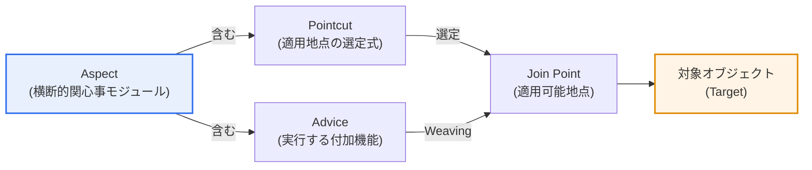
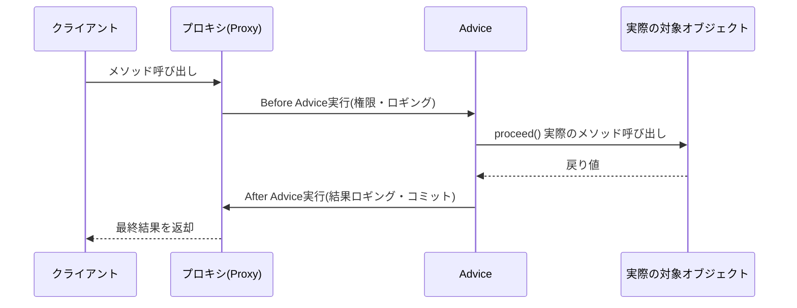

# AOP(Aspect Oriented Programming、アスペクト指向プログラミング)

## 1. 概要

### A. 定義
> ロギング・セキュリティ・トランザクションのように複数のモジュールにまたがって繰り返される **横断的関心事(Cross-cutting Concern)をAspectという独立モジュールに分離** し、実行フローの特定の地点(Join Point)に自動的に織り込む(Weaving)ことで、中核ロジックと付加機能を分離するプログラミングパラダイム。オブジェクト指向(OOP)を置き換えるのではなく補完する。

AOPの中核的な発想は「**散在して繰り返される共通機能を一箇所に集めること**」である。オブジェクト指向でいくら上手く設計しても、ロギング・認証・トランザクション・性能測定・例外処理といった機能は、ほぼすべてのメソッドに同じように入り込まざるをえない。こうしたコードを各メソッドに直接書き込むと、中核のビジネスロジックが付加機能のコードに埋もれて可読性が低下し、後でロギング方式を一つ変えようとしても数百箇所をいちいち修正しなければならない。これは単なる不便を超え、変更漏れによる欠陥(例: 特定のサービスメソッドだけトランザクションが抜けてデータ整合性が崩れる事故)につながる。

AOPはこの問題を、**横断的関心事をAspectという別モジュールとして抜き出し**、コンパイル・クラスロード・ランタイムのうち望む時点で対象コードの特定地点に自動的に差し込む方式で解決する。その結果、中核ロジックには純粋な業務コードだけが残って整理され、共通機能は一箇所で管理されるため変更が容易になる。代表的なのはSpringフレームワークで、`@Transactional` アノテーション一つでメソッド実行の前後にトランザクションの開始・コミット・ロールバックのコードを自動的に織り込むが、これがまさにAOPを利用した宣言的トランザクション処理である。開発者はトランザクション境界を毎回手作業でコーディングせず、「このメソッドはトランザクション対象である」と宣言するだけでよい。

### B. 登場背景と必要性
オブジェクト指向は機能をクラスという垂直的な単位でうまく分離する。しかしロギング・セキュリティ・トランザクションのように **複数のクラスを横断して共通に必要となる付加機能は、どのクラスにも完全には属さない**。こうした機能を無理に継承やユーティリティ呼び出しで処理すると、コードの散在(Code Scattering)と関心事の絡み合い(Code Tangling)という2つの慢性的な問題が生じる。コードの散在とは同じロギングコードが数百のメソッドに散らばる現象であり、関心事の絡み合いとは一つのメソッドの中に業務ロジック・ロギング・セキュリティ検査が混在する現象である。

AOPは1997年、ゼロックス・パロアルト研究所(Xerox PARC)のグレゴール・キザレス(Gregor Kiczales)の研究チームが提案し、その後Java陣営のAspectJとSpring AOPを通じて実務に広く定着した。すなわちAOPはオブジェクト指向の「モジュール化の死角」を埋めるための補完パラダイムとして登場し、今日ではエンタープライズフレームワークのトランザクション・セキュリティ・モニタリングを支える中核技術となっている。

### C. 特徴
AOPは、① 横断的関心事の **モジュール化**、② 中核ロジックと付加機能の **関心事の分離(SoC)**、③ 宣言的な方式で付加機能を適用する **非侵襲性(Non-invasive)** を特徴とする。特にSpring AOPは対象コードを直接修正せずプロキシで包んで付加機能を適用するため、既存のビジネスコードに手を触れることなく共通機能を付け外しできる。

## 2. 中核構成要素

AOPを理解するには、5つの中核概念がどのように噛み合うかを知る必要がある。以下の全体構造図はこれらの概念の関係を、続く詳細フロー図は実際のメソッド呼び出し時にAdviceがどのように割り込むかを示している。

**Aspect** は横断的関心事をモジュール化した単位であり、その中に「何をするか(Advice)」と「どこに適用するか(Pointcut)」をまとめて持つ。**Advice** はAspectが実際に実行する付加機能のコードであり、実行タイミングによっていくつかの種類に分かれる。**Join Point** はAdviceが割り込みうるプログラム実行上のすべての候補地点(メソッド呼び出し、例外発生など)であり、**Pointcut** はその多数の候補の中から実際に適用する地点を選び出す式である。**Weaving** は、こうして選んだ地点にAspectを実際に織り込む過程である。

| 構成要素 | 役割 | 例 |
|---|---|---|
| **Aspect** | 横断的関心事をまとめたモジュール | `LoggingAspect`, `TxAspect` |
| **Advice** | 実際に実行する付加機能 | メソッド前後のログ記録 |
| **Join Point** | Advice適用可能地点 | メソッド実行、例外処理 |
| **Pointcut** | 適用するJoin Pointの選定式 | `execution(* service..*(..))` |
| **Weaving** | Aspectを対象に織り込む過程 | コンパイル・ロード・ランタイムウィービング |
| **Target** | Adviceが適用される対象オブジェクト | 実際のビジネスBean |

### A. Adviceの種類 — 実行タイミングが生む違い
Adviceは対象メソッドのどの時点に割り込むかによって分かれ、この選択は実務で非常に重要である。**Before** はメソッド実行の直前に(例: 権限チェック)、**After Returning** は正常リターンの直後に(例: 結果のロギング)、**After Throwing** は例外発生時に(例: エラー通知)、**After(finally)** は成功・失敗に関係なく常に、**Around** はメソッド実行の前後をすべて包んで実行そのものを制御する(例: 実行時間の測定、キャッシング、リトライ)。

このうちAroundが最も強力だが、それだけ危険でもある。Aroundは対象メソッドを呼び出すかどうかまで直接決定するため、開発者が `proceed()` の呼び出しを忘れると肝心の中核ロジックが実行されない欠陥が生じる。したがって単純なロギングにはBefore/Afterを、実行フローの制御が必須となるトランザクション・キャッシングにはAroundを使うというように、目的に合わせて選択するのが原則である。

### B. Weavingのタイミング — 3つの方式のトレードオフ
Weavingをいつ行うかによって、AspectJ系はコンパイル時ウィービング(CTW)・ロード時ウィービング(LTW)を、Spring AOPはランタイムウィービングを用いる。以下の詳細フロー図は、ランタイムのプロキシベースのウィービングにおいて、クライアントの呼び出しがプロキシを経てAdviceと実際のメソッドへとつながる過程を示している。

コンパイル時ウィービングはソース・バイトコードのコンパイル段階でAspectを直接組み込むため、ランタイム性能は最も良いが専用コンパイラ(ajc)が必要である。ロード時ウィービングはクラスがJVMにロードされる瞬間にバイトコードを変換するため柔軟だが、別途エージェントの設定が必要である。ランタイムウィービングはプロキシオブジェクトで包む方式のため設定が簡単で純粋なJavaだけで動作するが、プロキシを経由する呼び出しのオーバーヘッドがあり、プロキシの特性上 **同じオブジェクト内部で自分のメソッドを直接呼び出す(self-invocation)とAdviceが適用されない** という限界がある。実際、Springで `@Transactional` メソッドを同じクラスの別のメソッドが直接呼び出すとトランザクションがかからないという有名な落とし穴は、ここに由来する。

## 3. 期待効果と適用事例

AOPの効果は単に「コードがすっきりする」にとどまらず、定量的な利得として現れる。たとえば100個のサービスメソッドそれぞれにトランザクション・ロギング・権限チェックのコードを入れると、付加コードだけで数百行が重複するが、AOPで分離すればAspect 3個(約数十行)で同じ機能を処理しつつ、中核メソッドからは付加コードが完全に消える。ロギングポリシーを変更する際に修正すべき箇所も、数百箇所からわずか1箇所(該当Aspect)に減る。

| 効果 | 内容 | 実務上の含意 |
|---|---|---|
| **関心事の分離(SoC)** | 中核ロジックと付加機能の分離 | ビジネスコードの可読性・集中度の向上 |
| **重複排除・再利用** | 共通機能を一箇所で管理 | 変更箇所を数百→1箇所に縮小 |
| **保守性** | 付加機能の変更時はAspectのみ修正 | 変更漏れによる欠陥を予防 |
| **非侵襲性** | 対象コードを修正せずに適用/解除 | レガシーにも段階的に適用可能 |

実際の産業適用を見ると、金融機関の勘定系システムはすべての取引サービスにAOPでトランザクションと監査ログ(誰が・いつ・何を照会/変更したか)を一括適用し、規制(電子金融監督規定)が求める追跡可能性を確保している。大手コマースプラットフォームはAOPでAPIの応答時間を地点ごとに測定してボトルネックを監視し、特定のメソッドにキャッシング・リトライのロジックを宣言的に載せて障害耐性を高めている。さらにマイクロサービスでは、AOPに類似した発想がサービスメッシュ(サイドカープロキシ)へと拡張され、認証・トラフィック制御・可観測性(Observability)をアプリケーションコードの外側で横断的に処理している。

### A. Spring AOPとAspectJの選択
実務でよく直面する判断は「Spring AOPで十分か、AspectJまで必要か」である。両技術は同じAOPの概念を実装するが、適用範囲と方式が異なる。Spring AOPはSpringコンテナが管理するBeanの **メソッド実行Join Pointのみ** を対象とし、ランタイムプロキシで動作する。設定が簡単で別途コンパイラが不要なため、大多数のエンタープライズアプリケーションにはこれで十分である。

一方AspectJは、フィールドアクセス・コンストラクタ呼び出し・静的初期化など **はるかに広いJoin Point** をサポートし、コンパイル時/ロード時ウィービングによってプロキシなしでバイトコードに直接組み込む。したがって、Spring Beanではない一般オブジェクトにもAspectを適用する必要がある場合や、プロキシのオーバーヘッド・self-invocationの限界を避ける必要がある高性能・きめ細かな制御の状況ではAspectJが適している。まとめると、「管理Beanのメソッドレベルの共通機能」はSpring AOP、「その境界を越える全面的・きめ細かなウィービング」はAspectJ、という基準で選択する。

| 区分 | Spring AOP | AspectJ |
|---|---|---|
| **Join Pointの範囲** | Spring Beanのメソッド実行 | メソッド・フィールド・コンストラクタなど広範 |
| **ウィービング方式** | ランタイムプロキシ | コンパイル時・ロード時バイトコード |
| **性能** | プロキシ呼び出しのオーバーヘッド | プロキシがなく優秀 |
| **適用難易度** | 簡単(純粋Java) | 専用コンパイラ・エージェントが必要 |
| **適した状況** | 一般的なエンタープライズ共通機能 | きめ細かで全面的なウィービング、高性能 |

## 4. OOPとAOPの比較

AOPはOOPと対立するものではなく、異なる軸のモジュール化を担う。OOPがデータと機能を垂直にカプセル化するとすれば、AOPは複数のオブジェクトを水平に横断する関心事をモジュール化する。この違いにより両者は競合ではなく並行関係にあり、実務ではOOPでドメインを設計し、AOPで横断的関心事を載せる組み合わせが標準となった。

| 区分 | OOP | AOP |
|---|---|---|
| **モジュール化の軸** | 垂直(クラス・継承) | 水平(横断的関心事) |
| **主な関心** | ドメインの中核ロジック | ロギング・セキュリティ・トランザクションなどの共通機能 |
| **分離単位** | クラス・オブジェクト | Aspect |
| **関係** | 基盤パラダイム | OOPの補完 |

## 5. 深掘り — 現代アーキテクチャにおける拡張と出題戦略

AOPの概念はフレームワーク内部にとどまらず、現代のクラウドネイティブアーキテクチャへと拡張されている。代表的なのが **サービスメッシュ(Service Mesh、例: Istio・Linkerd)** であり、各サービスの横にサイドカープロキシ(Envoy)を付けて、認証(mTLS)・リトライ・サーキットブレーカー・分散トレーシングをアプリケーションコードの外側で処理する。これは「横断的関心事をコードから分離し、インフラ層でウィービングする」という点で、AOPの発想をネットワークレベルに引き上げたものと見ることができる。また可観測性の標準であるOpenTelemetryの自動計装(auto-instrumentation)も、バイトコードウィービング手法でメソッドにトレースコードを挿入するという点で、AOPと技術的なルーツを共有している。

技術士試験の観点では、AOPは「SW工学・フレームワーク」領域の定番テーマであり、単独の略述だけでなく、Springトランザクション・クリーンアーキテクチャ・マイクロサービスの可観測性と組み合わせて出題されうる。答案構成時には、① 定義と登場背景(コードの散在・絡み合いの問題)、② 5大構成要素と図、③ Adviceの種類・Weavingタイミングのトレードオフ、④ Springでの実務適用(宣言的トランザクション)とself-invocationの落とし穴、⑤ サービスメッシュへの拡張、までを階層的に展開すれば深さを示すことができる。特に「AOPの限界や注意点」を問う変形問題には、プロキシのオーバーヘッド・デバッグの難しさ・自己呼び出しの落とし穴を根拠とともに提示することが高得点のポイントである。

## 6. 考慮事項および示唆

1. **OOPの補完として位置づけるべきである。** AOPはオブジェクト指向を置き換えるものではなく、オブジェクト指向が扱えない横断的関心事を補完する。したがってドメイン設計はOOPで、共通機能はAOPで分ける役割分担の原則を守ってこそ濫用を避けられる。
2. **デバッグ・追跡の難しさに備える。** コードに明示されていない機能が実行時に割り込むため、フローの追跡が難しい。Pointcut式を明確かつ狭く定義し、どのAspectがどこに適用されるかを文書化・検証(テスト)して「隠れた副作用」を統制しなければならない。
3. **性能と適用方式のトレードオフを判断する。** ランタイムプロキシのウィービングは設定が簡単だが呼び出しオーバーヘッドとself-invocationの限界があり、コンパイル時/ロード時ウィービングは性能は良いがビルド・デプロイの複雑さが増す。システムの性能要件と運用の容易さを天秤にかけてウィービング方式を選択すべきである。
4. **過度な適用(Aspectの濫用)を警戒する。** すべてをAspectに切り出すと、かえって実行フローが不透明になり保守が難しくなる。ロギング・トランザクション・セキュリティ・監査のように真に横断的な関心事に限定して適用する節度が必要である。
5. **クラウドネイティブへの進化と連携する。** AOPの関心事分離の哲学はサービスメッシュ・OpenTelemetry自動計装などのインフラ層へと拡張されているため、アプリケーションのAOPとインフラ層の横断処理を組み合わせ、アーキテクチャ全体の関心事分離を設計する観点が求められる。

## 参考資料
- Spring Framework Reference — Aspect Oriented Programming with Spring: https://docs.spring.io/spring-framework/reference/core/aop.html
- The AspectJ Programming Guide (Eclipse): https://eclipse.dev/aspectj/doc/latest/progguide/index.html

---

> **一言まとめ**: AOPは *ロギング・セキュリティ・トランザクションのような横断的関心事をAspectとして分離* し、実行時点(Join Point)にWeavingで織り込むパラダイムであり、Aspect・Advice・Pointcut・Join Point・Weavingで構成され、OOPを補完してコードの明瞭性・保守性を高め、サービスメッシュなどのクラウドネイティブへと拡張されている。
