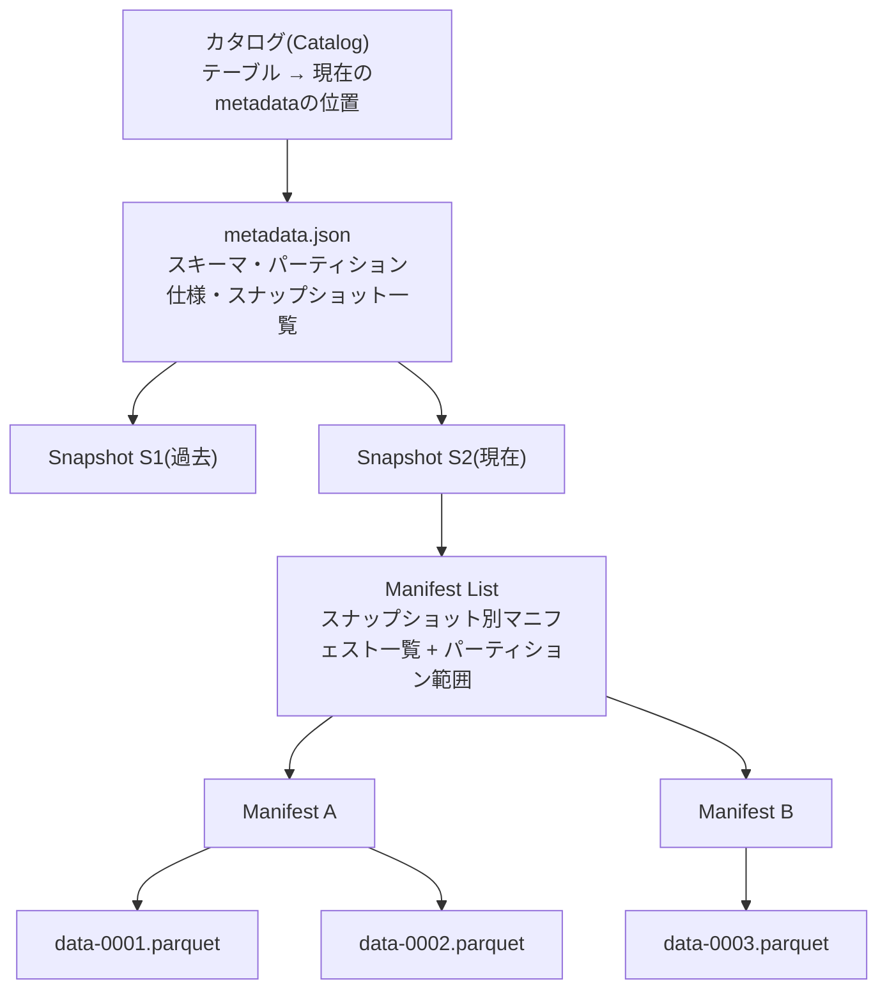
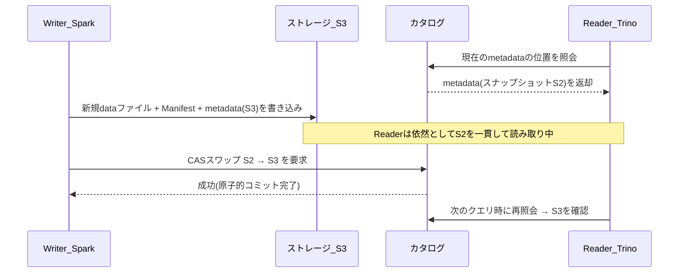

# オープンテーブルフォーマット(Apache Iceberg)

## 1. 概要

> **定義**: Apache Icebergは大規模な分析用データセットのための **オープンテーブルフォーマット(Open Table Format)**であり、オブジェクトストレージ(S3・HDFS・GCSなど)上のファイル集合に **リレーショナルテーブルのセマンティクス(ACIDトランザクション・スキーマ進化・タイムトラベル)**を付与するメタデータ仕様である。データファイルそのものではなく、「どのファイル群が特定時点のテーブルを構成するか」を記述する **メタデータ層の標準**である。

データレイクは安価なオブジェクトストレージに元データをそのまま格納できるという利点から急速に普及したが、初期のデータレイクは事実上「ディレクトリに積まれたファイルの塊」にすぎなかった。代表的なのがHiveテーブルで、**ディレクトリパス(例: `/sales/dt=2026-09-19/`)をパーティションとみなす**方式であったが、この構造には3つの根本的な限界があった。第一に、ファイル一覧を把握するにはストレージのディレクトリを再帰的に列挙(LIST)しなければならず、ファイルが数百万個に増えるとクエリプランニングそのものがボトルネックになった。第二に、複数のジョブが同時に同じテーブルへ書き込むと、部分的に更新されたファイルがそのまま露出し、**原子性が保証されなかった**(読み手が半分だけ書かれた結果を見る可能性がある)。第三に、パーティション列を変えたりスキーマを変更したりすると、データを全面的に書き直さなければならなかった。

Apache Icebergはこうした「データレイクの信頼性欠如」問題を解決するためにNetflixが2017年に社内で開発し、2018年にApacheソフトウェア財団へ寄贈され、2020年にTop-Level Projectとなった。中核となるアイデアは **ディレクトリ列挙をメタデータファイルの追跡で置き換える** ことである。テーブルを構成するすべてのデータファイルの一覧と統計をメタデータとして明示的に管理することで、ストレージを列挙することなく、どのファイルを読むべきかをO(ファイル数)ではなくメタデータの参照だけで決定する。これによりデータレイクがデータウェアハウス並みのトランザクション性と性能を備える **レイクハウス(Lakehouse)**の格納基盤となった。

Netflixがこの問題に直面した文脈は示唆に富む。当時Netflixは S3上の数十ペタバイトのデータをHiveテーブルとして運用していたが、1つの大規模テーブルで特定のパーティションを照会する単純なクエリでさえ、S3に対する数百万件のLIST・GET呼び出しのためにプランニングだけで数分を要し、同時書き込み時に原子性がないため誤った結果が分析に流入する事故が繰り返されていた。Icebergは「クエリエンジンにストレージを漁らせるのではなく、メタデータがあらかじめ正解を持つようにしよう」という観点の転換によって、この問題を根本から解決した。これはデータベースのインデックス・カタログが担っていた役割を、ファイルベースのデータレイクに移植したのと同じである。

Icebergの特徴は次のように要約される。**エンジン中立性**(Spark・Trino・Flink・Snowflake・Dremioなど複数のエンジンが同一テーブルを共有)、**ファイルフォーマット中立性**(Parquet・ORC・Avroをサポート)、**ストレージ中立性**(ファイルパスをメタデータに絶対パスで記録し、ディレクトリ構造に依存しない)、そして **スナップショットベースの分離** による直列化可能レベルの一貫性である。

まとめると、Icebergが解決した中核命題は「安価なオブジェクトストレージの拡張性・経済性を維持しつつ、リレーショナルデータベースが提供していたトランザクション・スキーマ管理・時点照会の信頼性を取り戻すこと」である。この命題はデータが爆発的に増え、分析・AIの需要が多様化する現代のデータプラットフォームにおいて必ず解くべき課題であり、そのためIcebergは情報管理技術士の観点からデータアーキテクチャ設計の必須検討対象となった。

## 2. 全体構造とメタデータ層

Icebergテーブルは大きく **カタログ → メタデータファイル → マニフェストリスト → マニフェスト → データファイル** と続く階層型のポインタ構造を持つ。この多層構造こそがIcebergの性能とトランザクション性を生み出す中核メカニズムである。各層は上位が下位を不変(immutable)のポインタで参照し、いかなる変更も新しいファイルを作成して最上位のポインタだけを差し替える方式で反映されるという原則を共有する。この「書き込みは常に追加、切り替えはポインタの差し替え」という原理が、以下で説明する原子性・分離・タイムトラベルを一つの一貫したメカニズムとして束ねている。

**カタログ(Catalog)**は、テーブル名を現在有効な `metadata.json` の位置にマッピングする最上位のポインタである。トランザクションの原子性はまさにこの地点で保証される。書き込み処理は新しいデータファイルと新しいメタデータをすべて準備した後、**最後の瞬間にカタログのポインタを旧metadataから新metadataへ原子的に差し替える(compare-and-swap)**。このスワップが成功するまではどの読み手も新しいデータを見ることはなく、成功した瞬間に変更全体が一斉に見えるようになる。カタログの実装としてはHive Metastore、AWS Glue、JDBC、Nessie、そして2024年に標準化された **REST Catalog** があり、REST Catalogはエンジンとカタログを HTTPプロトコルで分離して相互運用性を大きく高めた。

**メタデータファイル(metadata.json)**は、テーブルの現在のスキーマ、パーティション仕様、ソート順、そしてこれまでに生成されたすべてのスナップショットの一覧を保持する。各スナップショットは特定時点のテーブルの完全な状態を表し、このスナップショット履歴がタイムトラベルとロールバックの根拠となる。

**マニフェストリスト(Manifest List)**は、1つのスナップショットを構成するマニフェストファイルの一覧であり、各マニフェストがカバーする **パーティション値の範囲(下限・上限)**もあわせて保存する。おかげでクエリエンジンは、マニフェストを開く前にパーティション範囲だけで無関係なマニフェストを丸ごとスキップできる。

**マニフェスト(Manifest)**は、実際のデータファイルの一覧と、各ファイルの **列ごとの統計(最小値・最大値、null数、レコード数)**を保持する。このファイルレベルの統計がIcebergの性能の中核であり、エンジンは `WHERE price > 1000` のような条件を満たす可能性のないファイルを、統計だけを見て除外(file pruning)する。

## 3. 中核機能と動作原理

### A. 隠しパーティショニング(Hidden Partitioning)

従来のHiveテーブルでは、ユーザーはパーティション列を物理的に意識し、クエリに明示しなければならなかった。たとえばイベントのタイムスタンプで日付パーティションを作るには別途 `event_date` 列を維持し、クエリでも `WHERE event_date = '2026-09-19'` のようにパーティション列を直接条件に入れてはじめてパーティションプルーニングが働いた。ユーザーがうっかり `WHERE event_time BETWEEN ...` だけを書くとパーティションが効かずフルスキャンが発生するという、よくある致命的な落とし穴であった。

Icebergの **隠しパーティショニング** は、パーティションを元の列に対する **変換(transform)関数** として定義する。`days(event_time)`、`bucket(16, user_id)`、`truncate(10, zipcode)` のように宣言すると、Icebergが書き込み時に自動的にパーティション値を計算してメタデータに記録し、読み取り時にはユーザーが元の列(`event_time`)だけでフィルタリングしても、エンジンが変換関係を知っているため自動的にパーティションプルーニングを適用する。すなわち **パーティションの存在がユーザーにとって透過的(隠蔽)**になり、パーティション列を誤って使うことで性能が崩れる事故を構造的に予防する。実務では大容量のログテーブルを `days(ts)` でパーティショニングすると、1日分を照会する際に数千個のファイルのうち該当日付のファイルだけをスキャンし、応答時間が数十分から数秒に短縮される効果が得られる。

この設計のもう一つの利点は、**パーティション列の重複保存をなくす** 点である。Hive方式ではパーティション値を保持するために、元のタイムスタンプとは別に `event_date` 列を物理的に保存・維持する必要があり、この派生列が元データとずれるとデータ品質事故につながった。Icebergは変換式だけをメタデータに宣言するため派生列が不要であり、パーティション定義を進化(例: `days`→`hours`)させても保存済みのデータには手を触れない。これはパーティショニングを「物理的なディレクトリ配置」ではなく「論理的なインデックス規則」として抽象化した発想の転換であり、ユーザーが物理的な格納構造を知らなくても最適な性能を得られる **物理的データ独立性** のデータレイク版実装といえる。

### B. スキーマ・パーティション進化(Evolution)

Icebergは列を **名前ではなく固有IDで追跡** する。この設計のおかげで、列の追加・削除・名前変更・順序変更・型の拡大(int→longなど)を **データファイルを書き直さずにメタデータだけを変更** して安全に行える。たとえば列名を変えてもIDはそのままなので、過去のデータファイルとのマッピングが壊れない。反対にHiveは列を位置(順番)でマッピングしていたため、途中の列を削除すると後ろの列のデータがずれて誤って読まれる事故が頻発した。

**パーティション進化** はさらに一歩進んだ機能である。データが増えてパーティション戦略を `days` から `hours` に変えなければならないとき、Icebergは **既存データを書き直さずに新しいパーティション仕様を追加** する。以降に書き込まれるデータだけが新しい仕様に従い、マニフェストには各ファイルがどのパーティション仕様で書かれたかが記録されるため、1つのテーブルに異なるパーティショニングを持つファイルが共存してもクエリは正確に動作する。これはペタバイト級テーブルのパーティション戦略をダウンタイムなしで変更できるようにする、運用上非常に大きな利点である。

こうした進化能力が重要な理由は、データモデルが **時間とともに必ず変わる** という現実にある。ビジネスが成長すれば日単位のパーティションではファイルが大きくなりすぎ、新たな規制で列を追加する必要が生じ、誤って設計した型を広げなければならない状況が訪れる。従来のデータレイクでは、こうした変更の一つひとつが数時間〜数日の全面書き直しバッチとその間のサービス停止を意味したが、Icebergはこれを **メタデータトランザクションに格下げ** することで、「データモデルをまるでコードのように段階的にリファクタリング」できるようにする。この点がIcebergを単なるファイルフォーマットではなく、長寿テーブルのための管理フレームワークへと格上げする要素である。

### C. スナップショット分離・タイムトラベル・ロールバック

前述のスナップショット構造は、**直列化可能分離(serializable isolation)**を自然に提供する。読み手はクエリ開始時点のスナップショットを最後まで一貫して読み、書き手は新しいスナップショットを作ってカタログのポインタを差し替えるだけで、既存のスナップショットを毀損しない。したがって読み取りと書き込みが互いをブロックしない(MVCCに類似)。

このスナップショット履歴は **タイムトラベル** と **ロールバック** に直結する。`SELECT * FROM tbl FOR TIMESTAMP AS OF '2026-09-18 00:00:00'` のように過去時点のテーブルをそのまま照会したり、誤ったバッチ投入を以前のスナップショットへ即座に戻したりできる。実務では夜間ETLが誤ったデータを投入した際、バックアップ復元なしに `rollback_to_snapshot` で数秒以内に正常状態へ復旧した事例が代表的な活用例である。

タイムトラベルは単なる便利機能を超え、**データの再現性(reproducibility)**というデータエンジニアリングの長年の難題を解決する。たとえば機械学習モデルを学習した時点のデータ状態をスナップショットIDで固定しておけば、数か月後でもまったく同じ学習データで実験を再現したり、モデル性能低下の原因がデータの変化なのかコードの変化なのかを切り分けて究明したりできる。また2つのスナップショット間の差分だけを読み出す **増分読み取り(incremental read)**をサポートするため、テーブル全体を再スキャンすることなく、前回処理以降に新たに追加・変更されたレコードだけを下流パイプラインへ渡す効率的なCDC消費が可能である。

### D. 行レベルの変更とコンパクション(MoR/CoW)

Icebergは、オブジェクトストレージのファイルが不変(immutable)であるという制約の上でUPDATE・DELETE・MERGEを実装するために、2つの戦略を提供する。**CoW(Copy-on-Write)**は、変更が及ぶデータファイルを丸ごと書き直して即座に整合性を確保する方式で、読み取りは速いが少量の変更でもファイル全体を書き直すため書き込みコストが大きい。**MoR(Merge-on-Read)**は、変更分を別途の **削除ファイル(position/equality delete)**として記録しておき、読み取り時点でマージする方式で、書き込みは軽いが読み取り時にマージのオーバーヘッドがある。ストリーミングCDCのような少量・高頻度の更新にはMoRが、バッチ中心の大量更新にはCoWが有利である。

MoRとストリーミング投入は必然的に **スモールファイル(small file)問題** を生む。ファイルが細かく分割されるとマニフェストが肥大化し、スキャンのオーバーヘッドが大きくなる。これを解決するのが **コンパクション(compaction)**であり、`rewrite_data_files` で小さなファイルを大きなファイルにマージし、`expire_snapshots` で古いスナップショットとそれだけが参照するデータファイルを整理して、ストレージコストとメタデータサイズを管理する。こうした **テーブル保守(maintenance)** 作業の自動化水準が、実務の運用品質を左右する。

具体的には、毎秒数千件が流入するストリーミングテーブルでは、コミットごとに数MBのファイルが作られ、1日で数万〜数十万個のファイルに膨れ上がりうる。このとき照会性能はデータの総量ではなく **ファイル数** に支配される。ファイル1つごとに最低1回のGETリクエストとメタデータの解析が必要だからである。実務上の指針は通常、データファイルを128MB〜512MB程度に保つよう定期コンパクションをスケジューリングすることであり、さらに削除ファイルをデータファイルへ物理的にマージする作業も併せて行い、MoRテーブルの読み取り性能を回復させる。またマニフェスト自体が多くなれば `rewrite_manifests` でマニフェストを再構成し、クエリプランニング時間を下げる。このようにIcebergの性能は「フォーマットが良いから」自然に出るものではなく、**保守パイプラインを継続的に運用** してはじめて維持されるという点を必ず認識しておかなければならない。

## 4. 比較: Iceberg vs Delta Lake vs Hudi vs Hive

3つのオープンテーブルフォーマット(Iceberg・Delta Lake・Hudi)は、いずれもデータレイクにACIDを付与するという目標は同じだが、生い立ちと強みが異なる。以下の表は補助的な整理であり、違いが生じる理由は続けて述べる。

| 区分 | Hive(従来) | Apache Iceberg | Delta Lake | Apache Hudi |
|------|-----------|----------------|------------|-------------|
| 追跡単位 | ディレクトリ(パス) | ファイル一覧(メタデータ) | トランザクションログ(JSON) | タイムライン + インデックス |
| ACID | 保証なし | スナップショット+CAS | トランザクションログ | タイムラインコミット |
| パーティション進化 | 書き直しが必要 | サポート(書き直し不要) | 限定的 | 限定的 |
| 隠しパーティショニング | なし | サポート | なし(生成列が必要) | なし |
| 強み | レガシー互換 | エンジン中立・大規模 | Sparkエコシステムと密着 | ストリーミングupsert |

Hiveと残りの3つの根本的な違いは **「ディレクトリ列挙か、メタデータ追跡か」** である。Hiveはファイル一覧をストレージからリアルタイムで列挙するため、ファイルが増えるほど遅くなり、原子性もない。一方、3つのオープンフォーマットはファイル一覧をメタデータで明示的に管理することでこの問題を解決した。

この違いが実測性能にどう現れるかを例で示すと、100万個のファイルで構成されたテーブルで特定の1日分を照会する際、Hiveは関連ディレクトリを再帰的に列挙しながら数万〜数十万件のストレージAPI呼び出しを発生させ、クエリプランニングだけで数分を要しうる。一方Icebergは、マニフェストリストのパーティション範囲で無関係なマニフェストをスキップし、マニフェストの列統計で条件に合わないデータファイルを除外するため、実際に読むべき少数のファイルだけを残してプランニングを数秒以内に終える。ファイルレベルの統計に基づくこの **ファイルプルーニング** と、データそのものを値の順序でまとめておく **ソート・Z-orderクラスタリング** を併用すれば、照会が読むべきデータ量自体が大きく減り、コスト(スキャンバイト課金)と応答時間が同時に改善される。

IcebergとDelta Lakeの違いは、**中立性対統合性** のトレードオフとして理解すると明確になる。Icebergは当初から特定のエンジンに依存しないオープンな仕様(spec)として設計され、複数のエンジンが対等に同じテーブルを読み書きするマルチエンジン環境に強い。実際にSnowflake・Google BigQuery・AWSなど主要ベンダーがIcebergを標準として採用したことで、事実上の業界標準の地位を固めた(2024年のDatabricksによるTabular買収、SnowflakeによるPolarisカタログのオープンソース化がこの流れを象徴している)。Delta LakeはSpark・Databricksエコシステムと深く統合され、その環境での最適化・機能の成熟度が高い反面、歴史的にエンジン依存性があった(その後Delta UniFormで相互運用性を補強)。Hudiはインデックスベースのupsertに特化し、ストリーミングCDCの投入で強みを発揮する。したがって、**マルチエンジン・ベンダー中立を最優先するならIceberg**、Databricks中心ならDelta、高頻度のストリーミングupsertが中核ならHudiが合理的な選択となる。

## 5. 深掘り: 標準化の動向と実務適用

Icebergを取り巻く最近の最も重要な流れは、**カタログの標準化とベンダー中立性の強化** である。2024年にIcebergコミュニティが **REST Catalog仕様** を安定化させたことで、エンジンとカタログがHTTPベースの標準プロトコルで通信するようになり、特定のカタログ実装への依存が大きく緩和された。同年、SnowflakeはREST仕様を実装した **Polaris Catalog** をオープンソースで公開し、DatabricksはIcebergの商用サポート企業 **Tabular** を買収した。これは、データウェアハウスベンダーが独自のクローズドなフォーマットの代わりにIcebergを共通の格納層として受け入れる方向へ市場が収斂しつつあることを示している。技術士の観点では、この流れは **データアーキテクチャのオープン化(open data architecture)** — すなわち「一揃いのデータを複数のエンジンが複製なしに共有する」パラダイムの実現と解釈できる。

技術仕様の面では **Iceberg V3** の議論が進行中であり、削除ベクトル(deletion vector)を用いたMoRの性能改善、行リネージ(row lineage)の追跡、ジオメトリ・可変型など新しいデータ型のサポートが含まれる。削除ベクトルは、従来の位置削除ファイルよりマージコストを下げ、MoRの読み取りオーバーヘッドを減らす方向である。

実務適用事例としては、大手コマース企業が1日平均数十億件のクリックストリームをS3にIcebergで格納し、Flinkでリアルタイム投入(MoR)、Trinoでアドホック分析、Sparkで夜間バッチコンパクションを行う **単一格納・マルチエンジンアーキテクチャ** が典型的である。このとき1日分の照会は `days(event_time)` の隠しパーティショニングとファイル統計プルーニングでフルスキャンを回避し、誤った投入はスナップショットのロールバックで復旧し、`expire_snapshots` でストレージコストを統制する。金融機関では規制対応のため、タイムトラベルで特定の決算時点のデータを再現・監査する用途にも活用されている。

AI/MLパイプラインとの連携も急成長している領域である。フィーチャーストアのオフライン格納先としてIcebergを採用すれば、学習に使用したフィーチャーのスナップショットを固定して再現性を確保し、増分読み取りで新規フィーチャーだけを効率的に更新できる。さらにデータウェアハウスベンダーがIcebergを共通層として受け入れることで、同一のデータを複製なしにBIツール・SQLエンジン・MLフレームワークが共に消費する構造が現実のものとなりつつある。これは、これまでウェアハウスとレイクに二元化され、データが重複保存・同期されていた非効率を取り除く方向であり、総保有コスト(TCO)の削減とデータ整合性の向上を同時に狙うものである。

## 6. 考慮事項および示唆

Icebergの導入を検討する技術士は、次のような戦略的・技術的観点を総合しなければならない。

- **カタログの選択がアーキテクチャの中核的な決定である。** トランザクションの原子性はカタログのCASに依存するため、マルチエンジンの相互運用とベンダーロックインの回避を望むなら **REST Catalogベース** をまず検討し、既存のAWSエコシステムであればGlue、ハイブリッド/オンプレミスであればNessie・JDBCなど運用環境に合わせて選択しつつ、**移行可能性(portability)**も併せて評価すべきである。

- **CoW/MoRとコンパクションは性能・コストのトレードオフとして設計する。** ワークロードがバッチによる大量更新であればCoW、ストリーミングの少量・高頻度更新であればMoRを選び、MoRを使う場合はスモールファイルの蓄積を相殺する **定期コンパクション・スナップショット失効の自動化** を必ずパイプラインに含めなければならない。これを怠ると、クエリ性能の低下とストレージコストの急増が同時に発生する。

- **データガバナンス・規制対応のてことして活用する。** タイムトラベルとスナップショット履歴は監査証跡・再現性・ロールバックを提供するが、逆に古いスナップショットを無期限に保持すると個人情報の破棄義務(GDPR・個人情報保護法の削除権)と衝突しうる。したがってスナップショットの保持期間を規制要件と整合するようにポリシー化し、物理的削除が確実に行われるよう失効・整理の手順を検証する必要がある。

- **レイクハウス移行の格納標準として位置づける。** Icebergはそれ自体で完結したソリューションではなく、クエリエンジン(Trino・Spark・Flink)、カタログ、データリネージ・品質ツールと結合してはじめて価値を生む。導入はフォーマットの採用にとどまらず、**メタデータ管理・ガバナンス・運用自動化を含むプラットフォーム設計** としてアプローチすべきであり、既存のHiveテーブルはインプレースマイグレーション(`add_files`・`snapshot`)で段階的に移行する戦略がリスクを下げる。

- **同時実行の競合とコミットの再試行を設計に反映する。** 複数のジョブが同じテーブルに同時に書き込むと、カタログのCASスワップで一方が失敗し、再試行しなければならない。楽観的同時実行制御であるため、競合頻度の高いワークロード(多数のストリーミングライターが同一パーティションに集中)ではコミットの再試行が頻発し、スループットが低下しうる。ライターをパーティションごとに分離したり、コミットのバッチ化・ライター数の調整で競合を減らしたりする設計が必要であり、これは分散トランザクションのトレードオフを理解する技術士の判断領域である。

- **展望: オープンなデータアーキテクチャへの収斂。** 主要ベンダーのIceberg採用により、今後のデータプラットフォームは「データを一揃いだけ保存し、分析・AI・BIエンジンがそれを共有する」方向へ進化する可能性が高い。AI/MLパイプラインのフィーチャー格納、ベクトルデータとの連携などでIcebergが共通基盤となる余地が大きいため、組織のデータ戦略を特定ベンダーではなく **オープン標準の上に設計** することが長期的な柔軟性の確保に有利である。

## 参考資料
- Apache Iceberg 公式ドキュメント: https://iceberg.apache.org/docs/latest/
- Apache Iceberg Spec: https://iceberg.apache.org/spec/
- Iceberg REST Catalog: https://iceberg.apache.org/concepts/catalog/

---
> **一言まとめ**: Apache Icebergは、オブジェクトストレージ上のファイルの塊にスナップショットベースのACID・隠しパーティショニング・スキーマ進化・タイムトラベルを付与するエンジン中立のオープンテーブルフォーマットであり、ベンダーロックインのないレイクハウスの事実上の標準格納層である。
