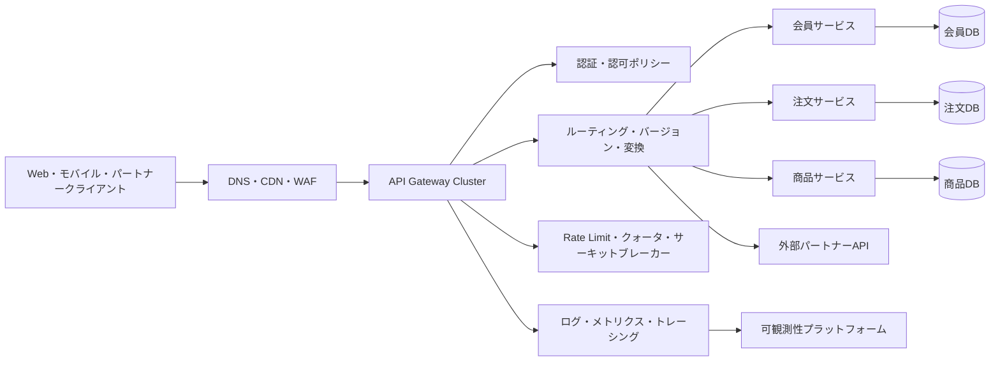
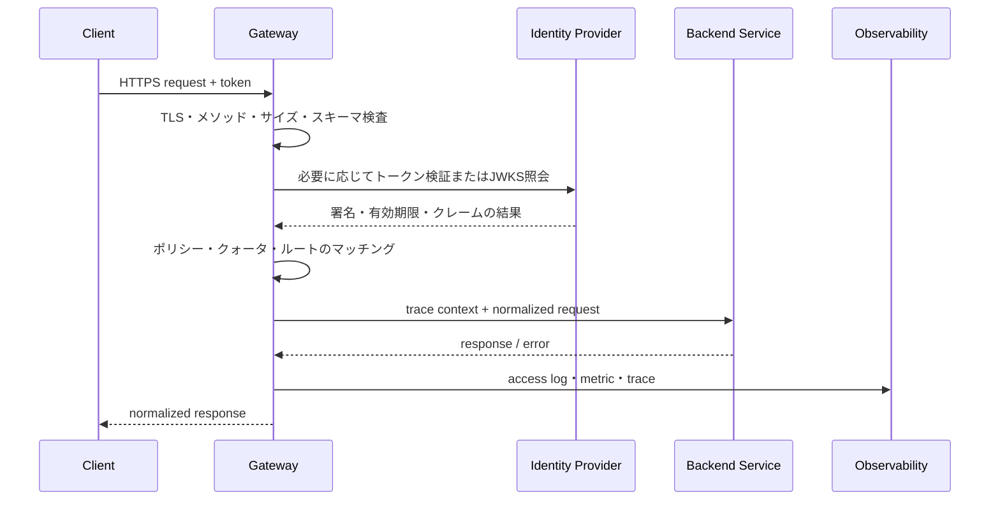

# APIゲートウェイ(API Gateway)のアーキテクチャと運用

## 1. 概要

> **定義**: APIゲートウェイは、外部クライアントと内部サービスの間の単一エントリポイントとして、リクエストを適切なバックエンドへルーティングし、認証・認可・変換・トラフィック制御・可観測性といった共通ポリシーを執行するサーバー側の構成要素である。

マイクロサービスアーキテクチャでは、機能が複数のサービスに分解され、サービスごとにアドレス、プロトコル、デプロイ周期が異なる。
クライアントが各サービスを直接呼び出すと、サービスの所在が外部に露出し、複数回のネットワーク往復によって遅延と失敗の可能性が大きくなる。
また、すべてのサービスが認証トークンの検証、呼び出し量の制限、監査ログ、TLS処理といった共通機能をそれぞれ実装することになり、重複とポリシーの不整合が生じる。
APIゲートウェイはこの境界にポリシー執行点を置き、外部APIの契約と内部サービスの実装を分離する。

ゲートウェイは単なるリバースプロキシより広い役割を担うが、業務ロジックを代行するアプリケーションサーバーではない。
リクエストの意味を解釈して決済承認や在庫引き当てのような中核的な業務判断を行うよりも、誰がどのAPIをどのような条件で呼び出せるかを統制することが本来の役割である。
この境界を守らないと、ゲートウェイが巨大なモノリスとなり、変更リスクと障害の影響範囲がかえって大きくなる。
したがって導入目的は、すべての機能を一箇所に集めることではなく、共通の横断的関心事と外部公開の境界を一貫して管理することにある。

試験答案では、APIゲートウェイを `外部チャネル → ポリシー執行 → 内部サービス` の流れで提示し、機能一覧を並べるだけで終わらせてはならない。
なぜ単一エントリポイントが必要なのか、どのポリシーをゲートウェイに置くのか、ゲートウェイの障害をどう隔離するのかまで結びつけてはじめて、設計の妥当性を説明できる。
特に認証と認可は異なる責任であり、TLS終端とバックエンド区間の暗号化を区別しなければならない。

### 1.1 登場背景と必要性

第一に、サービスのデカップリングのために必要である。
クライアントは `/orders` という安定した外部契約を呼び出し、ゲートウェイは現在の注文サービスのバージョンと所在を見つけて転送する。
サービスが `order-service-v2` から別のクラスタへ移動しても、外部クライアントの変更を最小化できる。
これはサービスディスカバリの変化とクライアントのリリース周期を切り離す効果がある。

第二に、APIの組み合わせとプロトコルの違いを吸収する。
モバイル画面1つが会員、商品、レコメンド情報を必要とするなら、ゲートウェイが複数のバックエンド呼び出しを組み合わせるBFF(Backend for Frontend)形態を選択できる。
反対にすべての組み合わせをゲートウェイに入れると結合度が高まるため、組み合わせのルールがチャネルごとに頻繁に変わる場合にのみ限定的に適用する。
ゲートウェイでの集約はネットワーク往復を減らせるが、部分的な失敗と応答の一貫性を新たに管理しなければならない。

第三に、セキュリティと運用ポリシーの基準点を提供する。
外部から流入するリクエストについて、ゲートウェイでTLS、トークン形式、リクエストサイズ、許可メソッド、呼び出し量、監査用識別子を検査できる。
しかしゲートウェイだけを信頼すると、内部の迂回呼び出しや権限昇格を防げないため、重要なサービスは独自の認可とサービス間の身元検証を追加しなければならない。
すなわちゲートウェイはセキュリティの唯一の境界ではなく、多層防御構造の第一層である。

### 1.2 中核目標と非目標

中核目標は、外部APIの安定した抽象化、共通ポリシーの一貫した執行、トラフィックの可視性の確保、サービス障害の伝播の抑制である。
これらの目標は互いに衝突しうる。
たとえば詳細な変換と集約を強化すると、クライアントの利便性は高まるが、ゲートウェイのCPU使用量と変更頻度が増加する。
したがって目標の優先順位を品質特性として定義し、APIごとに必要なポリシーだけを有効化すべきである。

非目標は、業務ルールの中央集約、データベースの統合、すべての内部通信の中継、無制限の応答キャッシュである。
注文金額の計算や顧客の融資限度の判断は、ドメインサービスが所有すべきである。
ゲートウェイが内部データベースを直接照会すると、サービス境界と監査証跡が曖昧になる。
内部の東西トラフィック全体をゲートウェイに通す構造も、ボトルネックと障害ドメインを大きくしうるため、サービスメッシュなど他の手段と切り分けて検討する。

## 2. 概念図と処理フロー

### 2.1 全体の論理アーキテクチャ

クライアントの前段にあるCDNとWAFは、静的コンテンツ、エッジキャッシュ、大規模ネットワーク攻撃の緩和に強みがある。
APIゲートウェイはその後ろで、API契約に合わせたルーティングとアプリケーションレベルのポリシーを実行する。
2つの層を一つのものと考えると、WAFが提供するネットワーク防御と、ゲートウェイが提供するユーザー・パス別のポリシーを区別しにくくなる。
各層で何を遮断し何を記録するかの責任表を先に作成すべきである。

ゲートウェイクラスタは最低2つ以上のインスタンスで構成し、状態をローカルメモリだけに保存しない方向が基本である。
ルーティング設定と認証鍵は宣言的に管理しつつ、実際の秘密値は別途のシークレット管理システムから供給する。
1つのインスタンスが失敗してもロードバランサーが他のインスタンスへ接続できなければならず、設定のデプロイ中も既存の接続を安全にdrainすべきである。

### 2.2 リクエスト処理パイプライン

処理順序は実装製品によって異なりうるが、通常は入力検証とTLS処理の後に身元と権限を確認し、ルーティングおよびトラフィックポリシーを執行する。
トークン検証の結果をバックエンドに渡す際は、元のトークン全体を無分別に複製するよりも、必要な主体・ロール・スコープのクレームだけを安全なヘッダや内部認証コンテキストとして渡す。
ただし、バックエンドがトークンの原文と監査証跡を必要とする場合には、露出の可能性を評価したうえで別途の保護を適用する。

失敗応答もAPI契約の一部である。
認証失敗は401、権限不足は403、呼び出し量超過は429、アップストリームのタイムアウトは504のように原因を区別しつつ、内部ホスト名やスタックトレースは外部に露出しない。
クライアントが再試行しても安全かどうかに応じて、再試行の可否と `Retry-After` のようなヒントを設計しなければならない。

### 2.3 構成要素別の責任

| 構成要素 | 主な責任 | 設計時の確認点 |
|---|---|---|
| Listener | ポート・ホスト・TLSの受信 | 証明書の有効期間、SNI、最小TLSバージョン |
| Route | パス・メソッド・ヘッダに基づくマッピング | 優先順位、重複、バージョン互換 |
| Upstream | バックエンドのアドレスとプールの管理 | ヘルスチェック、サービスディスカバリ |
| Policy | 認証・認可・制限・変換 | 適用範囲と例外承認 |
| Plugin/Filter | 拡張処理 | 実行順序、性能、失敗時のデフォルト値 |
| Control Plane | 設定・ポリシーの配布 | 検証、承認、ロールバック |
| Data Plane | 実際のリクエスト転送 | 遅延、高可用性、隔離 |
| Telemetry | ログ・メトリクス・トレース | 個人情報のマスキング、相関ID |

コントロールプレーンは設定を保存・検証・配布し、データプレーンは実際のパケットを処理する。
この2つを分離すれば、データプレーンが一時的にコントロールプレーンと通信できなくても、最後に有効だった設定でサービスを継続できる。
反面、ポリシー変更の伝播遅延が発生するため、セキュリティ上の緊急遮断には別途の遮断経路と伝播状態のモニタリングが必要である。

プラグインやフィルタは便利だが、リクエスト経路に任意のコードを挿入し続けると、順序と失敗時の動作を追跡しにくくなる。
フィルタごとにタイムアウト、メモリ上限、エラー時の許可・遮断のデフォルト値を明示し、業務別プラグインよりも共通ポリシー中心に保つ。

## 3. 主要機能と設計原理

### 3.1 ルーティングとAPIライフサイクル

ルーティングはURLだけを見て転送する単純な機能ではない。
ホスト、パス、HTTPメソッド、ヘッダ、クエリ、コンシューマーキーなどを組み合わせて最も具体的なルールを選択し、曖昧なルールはデプロイ段階で拒否すべきである。
たとえば `/v1/orders/{id}` と `/v1/orders/history` が同時に存在する場合、静的パスを変数パスより優先するルールを明確にしなければならない。

バージョン戦略は、URLパス、ヘッダ、メディアタイプ方式に分けられる。
パスによるバージョンは観察とルーティングが容易だがURLが増え、ヘッダによるバージョンはURLを安定させるがテストとデバッグが難しくなる。
どの方式を選んでも、互換期間、廃止告知、コンシューマー別の利用状況を管理しなければならない。

| バージョン方式 | 長所 | 限界 | 適した状況 |
|---|---|---|---|
| URLパス `/v1` | 直感的、ログ分析が容易 | エンドポイントの増加 | 公開・パートナーAPI |
| ヘッダ | URLが安定、表現の分離 | 呼び出しツールが複雑 | 内部・精緻なネゴシエーション |
| メディアタイプ | リソース表現とバージョンの結合 | 運用上の可視性が低い | REST表現のバージョン |
| 互換進化 | クライアント変更の最小化 | 設計規律が必要 | 長期運用API |

ゲートウェイはAPIカタログと連携すべきである。
各ルートに所有チーム、データ分類、認証方式、SLO、廃止日、連絡先を記録すれば、運用者が障害や権限要求に迅速に対応できる。
ルートが増えるほど、登録されていないシャドーAPIを検出し、使われていないエンドポイントを段階的に廃止する管理が重要になる。

### 3.2 認証と認可

認証はリクエスト主体が誰であるかを確認する過程であり、認可はその主体が特定のリソースと行為を許可されているかを決定する過程である。
JWTの署名と有効期限を検証したからといって、すべての注文照会権限が自動的に付与されるわけではない。
ゲートウェイはトークンのissuer、audience、signature、expiry、scopeを検証できるが、リソースの所有者であるかどうかのようにドメインに近い判断は、バックエンドが再度確認しなければならない。

OAuth 2.0とOpenID Connectは役割が異なる。
OAuth 2.0は委任されたアクセス権限のためのフレームワークであり、OIDCは認証情報とIDトークンを加える。
パートナー連携ではクライアントクレデンシャルフローとscopeを検討し、ユーザーによる呼び出しではauthorization codeとPKCEのようなフローを状況に合わせて選択する。
トークンをクエリ文字列に置かず、ログやエラー応答に機微なトークンが残らないようフィルタリングする。

mTLSは通信相手の証明書を用いてクライアントとサーバーを相互認証する。
外部ユーザーの認証をmTLSだけで代替するよりも、パートナー・サービス間の強力な身元確認に適した手段とみなす。
証明書の発行・更新・失効と時刻同期まで運用計画に含めなければ、技術的に強力な方式も実際の可用性を低下させる。

認可ポリシーは、ロールベースのRBAC、属性ベースのABAC、スコープベースのOAuth scopeを組み合わせることができる。
ポリシーは「誰が何をどのような条件で」行えるかとして表現し、デフォルト拒否と最小権限を原則とする。
ゲートウェイのポリシーとサービスのポリシーが異なる結論を出した場合の責任主体と監査ログを定義しなければならない。

### 3.3 トラフィック制御と公平性

Rate limitingは、一定時間内に許可するリクエスト数を制限する機能である。
固定ウィンドウは実装が単純だが境界時点で瞬間的なバーストが生じ、スライディングウィンドウはより滑らかだが状態と計算量が必要である。
トークンバケットは平均速度とバースト容量を分離して制御できるため、APIコンシューマー別のポリシーによく活用される。

| 方式 | 中核原理 | 強み | 注意点 |
|---|---|---|---|
| 固定ウィンドウ | 時間区間ごとのカウント | 単純・低コスト | 境界でのバースト |
| スライディングウィンドウ | 直近区間を連続的に計算 | 均一な制限 | 保存・計算コスト |
| トークンバケット | トークン生成とバースト消費 | burst許容量の調整 | 分散状態の同期 |
| リーキーバケット | 一定速度で排出 | 出力速度の平滑化 | 遅延の蓄積 |

制限キーをIPだけで定めると、NATの背後にいる正常なユーザーまでまとめて遮断しうる。
ユーザーID、アプリキー、組織、APIパス、コスト等級を組み合わせて公平性を設計し、認証前の段階にはIP・デバイスフィンガープリントのような制限を別途置く。
分散ゲートウェイでは、カウンタの一貫性と遅延を考慮し、中央ストア、ローカル近似値、リージョン別quotaのうち適切な方式を選択する。

クォータは1日の呼び出し量や月間の契約量のような、より長い期間の消費上限であり、rate limitと同一ではない。
429応答を受けるコンシューマーには再試行間隔を案内し、運用者は正常トラフィック・バースト・攻撃トラフィックを区別して、制限がビジネスに与えた影響を測定しなければならない。

### 3.4 変換、集約、キャッシュ

ゲートウェイは、外部のJSONと内部のgRPC・SOAP・メッセージ形式との間の軽量な変換を行うことができる。
変換は契約互換と段階的なモダナイゼーションに有用だが、データの意味を変える複雑なマッピングはドメインサービスが所有すべきである。
特にエラーフィールドや日付・通貨・文字エンコーディングの変換を仕様として固定し、双方向のテストを置く。

BFFは、Web、モバイル、パートナーなどチャネルごとに最適な応答を組み立てる。
モバイルには小さな応答と少ない往復が重要であり、パートナーには安定した公開契約と詳細なエラーが重要でありうる。
1つの汎用ゲートウェイがすべてのチャネルの違いを条件分岐で抱え込むよりも、チャネル別のBFFを分離し、共通のセキュリティ・可観測性ポリシーだけを再利用するほうが変更を統制しやすい。

キャッシュは読み取り負荷と遅延を減らすが、データの鮮度と権限の分離という問題が伴う。
公開の商品一覧のように、変更周期と許容されるstale範囲を定義できるAPIに適しており、個人別の応答や権限によって変わるデータは、キャッシュキーに主体・scopeを反映させるか、キャッシュしない。
無効化の失敗を考慮し、TTL、ETag、条件付きリクエスト、オリジン障害時にstaleを提供するかどうかを併せて設計する。

### 3.5 可観測性と監査

アクセスログには、時刻、route ID、status、latency、upstream、trace ID、consumer IDの非識別化された識別子を残すのが基本である。
Authorizationヘッダ、住民登録番号、決済手段の原文のような機微情報は、収集しないかマスキングする。
ログの保持期間と閲覧権限は、個人情報・監査ポリシーと合わせなければならない。

メトリクスは平均値よりも、p95・p99の遅延、4xx・5xxの比率、アップストリーム別のエラー、制限超過数、コネクションプールの枯渇を中心に見る。
ゲートウェイ自体の遅延とアップストリームの遅延を分離してはじめて、ボトルネックの位置を判断できる。
分散トレーシングでは、クライアントのtrace contextを検証して伝播させつつ、外部入力をそのままログのキーとして使わないよう、サイズと形式を制限する。

| 観測対象 | 代表的な指標 | 運用上の問い |
|---|---|---|
| 受信量 | RPS、接続数 | 突発的な流入か? |
| 遅延 | p50、p95、p99 | ゲートウェイとバックエンドのどちらが遅いか? |
| エラー | 4xx、5xx、timeout | コンシューマーのエラーとサーバーのエラーが分離されているか? |
| 制限 | 429、quota使用率 | ポリシーが正常な顧客を遮断していないか? |
| リソース | CPU、メモリ、pool | 水平スケールが必要か? |
| セキュリティ | 認証失敗、異常なパス | 攻撃パターンか誤用か? |

## 4. 高可用性・性能・デプロイ設計

### 4.1 障害の隔離と回復力

ゲートウェイはすべての呼び出しの前段にあるため、単一障害点になりやすい。
アクティブ-アクティブのインスタンス、複数のアベイラビリティゾーン、状態の外部化、ヘルスチェック、オートスケーリングを基本候補としつつ、フェイルオーバー時間と設定の一貫性を検証しなければならない。
単にインスタンス数を増やすだけでは、コントロールプレーンの障害や証明書の期限切れは解決できない。

タイムアウトは、リクエスト全体、接続、TLSハンドシェイク、アップストリームの応答のように段階ごとに設ける。
再試行は、冪等性が保証されるGETや明示的なidempotency keyを持つリクエストに限定し、再試行が負荷を増幅しないよう指数バックオフと上限を適用する。
決済リクエストを4回再送することは障害復旧ではなく、重複取引になりうる。

サーキットブレーカーは、連続して失敗したアップストリームへの呼び出しを一時的に遮断し、障害が他のサービスへ波及するのを防ぐ。
隔離プールとbulkheadを併用すれば、商品サービスの遅延がログインサービスのスレッドやコネクションプールを枯渇させる状況を減らせる。
遮断後はhalf-open状態で少数の探索リクエストにより回復を確認し、回復基準と運用者への通知を明確にする。

### 4.2 性能設計

ゲートウェイの遅延は、TLS、証明書・JWKSの照会、ポリシーエンジン、シリアライズ、プラグイン、ネットワーク往復が累積して決まる。
リクエストのたびにリモートの認証サーバーを同期呼び出しすると認証サーバーがボトルネックになるため、検証可能なトークンについては鍵キャッシュと有効期限ポリシーを設計する。
鍵のローテーション時には新旧の鍵の有効期間を重ね、正常なトークンが突然拒否されないようにする。

コネクションプールとkeep-aliveはハンドシェイクのコストを減らすが、バックエンドごとの最大接続数を誤って設定すると、ゲートウェイがかえってバックエンドを圧倒する。
負荷試験では平均スループットだけを見ず、p99遅延、同時接続、大きなリクエスト、遅いアップストリーム、障害時の再試行まで測定する。
圧縮は帯域幅を減らせるが、CPUと圧縮爆弾のリスクも併せて評価する。

### 4.3 デプロイと設定変更

ルートとポリシーはコードのようにバージョン管理し、静的検証、セキュリティルールの検査、承認、段階的デプロイを経る。
誤った正規表現1つが正常なトラフィックを別のサービスへ送ったり、認証の迂回を生んだりしうるため、設定ファイルの文法検証だけでは不十分である。
代表的なコンシューマーシナリオと禁止パスを含む契約テストをCIに置く。

カナリアデプロイは、全トラフィックのうち一部のコンシューマー・リージョン・ヘッダに新しい設定を適用し、エラー率と遅延を比較する方式である。
ブルーグリーンは以前の環境を維持して即座に切り替えられるが、2つの環境の証明書・ルーティング状態を同期させなければならない。
緊急遮断は通常のデプロイより迅速に行えなければならないが、誰がいつどのような根拠で実行したかの監査イベントを残す。

| デプロイ方式 | 長所 | リスク | 適した条件 |
|---|---|---|---|
| ローリング | リソース効率、段階的な切り替え | バージョン混在状態 | 後方互換の保証 |
| ブルーグリーン | 迅速な切り替え・切り戻し | 二重のリソース、データの差異 | 独立した環境が可能 |
| カナリア | 実トラフィックでの検証 | 判定指標の設計 | 可観測性とルーティングの細分化 |
| 宣言的GitOps | 変更の追跡・再現 | 同期の遅延 | 承認済み構成の運用 |

## 5. APIゲートウェイと類似技術の比較

リバースプロキシは、クライアントに代わってバックエンドに接続し、リクエストを転送するという基本的な役割に焦点がある。
APIゲートウェイはその機能の上に、APIコンシューマー別の認証、バージョン、クォータ、変換、開発者ポータルとライフサイクル管理までを含むことが多い。
しかし製品の名前だけで責任を断定することはできないため、実際の判断はルーティング・ポリシー・運用機能の範囲に基づいて行うべきである。

ロードバランサーは、複数のサーバーにトラフィックを分散して可用性とスループットを高めることが中心である。
ゲートウェイもロードバランシングを行うが、API契約とポリシーに関する意味のある判断をより多く行う。
WAFは攻撃パターンとWebリクエストのルールを防御し、サービスメッシュは主にサービス間の東西トラフィックの身元・暗号化・ポリシーを担当する。
1つのツールがすべての役割を完全に代替すると仮定すると、ポリシーの重複や統制の空白が生じる。

| 区分 | API Gateway | Reverse Proxy | Load Balancer | Service Mesh |
|---|---|---|---|---|
| 主な対象 | 外部・パートナーAPI | Web・アプリの転送 | サーバープール | サービス間通信 |
| 中核的関心事 | 契約・ポリシー・コンシューマー | 転送・TLS・キャッシュ | 分散・状態確認 | mTLS・東西ポリシー |
| APIバージョン | 積極的にサポート | 限定的 | ほぼなし | 内部契約中心 |
| 認証・認可 | コンシューマー・scopeポリシー | 基本認証が可能 | 通常は外部に委任 | ワークロードの身元 |
| 運用位置 | エッジ・DMZ・クラスタ境界 | エッジまたはサーバー前段 | ネットワーク・クラウド | サービス横のプロキシ |

### 5.1 選択基準

公開APIが少なく単純なWeb転送だけが必要であれば、リバースプロキシとWAFの組み合わせのほうが運用負担が低いことがある。
パートナー別のキーと利用量を管理し、APIバージョンの廃止、開発者登録、変換を行う必要があるなら、APIゲートウェイの価値が大きくなる。
サービス数が多く、内部通信のmTLSと再試行ポリシーが中核であればサービスメッシュを検討しつつ、外部APIゲートウェイと責任を分ける。

選択の要は、製品の機能表ではなく、トラフィックの境界と運用組織である。
誰がルートを承認し、誰が認証ポリシーを所有し、障害時に誰が復旧するのかをRACIで明示する。
ゲートウェイ導入前に、呼び出し量、遅延予算、データの機微度、規制上の保持期間、チームの能力をベースラインとして測定してはじめて、効果を判断できる。

## 6. 適用事例と答案型の分析

### 6.1 Eコマースのモバイル API事例

モバイルアプリは、商品一覧、カート、注文状態を短時間に呼び出す。
ゲートウェイはアプリのバージョンを基準に互換ルートを選択し、公開の商品情報には短いTTLのキャッシュを適用し、注文APIには強力な認証とidempotency keyを要求できる。
商品サービスが一時的に遅くなっても、ログインや注文照会のリソースを共有しないよう、アップストリーム別のコネクションプールとサーキットを分離する。

注文の作成は、キャッシュや無分別な再試行の対象ではない。
ゲートウェイはリクエストIDとidempotency keyを伝達し、実際の重複判定と在庫・決済の原子性は注文ドメインが判断する。
このようにゲートウェイは安全な転送条件を作り、取引の最終的な一貫性と業務上の補償処理はバックエンドが責任を負う。

### 6.2 公共・パートナーAPI事例

公共データAPIは、機関ごとに呼び出し量と利用目的が異なり、個人情報が含まれる場合は提供範囲と保持ポリシーが厳格である。
ゲートウェイは機関キーとユーザー認証を区別し、APIごとのquota、元データの等級、マスキングポリシー、利用規約への同意の有無を確認する。
障害時に任意の古い個人データを提供しないよう、キャッシュの許容範囲をデータ分類ごとに分ける。

パートナーが旧式のXMLを使い、内部がJSONに移行した状況では、ゲートウェイが短期間の変換層になりうる。
しかし変換ルールの所有者と終了日を記録しなければ、一時的なアダプタが恒久的なレガシーになる。
契約テストと利用量ダッシュボードによって旧式の呼び出しが減少しているかを確認し、廃止前にパートナーごとの移行を検証する。

### 6.3 障害シナリオと対応

認証プロバイダが遅くなった場合、すべてのリクエストを同期的に検証すると、ゲートウェイとバックエンドが同時に遅延する。
検証可能なトークンの鍵キャッシュ、短い接続タイムアウト、新規ログインと既存セッションの差別化処理、非常時の遮断ポリシーを用意しなければならない。
セキュリティを下げる期限切れトークンの許容は最後の手段であり、許容範囲と承認主体を事前に定めておく。

特定のパートナーが誤った再試行で呼び出し量を急増させた場合、コンシューマー別のrate limitとcircuit breakerでそのフローを隔離する。
グローバルな制限だけを使うと正常なコンシューマーまで被害を受けるため、組織・アプリ・パス単位の階層的な制限が必要である。
事後には、原因、影響を受けたユーザー、ポリシーの発動時刻、復旧結果を監査ログとともに分析し、制限値を調整する。

## 7. 深掘り: クラウドネイティブとAPIガバナンス

Kubernetes環境では、Gateway APIのように、インフラ提供者、クラスタ運用者、アプリケーション開発者の責任をリソース単位で分ける標準化の流れが重要である。
この方式はGatewayClass、Gateway、Routeといったオブジェクトの権限を分離し、マルチテナンシーを明示的に扱うことができる。
ただし標準リソースを導入しても、実装ごとの拡張フィールドやポリシーエンジンの違いは残るため、組織の標準プロファイルと適合性テストを別途運用しなければならない。

APIゲートウェイとサービスメッシュの境界も進化している。
外部のnorth-southトラフィックにはコンシューマー契約と公開認証を適用し、内部のeast-westトラフィックにはワークロードの身元・mTLS・サービス間ポリシーを適用する二重構造が、一般的な設計候補である。
2つの層で再試行と制限を重複して適用するとリクエストが増幅されうるため、一方の層を主たる執行者と定め、もう一方の層は安全装置に限定する。

APIガバナンスは、設計標準、セキュリティルール、仕様管理、変更承認、利用量分析、廃止管理の連続したプロセスである。
OpenAPI仕様を基準にルート登録と契約テストを自動化すれば、ドキュメントと実際の動作の差を減らせる。
認証・認可、エラー形式、correlation ID、機微情報のマスキング、バージョンポリシーを共通標準とし、例外には有効期限と責任者を持たせるべきである。

近年は、ゲートウェイのポリシーをコードと宣言的リソースで管理し、デプロイ前にAPIセキュリティテストと負荷テストを自動化するアプローチが広がっている。
しかし自動化は、承認されていない公開を急速に拡散させることもある。
したがって、ポリシー変更に対する静的解析、最小権限の検査、diffベースの承認、ロールバック可能なデプロイを組み合わせることが重要である。

## 8. 考慮事項および示唆

### 8.1 セキュリティと信頼境界

ゲートウェイでTLSを終端しても、機微な内部区間については再暗号化とバックエンド認証を考慮する。
トークン検証、スキーマ検査、リクエストサイズの制限、SSRF防御、異常なメソッドの遮断を共通基準とする。
外部入力が内部アドレスやヘッダに変換される地点については、別途脅威モデリングを行う。

### 8.2 性能とコストのバランス

すべてのリクエストに複雑なポリシーとリモート照会を入れると、セキュリティ機能が遅延予算を侵食する。
パスごとにポリシーのコストと失敗許容度を測定し、キャッシュ・ローカル検証・バッチ集計を必要な範囲で適用する。
ゲートウェイインスタンスと外部ポリシーストアのコストだけでなく、障害対応の人員とテストのコストもTCOに含める。

### 8.3 組織と運用責任

中央のプラットフォームチームが共通基盤を提供しつつ、API所有チームが契約と業務別の認可の責任を持つべきである。
ルート作成権限を広く付与すると、シャドーAPIや誤ったドメインの公開が増加するため、ロール別の承認フローを設ける。
SLO、オンコール、変更管理、廃止基準をAPIカタログに結びつけ、技術的な設定と組織の責任が切り離されないようにする。

### 8.4 可用性と災害復旧

複数インスタンスだけで高可用性が完成するわけではない。
証明書、ポリシー、ルーティング設定、鍵、rate-limitの状態、DNSと外部依存関係の復旧順序を文書化し、定期的に復旧訓練を行う。
リージョン障害時に迂回させるトラフィックとデータ整合性の条件をAPIごとに定義し、無条件の再試行は災害を拡大しうることを考慮する。

### 8.5 データ保護と監査

ログは運用に不可欠だが、個人情報や秘密情報の二次流出の地点となる。
収集目的、フィールドの最小化、マスキング、アクセス制御、保持・破棄、監査閲覧を設計に含める。
特にリクエスト・レスポンス本文のロギングはデフォルトで無効化し、やむを得ない場合は承認されたサンプリングと非識別化によって範囲を限定する。

### 8.6 技術士答案への示唆

答案は定義から始め、必要性、構成図、処理手順、中核ポリシー、類似技術の比較、事例、障害対応、ガバナンスへと展開すると論理的である。
各ポリシーを「適用する」で終わらせず、適用理由、副作用、測定指標、緩和策を結びつけるべきである。
たとえばrate limitはセキュリティを高めるが正常なユーザーを遮断しうるため、コンシューマー別のキーと例外承認、429の観測を併せて提示する。

結論として、APIゲートウェイはサービス数が多いという理由だけで設置するプロキシではない。
外部契約を保護し、共通ポリシーを反復可能な形で執行するプラットフォーム境界であり、その分だけ中央障害と過度な結合のリスクも抱える。
技術士は、トラフィック境界、ドメインの責任、セキュリティ水準、遅延予算、組織の運用モデルを併せて設計し、導入の便益が複雑さを上回るようにしなければならない。

## 参考資料

- Kubernetes, Gateway API の概念およびリソース: https://kubernetes.io/docs/concepts/services-networking/gateway/
- Kubernetes Gateway API セキュリティの概念: https://gateway-api.sigs.k8s.io/docs/concepts/security/
- OWASP API Security Project: https://owasp.org/www-project-api-security/
- OWASP Secure API Gateway Blueprint: https://owasp.org/www-project-secure-api-gateway-blueprint/
- RFC 9110 HTTP Semantics: https://www.rfc-editor.org/rfc/rfc9110

---

> **一言まとめ**: APIゲートウェイは、外部APIと内部サービスの間で契約・セキュリティ・トラフィック・可観測性を一貫して執行するものであり、業務ロジックの中央集約や単一障害点とならないよう、境界と責任を設計しなければならない。
