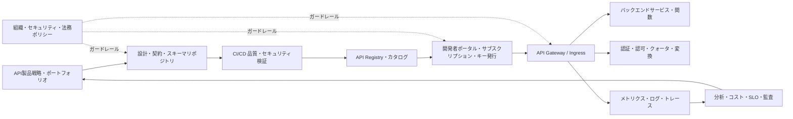
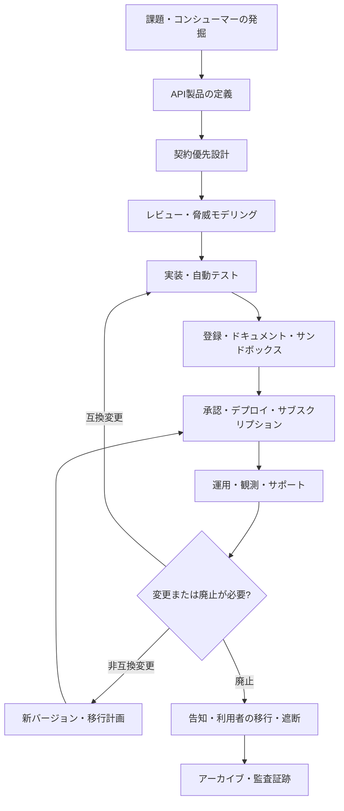

# API管理(API Management)とAPIライフサイクルガバナンス

## 1. 概要

> **API管理(API Management)**とは、APIを設計・開発・デプロイ・保護・公開・運用・分析・廃止するライフサイクル全体を、ポリシー、プラットフォーム、組織の責任によって統制し、APIを安定した製品として提供する体制である。

APIはアプリケーション間の呼び出し規約を超え、組織のデータとビジネス機能を外部に提供する製品の境界となった。内部サービスの連携、モバイルアプリ、パートナーシステム、公共データ、SaaS連携がすべてAPIに依存しているため、APIの変更は1つのプログラムの変更よりも広範なコンシューマーと契約に影響を与える。API管理が必要な理由は、APIをたくさん作るためではなく、誰がどのような目的で、どのような品質と権限で使っているのかを継続的に説明し、統制するためである。

APIゲートウェイはAPI管理プラットフォームの重要な実行構成要素であるが、API管理全体と同一ではない。ゲートウェイがリクエストをルーティングし、ランタイムポリシーを執行するのに対し、API管理は企画・設計・登録・文書化・開発者ポータル・サブスクリプション・分析・変更・廃止までを含む。ゲートウェイだけを導入すれば呼び出しは転送されるが、所有者のいないAPI、古いバージョン、隠れたエンドポイント、契約の不一致が蓄積しうる。

APIを製品として捉えるということは、見栄えの良いドキュメントを作るという意味ではない。明確なコンシューマーと価値提案、安定した契約、利用量と品質の測定、サポート窓口、廃止ポリシー、セキュリティ上の責任を持つという意味である。したがってAPI管理の成果は、APIの数よりも、再利用率、コンシューマーのオンボーディング時間、変更失敗率、脆弱性対応時間、SLO達成率といった運用上の結果で評価すべきである。

### A. 登場背景と必要性

第一に、デジタルサービスがマルチチャネル化するにつれ、同一の業務機能がWeb・モバイル・パートナー・バッチ・AIエージェントで再利用されるようになった。各チャネルがデータベースを直接照会すると結合度とセキュリティリスクが大きくなるため、明示的なAPI契約を通じてサービス境界を提供しなければならない。管理体制がなければ、チャネルごとに似たようなAPIが作られ、重複と意味の不一致が生じる。

第二に、APIはデプロイ後もコンシューマーが存在し続ける。内部のコードであれば一度にまとめて修正できるが、外部パートナーやすでに配布されたモバイルアプリは即座には更新されない。互換性ルール、バージョンの並行運用、利用状況、廃止告知と移行支援がなければ、小さなフィールド変更でも障害につながる。

第三に、APIは攻撃対象領域である。オブジェクト識別子、権限、呼び出し量、機微情報、第三者連携がリクエスト単位で露出するため、認証だけでは安全性を保証できない。OWASP API Security Top 10は、オブジェクトレベル認可の不備、過剰なリソース消費、不適切なインベントリ管理、安全でないAPIの利用などを、API特有のリスクとして提示している。

第四に、クラウドネイティブ環境では、APIが複数のクラスタ・リージョン・サービスメッシュ・サーバーレス関数に分散する。中央ゲートウェイのルーティング情報だけではすべてのAPIを把握できないため、設計仕様、サービスカタログ、ランタイムの可観測性、セキュリティスキャンを結びつけたAPIポートフォリオが必要である。

### B. 中核目標と範囲

API管理の第一の目標は、コンシューマーが信頼できる発見可能性と契約の安定性である。API名、説明、例、認証方式、エラーモデル、制限ポリシー、サポート担当者がカタログにあってはじめて、コンシューマーは試行錯誤を減らせる。第二の目標はポリシーの一貫性である。認証・認可・リクエスト検証・呼び出し量・監査・個人情報保護をサービスごとにばらばらに実装しないよう、共通のガードレールを提供する。

第三の目標は、変化と運用の可視性である。APIごとの呼び出し量、エラー率、遅延、コンシューマー、バージョン、コストとデータ分類を結びつけてはじめて、過剰な利用や廃止対象のAPIを判断できる。第四の目標は、ビジネス価値の測定である。呼び出し数が多くても、失敗率が高かったり顧客のコンバージョンに寄与しなかったりすれば、成功したAPIではない。

範囲には、公開APIだけでなく、内部・パートナー・管理者・サービス間のAPIも含まれうる。ただし同一の公開レベルやポリシーを適用するわけではない。公開APIは開発者体験と契約の安定性を重視し、内部APIはデプロイの自動化とサービスの信頼性を重視し、パートナーAPIは契約・法務・サポート・相互認証を追加で考慮する。

## 2. API管理の全体構造

### A. 論理アーキテクチャ

上記の構造において、API製品戦略は、どのようなコンシューマーの問題を解決し、どの程度まで公開するかを決める。設計・契約リポジトリは、OpenAPIのようなインターフェース仕様とエラーモデル、例、変更履歴を保管する。CI/CDでの検証は、仕様の構文だけでなく、互換性、セキュリティ、テスト、個人情報ルールをデプロイ前に点検する。

Registryとカタログは、APIの技術的なアドレスだけを保存する場所ではない。所有チーム、データ分類、環境、認証方式、バージョン、SLO、廃止日、連絡先、規制地域、コンシューマーと利用量を結びつけ、意思決定に使える資産一覧を作る。ポータルは、カタログで承認されたAPIのドキュメントとサンドボックス、サブスクリプション・サポートの手続を提供する。

ゲートウェイはデータプレーンで実際のリクエストを処理し、認証・認可・レート制限・変換・キャッシュ・ルーティングと可観測性のポリシーを執行する。しかし、ゲートウェイがすべての業務ルールを所有してはならない。注文承認、口座残高の判断、データ所有権の確認といったドメインの判断はバックエンドサービスが最終的な責任を負うべきであり、ゲートウェイは多層防御の一層として動作すべきである。

### B. ライフサイクルの処理フロー

ライフサイクルはドキュメント作成の順序ではなく、意思決定と証拠がつながる統制ループである。設計段階で定義した契約は実装とテストの基準となり、デプロイされたバージョンはコンシューマー・利用量・エラーのデータによって検証される。運用中に発見された契約上の不便やセキュリティリスクは、次の設計に反映されなければならない。

アイデア段階では、コンシューマー、ユースケース、データの機微度、期待遅延、可用性、呼び出し量、コスト負担の主体を定義する。同じデータを提供するとしても、リアルタイム照会APIと大量抽出APIとでは、制限や保存・転送コストが異なる。サービス名だけを決めて始めると、後になって製品目標と技術実装の優先順位が衝突する。

設計段階では、リソースと行為、入出力スキーマ、状態遷移、エラーモデル、冪等性、ページネーション、ソート、フィルタ、認証・認可を契約として作成する。OpenAPIはHTTP APIのインターフェースを人とツールが理解できる形式で表現する標準であるため、コード生成・ドキュメント・契約テストの共通入力として活用できる。ただし、仕様があるからといって、意味の品質や権限設計が自動的に保証されるわけではない。

実装・検証段階では、正常系だけでなく、境界値、権限のないオブジェクトへのアクセス、大量リクエスト、重複した再試行、部分障害、旧バージョンのクライアントをテストする。仕様と実際の応答を比較する契約テストをCIに組み込み、breaking changeの検出をマージ条件とする。開発環境の一時的なエンドポイントが本番へ昇格しないよう、環境ごとの登録と承認状態を分離する。

## 3. 中核構成要素と設計原理

### A. API契約と設計優先方式

契約優先(contract-first)とは、実装前にコンシューマーが目にするインターフェースを合意する方式である。パス・メソッド・ステータスコード・スキーマ・例・セキュリティ要件を先に定義すれば、フロントエンドとバックエンドが並行して開発でき、曖昧な要求を早期に発見できる。反対に、コードからドキュメントを自動生成する方式は実際の動作を素早く反映するが、設計意図と業務上の意味が後回しになりうる。

良い契約は成功応答だけを説明するものではない。401と403の違い、404をリソースの不在と権限の秘匿のどちらに使うか、409の競合と429の制限超過、5xxの再試行可能性を明確にすべきである。エラーオブジェクトには外部に公開するコード・メッセージ・トレースIDを置きつつ、内部ホスト名やスタックトレースは除外する。

スキーマはフィールド名よりも、意味と進化のルールが重要である。数値の単位、タイムゾーン、精度、nullの許容可否、列挙値の追加可能性を明示しなければ、異なるコンシューマーが同じフィールドを異なって解釈する。フィールドを削除したり意味を変えたりする代わりに、新しいフィールドを追加して一定期間旧フィールドを並行させる互換戦略をまず検討する。

OpenAPI仕様は、再利用可能なcomponents、セキュリティスキーム、リクエスト・レスポンスのスキーマを表現できる。しかし、仕様ファイル自体の変更履歴、レビュアー、承認状態、運用バージョンとの一致の有無を管理しなければならない。リポジトリの仕様と実際のゲートウェイ設定がずれていると、ポータルは正しいドキュメントを表示しているのに、本番のリクエストは異なる動作をするというリスクが生じる。

### B. ポータル・カタログ・開発者体験

開発者ポータルの要は、検索から呼び出し成功までの時間を短縮することである。説明、認証の始め方、最小権限の範囲、リクエスト・レスポンスの例、SDK、エラーの解決方法、制限ポリシー、ステータスページと問い合わせ窓口を一連の流れとして提供する。ドキュメントが最新であっても、最初の呼び出しのためのテスト用クレデンシャルやサンドボックスがなければ、オンボーディングの障壁が残る。

APIカタログは、すべてのエンドポイントを無分別に並べた一覧ではなく、責任とリスクを含む資産台帳である。APIごとに、プロダクトオーナー、技術オーナー、データオーナー、セキュリティ分類、運用環境、バージョン、コンシューマー、最終利用時刻、廃止予定日を記録する。この情報は障害対応や個人情報影響評価にも活用される。

サブスクリプションモデルは、コンシューマーとAPIの関係を明示する。公開の読み取りAPIはセルフサービスでのキー発行を許可できるが、個人情報や決済機能には、組織の確認、契約、承認されたscope、強力な認証が必要である。キーはコンシューマーの識別に使うクレデンシャルであり、きめ細かなユーザー認可を代替するものではなく、漏洩時には失効・再発行と利用量の追跡が可能でなければならない。

### C. ゲートウェイとポリシー執行

ゲートウェイは、パス・ホスト・メソッド・ヘッダに基づいて、リクエストを適切なアップストリームに転送する。ルーティングルールが重なる場合は、静的パスと変数パスの優先順位を明示し、デプロイ前に曖昧さを検査しなければならない。データプレーンは最後に有効だった設定で動作できる必要があり、コントロールプレーンの障害がそのままAPI全体の障害にならないよう分離する。

認証は主体を確認し、認可は主体の行為を許可するかを判断する。JWTの署名と有効期限を検証したからといって、ユーザーに他の顧客の注文を読む権限が生じるわけではない。オブジェクトの所有者・テナント・業務状態に関する認可はサービスが再確認し、ゲートウェイとバックエンドの判断・ポリシーのバージョン・結果を監査可能な形で残すべきである。

Rate limitは短期的な速度を制限し、quotaは期間ごとの累積量を管理する。トークンバケットは平均速度とバースト許容量を分離しやすいが、複数インスタンスではカウンタの一貫性とストアの遅延を考慮しなければならない。IPだけを制限キーにすると、NATの背後にいる正常なユーザーまでまとめて遮断されうるため、アプリ・ユーザー・組織・パス・料金プラン・コストを組み合わせたポリシーを設計する。

変換と集約は外部契約と内部プロトコルの差異を吸収するが、ゲートウェイに複雑な業務上の組み合わせを入れると、変更と障害の中心になる。単純なJSON↔gRPC変換やフィールド名の互換はゲートウェイに置けるが、在庫予約や決済承認のように状態と補償が必要なオーケストレーションは、ドメインサービスまたは別途のBFFが所有するほうが適切である。

### D. 可観測性・分析・コスト

APIごとに、リクエスト量、p50・p95・p99の遅延、4xx・5xxの比率、アップストリームのエラー、timeout、429、ペイロードサイズ、コンシューマーごとのquotaを測定する。平均遅延だけを見ると一部のユーザーのロングテール遅延を見落とすため、SLOと連携したパーセンタイル指標を基本とする。ゲートウェイ自体の処理時間とバックエンドの処理時間を分離してはじめて、改善箇所を判断できる。

ログには、時刻、route ID、バージョン、ステータス、遅延、trace ID、非識別化されたコンシューマーIDを残すことができる。Authorizationヘッダ、住民登録番号、決済手段の原文、機微なリクエスト本文は、デフォルトの収集対象から除外するか、フィールド単位でマスキングする。ログがセキュリティ監査に使われるとしても、原文を長期保管することが常に正当化されるわけではなく、アクセス権限と保持期間を別途定めるべきである。

分析は、単なる呼び出しランキングよりも、API製品の健全性を示すべきである。再利用率、アクティブなコンシューマー数、成功率、ドキュメント閲覧に対する呼び出しへの転換率、バージョンごとの利用量、コンシューマーのオンボーディング時間、サポートチケット、呼び出し当たりのインフラコストを併せて見る。トラフィックが減ったからといって廃止するのではなく、季節性・代替API・重要な少数のコンシューマーへの業務影響まで確認する。

## 4. セキュリティ・品質・ガバナンス

### A. APIセキュリティ統制

APIセキュリティは、設計時点とランタイムに分けて多層的に適用する。設計時点では、脅威モデリング、機微情報の分類、スキーマ検証、契約テスト、依存関係・シークレットのスキャン、権限マトリクスのレビューを行う。ランタイムでは、TLS、認証・認可、リクエスト・レスポンスの検証、rate limit、timeout、circuit breaker、異常行為の検知を適用する。

OWASP API Security Top 10のBroken Object Level Authorizationは、URLのオブジェクトIDを変えるだけで他のユーザーのリソースにアクセスできるリスクを説明している。ゲートウェイでトークンの有効性だけを確認し、サービスがオブジェクトの所有権を確認しなければ、この攻撃は防げない。テストデータでIDを変える否定テストとテナント境界の検証を自動化すべきである。

Unrestricted Resource Consumptionは、ネットワークだけでなく、CPU、メモリ、ストレージ、外部のSMS・決済呼び出しのコストまで枯渇させうる。ページサイズ、ファイルサイズ、ソート・フィルタの複雑さ、再帰の深さ、外部呼び出しの回数に上限を設け、コンシューマーごとの予算と時間制限を設計する。制限が低すぎると正常な利用を妨げるため、業務ごとの基準と例外手続を併せて設ける。

Improper Inventory Managementは、運用中のすべてのホスト・バージョン・ドキュメント・デバッグ用エンドポイントを把握できていない問題である。デプロイパイプラインでの登録を義務化し、DNS・ゲートウェイのログ・サービスディスカバリ・コードリポジトリを突き合わせてシャドーAPIを検出する。使われていないバージョンは即座に削除するのではなく、所有者の確認、コンシューマーへの通知、代替経路、段階的な遮断を経る。

### B. 品質ゲートと変更管理

品質ゲートは構文チェックだけでは不十分である。仕様のlint、互換性の比較、スキーマと例の一致、自動テスト、性能基準、セキュリティスキャン、個人情報フィールドのレビュー、ドキュメント生成とポータル登録をパイプラインに含める。失敗原因をコンシューマーが理解できるメッセージとして残し、反復可能な改善へとつなげる。

互換変更とはフィールドの追加のように既存コンシューマーのリクエストとレスポンスを壊さない変更であり、非互換変更とはフィールドの削除・型の変更・意味の変更・必須値の追加のように、コンシューマー側の修正が必要な変更である。互換性の判断は文法ではなく、実際のコンシューマーの使い方やコード生成ツールまで考慮しなければならない。たとえば列挙値の追加も、コンシューマーが未知の値を拒否するように実装していれば、事実上リスクのある変更となりうる。

バージョン戦略には、URL、ヘッダ、メディアタイプ、互換進化がある。URLによるバージョンは観察とルーティングが容易だがエンドポイントが増え、ヘッダ方式はアドレスが安定するがデバッグとキャッシュが複雑になる。方式よりも重要なのは、各バージョンのサポート期間、廃止基準、利用量の確認、移行ドキュメントとロールバック手段を明確にすることである。

## 5. 比較と適用事例

### A. API管理・APIゲートウェイ・サービスメッシュの比較

API管理とゲートウェイには包含関係がある。ゲートウェイはリクエストの実行地点であり、API管理は設計から廃止までの運用・ガバナンス体制である。サービスメッシュのプロキシとポリシーは、主にサービス間の東西トラフィック、サービスの身元、再試行、分散トレーシングを扱うため、外部・パートナーAPIのポータルや製品ライフサイクルを自動的に代替するものではない。

| 区分 | API管理 | APIゲートウェイ | サービスメッシュ |
|---|---|---|---|
| 主な対象 | 外部・内部・パートナーのAPI製品 | リクエストの入口・中継・ポリシー | サービス間の東西通信 |
| 主な機能 | 契約・ポータル・サブスクリプション・分析・廃止 | ルーティング・認証・制限・変換 | mTLS・サービスディスカバリ・再試行 |
| 中核plane | 管理・開発者体験・data plane | control plane・data plane | control plane・sidecar/data plane |
| コンシューマー | 人・組織・外部開発者 | 呼び出し元クライアント・サービス | 内部サービス |
| 失敗時の問い | 誰が何をいつ廃止するのか | どこへどのように転送するのか | どのサービスが安全に通信するのか |

この違いを無視して1つのツールですべてを解決しようとすると、ポリシーの責任と観測範囲が混在する。外部APIの利用量・契約・法務上の要求はAPI管理で扱い、サービス間のmTLSと再試行はサービスメッシュで扱い、ゲートウェイでは両領域の間の入口ポリシーを統合する、というように境界を定める。

### B. 事例: 金融機関のパートナー向け決済API

金融機関が提携企業に決済承認・取引照会APIを提供すると仮定する。まずAPI製品の定義において、パートナーごとの利用目的、許可地域、処理量、個人情報の範囲、取引上の責任、障害時の補償基準を定める。公開ドキュメントとは別に、契約済みのパートナーだけがアクセスできるよう、ポータルへの登録・審査・mTLSまたは強力なクライアント認証・scopeの承認を結びつける。

設計では、承認リクエストの冪等キーと取引状態を明示する。ネットワークの再試行によって同一の承認リクエストが重複処理されると金銭事故になりうるため、サーバーが冪等キーとリクエスト本文の関係を保存し、同じキーには同じ結果を返すポリシーを設ける。401・403・409・429・5xxの意味と再試行条件を契約に含めてはじめて、パートナーが任意の再試行で負荷を増幅させないようになる。

運用では、パートナー・商品・APIバージョンごとのp95遅延、成功率、承認拒否率、重複リクエスト、quota、異常な地域や時間帯の呼び出しを分けて見る。決済データの原文はログに残さず、取引識別子とトレースIDを仮名化する。バージョン廃止の前に各パートナーの呼び出し状況とテスト結果を確認し、サンドボックスと段階的なトラフィック切り替えによって互換性を検証する。

### C. 事例: 公共データ照会APIの過剰利用

ある機関が交通データを提供しているところ、特定のコンシューマーが短時間に大量のページを繰り返し照会し、他のユーザーに429が発生したと仮定する。IPだけを基準に遮断すると、同じNATの背後にいる正常なユーザーまで影響を受ける。アプリケーションキー・機関・エンドポイント・ページサイズ・時間帯ごとのquotaを組み合わせ、キャッシュ可能なデータについては更新周期とETagを提供して、繰り返しの照会自体を減らす。

同時に、APIが返すデータに個人情報や位置に関する機微情報が含まれていないかを再検討する。呼び出し量を制限するだけでは、過剰なデータ収集や目的外利用を防ぐことはできない。最小限のフィールド、集計・匿名化、利用目的と保持期間、利用規約、監査ログを併せて設計し、遮断・警告・承認例外の基準を公開してはじめて、ポリシーへの信頼を維持できる。

## 6. 深掘り: 標準とクラウドネイティブAPI保護の動向

OpenAPIの公式仕様は3.1系のパッチリリースと3.2系を併せて提供しており、インターフェースを言語中立に記述する契約の基盤として活用されている。実務では、組織がサポートする仕様バージョンを固定し、仕様の文法バージョンと実際の本番ゲートウェイの機能との差を検証しなければならない。最新仕様を宣言したというだけで、すべてのツールが同一に解釈すると仮定してはならない。

NISTは、クラウドネイティブシステムのAPI保護を、開発・デプロイ前の段階とランタイムの段階に分けて、リスクと統制を説明している。2026年3月に更新されたSP 800-228の改訂版は、APIのリスクとライフサイクルの段階ごとの推奨統制を補強した。これは、APIセキュリティをゲートウェイ一箇所での防御ではなく、仕様・開発・テスト・デプロイ・運用の連続した統制として捉えるべきだという方向性と通じている。

生成AIがAPIのコンシューマーおよび提供者として参加するにつれ、新たな問題が生じている。エージェントがツールAPIを呼び出す際には、人間のログインセッションとは異なる実行主体・目的・権限・予算を識別しなければならない。プロンプトに含まれた指示がAPIの権限を迂回しないよう、ツール一覧と引数スキーマをallowlistで制限し、高リスクの操作にはユーザー確認と取引限度を設ける。

AI APIは、リクエストトークン・レスポンストークン・モデルバージョン・遅延・品質・コストを併せて分析しなければならない。単純な呼び出し量の制限では、長いプロンプトや大規模な応答によるコストの急増を防ぎにくいため、トークンquota、モデルごとの予算、最大コンテキスト、再試行の上限、fallbackルールを契約に含める。機微なプロンプトと応答を観測データとして保存する際には、最小収集・マスキング・アクセス制御を適用する。

API管理プラットフォームはAPIポートフォリオを中央で統制しつつも、ドメインチームの自律性を奪ってはならない。中央プラットフォームが標準テンプレート・セキュリティガードレール・ポータル・共通の可観測性を提供し、ドメインチームが業務上の契約とコンシューマーとの関係に責任を持つ、プラットフォーム型の運用モデルが現実的である。ポリシーの例外は無期限に許容せず、根拠・承認者・有効期限を記録すべきである。

## 7. 考慮事項および示唆

### A. APIを製品として定義し、優先順位を定める

APIを技術チームの副産物として作ると、類似APIが増え、コンシューマーが誰なのかが不明確になる。製品目標、中核となるコンシューマー、データ範囲、品質水準、コスト負担、成功指標を先に定義し、ポートフォリオの中で重複・未使用・高リスクのAPIを定期的に整理する。APIの数よりも、再利用とコンシューマーの成功をKPIとすべきである。

### B. 契約と変更を自動検証する

OpenAPI仕様を中央リポジトリに置き、lint・互換性・契約テスト・例の検証をCIにつなげる。仕様の変更だけを承認し、ゲートウェイの設定や実際の応答を検証しなければ、ドキュメントと運用が乖離する。変更の種類ごとの承認レベルとロールバック手順を定義し、旧バージョンのコンシューマーの利用量を確認した後に廃止する。

### C. セキュリティ責任をゲートウェイだけに集中させない

ゲートウェイは共通の認証とトラフィック統制を提供するが、オブジェクトレベルの認可と業務ルールはバックエンドが最終的に検証しなければならない。内部の迂回呼び出し、サービスアカウント、管理者API、バッチ経路を含む全呼び出し経路について脅威モデリングを行う。APIインベントリとシャドーAPIの検出を運用し、放置されたエンドポイントを減らす。

### D. 性能・可用性・コストを併せて設計する

キャッシュとrate limitは性能とコストを改善しうるが、鮮度・公平性・可用性のトレードオフがある。ゲートウェイとアップストリームのSLOを分離し、再試行・タイムアウト・サーキットブレーカーが連鎖的な暴走を生まないよう予算を設ける。サーバーレス・AI APIは、呼び出し量よりもリクエストサイズと実行単位がコストを左右するため、ユニットエコノミクスを別途測定する。

### E. 開発者体験と統制をバランスよく運用する

セキュリティ承認をすべてのAPI呼び出しに手作業で求めると、迂回APIや非公式に共有されたキーが生まれうる。リスクの低い読み取りAPIは、自動化されたセルフサービスと標準ポリシーで迅速にオンボーディングし、機微なデータ・金銭・管理機能には厳格な審査と最小権限を適用する。ポータルのドキュメント、サンプル、SDK、サンドボックス、ステータスページを継続的に改善する。

### F. 観測データも個人情報・機密として保護する

リクエスト本文やヘッダには、トークン・個人情報・営業情報が含まれうる。ログフィールドのallowlist、マスキング、保持期間、アクセス権限、照会の監査、テナントの分離を設計し、必要であれば原文の代わりにハッシュ・分類・トレースIDを使用する。API管理のメタデータ自体が、どの顧客・業務がつながっているかを明らかにしうるため、カタログへのアクセスもリスクベースで統制する。

### G. 組織の責任と例外の有効期限を明確にする

プロダクトオーナーは価値とコンシューマー、技術オーナーは実装とSLO、セキュリティオーナーは統制、データオーナーは利用目的と分類に責任を持つよう、RACIを定める。標準から外れる例外については、理由・リスク・補完統制・承認者・有効期限を残し、自動通知によって更新の要否を確認する。プラットフォームチームがすべてのAPIの業務上の意味を代わりに決定する構造は、スケールしない。

## 参考資料

- OpenAPI Initiative, “OpenAPI Specification” — https://spec.openapis.org/oas/
- OpenAPI Initiative, “OpenAPI Specification v3.1.2” — https://spec.openapis.org/oas/v3.1.2.html
- OWASP, “API Security Project” — https://owasp.org/www-project-api-security/
- OWASP, “Top 10 API Security Risks – 2023” — https://owasp.org/API-Security/editions/2023/en/0x11-t10/
- NIST, “SP 800-228-upd1 Guidelines for API Protection for Cloud-Native Systems” — https://csrc.nist.gov/pubs/sp/800/228/upd1/final
- NIST, “Guidelines for API Protection for Cloud-Native Systems” — https://www.nist.gov/publications/guidelines-api-protection-cloud-native-systems-march-2026-update

---

> **一言まとめ**: API管理とは、ゲートウェイによるリクエストの中継を超え、契約・セキュリティ・開発者体験・可観測性・変更・廃止を一つのライフサイクルとして結びつけ、APIを信頼できるデジタル製品として運用するガバナンス体制である。
