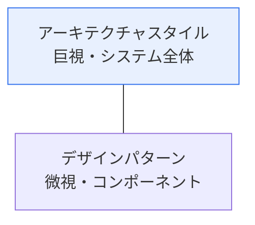
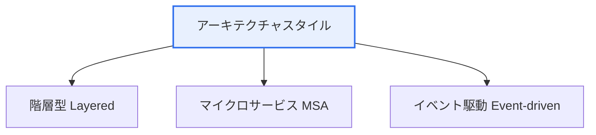

# アーキテクチャスタイルとデザインパターン

## 1. 概要

### A. 定義
> **アーキテクチャスタイル** はシステム全体の構造を組織する **巨視的(Macro)な設計の枠組み** であり、**デザインパターン** は特定の設計問題を解決する **微視的(Micro)で再利用可能な解法** である。

両概念の関係は、「**建物の構造様式**」と「**部屋を整える定型化された技法**」にたとえると明確になる。アーキテクチャスタイルがマンションか一戸建てかといった建物全体の骨格(階層型・MSAなど)を決めるとすれば、デザインパターンはその建物の中で繰り返し直面する問題 — たとえば「どうすれば特定のオブジェクトを1つだけ作って共有できるか」 — を検証済みの方法で解く局所的な解法である。両者の違いは **抽象化のレベルと影響範囲** にある。アーキテクチャスタイルの選択は、性能・拡張性・セキュリティといったシステム全体の品質特性を左右する後戻りの難しい決定であるのに対し、デザインパターンは特定のクラス・コンポーネントレベルの柔軟性・再利用性を扱う。

### B. 必要性
ソフトウェアが大きく複雑になるほど、毎回ゼロから構造を検討するのは非効率であり、失敗のリスクも大きい。アーキテクチャスタイルとデザインパターンは、先人の開発者たちが蓄積してきた検証済みの解法を再利用可能にし、品質と生産性を同時に高める。

## 2. アーキテクチャスタイルとデザインパターンの違い

| 区分 | アーキテクチャスタイル | デザインパターン |
|---|---|---|
| **範囲** | システム全体(巨視) | クラス・コンポーネント(微視) |
| **関心事** | 構造・コンポーネント・接続・品質特性 | オブジェクトの生成・構造・振る舞い |
| **影響** | 性能・拡張性・セキュリティ(後戻りが困難) | コードの再利用・柔軟性 |
| **例** | 階層型、MSA、イベント駆動 | シングルトン、ファクトリ、オブザーバー |

## 3. 代表的なアーキテクチャスタイル3種

**階層型(Layered)** は、プレゼンテーション・ビジネス・データの各層に関心事を水平に分離し、理解・保守が容易な最も一般的なスタイルであるが、層を貫く変更に弱く、大規模になると拡張性が低下する。**マイクロサービス(MSA)** は、システムを独立してデプロイ可能な小さなサービス群に分解し、サービスごとの拡張・自律的な開発・障害の隔離を可能にするが、分散システムの複雑さ(ネットワーク・データ一貫性・運用負担)が代償として伴う。**イベント駆動(Event-driven)** は、コンポーネントがイベントを発行/購読して疎結合となるため、リアルタイム・非同期処理と拡張に強いが、フローの追跡・デバッグが難しい。

| スタイル | 特徴 | トレードオフ |
|---|---|---|
| **階層型** | 関心事の水平分離、単純 | 層を貫く変更に弱い、拡張の限界 |
| **マイクロサービス** | 独立デプロイ・拡張・障害の隔離 | 分散の複雑さ・運用負担 |
| **イベント駆動** | 疎結合、リアルタイム・非同期 | フローの追跡・デバッグが困難 |

## 4. GoFデザインパターン

GoF(Gang of Four)のデザインパターンは、目的によって3つの類型に分けられる。**生成(Creational)** パターンはオブジェクトをどのように生成するかをカプセル化し、**構造(Structural)** パターンはオブジェクト・クラスをどのように組み合わせるかを扱い、**振る舞い(Behavioral)** パターンはオブジェクト間の責任の分担と相互作用を扱う。

| 類型 | 目的 | 代表的なパターン |
|---|---|---|
| **生成** | オブジェクト生成のカプセル化 | シングルトン、ファクトリメソッド、抽象ファクトリ、ビルダー、プロトタイプ |
| **構造** | オブジェクト・クラスの組み合わせ | アダプター、デコレーター、プロキシ、ファサード、コンポジット |
| **振る舞い** | オブジェクト間の責任・相互作用 | オブザーバー、ストラテジー、コマンド、ステート、イテレーター、テンプレートメソッド |

代表的なパターンを見ると、**シングルトン** はインスタンスを1つだけ生成・共有するもので、設定・ログのようにグローバルに1つだけ必要なリソースに使われ、**ファクトリメソッド** はオブジェクトの生成をサブクラスに委譲して結合度を下げる。**オブザーバー** は1つのオブジェクトの状態変化を購読者たちに自動通知するもので、イベント・MVCに活用され、**ストラテジー** はアルゴリズムをカプセル化してランタイムに交換できるようにする。

## 5. 考慮事項および示唆

1. **アーキテクチャスタイルで品質特性を、デザインパターンでコードの柔軟性を** 確保する。両レイヤーは目的が異なるため、相互補完的に適用する。
2. **パターンの濫用は過剰設計(Over-engineering)** である。問題がないのにパターンのためのパターンを適用すると、かえって複雑さが増すだけである。問題の文脈に合わせて節度をもって使用する。
3. クラウドネイティブ・MSAの時代には、**サーキットブレーカー・サーガ(Saga)・APIゲートウェイ** など新たな分散アーキテクチャパターンが登場し、従来のGoFパターンを補完している。

---

> **一言まとめ**: アーキテクチャスタイル(階層型・MSA・イベント駆動)はシステム全体の構造と品質特性を、GoFデザインパターン(生成・構造・振る舞い)は繰り返し現れる設計問題の局所的な解法を提供するものであり、抽象化のレベルと影響範囲が異なるため、相互補完的に節度をもって適用する。
