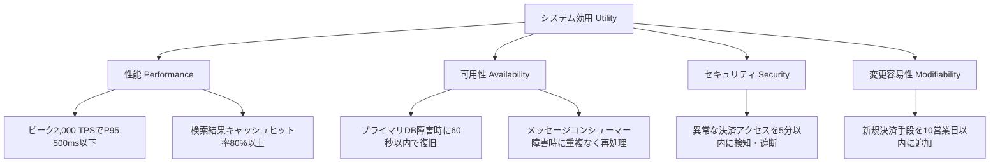
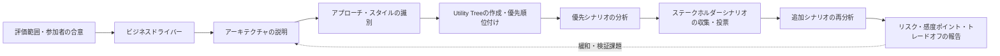

# ATAM(Architecture Tradeoff Analysis Method)に基づくソフトウェアアーキテクチャ評価

## 1. 概要

> **定義**: ATAM(Architecture Tradeoff Analysis Method)は、ビジネス目標から導出した品質特性要求をシナリオとして具体化し、アーキテクチャ上の決定が品質特性に与える影響を分析して、リスク・感度ポイント・トレードオフを早期に識別する、ステークホルダー参加型のアーキテクチャ評価手法である。

ソフトウェアアーキテクチャは、機能一覧だけでは説明できない。
同じ機能を提供していても、応答時間、障害許容、セキュリティ、変更容易性、デプロイ速度によって、ユーザーと事業が得る結果は異なる。
たとえば注文システムが注文を作成するという機能は同じでも、ピーク時間帯に95パーセンタイルの応答時間を500ミリ秒以内に保てるか、決済障害時に二重請求を防げるかによって、アーキテクチャの適合性は変わる。
したがってアーキテクチャ評価とは、コンポーネントが存在するかを確認する作業ではなく、重要な品質特性目標を実際の構造が継続的に満たせるかを検討する活動である。

ATAMの中核は、品質特性間の相互作用を明らかにすることにある。
キャッシュを導入すれば性能と可用性は向上しうるが、データの鮮度と無効化の複雑さが増しうる。
同期的な密結合を減らせば変更性と拡張性は向上するが、メッセージの重複・順序・結果整合性という運用上の負担が生じる。
すなわち、ある品質特性の改善が別の品質特性の低下を引き起こしうるため、単一指標の最適化ではなく、事業の優先順位に応じた均衡点を見つけなければならない。

従来の設計レビューは、アーキテクトが構成図を説明し、参加者が実装の詳細を質問するという形で終わりがちである。
この方式では、ステークホルダーが実際に重要視している品質目標が暗黙知のまま残り、アーキテクチャ選択の根拠も議事録に散在する。
ATAMは、ビジネスドライバー、品質特性ユーティリティツリー、シナリオの優先順位、アーキテクチャアプローチを共通言語として用い、議論を構造化する。
その結果、評価チームは設計の正解を宣言するのではなく、現在の決定がどのようなリスクを生み、どのような追加検証が必要かを透明に提示する。

ATAMは機能的な正しさを証明するテスト手法ではない。
すべてのコードパスを検証したり、性能値を実測して保証したりする手法でもない。
アーキテクチャ上の決定の結果を品質特性の観点から問い、不確実性の大きい箇所を見つけて、後続の分析・プロトタイプ・試験へとつなげるリスク識別手法である。
したがって評価結果は、合格・不合格の一行よりも、リスク一覧、非リスクの判断、感度ポイント、トレードオフ、緩和計画と意思決定の根拠で構成されるべきである。

### 1.1 登場背景と必要性

第一に、アーキテクチャ上の決定は後戻りが難しく、変更コストが大きい。
データストア、通信プロトコル、デプロイ単位、認証境界といった決定は、その後のコンポーネントと運用手順全体に影響を与える。
実装後にこれを変えると、データ移行、インターフェース互換、運用停止、組織の再教育が同時に発生する。
ATAMを要求事項と基本アーキテクチャが形成される時点で適用すれば、高価な再設計を減らし、まだ複数の代替案を比較できる状態でリスクを可視化できる。

第二に、非機能要求は曖昧な形容詞のまま残りやすい。
「速いシステム」「安全なサービス」「柔軟なプラットフォーム」という表現だけでは、設計の代替案を判断できない。
ATAMは、刺激源、刺激、環境、対象、応答、応答測定値で構成される品質特性シナリオを用いて、抽象的な要求を観察可能な基準に変える。
たとえば「ピークトラフィックで速い」を「通常運用中に毎秒2,000件の注文リクエストが流入したとき、注文APIの95パーセンタイル応答時間が500ミリ秒以下で、エラー率が0.5パーセント以下」と具体化する。

第三に、ステークホルダーごとに最適なアーキテクチャが異なる。
事業部門はリリース日とコストを重視し、セキュリティ部門は隔離と監査性を重視し、運用部門は障害復旧と可観測性を重視する。
一方の観点だけを反映すると、プロジェクト後半で隠れていた要求が衝突する。
ATAMは、事業責任者、アーキテクト、開発者、運用者、セキュリティ担当者、保守担当者、ユーザー代表が同じシナリオを前に優先順位を議論するようにし、合意の質を高める。

### 1.2 目標と基本原則

ATAMの第一の原則は、**ビジネスドライバーから出発する** ことである。
品質特性はそれ自体が目的ではなく、事業目標を達成するための手段である。
たとえば高い可用性が必要な理由は、技術チームが数字を好むからではなく、金融取引の中断が売上・信頼・規制遵守に直接影響するからである。
したがって評価の範囲と優先順位は、事業価値、法的義務、ユーザーへの影響、運用リスクを併せて考慮して定める。

第二の原則は、**シナリオで分析する** ことである。
品質特性の名前だけを言うと、評価者の経験によって解釈が異なる。
刺激と応答、環境と測定値を明示すれば、異なるアーキテクチャが同じ問いに答えるようになり、追加の負荷試験やセキュリティ検証の要件も明確になる。
定量化が難しい変更容易性も、「新しい決済手段を既存のリリースサイクル内に追加する」といった変更シナリオとして扱うことができる。

第三の原則は、**リスクを早期に明らかにしつつ、解決策を独断で決めない** ことである。
ATAMの評価チームはリスクの存在と影響度を説明し、緩和策と検証課題を提示する。
最終的な選択は、予算、スケジュール、組織能力、規制、製品戦略に責任を持つ意思決定者が行うべきである。
評価チームが特定の技術を正解として強制すると、参加型評価の長所と責任の所在の両方が弱まる。

## 2. ATAMの評価対象と品質特性シナリオ

ATAMは、アーキテクチャを構成するコンポーネント、コネクタ、配置、外部インターフェース、データフロー、デプロイ環境と、その選択根拠を対象とする。
アーキテクチャの説明には、単なる箱と線だけでなく、どの品質特性要求をどのようなアプローチで満たすのかが含まれていなければならない。
たとえば注文サービスと決済サービスの間にメッセージキューを置いたのであれば、非同期化の決定によって拡張性と障害の隔離を高めると同時に、重複イベントと一貫性の問題をどう処理するのかを説明すべきである。

### 2.1 品質特性の分類と相互作用

代表的な品質特性は、性能、可用性、セキュリティ、変更容易性、拡張性、試験容易性、相互運用性、使用性、運用性である。
これらは互いに独立したチェックボックスではなく、同一のアーキテクチャ上の決定によって共に変化する。
たとえば強力な暗号化ときめ細かな監査ログはセキュリティを高めるが、CPU使用量、ストレージ量、処理遅延を増加させうる。
この相互作用を整理しなければ、性能チームとセキュリティチームが互いの要求を妨害要因としてしか認識しなくなる。

品質特性の分析は、次の4つの問いで進める。
第一に、どのステークホルダーがどのような刺激を発生させるのかを問う。
第二に、システムはどの環境でどのような応答を示すべきかを問う。
第三に、応答が成功したと判断する測定値と許容基準は何かを問う。
第四に、その応答を保証するためにどのようなアーキテクチャアプローチを選択し、その選択が他の品質特性にどのようなコストを与えるのかを問う。

| 品質特性 | 代表的な刺激 | 応答測定の例 | 代表的なアーキテクチャアプローチ |
|---|---|---|---|
| 性能 | ピーク時のリクエスト急増 | 95パーセンタイル遅延、スループット、エラー率 | キャッシュ、非同期キュー、水平スケール |
| 可用性 | 特定インスタンスの障害 | 復旧時間、失敗リクエストの比率 | 冗長化、自動フェイルオーバー、隔離 |
| セキュリティ | 非認可アクセスの試み | 検知・遮断時間、監査の欠落 | 最小権限、多層防御、暗号化 |
| 変更容易性 | 新規決済手段の追加 | 変更所要時間、影響ファイル数 | インターフェース分離、プラグイン、契約テスト |
| 拡張性 | ユーザー・データ規模の増加 | 容量増加に伴うコスト・性能 | ステートレス化、シャーディング、パーティショニング |
| 運用性 | 障害・デプロイ・設定変更 | 検知時間、復旧時間、変更失敗率 | 可観測性、自動化、段階的デプロイ |

表の項目を並べるだけでは評価にならない。
たとえばステートレスなサービスは水平スケールに有利だが、セッションやジョブの状態を外部ストアへ移す必要があるため、ストアの可用性とネットワーク遅延が新たな感度ポイントとなる。
またキャッシュは読み取り性能を改善するが、無効化の遅延が決済残高や在庫数量の正確性を損ないうる。
ATAMでは、このように1つのアプローチが生む利得と副作用を、同じシナリオ群の中で追跡する。

### 2.2 品質特性シナリオの6要素

品質特性シナリオは、**刺激源(Source)**、**刺激(Stimulus)**、**環境(Environment)**、**対象(Artifact)**、**応答(Response)**、**応答測定(Response Measure)** によって具体化する。
刺激源は、ユーザー、管理者、外部システム、運用者、障害イベントのように刺激を発生させる主体である。
刺激は、リクエストの急増、ノード障害、ポリシー変更、攻撃の試み、新機能の要求のように、システムが処理すべき事象である。

環境は、通常運用、ピーク負荷、部分障害、デプロイ中、災害状況のように、事象が発生する条件をいう。
対象はシステム全体の場合もあれば、APIゲートウェイ、データベース、認証モジュール、メッセージコンシューマーのように特定のコンポーネントの場合もある。
応答はシステムが実行すべき振る舞いを記述し、応答測定は時間・比率・数量・変更範囲のように検証可能な基準で記述する。

たとえば「障害に強くなければならない」というシナリオは、次のように書き換える。
「通常運用中にデータベースのプライマリインスタンスが停止した場合、注文サービスが障害を検知してスタンバイインスタンスに切り替え、60秒以内に読み取り・書き込み機能を復旧し、確定済みトランザクションの損失を0件に保つ。」
この文は、可用性、データ完全性、運用の自動化、復旧手順を同時に問うことになる。

変更シナリオも同じ方法で記述する。
「事業担当者が3か月後に新たな海外決済事業者を追加しても、既存の注文・返金フローを停止することなく、開発者2名が10営業日以内にアダプターと契約テストを追加してデプロイする。」
このシナリオは、モジュール性、インターフェースの安定性、テスト自動化、デプロイの独立性についての根拠を求める。

### 2.3 Utility Treeと優先順位

Utility Treeは、最上位の効用(Utility)から品質特性、詳細シナリオへと下りていく階層構造である。
各シナリオは、事業上の重要度と、アーキテクチャ上の難易度またはリスクを組み合わせて優先順位付けする。
重要度はそのシナリオが事業成果・規制・ユーザー体験に与える影響であり、難易度は現在のアーキテクチャが要求を満たすために引き受けなければならない技術的な不確実性である。

実務では、重要度と難易度をそれぞれH(High)、M(Medium)、L(Low)で表示するか、数値スコアで記録する。
たとえばピーク時の注文処理シナリオが事業重要度H、難易度Hであれば、最優先の分析対象である。
一方、内部管理画面のテーマ変更のように重要度と難易度がともに低い項目は、ATAMワークショップの中核時間を消費しないよう、別途のレビューに回すことができる。
スコアそのものが客観的な真理を意味するわけではなく、なぜその優先順位になったのかについて、ステークホルダー間の根拠を残すことのほうが重要である。

## 3. ATAMの実施手順と成果物

ATAMは組織や範囲によって変形されるが、一般的には、評価の紹介、ビジネスドライバーの提示、アーキテクチャの提示、アーキテクチャアプローチの識別、品質特性ユーティリティツリーの作成、アプローチの分析、ステークホルダーシナリオの収集・優先順位付け、再分析、結果の提示という流れで実施する。
一回限りの発表ではなく、質問と分析が繰り返されるワークショップであり、各段階で発見された事実が次の段階の問いをより精密にする。

### 3.1 準備と評価の紹介

準備段階では、評価の目的、対象システム、評価時期、対象・対象外の範囲、意思決定の権限、必要な資料、参加者について合意する。
評価対象がまだ概念設計であれば論理アーキテクチャと中核的な技術選択を中心に見て、運用中のシステムであれば実際の障害・変更履歴・観測指標を資料に含める。
範囲を定めずにすべての品質特性を扱うと、ワークショップが技術討論会に変質するため、ビジネスドライバーと最大の不確実性に焦点を合わせる。

評価チームには、進行役、記録係、アーキテクチャ評価の経験者とドメイン専門家を含める。
進行役は特定の技術を擁護するのではなく質問と発言のバランスを管理し、記録係はシナリオ・前提・リスク・意見の相違をリアルタイムで構造化する。
事業責任者とアーキテクトは目標と構造を説明し、開発・運用・セキュリティ・保守の担当者は実際の品質要求と失敗経験を補足する。

紹介段階では、ATAMの目的が設計者を審査したり個人の責任を追及したりすることではないと明確にしなければならない。
評価結果を人事評価と結びつけると、参加者がリスクを隠したり防御的に発表したりしうる。
反対に、リスクを公開しても不利益がなく、発見されたリスクが緩和計画につながるという信頼が形成されてはじめて、客観的な資料が出てくる。

### 3.2 ビジネスドライバーとアーキテクチャの提示

ビジネスドライバーには、事業目標、中核ユーザー、規制と契約、市場投入時期、コスト制約、成長見通しが含まれる。
たとえばオンライン注文プラットフォームのドライバーは、繁忙期のピークでも取引を受け付けること、決済情報の法的保護、新規出店者の出店期間の短縮、クラウドコストの予測可能性でありうる。
このドライバーを品質特性に翻訳してはじめて、アーキテクチャの選択と事業価値の結びつきが生まれる。

アーキテクトは構成図を見せるだけでなく、主要な決定の意図と前提を説明しなければならない。
サービスを分離した理由、データ所有権を分けた基準、同期・非同期通信を選択した根拠、障害時の一貫性モデル、デプロイ・ロールバックの方式、セキュリティ境界を併せて提示する。
特にまだ検証していない前提は、事実のように語らず前提一覧として示さなければならない。
前提はリスク一覧へと発展しうるからである。

アーキテクチャアプローチとは、完成した製品や特定のベンダーを意味するものではない。
ステートレスコンピューティング、読み取り専用レプリカ、イベント駆動統合、サーキットブレーカー、マルチリージョン、トークンベース認証のように、品質特性目標を達成するために選択した構造的な戦略をいう。
同じアプローチでも環境や実装方式によって結果が異なるため、ATAMではアプローチの名前よりも、どのシナリオにどのように作用するかを分析する。

### 3.3 Utility Treeの作成とアプローチの分析

評価チームはステークホルダーとともに品質特性を抽出し、各品質特性の下に優先順位付きのシナリオを作成する。
シナリオは曖昧な表現を避け、刺激・環境・対象・応答・測定値を含むように練り上げる。
その後、投票や合意によって重要度と難易度を示し、最も影響の大きい葉ノードからアーキテクチャアプローチを分析する。

アプローチの分析では、その選択がシナリオを満たす経路をたどる。
たとえば注文サービスの水平スケールはスループットの増加には効果的だが、セッションの外部化とデータベースのボトルネックへの対処が必要かを確認する。
メッセージキューはプロデューサーとコンシューマーを分離するが、再処理時の冪等性キーと順序保証のポリシーがあるかを確認する。
マルチリージョン複製は災害対応を改善するが、リージョン間の書き込み競合や個人情報の国外移転といった法・運用上の問題を追加しうる。

分析の問いは「この技術を使うのか」ではなく、「このアプローチがこのシナリオの測定基準をどのようなメカニズムで満たし、失敗時にどのような結果をもたらすのか」でなければならない。
回答が定量的な根拠なしに楽観的であればリスクとして記録し、負荷試験・障害注入・プロトタイプ・セキュリティレビューといった検証課題を定義する。
検証課題の責任者と完了時期を指定すれば、ワークショップの洞察が実行可能なアーキテクチャ管理へと転換される。

### 3.4 シナリオのブレインストーミングと再分析

初期のUtility Treeはアーキテクトや中核担当者の観点を過度に反映しうるため、より広いステークホルダーからシナリオを募る。
ユーザー視点の不便、運用者が経験する手動復旧、監査担当者の追跡要求、パートナーシステムの互換性要求が、この段階で明らかになりうる。
提出されたシナリオは重複を統合しつつも、異なる事業上の意味を消さないよう、元の発言と出所を記録する。

シナリオは投票で優先順位を決めることができるが、票数の少ない規制・安全のシナリオを単純な多数決で脱落させてはならない。
法的義務や安全に関する要求は、頻度が低くても影響が非常に大きいため、別途の必須条件として分類する。
また投票結果がビジネスドライバーと一致しない場合はその理由を問い直すべきであり、スコアだけで意思決定を自動化しない。

再分析では、新たに優先順位が高まったシナリオを既存のアプローチに当てはめる。
この過程で、それまで見えていなかったリスクと感度ポイントが追加され、異なるシナリオが同一の決定に依存しているという事実も明らかになる。
たとえばキャッシュポリシーが検索性能シナリオと在庫整合性シナリオの両方の要であれば、キャッシュは単なる最適化ではなく、トレードオフを生む中心的な決定へと格上げされる。

### 3.5 結果の提示と事後管理

結果報告書には、評価範囲と参加者、ビジネスドライバー、アーキテクチャの要約、主要なアプローチ、Utility Tree、優先シナリオ、リスク、非リスク、感度ポイント、トレードオフ、未解決の前提、緩和・検証計画を含める。
リスクは「問題がある」で終わらせず、発生条件、影響を受ける品質特性、事業への影響、現在の統制、追加の措置と責任者を併せて記録する。

非リスク(Non-risk)とは、そのアプローチが特定のシナリオを現在の範囲で満たしており、追加の措置が不要であるという判断である。
非リスクの判断も、根拠と範囲を記録しておいてはじめて、後に環境が変わったときに再検討できる。
感度ポイントは、ある品質特性の結果が特定の決定やパラメータに大きく左右される地点であり、トレードオフは、1つの決定が2つ以上の品質特性に同時に影響を与える地点である。

評価後は、リスクをアーキテクチャバックログとADR(Architecture Decision Record)に結びつける。
ADRには、問題の文脈、検討した代替案、決定、根拠、結果と再検討の条件を残す。
負荷試験の結果や障害訓練の結果が出たら、該当するADRとリスク項目を更新し、ドキュメントが実際の設計知識の記録として残るようにする。

## 4. 中核成果物とリスク分析

### 4.1 リスク・感度ポイント・トレードオフの区別

**リスク(Risk)** とは、あるアーキテクチャ上の決定や前提が、将来の品質特性目標を妨げる可能性がある状態である。
たとえば決済イベントを非同期で処理しながら冪等性キーが定義されていなければ、再送時に二重決済が発生するリスクがある。
リスクはまだ失敗が確定したものではなく、失敗の可能性と影響が十分に大きく、検証または緩和が必要な状態である。

**感度ポイント(Sensitivity Point)** とは、特定のアーキテクチャ上の決定やパラメータの小さな変化が、品質特性の結果に大きな変化をもたらす地点である。
たとえばキャッシュのTTLが30秒から60秒にわずかに変わるだけで在庫の不正確さが許容範囲を超えるのであれば、TTLは感度ポイントである。
感度ポイントは、将来の要求や運用条件が変わったときに再評価すべき調整レバーであるため、設定値・しきい値・容量計画と併せて管理する。

**トレードオフ(Tradeoff Point)** とは、2つ以上の品質特性に影響を与え、一方の改善が他方のコストや低下を招く決定である。
たとえば強力な同期的検証はデータの一貫性とセキュリティを高めうるが、応答時間と可用性を低下させうる。
トレードオフは必ずしも悪い設計を意味するのではなく、事業の優先順位に応じて意識的に選択し、運用指標で監視すべき設計上の地点である。

| 区分 | 中核となる問い | 例 | 事後措置 |
|---|---|---|---|
| リスク | どの決定が目標を脅かす可能性があるか? | 再処理時の二重決済 | 冪等性設計・障害試験 |
| 非リスク | どのような根拠で現在の目標を満たすとみなすか? | 読み取りレプリカによる照会負荷の充足 | 根拠と範囲の記録 |
| 感度ポイント | どの変数の小さな変化が大きな影響を与えるか? | キャッシュTTL、コネクションプールのサイズ | しきい値の測定・モニタリング |
| トレードオフ | 1つの決定が複数の品質特性にどのような相反を生むか? | 暗号化の強度と遅延 | 優先順位・補償策の合意 |

### 4.2 リスクテーマと優先順位付け

個々のリスクを品質特性とビジネスドライバーごとにまとめると、繰り返される原因と構造的な問題を見つけることができる。
たとえば複数のサービスのリスクが「運用者が障害原因を追跡できない」に収斂するのであれば、各チームがログを追加するのではなく、共通の相関ID、分散トレーシング、サービスレベル指標をプラットフォーム能力として補強すべきである。
リスクテーマは、リスクの数を減らすものではなく、一度の改善で複数のシナリオを緩和できるレバーを見つけさせるものである。

リスクの優先順位は、発生可能性、事業への影響、検知可能性、緩和コスト、規制・安全上の重要度を組み合わせて決める。
定量スコアは対話を促進するツールであり、正確な確率計算と誤解してはならない。
特に発生確率が低くても、大規模な個人情報漏洩や安全事故のように影響が極端なリスクは、経営陣が受容するか否かを明示的に決定しなければならない。

## 5. ATAMと類似手法の比較

ATAMは、品質特性の相互作用とリスクをステークホルダーの参加によって分析することに強みがある。
しかし、システムの機能的な正しさ、詳細なコード品質、実際の容量を単独で検証するものではないため、他の手法と組み合わせる必要がある。
類似手法との違いを理解すれば、どの問いにどの評価手法を投入すべきかを判断できる。

**SAAM(Software Architecture Analysis Method)** は、変更シナリオを中心に、アーキテクチャの修正容易性と機能配分を分析することに焦点を置く。
ATAMはSAAMのシナリオベースの考え方を拡張し、性能・可用性・セキュリティなど複数の品質特性の相互作用とトレードオフを扱う。
したがって変更の影響が主な関心であればSAAMが簡潔であり、複数の品質目標が衝突する大規模システムであればATAMのほうが適している。

**ARID(Active Reviews for Intermediate Designs)** は、詳細設計が完成する前の中間設計をレビューする方式であり、設計の実行可能性と中核コンポーネントの責任について迅速にフィードバックする。
ATAMがビジネスドライバーと品質特性リスクの全体像に焦点を置くとすれば、ARIDは特定の設計部分をより詳しく見るレビューに近い。
両手法を段階的に適用すれば、初期のATAMで大きなリスクを見つけ、ARIDでその領域の設計を具体化できる。

**ADR** は、評価手法というよりも、1つの重要なアーキテクチャ上の決定を文脈と根拠とともに記録する成果物の形式である。
ATAMで導出したトレードオフと合意された緩和策をADRとして残せば、意思決定の追跡可能性と新メンバーの理解度が高まる。
反対にADRだけを作成し、代替案の比較やステークホルダーシナリオを実施しなければ、結果の根拠が乏しい事後文書になりうる。

| 区分 | 主な問い | 強み | 限界 | 併用方法 |
|---|---|---|---|---|
| ATAM | 品質特性目標と相互作用のリスクは何か? | ステークホルダーに基づくリスク・トレードオフ分析 | ワークショップの準備と参加が必要 | ADR・負荷・障害試験との連携 |
| SAAM | 変更シナリオが構造に与える影響は? | 変更容易性・機能配分の分析 | 品質特性の相互作用は相対的に限定的 | ATAM前後の変更分析 |
| ARID | 中間設計は実装可能か? | 詳細設計の早期フィードバック | 範囲が局所的 | リスクのあるコンポーネントの詳細レビュー |
| ADR | なぜこの決定を選択したのか? | 決定の文脈と根拠の継続的な記録 | それ自体は評価手順ではない | ATAM結果の決定ログ化 |
| 性能・セキュリティ試験 | 実際の条件で目標を満たすか? | 測定値と証拠の確保 | アーキテクチャ初期には実行環境が不足 | ATAMのリスク検証課題 |

比較における重要な実務上の含意は、手法を競わせないことである。
ATAMが「メッセージキューの再処理リスクを検証せよ」と指摘すれば、性能試験と障害注入試験が実際の証拠を生み出す。
セキュリティシナリオが認証境界の問題を明らかにすれば、脅威モデリングとペネトレーションテストが設計の代替案を検証する。
評価と試験が互いの代替物ではなく、問いの生成と証拠の確保の循環を構成するように計画すべきである。

## 6. 事例 — オンライン注文・決済プラットフォームのアーキテクチャ評価

### 6.1 ビジネスドライバーと代替案

オンライン注文プラットフォームは、平常時に毎秒300件、イベント期間に毎秒2,000件のリクエストを処理しなければならない。
注文作成から決済承認までの中核取引では二重請求と在庫の過剰販売を防止しなければならず、新規の決済事業者を迅速に追加する必要がある。
また決済関連の機微情報へのアクセスを制限し、障害発生時には運用者が5分以内に原因を把握しなければならない。
これらの要求は、性能、完全性、セキュリティ、変更容易性、運用性という互いに絡み合った品質特性を生み出す。

評価対象のチームは、すべての処理を1つのトランザクションにまとめるモノリシックな代替案と、注文・決済・在庫を分離してイベントでつなぐ代替案を比較する。
モノリシック構造はトランザクションの一貫性と初期開発の単純さが長所だが、全体をまとめて拡張・デプロイしなければならず、決済障害が注文照会まで引きずり下ろしうる。
分離構造はサービスごとの拡張と障害の隔離に有利だが、分散トランザクションの代わりに、サーガ・補償処理・冪等性・可観測性を設計しなければならない。
ATAMはどちらの代替案が一般的に優れていると宣言するのではなく、与えられたシナリオと制約のもとでどのリスクを引き受けるかを比較する。

### 6.2 Utility Treeシナリオの分析

性能シナリオは、イベント中に毎秒2,000件の注文リクエストが流入しても、注文APIのP95が500ミリ秒以下でエラー率が0.5パーセント以下であることである。
ステートレスな注文APIと水平スケールはスループットの増加に寄与するが、在庫引当データベースのロック競合がボトルネックになりうる。
したがってキャッシュを注文作成に無分別に適用するよりも、商品照会と在庫予約を分離し、予約台帳に原子的な条件チェックを適用する方式が安全である。
このときコネクションプールとキューの滞留が感度ポイントとなるため、負荷の増加に伴う遅延曲線を測定する。

可用性シナリオは、決済サービスが3分間応答しなくても、注文受付と決済待ち状態を分離して、ユーザーに重複した再試行を促さないことである。
サーキットブレーカーは決済障害の連鎖的な伝播を減らすが、回路が開いている間にどの注文を待機させ、いつ再試行するかのポリシーが必要である。
メッセージベースの再処理では、コンシューマーの再起動時に同じ決済イベントが再度配信されうるため、注文IDと決済試行番号を冪等性キーとして使用しなければならない。
決済承認と在庫予約の順序を入れ替えると補償トランザクションが変わるため、この順序と失敗時の状態遷移をADRに記録する。

セキュリティシナリオは、異常な場所から管理者APIが呼び出されたときに多要素認証ときめ細かな権限チェックを行い、すべての決済状態の変更を監査ログとして残すことである。
ゲートウェイでトークンを確認したとしても、サービス内部の呼び出しでユーザー・サービスの権限を再確認しなければならない。
監査ログは改ざん防止ストレージに送り、相関IDで注文・決済・管理者の行為を結びつけつつ、カード番号のような機微情報はログに記録しない。
このアプローチはセキュリティと監査性を高めるが、ログの保存量と検索コストを増加させるため、保持期間とマスキングポリシーを併せて決定する。

変更容易性シナリオは、新しい決済事業者を追加する際に、注文ドメインのコードを修正せずに10営業日以内にデプロイすることである。
決済ポートは承認・取消・返金の内部契約を定義し、事業者ごとのアダプターが外部APIの違いを吸収するようにする。
契約テストとサンドボックスでの検証がなければ、内部インターフェースが安定していても、外部のエラーコード・タイムアウト・部分承認の処理で障害が発生する。
したがってプラグイン構造だけで十分と判断せず、失敗時の契約と運用ダッシュボードまで変更の境界に含める。

### 6.3 発見されたリスクと緩和策

第一のリスクは、メッセージの重複による二重決済である。
現在の設計が「メッセージキューは少なくとも1回配信する」という特性を認めず、コンシューマーの成功だけを記録しているならば、ACK直前の障害で同一の決済が再実行されうる。
緩和策は、決済事業者へのリクエストに冪等性キーを渡し、決済試行台帳に一意制約を設け、再処理結果を観測可能な状態機械として管理することである。
緩和の有効性は、障害注入によってACK前の中断とネットワークタイムアウトを再現して検証する。

第二のリスクは、マルチリージョンの書き込み競合と個人情報処理の境界である。
災害復旧のために両リージョンで書き込みを許可すれば遅延は減らせるが、同一注文の状態競合と、データ主権・国外移転の検討が必要になる。
単一リージョンでのプライマリ書き込みとスタンバイリージョンでの復旧方式を選択すれば競合は減るが、復旧時点のデータ損失目標と切り替え時間目標を立証しなければならない。
この地点は可用性、復旧性、遅延、規制遵守にまたがるトレードオフとして記録し、事業責任者が復旧目標とコストを承認するようにする。

第三のリスクは、運用上の可観測性の不均衡である。
サービスごとのログは多くても、1つの注文のフローを束ねる相関IDと標準指標がなければ、障害原因の究明に長い時間がかかる。
APIゲートウェイで生成したトレースIDをサービス・メッセージヘッダ・監査イベントに伝播させ、注文の状態遷移、キューの滞留、決済タイムアウトを共通ダッシュボードとして構成する。
ただし、機微情報をトレース情報に含めず、サンプリング・保持ポリシーでコストを統制しなければならないため、可観測性もセキュリティ・コストと併せて評価する。

## 7. 深掘り — クラウド・AI時代におけるATAMの拡張

近年のアーキテクチャは、クラウドのマネージドサービス、コンテナ、イベントストリーミング、AIモデル、外部APIに依存するため、評価範囲がアプリケーションコードの外側へと広がっている。
アーキテクチャアプローチには、デプロイ時点の構造だけでなく、サービス提供者の障害ドメイン、データの保持・学習ポリシー、モデルの変更、リージョン依存性、サプライチェーンと運用組織までを含めなければならない。
ATAMのシナリオ形式は、このように技術が変わっても、「誰がどのような刺激を与え、どのような環境で、何がどのように応答し、どのような数値で検証するのか」を維持させる。

ISO/IEC 25010:2023は、ICT製品とソフトウェア製品を対象に製品品質モデルを定義し、品質を要求・設計・試験・評価のライフサイクル全体で活用できるようにしている。
従来から馴染みのある品質特性の名前をそのまま暗記するのではなく、組織のビジネスドライバーと製品の範囲に合わせて品質特性を選択し、測定可能なシナリオに翻訳すべきである。
特に安全性、セキュリティ、相互作用能力、柔軟性といった品質の観点が製品とシステムの範囲でどのように適用されるかを確認すれば、ATAMのUtility Treeを最新の品質モデルと結びつけることができる。

AI機能を含むサービスでは、一般的な性能・可用性に加え、正確性、説明可能性、バイアス、データ・プロンプトの保護、モデル変更の安定性をシナリオとして追加する。
たとえば「検索拡張生成の回答が知識の基準日以降の文書を引用し、根拠のない回答は拒否し、機微情報がプロンプトログに残らない」というシナリオを設定できる。
モデルバージョンの入れ替えが応答品質とコストに与える影響は感度ポイントであり、外部モデルAPIの障害や料金改定は、可用性・コスト・サプライチェーンのトレードオフとなる。
AIの結果を絶対的な事実と仮定せず、オフライン評価セット、人間によるレビュー、ランタイムモニタリング、ロールバック条件をアーキテクチャアプローチとして提示すべきである。

クラウドネイティブシステムではインフラをコードで管理するため、アーキテクチャ上の決定と運用設定が素早く変化する。
ATAMの結果をADR、コードリポジトリ、ポリシーコード、可観測性ダッシュボードと結びつけ、重要なリスクについては自動検証をCI/CDゲートとして配置すれば、ワークショップの結論が一回限りの文書で終わらない。
ただし、すべてのコミットのたびにATAM全体をやり直すのは非効率であるため、機微なアーキテクチャ上の決定・ビジネスドライバー・品質目標が変わるイベントを再評価のトリガーとして定義する。

## 8. 考慮事項および示唆

1. **ビジネス中心で範囲を定める。** ATAMを技術一覧のレビューから始めると、品質特性の優先順位が揺らぐ。まず売上・ユーザー・規制・運用の目標を確認し、その目標に影響を与えるアーキテクチャ上の決定だけを評価範囲に入れる。

2. **品質特性を測定可能なシナリオに変える。** 「拡張可能」や「安全」のような形容詞では合意を生み出せない。刺激・環境・対象・応答・測定値を含め、負荷試験、障害試験、セキュリティ検証へとつなげられる文として記述する。

3. **リスク・感度ポイント・トレードオフを区別する。** 3つの結果をすべて「課題」として記録すると、優先順位と対応方法が異なるものが混ざる。リスクは緩和・検証課題として、感度ポイントはしきい値とモニタリングとして、トレードオフは事業の優先順位と補償策の合意として管理する。

4. **参加者の心理的安全性を保障する。** リスクを発見した人や設計者を責めると、ATAMは形式的な発表になる。評価の目的を学習と早期のリスク低減と定義し、根拠が不十分な前提も公開できる運用ルールを作る。

5. **定性分析と定量検証を結びつける。** ATAMは問いとリスクを見つけることに強いが、実際のスループット・復旧時間・誤検知率を自動的に保証するものではない。リスクごとに、プロトタイプ、負荷試験、障害注入、脅威モデリング、模擬ハッキングといった検証方法と完了基準を割り当てる。

6. **アーキテクチャ上の決定のライフサイクルを管理する。** 評価結果をADRとアーキテクチャバックログに記録し、環境・ビジネスドライバー・品質目標が変わったときに再検討する。ドキュメントと実際の構造が乖離しないよう、コード・デプロイ設定・ダッシュボードの変更と決定記録を結びつける。

7. **技術的負債と未解決の前提を隠さない。** スケジュールの都合で先送りしたリスクは消えたのではなく、将来のコストと障害の可能性へと移ったのである。受容するリスク、即時に緩和するリスク、追加の証拠を得てから決定するリスクを区別し、意思決定者の明示的な承認を得る。

8. **手法を組織の成熟度に合わせて段階化する。** すべてのチームに大規模なワークショップを強要するのではなく、中核システムでは正式なATAMを実施し、小さな変更はシナリオベースのミニレビューとADRから始める。反復実施を通じて組織の品質特性の語彙とリスクデータベースを蓄積してはじめて、評価時間が短縮されつつ効果が大きくなる。

9. **出題答案は目的・手順・成果物・事例の流れで構成する。** 技術士の論述では、ATAMの略語と段階を並べるだけでなく、ビジネスドライバーからUtility Treeを作り、シナリオを分析してリスク・感度ポイント・トレードオフと緩和策を導出するという因果関係を示すべきである。最後にはADR、試験、運用モニタリングへとつなげ、適用戦略と限界を併せて提示する。

## 参考資料

- Carnegie Mellon Software Engineering Institute, “Architecture Tradeoff Analysis Method Collection” — https://www.sei.cmu.edu/library/architecture-tradeoff-analysis-method-collection/
- Carnegie Mellon Software Engineering Institute, “ATAM: Method for Architecture Evaluation” — https://www.sei.cmu.edu/library/atam-method-for-architecture-evaluation/
- Carnegie Mellon Software Engineering Institute, “The Architecture Tradeoff Analysis Method” — https://www.sei.cmu.edu/library/the-architecture-tradeoff-analysis-method/
- ISO, “ISO/IEC 25010:2023 — Product quality model” — https://www.iso.org/standard/78176.html
- Architectural Decision Records, “Architectural Decision Records” — https://adr.github.io/
- arc42, “Quality Scenarios” — https://docs.arc42.org/section-10/

---

> **一言まとめ**: ATAMは、ビジネスドライバーと品質特性シナリオを出発点として、アーキテクチャアプローチのリスク・感度ポイント・トレードオフをステークホルダーとともに分析し、試験・ADR・運用指標によって事後管理するアーキテクチャ評価手法である。
