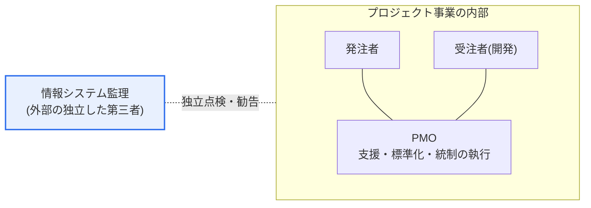
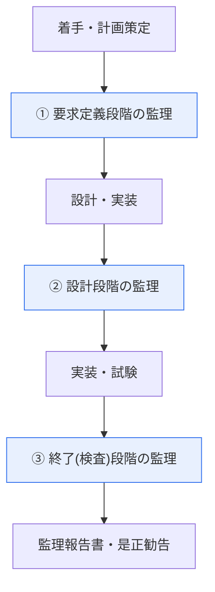

# 情報システム監理とPMOの比較

## 1. 概要

### A. 定義

> **情報システム監理(IS Audit)** とは、発注者・開発者と利害関係のない **第三者が情報システム事業の適正性・品質・成果を独立して点検・評価** し、改善を勧告する活動であり、**PMO(Project Management Office)** とは、プロジェクト管理を **支援・標準化・統制** するために、発注機関の内部(または委託)の立場で運営される常設・時限の組織機能である。

両者はいずれも情報化事業を成功に導く統制手段であるが、その **立場(Position)が根本的に異なる**。監理は事業の **外** から利害関係なく客観的に検証する「審判」に近く、PMOは事業の **中** でプロジェクトチームを助けて成功へ導く「コーチ」に近い。この立場の違いが、目的・時期・役割・責任のあらゆる違いを派生させる。監理が「この事業はきちんと進んでいるか」を外部の視点で診断するとすれば、PMOは「きちんと進むようにどう支援するか」を内部で実行する。したがって両者を「競合関係」と誤解してはならず、異なる地点で事業の失敗リスクを低減する **補完的な二重統制** として理解するのが正確である。

### B. 登場背景と必要性

情報システム事業が大型化・複雑化するにつれ、失敗リスク(要求の不明確さ、スケジュール遅延、品質未達、予算超過)も大きくなり、これを統制する2つの系統のアプローチが発展した。第一に、発注機関は受注者が提出する成果物が要求を満たしているかを自ら判断することが困難であった。発注者は多くの場合IT専門性が不足しており、受注者には自らの成果物を有利に説明しようとする誘因があるため、**利害関係のない第三者による客観的な検証** が必要となり、これが監理として制度化された。韓国では「電子政府法」と関連告示に基づき、一定規模以上の公共情報化事業に監理を義務付け、監理法人・監理員の資格と監理手続・点検基準を規定している。

第二に、1つの機関が多数のプロジェクトを同時に遂行する中で、方法論・成果物・品質基準がまちまちになる問題が大きくなった。これを一貫した標準で管理し、発注機関の不足する管理能力を補強するために **PMO** が定着した。特に発注機関に代わって事業管理を行う「発注者PMO(委託PMO)」が公共分野で広がり、発注機関の統制力と専門性を引き上げる仕組みとして機能している。要するに、監理は「検証の必要」から、PMOは「管理能力補強の必要」からそれぞれ生まれたのである。

## 2. 関係構図と独立性

両機能の位置関係を図で見ると、違いが明確になる。PMOはプロジェクト内部の境界の中で発注者・受注者とともに動いて管理を執行し、監理はその境界の外で、プロジェクトとPMOの成果物をともに点検対象として独立して検証する。

ここでの要は、監理の **独立性(Independence)** である。もし監理人がプロジェクトの遂行やPMO業務に直接関与すれば、自分が作ったり管理したりしたものを自分で点検する **利益相反(self-review)** が発生し、客観性が崩れる。そのため監理は必ず事業と組織的・経済的に分離された第三者でなければならず、この独立性こそが監理の価値の源泉であり、存在理由である。監理基準が監理員の資格・所属・受注者との関係を厳格に規律しているのもこのためである。

手続の面では、監理は事業の全過程に常駐するのではなく、**主要な段階ごとにスナップショットのように介入** する。以下のフローは、典型的な3段階監理(要求定義・設計・終了)の進行を示している。

このように段階ごとに区切って介入するのには理由がある。後戻りの難しい次の段階へ進む **前に** 問題を発見してこそ、是正コストが小さく済むからである。要求が誤って定義されたまま設計・実装まで進むと手戻りの規模が雪だるま式に膨らむため、監理は「事後の指摘」ではなく「段階移行直前のゲート(gate)点検」として設計される。ソフトウェアの欠陥は発見時点が遅れるほど是正コストが指数関数的に増加するというのが長年の工学的な経験則であり、監理の段階的な介入は、まさにこのコスト曲線の前方で問題を捉えるための仕組みである。

監理は点検する観点によっていくつかの類型に分けられる。事業の計画・成果物が要求と基準に合致しているかを見る **事業監理** が基本であり、セキュリティ統制の適正性を見る **情報セキュリティ監理**、データの品質・構造を見る **データベース(DB)監理** などが目的に応じて組み合わされる。どの類型であれ、監理員は点検項目(チェックリスト)と証拠(成果物・インタビュー・デモ)を根拠に判断し、その結果を「適合/不適合/改善勧告」として整理して **監理実施結果報告書** にまとめる。ここで重要なのは、監理が主観的な印象ではなく、事前に定義された基準と確保された証拠に基づかなければならないという点であり、この証拠に基づく性質が監理の指摘の説得力と履行の強制力を支えている。

PMOもまた一様ではない。関与の強さによって、情報・助言のみを提供する **支援型(supportive)**、標準の遵守を求める **統制型(controlling)**、プロジェクトを直接管轄する **指示型(directive)** のPMOに区分される。公共の発注者PMOは、発注機関の統制力を代わりに行使するという点で統制型に近い場合が多い。どの類型のPMOを置くかは、発注機関の管理成熟度と事業リスクに応じて決定されるべきであり、成熟度の低い組織に支援型PMOだけを置けば統制の空白が、反対に能力のある組織に指示型PMOを置けば現場との権限の衝突が生じうる。

## 3. 監理とPMOの比較

監理とPMOは、目的・時期・役割・責任の4つの軸で分かれる。**目的** の面では、監理は品質・適正性の検証と改善勧告にあり、PMOはプロジェクトの成功そのものの支援と統制にある。監理は「うまくいっているかを確認する」ことが目的であり、PMOは「うまくいくようにする」ことが目的であるという点で志向が異なる。**時期** の面では、監理は要求定義・設計・終了などの主要な段階ごとに介入するのに対し、PMOは着手から終了まで常時関与する。監理が「点」の介入だとすれば、PMOは「線」の関与である。

**役割** の面では、監理は点検・診断・勧告までを行い、実際の執行(標準の策定・資源配分・スケジュール調整)は行わない。一方PMOは、管理標準を作り、資源を配分し、リスク・課題を直接管理する執行主体である。この違いは責任の性格も分ける。監理は自らの **独立性・客観性** と点検の充実度に責任を負い、PMOは **プロジェクトの成果** そのもの(スケジュール・品質・コスト目標の達成)に責任を負う。すなわち監理が誤れば「検証が不十分だった」という責任を、PMOが誤れば「事業が失敗した」という責任を負う構造である。

| 区分 | 情報システム監理 | PMO |
|---|---|---|
| **立場** | 独立した第三者(外部) | プロジェクトのステークホルダー(内部) |
| **目的** | 適正性・品質の検証・改善勧告 | プロジェクト成功の支援・統制 |
| **時期** | 主要段階ごとの点検(スナップショット) | 全期間にわたり常時関与 |
| **役割** | 点検・診断・勧告(執行しない) | 標準化・資源・リスク管理(執行) |
| **責任** | 独立性・客観性・点検の充実度 | プロジェクトの成果(スケジュール・品質・コスト) |
| **根拠** | 電子政府法・監理基準(告示) | 組織規程・契約・PMBOKなど |
| **成果物** | 監理実施結果報告書・是正勧告 | 管理計画・標準・進捗/リスク報告 |

表の各項目は、結局のところ「外から検証するのか、中で執行するのか」という1つの軸から分かれ出た結果である。たとえば監理が執行を行わないのは執行に関与した瞬間に独立性が損なわれるからであり、PMOが成果に責任を負うのは事業の中で資源とスケジュールを実際に動かす主体だからである。

## 4. 相互関係と並行運用

監理とPMOは排他的ではなく、むしろ相互補完的である。監理は、PMOが策定した管理計画・成果物・統制体制までも点検対象とし、その適正性を検証する。すなわちPMOが管理を「行う」主体であるとすれば、監理はその管理が「きちんと行われているか」を外から確認する主体である。大規模な公共事業では、PMOが内部でプロジェクトをきめ細かく管理し、監理が外部からその管理と成果物を独立して検証する **二重の安全装置(two lines of assurance)** として併せて運用されるのが一般的である。

ただし、並行運用には明確な原則が必要である。第一に、監理人がPMOの役割を兼ねたり、PMOが自らの事業を監理したりしてはならない。これは独立性の毀損であり、利益相反である。第二に、監理の指摘事項とPMOの管理活動が衝突しないよう、**役割・権限・責任(R&R)を事前に明確に分離** しなければならない。たとえば監理が指摘した是正事項の履行管理はPMOが担いつつ、その履行の有無の最終判定は再び監理が行うというように、牽制と均衡を設計する。実際の大型次世代システム(金融・公共)の構築事業では、PMOと監理を同時に置き、この境界を契約書に明記することが定着した慣行となっている。

この構図を組織の内部統制理論における「3ラインモデル(Three Lines)」の観点に当てはめると理解しやすくなる。実際の開発を行う受注者が第1ライン、その遂行を管理・統制するPMOが第2ライン、これを独立して検証する監理が第3ラインに対応する。各ラインは前のラインを代替するのではなく **補強** する。受注者自身の品質活動があってもPMOの管理統制が必要であり、PMOの統制があっても監理の独立した検証が必要な理由はここにある。あるラインが他のラインの役割を飲み込んだ瞬間に防御ラインは1本に減り、問題を見逃す確率はそれだけ上がる。

一方、事業の規模・性格によって両者の適用は異なる。小規模事業は義務監理の対象ではなく、別途PMOを置くにはコスト負担が大きいため、発注機関が直接管理しつつ、必要に応じて簡易点検のみを置く場合が多い。反対に数百億ウォン規模の公共次世代事業では、常駐PMOと3段階以上の監理を同時に運用するのが一般的である。すなわち監理・PMOは「あれば良いオプション」ではなく、**事業のリスクの大きさに比例して配置するリスク統制資源** として理解すべきであり、過少配置は統制の空白を、過大配置はコスト・行政負担を生むというバランス感覚が求められる。

両者がどのように噛み合って回るかは、1つの流れとして整理できる。PMOが常時の管理活動によって進捗・品質・リスクを統制する中で、段階移行の時点に監理が介入してその成果物を独立して検証し、指摘事項を出す。その後、指摘事項の履行は再びPMOの管理トラックに入り、最終的な履行の有無は終了段階の監理で確認される。このように管理(PMO)と検証(監理)が交互に噛み合いながら事業を前進させるのが、理想的な協業モデルである。

- **PMO(常時)**: 管理標準の策定 → 進捗・品質・リスクの統制 → 指摘事項の履行管理
- **監理(段階別)**: 要求・設計・終了時点での独立点検 → 是正勧告 → 履行の有無の最終判定
- **接点の原則**: 役割・権限の分離(R&Rの明文化)、監理人のPMO兼任禁止、履行-検証の閉ループの維持

こうした協業が失敗する典型的なパターンも知っておく価値がある。監理の指摘が形式的な文書確認にとどまって実際のリスクを突けない場合、PMOが発注機関ではなく受注者の都合を代弁して統制機能を失う場合、指摘事項が報告書にだけ残って履行の追跡が途切れる場合である。これらの失敗はいずれも「独立性の毀損」と「閉ループの断絶」という2つの原因に収斂するため、実務では制度の有無よりも、**実質的な独立性と履行追跡の仕組みが生きているか** をより重視して点検する。

## 5. 深掘り — 知能情報技術の普及に伴う監理・PMOの進化

AI・ビッグデータ・クラウドといった知能情報技術が事業の中心に入り込むにつれ、従来の監理・PMOのあり方も進化している。既存の監理基準は、要求・設計・実装・試験という定型的なSW開発手順を前提に作られていたが、AI事業は「データ品質」と「モデルの性能・妥当性」という新たな点検軸を要求する。学習データの偏り・代表性、モデルの精度・説明可能性、再学習の体制といった項目は、従来の成果物点検だけでは検証できない。これに伴い、データ・モデルの妥当性を点検する **知能情報技術関連の監理ガイド** が整備されるなど、監理基準そのものが拡張されている(詳細基準は改正が頻繁であるため、最新の告示・ガイドを確認する必要がある)。

PMOも変わりつつある。アジャイル・DevOpsが普及するにつれ、段階ごとの成果物を統制していた従来のウォーターフォール型PMOから、反復開発の流れを支援し障害を取り除く **価値提供中心のPMO(またはアジャイルコーチ・VMO)** へと役割が移行している。このとき監理もまた、「文書の完結性」中心の点検から、「実際に動作する成果物とデータに基づく統制」を併せて見る方向へ調整する必要性が高まる。技術士の観点で重要なのは、ツール・方法論が変わっても、「中で執行するPMOと、外で独立して検証する監理」という本質的な役割分担は維持されなければならないという点である。

さらにクラウド移行は、監理・PMOの双方に点検対象の移動を求める。オンプレミスの時代にはハードウェアの導入・構築の成果物が点検の中心であったが、クラウドではリソースがコードで定義(IaC)され、サービスとして調達されるため、構成の適正性・コスト最適化・セキュリティの責任共有モデルの遵守といった新たな軸が点検対象となる。PMOは従量課金のコストを常時モニタリングし、監理はクラウドのセキュリティ統制とデータ主権要件の充足の有無を独立して検証するというように、それぞれの役割が再定義される。

結局、技術環境がいかに変わろうとも、両者が守るべき原則は変わらない。PMOは事業の中で成果に責任を負う執行者として管理の一貫性と実行力を提供し、監理は事業の外でその管理と成果物の適正性を独立して検証する。新技術は「何を点検し、何を管理するか」という対象を変えるだけであり、「誰がどの立場で行うか」という役割の骨格はそのまま維持されてこそ、統制体制が崩れない。

## 6. 考慮事項および示唆

1. **独立性の確保が監理の生命線である。** 監理人が事業の遂行やPMOに関与しないよう、組織上・契約上分離してこそ客観性が保たれる。独立性が形式的に宣言されるだけで実際には発注機関に従属していれば、監理は形だけの儀式に堕してしまう。
2. **監理は事後の指摘ではなく、早期の統制によって価値を生む。** 後戻りの難しい段階の前に問題を発見して是正するよう、段階別のゲートとして介入すべきであり、指摘事項の履行の有無まで追跡・確認する閉ループ(closed-loop)があってはじめて実効性がある。
3. **PMOと監理のR&Rを事前に明確に分離・明文化すべきである。** 並行運用時に役割が重なると責任の空白や利益相反が生じるため、契約・規程に権限と牽制関係を具体的に規定しなければならない。
4. **発注機関の管理能力そのものを併せて育てるべきである。** PMO・監理に全面的に依存すると、委託の終了後に管理の空白が生じる。両者は発注者の能力を代替するのではなく、補強する手段として設計・運用されなければならない。
5. **新技術事業に合わせて点検基準を更新すべきである。** AI・データ中心の事業では、データ品質・モデルの妥当性・倫理・説明可能性といった新たな軸を監理・PMOの点検項目に反映し、基準の陳腐化による検証の死角をなくさなければならない。
6. **履行追跡の閉ループが実効性を左右する。** 監理の指摘事項が報告書にだけ残り、履行が追跡されなければ、統制は形式にとどまる。指摘 → PMOによる履行管理 → 終了段階の監理による最終確認へと続く閉ループを契約・プロセスに明記し、統制が文書ではなく実際の改善に帰結するようにしなければならない。

## 参考資料

- 国家法令情報センター、電子政府法(情報システム監理の根拠): https://www.law.go.kr/
- 韓国知能情報社会振興院(NIA)、情報システム監理に関する案内: https://www.nia.or.kr/
- PMI, PMBOK Guide(PMO・プロジェクトガバナンスの概念): https://www.pmi.org/

---

> **一言まとめ**: 監理は *外部の第三者が独立して事業の適正性を検証・勧告* し、PMOは *内部でプロジェクトを支援・標準化・統制* する仕組みであり、立場・目的・時期・役割・責任は異なるが、大規模事業では二重の安全装置として相互に補完し合う。その前提は常に、監理の独立性の分離と明確な役割区分である。
