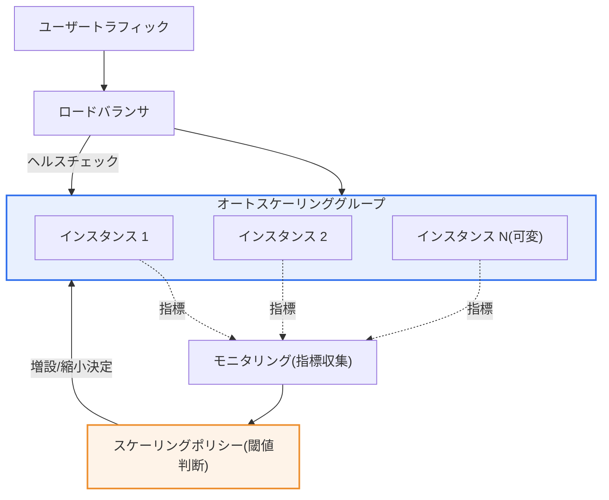
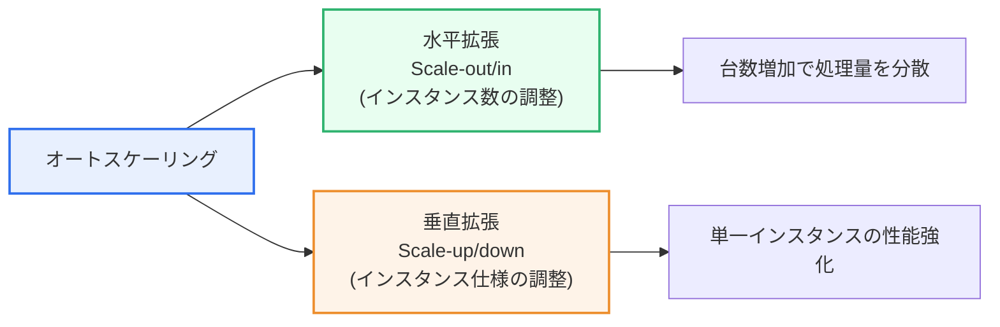

# オートスケーリング(Auto Scaling)

## 1. 概要

### A. 定義
> 負荷(トラフィック・リソース使用率)の変化に応じて**コンピューティングリソースを自動的に増やし(scale-out/up)、あるいは減らす(scale-in/down)**ことで、サービスの性能・可用性とコストを同時に最適化するクラウド運用技術である。

オートスケーリングがクラウドの中核的価値とされる理由は、クラウドが掲げる「**弾力性(Elasticity)**」を実際に実現するメカニズムだからである。弾力性とは需要に合わせてリソースを増減できる能力を指すが、これが自動化されていなければ、人が昼夜を問わず指標を監視してサーバを停止・起動しなければならず、現実的には不可能である。オートスケーリングはこの判断と実行をルール(ポリシー)に委ねることで、人の介入なしに需要へリソースをリアルタイムに合わせる。

### B. 登場背景と必要性
オンプレミス(自社電算室)時代のキャパシティ見積もりは、根本的なジレンマを抱えていた。サーバは一度購入すれば数年使う固定資産であるため、管理者は**最大トラフィック(ピーク)**を基準にサーバを余裕をもって購入するしかなかった。その結果、平常時にはリソースの大部分が遊休状態となって浪費され、逆に予測を保守的に低く見積もると、イベント・マーケティングでトラフィックが集中した際にサービスがダウンした。すなわち「**浪費か障害か**」という二者択一から抜け出せなかったのである。

オートスケーリングはこのジレンマを正面から解消する。トラフィックが集中すればリソースを自動的に増やして障害を防ぎ、閑散になれば減らしてコストを節約する。言い換えれば、「**必要な分だけ使い、使った分だけ支払う**」というクラウド従量課金(pay-as-you-go)の利点をようやく完成させる。例えばECプラットフォームがブラックフライデーや独身の日(光棍節)のような繁忙期に平常時の10倍を超えるトラフィックを迎えても、インスタンスが数分以内に自動増設されて耐え、深夜帯には最小台数まで縮小してコストを削減する。Netflixが特定時間帯の視聴急増を自動拡張で吸収したり、国内大学の履修登録システムがオープン直後の殺到をスケジュール拡張で備えたりするのが代表的な事例である。

### C. 特徴
オートスケーリングは、① 指標ベースの**自動性**、② 増やす・減らす**双方向性**、③ ポリシーで動作を規定する**宣言性**、④ ロードバランサ・ヘルスチェックと結合した**高可用性志向**という特徴を持つ。特に単に「多ければ増やす」のではなく、ヘルスチェックで異常インスタンスを除外し置換まで実施するため、オートスケーリングは拡張ツールであると同時に**自己修復(self-healing)**を実現するレジリエンス(resilience)ツールでもある。

## 2. 全体構造と動作原理

オートスケーリングの動作は、一つの**閉ループ制御(closed-loop control)**として理解すると明確である。まずモニタリングシステムが各インスタンスのCPU・メモリ・リクエスト数・応答時間といった指標を周期的に収集する。収集された指標はスケーリングポリシーが定義した閾値と比較され、条件を満たすとオートスケーリンググループ(ASG, Auto Scaling Group)にインスタンスの増設・縮小命令が下される。新しいインスタンスは事前に定義されたテンプレート(マシンイメージ・起動スクリプト)で同一に複製されてロードバランサに自動登録され、ヘルスチェックを通過した後から実際のトラフィックを受ける。この循環が絶え間なく回ることで、リソース規模が需要に追随する。

この構造では四つの構成要素が中核であり、それぞれを分解して理解する必要がある。

**A. オートスケーリンググループ(ASG)**は、「最小台数・希望台数・最大台数」という三つの境界値でリソースの安全範囲を強制する。最小台数はトラフィックがほとんどなくても常に維持する可用性の下限であり、希望台数は現在維持しようとする目標台数、最大台数はコスト・障害の暴走を防ぐ上限である。この三つの値がなければ、オートスケーリングは制御不能になりやすい。例えば最小を2にすれば1台が停止しても少なくとも1台が生き残り無停止を保証し、最大を20にすれば異常負荷でも請求額が際限なく膨らむことはない。

**B. ロードバランサ(LB)**は、増えたインスタンスにトラフィックを均等に分配し、ヘルスチェックに失敗したインスタンスを即座に対象から除外する。ロードバランサがなければインスタンスを増やしてもトラフィックが1台に集中し、水平拡張が成立しない。ロードバランサは水平拡張の物理的前提といえる。

**C. 起動テンプレート(Launch Template)**は、どのインスタンスでも同一のマシンイメージ・ソフトウェア・初期化スクリプトで即座に複製されるようにする。これにより新たに起動したインスタンスが既存インスタンスと完全に同一に動作し、拡張の結果が予測可能になる。インスタンスごとに設定が異なると拡張のたびに予期しないエラーが発生するため、イミュータブルインフラストラクチャ(immutable infrastructure)の原則がここで重要となる。

**D. モニタリング・ヘルスチェック**は、指標を収集してポリシー判断の根拠を提供し、異常インスタンスを検知して置換を誘発する。この要素がオートスケーリングを単なる拡張装置ではなく自己修復システムにする。

簡単な数値例で動作を整理してみよう。ターゲット追跡ポリシーで「CPU平均50%維持、インスタンスあたりCPU 100% = 100 RPS処理」とすると、平常時の400 RPSは8台(1台あたり50 RPS)で処理する。トラフィックが1,200 RPSへと3倍に跳ね上がると、目標50%を維持するためにシステムは台数を約24台に増やし、再び400 RPSに戻れば8台に縮小する。このように台数が負荷に比例して自動的に収束することが、オートスケーリングの本質である。

## 3. 拡張タイプ — 水平拡張と垂直拡張

拡張には異なる二つの方向があり、どちらを選ぶかがアーキテクチャ設計を左右する。

**水平拡張(Scale-out/in)**は、同一仕様のインスタンスの「台数」を増減する方式である。リクエストを複数台に分けて処理するため、サービスを止めずに無停止で容量を調整でき、理論上は限界なく拡張できる点が最大の長所である。大規模なWeb・APIサービスがほぼ例外なく水平拡張を採用する理由はここにある。ただし、複数インスタンスにリクエストを振り分けるロードバランサと、特定サーバにセッション・ファイルなどの状態を保存しない**ステートレス(Stateless)**設計が必ず前提とならなければならない。状態が特定サーバに紐付いていると、そのサーバが縮小で消えた際にデータが失われるからである。

**垂直拡張(Scale-up/down)**は、1台のインスタンスのCPU・メモリ仕様そのものを増減する方式である。アプリケーション構造を変更する必要がなく仕様を上げるだけでよいため実装が単純という長所があるが、通常は仕様変更時に再起動が必要で瞬間的な中断が発生し、最終的には単一の物理マシンが提供できる最大仕様という限界に突き当たる。

そのため垂直拡張は、リレーショナルデータベースのように水平分散が難しいステートフル(stateful)層で限定的に用いられることが多い。データが一か所に集まっている必要があるという特性上、台数を増やしにくいため、まず仕様を上げて耐えるのである。実務ではWeb・アプリ層は水平、DB層は垂直(またはリードレプリカ追加)で組み合わせるハイブリッド戦略が一般的であり、どちらを自動化するかは層の状態の有無が決定する。

| タイプ | 方式 | 長所 | 制約 | 適合層 |
|---|---|---|---|---|
| **水平拡張** | インスタンス数の増減 | 無停止・高可用、事実上無限の拡張 | ステートレス設計・ロードバランサが必要 | Web・API・ワーカー |
| **垂直拡張** | インスタンス仕様の増減 | 実装が簡単、アプリ変更不要 | 再起動発生・物理的上限 | DB・レガシー単一サーバ |

## 4. スケーリングポリシー — いつ拡張するか

いつどれだけ調整するかを定めるのがスケーリングポリシーであり、ポリシーの精緻さがオートスケーリングの実効性を決定する。ポリシーは大きく三つに分かれる。

**動的ポリシー(Dynamic)**は、CPU使用率・秒間リクエスト数(RPS)・応答遅延といった指標が閾値を上回るか下回るとリアルタイムにリソースを調整する、最も一般的な方式である。例えば「CPU平均70%超過が3分継続すれば2台増設、30%未満が10分継続すれば1台縮小」のようにルールを与える。単純な閾値(step scaling)から一歩進んで、目標値を指定すればシステムが自ら台数を合わせる**ターゲット追跡(target tracking)**方式が広く使われており、サーモスタットのように「CPUを常に50%付近に維持」という目標だけを与えればよいので運用が簡便である。

**予測ポリシー(Predictive)**は、機械学習で過去のトラフィックパターンを学習し、負荷が上がる「前に」先制的にリソースを準備する方式である。動的ポリシーは本質的に負荷が上がった「後に」反応するため準備時間分の遅延が生じるが、予測ポリシーはこの遅延を前倒しして急増初期の瞬間的な障害を減らす。毎週繰り返される周期的パターン(例:平日の出勤時間帯の急増)が明確なサービスで特に効果が大きい。

**スケジュールポリシー(Scheduled)**は、「毎日午前9時の業務開始」「毎月末の精算バッチ」「履修登録オープン10分前」のように、時点が既に分かっているイベントに合わせてあらかじめ台数を確保しておく方式である。予測が不要なほど明白なパターンにはスケジュールポリシーが最も確実である。チケット予約のオープンのように秒単位の殺到が予定されている場合、動的ポリシーだけでは増設が殺到に追いつかないため、スケジュールであらかじめ規模を大きくしておくことが必須である。

実務ではこの三つのポリシーを排他的に使うよりも、スケジュールで基本規模を確保し、予測で曲線を前倒しし、動的に誤差を補正するように**重畳適用**するのが定石である。いずれか一つだけに依存すると死角が生じるが、三つのポリシーを重ねておけば、既知のパターン・学習されたパターン・想定外の変動をすべて吸収できる。

| ポリシー | 判断基準 | 特徴 | 代表的活用 |
|---|---|---|---|
| **動的(Dynamic)** | 指標の閾値・目標値 | 事後反応、汎用的 | 常時のトラフィック変動への対応 |
| **予測(Predictive)** | ML需要予測 | 事前先制、遅延短縮 | 周期的パターンのサービス |
| **スケジュール(Scheduled)** | 既知のタイムテーブル | 確定イベントへの備え | バッチ・オープン殺到・業務時間 |

## 5. 比較 — オートスケーリング vs 手動増設、そしてサーバレスとの関係

オートスケーリングの価値を理解するには、代替手段と比較する必要がある。**手動増設**は管理者が指標を見て直接サーバを増やす方式で、判断の柔軟性は高いが、夜間・週末の急増に即座に対応しにくく、人のミス・遅延が介在する。一方、オートスケーリングは反応が一貫して速いが、ポリシーを誤って設計すると不要な増設・縮小が繰り返される**フラッピング(flapping)**が発生する。この差が生じる根本的な理由は「判断主体が人かルールか」にあり、実務的な含意は明確である — **ルールがよく定義された反復的な負荷は自動化し、判断が必要な例外状況のみ人が介入する**のが最適である。

一方、サーバレス(FaaS、例:AWS Lambda)との関係も押さえておく必要がある。従来のオートスケーリングが「インスタンス(仮想サーバ)単位」で数分かけて調整するのに対し、サーバレスは「リクエスト単位」でミリ秒〜秒単位に0から拡張する。すなわちサーバレスは、オートスケーリングの極端な細粒度化の形態とみなすことができる。

ただしサーバレスは実行時間・状態保持に制約があり、長期間リクエストがなかった後に突然呼び出された際にインスタンスを新たに起動するコールドスタート(cold start)遅延があるため、常時稼働し応答遅延に敏感な大規模サービスでは、依然としてインスタンス・コンテナベースのオートスケーリングの方がコスト効率的な場合が多い。選択基準は「トラフィックがどれほど間欠的か」と「リクエストあたりの処理時間がどれほど長いか」である。間欠的・単発的な処理はサーバレスが、継続的・大容量のトラフィックはオートスケーリングが有利であり、実務では両方式を併用するハイブリッド構成も一般的である。

## 6. 深掘り — Kubernetesのオートスケーリングと最新動向

コンテナ・Kubernetesが標準となるにつれ、オートスケーリングはより細かく多層的な形態へと進化した。Kubernetesは三つの階層の自動拡張を提供する。**HPA(Horizontal Pod Autoscaler)**はPod(コンテナグループ)の数を指標に応じて増やす水平拡張であり、**VPA(Vertical Pod Autoscaler)**はPodに割り当てられるCPU・メモリ要求量を調整する垂直拡張、**Cluster Autoscaler(およびKarpenter)**はPodを載せるノード(仮想サーバ)自体が不足するとノードプールを拡張する。すなわちアプリケーション単位(Pod)とインフラ単位(ノード)の拡張が階層的に噛み合って動作する。

近年注目される流れは**イベント駆動型自動拡張(KEDA, Kubernetes Event-Driven Autoscaling)**である。従来のHPAがCPU・メモリといったリソース指標に主に反応していたのに対し、KEDAはメッセージキューの滞留量、Kafkaコンシューマラグ(lag)、イベントストリーム長といった**業務指標**に直接反応して拡張する。例えば注文処理キューにメッセージが溜まればコンシューマPodを即座に増やし、キューが空になれば0まで減らすといった具合である。これは「リソースではなく実際に処理すべき仕事の量」にリソースを合わせる発想の転換であり、サーバレスに近い効率をコンテナ環境で実現する。

また、予測拡張に時系列予測・強化学習を組み合わせたり、複数のクラウド・リージョンにまたがってコストと可用性を共に考慮して拡張先を選択するマルチクラウドスケーリング、スポット(spot)インスタンスを優先活用してコストを下げる混合戦略などが、FinOps(クラウドコスト最適化)の観点から広がっている。オートスケーリングは今や単純な拡張を超え、**性能・可用性・コストを同時に最適化するインテリジェントなリソースオーケストレーション**へと位置付けが変わりつつある。

## 7. 考慮事項および示唆点

技術士の観点から、オートスケーリングの導入・運用時に考慮すべき点は次のとおりである。

1. **ステートレス(Stateless)設計が水平拡張の絶対的前提である。** セッション・アップロードファイル・キャッシュを特定インスタンスのローカルに保存すると、縮小時にデータが失われユーザーセッションが切断される。状態はRedis・DB・オブジェクトストレージといった外部ストレージに分離し、アプリケーションはいつ停止しても問題ない「使い捨て(cattle, not pets)」の原則で設計しなければならない。これはオートスケーリングのための事前のアーキテクチャ投資である。

2. **準備時間(Warm-up)とフラッピング(Flapping)を併せて制御しなければならない。** インスタンスが起動してトラフィックを受けるまでには数十秒〜数分かかるため、閾値と増設タイミングに余裕を持たせてこそ急増に遅れない。同時に縮小と増設が短い間隔で繰り返されるフラッピングを防ぐため、クールダウン期間(cooldown)と緩衝区間(hysteresis)を設けなければならない。「速い増設、遅い縮小」が安定運用の経験則である。

3. **コスト上限と暴走防御をポリシーに組み込まなければならない。** オートスケーリングはトラフィック急増だけでなく、DDoS攻撃やアプリケーションのバグによる異常負荷にも反応してリソースを際限なく増やしうるため、これはそのまま予期しない請求額として跳ね返ってくる。最大台数の制限、コストアラート、WAF・リクエスト制限(rate limiting)との連携により、「悪いトラフィックには拡張ではなく遮断」が機能するよう設計すべきである。

4. **オブザーバビリティ(Observability)と指標選択が成否を分ける。** CPUのようなリソース指標だけを見ると、実際のユーザー体験(応答遅延・エラー率)と乖離しうる。キュー長・RPS・p95遅延などサービス特性に合った指標を選ぶ必要があり、拡張の決定と結果を継続的に観測・チューニングするフィードバックループが必要である。指標が不正確であれば、オートスケーリングはかえって障害を増幅する。

5. **災害復旧・マルチアベイラビリティゾーンと連携しなければならない。** オートスケーリンググループを複数のアベイラビリティゾーン(AZ)に分散配置すれば、一つのデータセンター障害時にも他のゾーンで自動的に台数を補充して可用性を守る。オートスケーリングは拡張ツールを超え、高可用性・自己修復アーキテクチャの中核軸として統合設計されるべきである。

## 参考資料
- AWS, "What is Amazon EC2 Auto Scaling?" — https://docs.aws.amazon.com/autoscaling/ec2/userguide/what-is-amazon-ec2-auto-scaling.html
- Kubernetes, "Horizontal Pod Autoscaling" — https://kubernetes.io/docs/tasks/run-application/horizontal-pod-autoscale/
- KEDA, "Kubernetes Event-driven Autoscaling" — https://keda.sh/docs/latest/concepts/

---

> **一言まとめ**: オートスケーリングは負荷に応じてリソースを自動増減(水平・垂直)し、*性能・可用性とコストを同時に最適化*するクラウドの弾力性技術であり、ステートレス設計・ロードバランシングを前提に動的・予測・スケジュールポリシーを重畳適用し、Kubernetes HPA/VPA・KEDAとサーバレスによって細粒度化され、インテリジェントなリソースオーケストレーションへと進化している。
