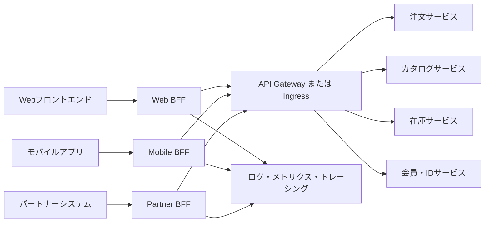
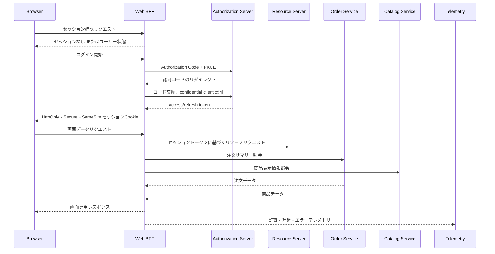

# BFF(Backend for Frontend)パターンとブラウザOAuthセキュリティ

## 1. 概要

### A. 定義

> **BFF(Backend for Frontend)**は、Web・モバイル・外部パートナーのように異なるユーザー体験を提供するクライアントごとに専用のバックエンド層を設け、当該クライアントに必要なデータの組み合わせ・変換・セキュリティ・性能最適化を行うアーキテクチャパターンである。

BFFの核心は、「すべての利用者に一つの汎用APIを提供する」という発想から脱却し、ユーザー体験の境界に合わせてサーバ側APIを設計することにある。モバイルアプリケーションはバッテリーとネットワークコストを節約する必要があり、Webアプリケーションは画面単位の豊富なデータと高速な初期レンダリングを要求しうる。外部パートナーは内部サービスのドメイン構造を知る必要がなく、古い契約を一定期間維持しなければならない場合もある。同じバックエンドがこれらの要求をすべて満たそうとすると、条件分岐とバージョン分岐が増え続ける。

BFFはフロントエンドと内部ドメインサービスの間に位置するが、内部ドメインサービスの業務ルールを代替する層ではない。BFFは複数のサービスを呼び出して画面に必要な読み取りモデルを作り、クライアントが理解しやすい形式で応答し、クライアント別の認証・セッション・キャッシュポリシーを適用する。注文承認、在庫引当、決済確定といった中核業務の不変条件は、注文・在庫・決済ドメインが責任を負うべきである。

Microsoft Azure Architecture Centerは、BFFを複数のフロントエンドインターフェースで一つの汎用バックエンドを共有する代わりに、インターフェース別のバックエンドサービスを作るパターンとして説明している([Microsoft Azure Architecture Center](https://learn.microsoft.com/en-us/azure/architecture/patterns/backends-for-frontends))。Sam Newmanはこれを特定のユーザー体験に密接に結合した単一目的のエッジサービスとして説明し、UIチームがBFFを共同で所有すればUIとAPIの変更を併せて調整しやすくなると整理している([Sam Newman, Backends For Frontends](https://samnewman.io/patterns/architectural/bff/))。

### B. 登場背景と必要性

モノリシックシステムでは一つのサーバが画面生成と業務処理をすべて担うため、クライアント別の要求の違いがコード内部に隠れうる。しかしマイクロサービスが導入されると、画面一つを描画するためにカタログ、価格、在庫、配送、会員サービスをそれぞれ呼び出さなければならない。クライアントがこの呼び出しグラフを直接知るようになると、内部サービスのアドレスとデータモデルが外部契約として固定化され、ネットワーク遅延と障害処理まですべてのクライアントが重複実装することになる。

汎用APIは当初は再利用性が高く見える。しかしWeb、モバイル、キオスク、パートナーが同じエンドポイントを使うと、ある利用者のフィールド追加要求が他の利用者の応答サイズとセキュリティ範囲に影響を与える。サーバが利用者別の要求をすべて受け入れようとすると、`includeMobileFields`、`legacyVersion`、`compact=true`のようなパラメータが累積し、APIの意味が呼び出し元によって変わってしまう。BFFはこうした変異をクライアント境界の内側に隔離する。

また、ブラウザベースのアプリケーションはOAuthトークンをどこに保管し、どのように更新するかを決めなければならない。トークンをブラウザのJavaScriptが直接管理すると、悪意あるスクリプトやブラウザ拡張、サプライチェーン攻撃がトークンにアクセスできるリスクが高まる。2026年8月に公開されたIETF RFC 10017は、ブラウザアプリケーションのOAuth 2.0ベストプラクティスとしてBFFを含む三つのパターンを比較し、機微な業務・個人情報を扱うアプリケーションにはBFFアーキテクチャを強く推奨している([IETF RFC 10017](https://datatracker.ietf.org/doc/rfc10017/))。

### C. 目標と適用範囲

BFFの目標は次のように整理できる。

1. クライアントが必要とするデータの形と呼び出し回数に合わせて応答を最適化する。
2. 内部サービスのアドレス・トポロジー・ドメインモデルをクライアントから隠す。
3. 画面単位の集約と変換をサーバで行い、クライアントの複雑さを減らす。
4. クライアント別のリリース速度と障害隔離の水準を高める。
5. ブラウザとリソースサーバの間でセッション・トークン・監査・濫用防止ポリシーを一貫して執行する。

ただし、BFFはすべてのアプリケーションに追加すべき必須層ではない。クライアントが一つだけでAPI要求が単純な場合や、既にGraphQLのフロントエンド別resolverとスキーマで十分に問題を解決できている場合、あるいはAPIゲートウェイだけでルーティング・認証・変換の要求が満たされる場合には、BFFの追加運用コストが便益を上回りうる。

## 2. 全体構造と動作原理

### A. 論理アーキテクチャ

上記の構造において、各BFFは特定のユーザー体験のサーバ側の一部とみなされる。Web BFFはブラウザ画面に必要な集約とセッション処理を担当し、Mobile BFFは小さな画面と不安定なネットワークに合わせて応答を縮約したり呼び出しをまとめたりする。Partner BFFは内部サービスのドメインモデルをパートナー契約に合わせて変換し、パートナー別のレート制限とバージョンポリシーを適用する。

BFFの背後にAPIゲートウェイを置くことはできるが、両層は同一の概念ではない。ゲートウェイは複数APIの入口としてルーティング・共通認証・レート制限・TLS終端を行うプラットフォーム層である。BFFは一つの体験の要求に合ったAPIを設計し、集約・変換するプロダクトまたはドメイン隣接層である。組織によっては一つの製品が両方の役割を兼ねることもあるが、責任を文書で分離しておかなければ、運用中に万能ミドルウェアと化すのを防げない。

### B. 画面リクエストの処理フロー

最初の段階で、ブラウザはBFFのセッション確認エンドポイントを呼び出す。アクティブなセッションがなければ、BFFが認可サーバとAuthorization Codeフローを開始する。RFC 10017のBFFモデルにおいて、BFFはブラウザに代わるconfidential OAuth clientであり、access tokenとrefresh tokenをブラウザのコードに露出させず、サーバ側セッションと紐付ける。

ログイン後、ブラウザはトークンをAPIごとに直接渡すのではなく、BFFにセッションCookieを送る。BFFはCookieを検証した後、サーバ側に保管されたトークンを使ってリソースサーバにリクエストする。CookieにはHttpOnly、Secure、適切なSameSiteポリシーを適用し、CSRF防御トークンまたは同一オリジン検証とともに運用しなければならない。Cookieを使えばCSRFが自動的に消えるわけではない。

画面データのリクエストでは、BFFは複数の下位サービスを並列に呼び出せる。注文サービスの注文識別子とカタログサービスの商品名を組み合わせて画面モデルを作り、在庫が遅ければ在庫状態を別途表記するかキャッシュ値を使うよう設計できる。しかし決済金額や在庫引当のように強い一貫性が必要な決定は、単純な集約ではなくドメインサービスのコマンドAPIを呼び出さなければならない。

### C. BFFの責任境界

BFFが担う責任は、クライアント体験に限定された変換・集約・保護である。例えばモバイル一覧画面のページサイズを調整し、複数サービスのデータを一つのDTOに組み合わせ、使わないフィールドを除去することはBFFの責任である。クライアントが理解できない内部エラーコードをユーザー体験に合った状態に変換することもBFFで行える。

一方、価格計算ルール、注文状態の遷移、権限の最終決定、在庫予約の原子性はドメインサービスが責任を負わなければならない。BFFがこの業務ロジックを複製すると、WebとモバイルのBFFでルールが食い違い、サービスのポリシー変更がすべてのBFFに伝播しないという問題が生じる。技術士の答案では、「BFFは薄く保つ」という原則を単なるスローガンとして書くのではなく、どのロジックをどの層に置くかを不変条件と変更主体を基準に説明すべきである。

## 3. 主要構成要素と設計原則

### A. クライアント専用APIとデータの組み合わせ

BFF APIは、内部サービスのエンドポイントをそのまま公開するのではなく、画面またはユーザージャーニー中心に設計する。例えば`/mobile/home`は、レコメンド、最近の注文、配送通知をモバイル画面向けの一つの応答に組み合わせることができる。このとき応答は画面のレンダリング要求に合わせたものであるため、内部のCatalogオブジェクトをそのままシリアライズせず、必要なフィールドと公開等級のみを選択する。

集約では逐次呼び出しと並列呼び出しを区別しなければならない。互いに独立したカタログと在庫の照会は並列化できるが、2番目のリクエストが1番目の結果を必要とするなら逐次フローは避けられない。並列化は総遅延を減らせるが下位呼び出し数を増やしうるため、コネクションプール、タイムアウト、同時実行数制限を併せて設計する。

下位サービスの部分的な失敗をどう表現するかも重要である。レコメンドサービスが失敗しても注文履歴画面は表示できるのであれば、BFFは中核データと選択データの優先順位を区別する。逆に決済承認画面で為替レートや決済手段の検証が失敗した場合は、「部分応答」を返してはならず、明確な再試行・代替経路を提供しなければならない。

### B. キャッシュと応答の最適化

BFFはクライアントごとにキャッシュキーと鮮度要件を変えて適用できる。公開商品説明はCDNやリバースプロキシでキャッシュできるが、個人別の注文状態はユーザー・権限・地域をキーに含めなければならない。キャッシュされた応答に個人情報が混ざらないよう`Cache-Control: private`と保存場所を点検し、ログとキャッシュの保存期間をデータ分類に合わせて設定する。

画面集約の応答は、複数ソースの鮮度が異なりうる。価格が1分ごとに更新され商品説明が1日に1回変わるのであれば、一つの全体TTLを恣意的に決めるよりも、データ属性別のキャッシュ戦略を設計すべきである。キャッシュ無効化イベントを使う際は、イベント消失と順序逆転、地域別の伝播遅延を考慮し、キャッシュが業務整合性の唯一の根拠とならないようにする。

モバイルネットワークを考慮した最適化は、単にJSONを小さくすることにとどまらない。必要なフィールドのみを返し、複数の往復を一度の集約呼び出しに減らし、ページネーションと圧縮を適用し、再試行可能な読み取りリクエストと再試行してはならないコマンドリクエストを区別する。画面に表示されない内部フィールドを除去することは、性能だけでなくデータ最小化にも役立つ。

### C. エラー・タイムアウト・再試行

BFFの全体タイムアウトは、下位呼び出しタイムアウトの合計以下でなければならない。上位リクエストのdeadlineを下位呼び出しに伝播しなければ、既に応答を諦めたクライアントリクエストが内部リソースを占有し続ける。例えば画面リクエストの予算が800msであれば、注文・カタログ・在庫の呼び出しにそれぞれ無制限の1秒タイムアウトを設定してはならない。

再試行は、冪等性が保証される照会か、明示的な冪等キーのあるコマンドに限定する。決済リクエストをネットワークエラーだけを見て自動再試行すると、サーバでは決済が成功したが応答だけが失われた状況で二重承認が発生しうる。BFFはドメインサービスの冪等契約を確認し、再試行回数・バックオフ・ジッター・サーキットブレーカーを併せて設定する。

下位サービスのエラーは、原因を隠さずにクライアント契約を安定的に維持しなければならない。内部のスタックトレースや秘密値を応答に含めず、相関IDを返して運用者がログを探せるようにする。HTTPステータスコード、ドメインエラーコード、再試行可否を区別すれば、クライアントが無意味な無限再試行を行わなくなる。

### D. 認証・認可・セッション

認証はユーザーが誰であるかを確認する過程であり、認可はそのユーザーが特定のデータと機能を使えるかを判断する過程である。BFFがOAuth認証を行っても、注文照会権限や管理者機能の権限が自動的に付与されるわけではない。BFFはセッションのユーザー・クライアント・スコープ・対象リソースを確認し、ドメインサービスも信頼境界の内側で権限を再検証しなければならない。

ブラウザにセッションCookieを発行する際、Cookieの寿命はサーバ側セッションとrefresh tokenの寿命ポリシーに合わせなければならない。ログアウトはブラウザのCookie削除だけでなく、サーバセッションの破棄、必要に応じてrefresh tokenの失効、関連する監査記録を含まなければならない。鍵のローテーションやトークン期限切れの際に既に発行済みのセッションをどう扱うかは、ランブックで定めておく。

BFFは外部ブラウザと内部リソースサーバの間のセキュリティ境界であるため、SSRF、オープンリダイレクト、Hostヘッダ攻撃、リクエストサイズ爆弾、ヘッダインジェクション、セッション固定攻撃を点検する。プロキシ先のURLをクライアント入力で直接決定せず、許可されたリソースとパスをサーバ側のマッピングで制限する。

### E. オブザーバビリティと監査

BFFはユーザーリクエスト一つが複数の下位呼び出しへ展開される地点であるため、trace IDとspanの関係を維持しなければならない。全体遅延時間、下位サービス別の遅延、集約失敗率、キャッシュヒット率、トークン更新失敗、401・403の増加、応答サイズを主要指標として収集する。単にBFFの200応答率だけを見ると、一部データが欠落した部分的成功を発見できないことがある。

ログにはユーザー識別子を原文のまま残さず、仮名化された相関IDと必要最小限の属性のみを記録する。access token、refresh token、Cookie値、住民登録番号のような機微情報は、ログ・トレース・エラー応答から除去する。監査ログは、誰がいつどのクライアントでどの保護リソースにアクセスしたかを追跡できなければならないが、アクセスしたデータの原文を複製する保存場所になってはならない。

## 4. 適用方式と比較

### A. BFFとAPIゲートウェイ

APIゲートウェイは組織共通の入口として、ルーティング、TLS終端、証明書ポリシー、レート制限、WAF連携、APIキーと使用量計測を標準化する点に強みがある。一方、BFFは特定のユーザー体験のデータ組み合わせとAPI契約に強みがある。ゲートウェイがすべての画面組み合わせを担うと中央チームに変更が集中し、BFFがすべての共通セキュリティ機能を重複実装するとポリシーのばらつきが生じる。

両者は代替関係というよりも階層的な組み合わせが可能である。外部リクエストはAPIゲートウェイで基本的なネットワーク・プラットフォーム統制を受け、各クライアントのBFFでセッションと画面データの組み合わせを行った後、内部サービスでドメイン権限と業務不変条件を検証する。ただし、同じ認証・レート制限・観測機能が複数の層に重複し、どのポリシーが最終的に適用されるのか不明確にならないよう、責任分担表を作成する。

### B. BFFとGraphQL

GraphQLは、クライアントが必要なフィールドを問い合わせ、複数ソースをresolverで組み合わせられるため、BFFの問題の一部を解決する。一つのスキーマとフロントエンド別resolver体系をうまく運用すれば、別途のBFFサービス数を減らせる。しかしGraphQLも認証・認可、クエリ複雑度の制限、N+1呼び出し、キャッシュ、スキーマ変更、オブザーバビリティの問題を解決しなければならず、GraphQLサーバが事実上BFFの役割を果たすこともある。

BFFとGraphQLの選択は、プロトコルの好みではなく組織と境界の問題である。複数のクライアントが一つのドメイングラフを探索し、フィールドの選択性が重要であればGraphQLが有利となりうる。クライアント別のセキュリティ境界やデプロイ周期が大きく異なる場合や、パートナー契約を独立して維持しなければならない場合には、BFFを分離する方が明確となりうる。Microsoftのドキュメントも、GraphQLのフロントエンド専用resolverで十分であれば、BFFは追加の価値をもたらさない可能性があると案内している([Microsoft BFF pattern guidance](https://learn.microsoft.com/en-us/azure/architecture/patterns/backends-for-frontends))。

### C. BFFと直接呼び出し・汎用バックエンド

クライアントが内部マイクロサービスを直接呼び出すと中間ホップが減る利点があるが、内部トポロジーの露出、呼び出しグラフの重複、サービス別の認証実装、障害処理のばらつきが大きくなる。特にブラウザに内部サービスのアドレスとOAuthトークンを露出させると、攻撃対象領域が広がりうる。逆に一つの汎用バックエンドは、サービス数の少ない初期システムでは単純で運用しやすいが、利用者別の要求が増えるとボトルネックと結合度が大きくなりうる。

BFFはこの両極端の間で、ユーザー体験別のサーバ境界を提供する。しかしBFFを追加するとネットワークホップとデプロイ単位が増える。したがって、クライアント数、要求の違い、内部呼び出しの複雑さ、セキュリティ等級、チームの所有権、運用自動化の水準を判断基準とすべきである。

| 比較項目 | 直接呼び出し | 汎用APIバックエンド | BFF | GraphQL中心 |
|---|---|---|---|---|
| API最適化の単位 | クライアントコード | 全利用者共通 | ユーザー体験別 | クエリ・resolver別 |
| 内部トポロジーの隠蔽 | 低い | 中程度 | 高い | 高い |
| 画面集約 | クライアントで重複 | 中央集中 | 体験別集約 | resolverの組み合わせ |
| 運用サービス数 | 少ない | 少ない〜中程度 | クライアント数に比例 | プラットフォーム中心 |
| クライアントの独立デプロイ | 高い | 低い | 高い | スキーマポリシーが必要 |
| 主なリスク | セキュリティ・重複呼び出し | ボトルネック・汎用化 | 運用コスト・重複 | クエリ暴走・複雑さ |

表の違いは、機能の数よりも変更の方向から生じる。直接呼び出しでは変更責任が各クライアントに分散し、汎用バックエンドでは変更責任が一つのチームに集中する。BFFはクライアントに近いチームに責任を配置する代わりに、BFFの数と運用コストを受け入れる。GraphQLは呼び出し形状の柔軟性を得る代わりに、スキーマとresolverのガバナンスを強化しなければならない。

## 5. 適用事例と導入手順

### A. ECのモバイル・Web事例

ECサービスにWeb、モバイル、パートナーチャネルがあると仮定する。Webの商品詳細画面は高解像度画像、レコメンド一覧、レビュー要約、配送予定日を要求するが、モバイルは限られたデータ使用量と小さな画面を考慮して、代表画像と主要価格だけを必要とする場合がある。パートナーは内部のレコメンドアルゴリズムや会員属性を見ることなく、契約された商品・在庫フィールドだけを使用すべきである。

Web BFFは商品・レビュー・レコメンド・配送サービスを呼び出して画面モデルを作る。Mobile BFFは画像サイズとフィールドを減らし、複数の読み取りリクエストを一つにまとめる。Partner BFFはパートナー別のAPIキーまたはOAuth clientとクォータを適用し、内部の商品状態をパートナー契約の公開状態へ変換する。こうすれば内部サービスが変わっても、各利用者に安定した体験別の契約を維持できる。

例えばWebのトップ画面の目標がp95 700msと仮定すると、BFFは下位呼び出しを並列化し、レコメンド失敗時には商品情報のみを返す代替経路を設けられる。これは説明のための仮想的な目標であり、実際のSLOはユーザー行動と測定されたベースラインで定めるべきである。決済承認のように失敗を許容できないフローには、レコメンド画面のような部分的成功ポリシーを適用してはならない。

### B. ブラウザ業務システムのOAuth事例

公共・金融の業務システムで、ブラウザSPAが個人情報APIを呼び出すと仮定しよう。ブラウザのコードがaccess tokenとrefresh tokenを直接保存すると、XSSや悪意ある依存関係によってトークンが露出しうる。BFFはauthorization serverとconfidential clientとして通信し、サーバ側のセッションとトークンを管理する。ブラウザはHttpOnlyセッションCookieでBFFを呼び出し、BFFが保護されたリソースサーバにaccess tokenを渡す。

RFC 10017は、BFF、token-mediating backend、ブラウザベースのOAuth clientを区別する。BFFはすべてのAPIのやり取りをバックエンドが中継し、トークンをブラウザに露出させない構造であり、token-mediating backendはトークンをブラウザのコードが使えるよう渡すという違いがある。保護水準と実装の複雑さを比較し、業務の機微度に合った選択をしなければならない。

BFFを導入してもXSSとCSRFが消えるわけではない。XSSはセッションを利用してユーザーに代わるリクエストを作ることができ、CSRFはCookieベースの認証リクエストを悪用しうる。コンテンツセキュリティポリシー、出力エンコーディング、依存関係の点検、SameSite設定、CSRFトークン、Origin検証、再認証と異常兆候検知を多層的に適用する。

### C. 段階的な導入手順

1. **利用者と変更履歴の調査**: Web・モバイル・パートナー別のAPI呼び出し、データ要求、リリース周期、障害事例をリスト化する。
2. **境界と所有者の定義**: BFFが担当する体験、ドメインサービスの責任、APIゲートウェイの共通機能を決定する。
3. **読み取り中心のパイロット選定**: 決済や在庫のコマンドよりも、失敗を隔離しやすいダッシュボード・商品照会から始める。
4. **契約設計**: クライアント専用DTO、バージョンポリシー、エラーモデル、ページネーション、フィールドの機微度と廃止ポリシーを定義する。
5. **性能ベースラインの測定**: 直接呼び出し・既存の汎用APIと比較して、p50・p95・p99、呼び出し数、payload、CPU・メモリを測定する。
6. **セキュリティ設計**: OAuth clientの種類、PKCE、セッションCookie、CSRF、トークン保管、ログマスキング、権限検証を脅威モデルに反映する。
7. **オブザーバビリティの構築**: trace contextの伝播、下位呼び出し別のspan、エラー・部分的成功の分類、ユーザー影響指標を先に作る。
8. **段階的な移行**: 機能フラグやルーティング重みで一部ユーザーから移行し、エラー・遅延・セキュリティイベントを基準にロールバックする。
9. **所有権の移管と運用自動化**: UIチームとBFFチームのデプロイ・オンコール・脆弱性パッチ・コスト責任を明文化する。
10. **拡大可否の再評価**: クライアント別の要求の違いが実際に維持されているかを確認し、類似BFFを無理に増やさない。

## 6. 深掘り — RFC 10017とセキュリティ型BFF

IETF RFC 10017は、2026年8月にBest Current Practiceとして発行されたRFC 10017(BCP 212)である。この文書はブラウザベースのOAuthアプリケーションの脅威とセキュリティ勧告を整理し、BFFを単なるデータ集約パターンではなく、ブラウザと保護リソースの間のOAuth client境界として説明している([IETF Datatracker, RFC 10017](https://datatracker.ietf.org/doc/rfc10017/))。

RFC 10017が提示するBFFの三つの中核責任は明確である。第一に、BFFがauthorization serverとconfidential OAuth clientとしてやり取りする。第二に、BFFがaccess tokenとrefresh tokenをCookieベースのセッションのサーバ側コンテキストに保管し、ブラウザアプリケーションに直接露出させない。第三に、BFFがブラウザのリクエストを保護リソースサーバに中継する際に、正しいaccess tokenを付与する。

この勧告は、従来の「モバイル画面用の集約API」というBFF理解をセキュリティアーキテクチャへと拡張する。技術士の答案では、BFFを単なるプロキシと書くよりも、クライアント別のAPI契約とサーバ側のトークン・セッション保護を同時に担う境界として説明するとよい。ただしBFFのセキュリティ効果は実装品質に依存するため、セッション窃取、CSRF、SSRF、オープンリダイレクト、ログ流出に対する統制が併せて必要である。

ブラウザアプリケーションがpublic clientとして直接OAuthを行わなければならない場合でも、Authorization Code + PKCEの適用、トークン保存の最小化、ブラウザベース攻撃への防御が重要である。BFFが常に可能とは限らないため、ネットワーク構成・デプロイモデル・個人情報への影響・ユーザー体験・トークン寿命といった現実的な制約を比較しなければならない。RFCの勧告を製品導入の命令と誤解せず、脅威モデルと業務リスクに結び付ける。

## 7. 考慮事項および示唆点

### A. 性能とコストのバランス

BFFは集約によって往復回数を減らせるが、サーバ側の下位呼び出しと追加のネットワークホップを生み出す。呼び出し数が増えたときにコネクションプールとスレッドが枯渇しないか、下位サービスへのfan-outが障害を増幅しないかを負荷試験で確認しなければならない。平均遅延だけでなく、p95・p99とユーザージャーニー完了率を併せて評価する。

BFFごとにランタイム、デプロイパイプライン、セキュリティパッチ、モニタリング、オンコール運用が必要である。クライアント数が増えるにつれてサービス数を線形に増やすことが常に答えとは限らない。要求が類似したクライアントは一つのBFFを共有できるが、異なる要求を無理にまとめると再び汎用バックエンドのボトルネックが生じるため、共有基準を文書化する。

### B. 重複と責任境界

BFFごとに似たような下位サービス呼び出しコードが生まれうる。重複をすべて除去しようと共通ライブラリと中央BFFを作ると、独立デプロイの利点が損なわれる。安定した認証・トレース・エラー処理ライブラリは共有しつつ、クライアント体験の組み合わせルールとUI契約は各BFFが所有するという形で境界を分ける。

BFFにドメイン業務ロジックが入り込むと、Webとモバイルで結果が異なるリスクが高まる。ドメインサービスが保証すべき不変条件、BFFが行ってよい表現変換、クライアントが責任を持つ表示ロジックを、ADRとAPI契約に記録する。変更レビューの際も、コードの位置よりも業務ルールの所有者を基準に判断する。

### C. セキュリティと個人情報保護

BFFは機微なトークンと個人情報が通過する集中地点である。セッションストアの暗号化、鍵のローテーション、アクセス権限の分離、シークレット管理、監査ログ、脆弱性パッチ、WAFとrate limitを併せて運用する。ユーザー別の応答キャッシュが他のユーザーに提供されていないか、エラー・トレースデータが原文の個人情報を含んでいないかを定期的に点検する。

ブラウザCookieベースのセッションには、CSRF防御とセッション固定の防止が必要である。`SameSite`だけですべてのブラウザや連携シナリオを解決できると仮定せず、Origin・Referer検証とCSRFトークンをリスクに応じて組み合わせる。OAuthのredirect URIは事前登録された正確な値のみを許可し、stateとPKCEの検証失敗を拒否し、ログイン・ログアウトエンドポイントのオープンリダイレクトを遮断する。

### D. 可用性と障害隔離

BFFがWebとモバイルの単一共通バックエンドになると、かえって中央の障害点となりうる。クライアント別にBFFを分離する理由が障害隔離であるならば、デプロイ・キャッシュ・セッションストア・オートスケーリング・オンコールも実際に分離されていなければならない。一つの共有データベースや共通メッセージバスが全BFFを同時に束ねていないかを確認する。

部分的成功を許容する画面と、全体として失敗させるべき業務を区別する。レコメンド・広告・レビューは代替応答を許容できるが、決済金額・権限・在庫予約を任意のキャッシュや空値で代替してはならない。エラーバジェットとユーザー影響等級をもとに機能別のfallbackを設計し、カオステストと復旧訓練で検証する。

### E. オブザーバビリティ・契約テスト

BFFの契約テストは、クライアントが期待する応答構造とエラーの意味が維持されているかを検証しなければならない。下位サービスのconsumer-driven contract、スキーマ互換性チェック、サンプル応答に基づく回帰テストをCIに含める。集約順序と部分的失敗を含むシナリオをテストしなければ、正常応答のみを確認する浅いテストになってしまう。

オブザーバビリティは、BFFを通じて展開された呼び出しグラフを示さなければならない。trace IDをクライアントのエラー応答と結び付けつつもトークン・個人情報を露出させず、下位サービスの遅延が画面の遅延につながる経路を追跡する。SLOはBFF単位だけでなく、ユーザージャーニーと中核機能単位で定義する。

### F. 技術士の観点からの導入判断

BFFの導入判断は「マイクロサービスならBFF」という公式ではなく、利用者の違いと組織の運用能力の関数である。クライアント別のデータ形状・セキュリティ・リリース周期が大きく異なり、画面集約とトークン保護が必要で、体験別のチームがデプロイを自律的に運用できるのであれば、BFFの価値は高い。

逆にクライアントが一つであるか要求がほぼ同じで、APIゲートウェイと既存のドメインAPIが十分に単純であれば、BFFは不要なホップと運用コストになりうる。導入前にベースライン、目標SLO、チームの所有権、セキュリティ脅威モデル、コスト上限、撤回条件を定める。導入後は、BFFの数よりも、利用者の変更リードタイム、障害隔離、トークン露出の減少、ユーザー遅延の改善といった成果を測定する。

## 参考資料

- [Microsoft Azure Architecture Center — Backends for Frontends pattern](https://learn.microsoft.com/en-us/azure/architecture/patterns/backends-for-frontends)
- [Sam Newman — Pattern: Backends For Frontends](https://samnewman.io/patterns/architectural/bff/)
- [IETF Datatracker — RFC 10017: OAuth 2.0 for Browser-Based Applications](https://datatracker.ietf.org/doc/rfc10017/)
- [RFC Editor — BCP 212 / RFC 10017](https://www.rfc-editor.org/info/bcp212/)
- [OAuth 2.0 for Browser-Based Applications, RFC 10017 full text](https://www.rfc-editor.org/rfc/rfc10017.html)

---

> **一言まとめ**: BFFはクライアント体験別の専用バックエンドで集約・変換・性能最適化とOAuthセッション・トークン保護を行う一方、ドメインの不変条件は内部サービスに残し、運用コスト・セキュリティ・可用性・チームの所有権を併せて評価すべきパターンである。
